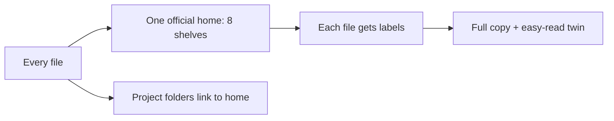

# The Master Map, in Plain Words

> **Status**: Active
> **Date**: 2026-07-10
> **Author**: @shahin
> **Audience**: operators
> **Tags**: `operations`
> **Variants**: Technical (this doc) - Readable (Obsidian twin optional, same filename) - Agent (n/a)

**Reading time: about 2 minutes.**

> **Technical version:** `06-Operations/inventory/MASTER-CATALOG.md` (this is its easy-read twin).

> **If you only read one thing:** we now have one master list of every file we own, what it is, how it is labeled, and where it used to live. Nothing is lost. We can re-run one script to refresh the list any time.

> **What this is (101 box):** think of a library catalog. It says what every book is, which shelf it is on, and what it is about, plus a record of any book we moved so we can always find it again.

## What we now have

- A **master list** of **3,758 files** across your official home and all project folders.
- A **record of 7,485 older file locations** (from safe backups), so we can trace anything that moved.
- A **one-click refresh**: re-run the catalog script and every count updates.

## How files are organized (two simple ideas)

- **Where it lives:** one official home split into 8 shelves (Strategy, Funding, Products, Engineering, Research, Operations, Design, Inbox). Project folders point to the home with shortcuts.
- **What it is about:** each file gets **labels** on three questions: what kind of work, which team function, and which subject. A file can have several labels at once.

## Paired versions rule

- The **full/technical** copy lives in the official home.
- The **easy-read** copy lives in Obsidian with the **same name** and links back to the full copy. They always come as a pair.
- **Agent** copies are only for handing work to an AI helper; they become skills or live in code folders.

## Nothing is lost

- A **restore point** exists (`pre-promotion-2026-07-10`).
- Every moved or removed file is saved in backups and listed in the record.
- We never delete something unique; we archive it instead.

## Your one action

Nothing needed. This map updates itself when I re-run the script; I will refresh it after each cleanup step.
