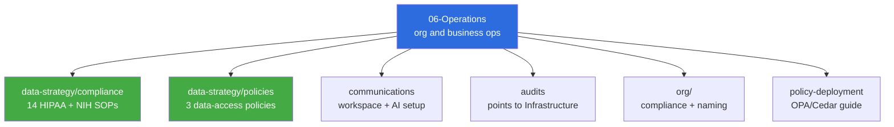

# Operations (06-Operations) — Overview (Readable)

> **Status:** Active · **Date:** 2026-07-01 · ADHD-friendly variant. Canonical detail: [technical](operations-overview.technical.md) · fresh-agent brief: [agent](operations-overview.agent.md)

> [!NOTE]
> **TL;DR:** This layer is where **running the org** lives: HIPAA and NIH compliance, data policies, audits, and workspace comms. No patient data has been ingested yet. HIPAA is **32 of 38 controls done**.

## What is in here

## The 5 things to know

1. **Compliance is the bulk of it.** 14 HIPAA and NIH GDS SOPs and templates live in `data-strategy/compliance/`. Start at **`HIPAA-STATUS.md`** (the live tracker) and **`hipaa-compliance-framework.md`** (the authoritative narrative).
2. **Policies are formal.** `data-strategy/policies/` holds the data governance policy, controlled-access policy, and NIH NDA procedures.
3. **We are pre-operational.** No PHI ingested. All data is public or licensed academic. Full HIPAA activates before any restricted data lands.
4. **Boundary with Infrastructure.** Compliance and governance are ours; the technical platform and technical data infra belong to `04-Engineering/infrastructure`. A few infra-flavored SOPs are flagged for a Wave 2 tidy.
5. **Naming and policy-deployment docs are on loan.** They sit here now but read more like engineering decisions; flagged, not moved.

> [!IMPORTANT]
> If you touch compliance content, **do not weaken a control or claim a control is met without evidence**. `HIPAA-STATUS.md` is the source of truth for what is actually done.

## Where to start by task

| I want to... | Open |
|---|---|
| See what compliance is done vs pending | `data-strategy/compliance/HIPAA-STATUS.md` |
| Understand our HIPAA posture | `data-strategy/compliance/hipaa-compliance-framework.md` |
| Onboard a new dataset | `data-strategy/compliance/pia-template.md` + `policies/controlled-data-access.md` |
| Submit an NIH NDA request | `data-strategy/policies/nih-nda-access-procedures.md` |
| Set up workspace or AI | `COMMUNICATIONS_AND_WORKSPACE.md`, `communications/workspace-ai-setup.md` |
| Find a legal or financial doc | `gdrive-ops-legal-index.md` |

> [!WARNING]
> The GCP technical audit is **not** stored here anymore. It is canonical in `04-Engineering/infrastructure/audits/`; a superseded raw copy sits in `_archive/audits/` for provenance only.

## Consolidation status (2026-07-01)

Deduplicated the GCP audit, repaired four broken links in the HIPAA overview, confirmed the data-strategy split is clean, and flagged the handful of infra/naming docs for Wave 2. Full state in the Operations project `00-CONSOLIDATION/`.
