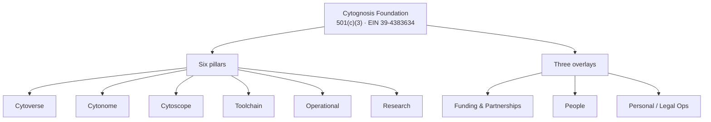

# Cytognosis Foundation — Org Context (Readable)

> **Status:** Active · **Date:** 2026-07-01 · **Reading time:** ~3 min · Readable variant of `org-context.technical.md` (mirrored to the Obsidian vault).

## TL;DR

Cytognosis Foundation is a **Delaware 501(c)(3)** biomedical AI nonprofit (**EIN 39-4383634**), founded and led by **Shahin Mohammadi**. It builds **AI-native** technology to **detect and intercept** disease **years before symptoms**. This page is the **thin org-level context**: identity, structure, voice, and where everything else lives. Domain content (product, funding, research, engineering) is **not** kept here; it is routed to its owning pillar.

> [!IMPORTANT]
> This is a **routing and reference** doc, not a pitch and not a platform description. For the science and platform story use the `science-platform` skill; for brand and design use `brand-identity`; for funding use the Funding & Grants project.

## Who we are

| Field | Value |
|---|---|
| Legal name | Cytognosis Foundation |
| Status | 501(c)(3), Delaware incorporated |
| EIN | 39-4383634 |
| Mailing address | 394 Innisfree Dr, Daly City, CA 94015 |
| Founder and CEO | Shahin Mohammadi (MIT, Broad, insitro, GenBio AI) |

> [!WARNING]
> **Address reconciliation needed.** Strategy docs list HQ as South San Francisco; the mailing address is the founder residence in Daly City. Always match the **IRS determination letter** on official filings. Tracked in the project `OPEN_QUESTIONS.md`.

> [!NOTE]
> **No PBC yet.** The Public Benefit Corporation subsidiary is not formed; it is pending the Gate 1 / YC S26 outcome. Do not describe a PBC as existing.

## How we are organized

Six pillars plus three cross-cutting overlays, arranged as value-streams by lifecycle.

The authoritative pillar-to-repo-to-docs-layer mapping lives in `PROJECT-REGISTRY.md` and `SHARED-BLUEPRINT.md`; this page does not copy it.

## How we speak

> [!CAUTION]
> **Forbidden words:** "revolutionary", "cure", "game-changing", "breakthrough". Avoid "diagnose and treat", "early detection", "algorithm-based", and "health care" (two words).

- **Tone:** authoritative, compassionate, optimistic; never fear-based.
- **Framing:** detect and intercept; years before symptoms; AI-native; healthcare; person-first.
- Full brand system: the `brand-identity` skill and the `07-Design` layer.

## Where things live

> [!TIP]
> One artifact, one home. This project is the **working area for cross-org context only**. Finalized engineering docs live in the docs repo; datasets live in the Data Hub.

| Home | Canonical for |
|---|---|
| cytomem | Index, provenance, dedup oracle |
| docs repo | Engineering and platform docs (incl. this page) |
| Obsidian vault | Readable, ADHD-variant docs |
| Claude Projects | Working drafts and per-project sets |
| Data Hub (`gs://cytognosis-data-hub`) | Datasets and large or versioned assets |

## What belongs here vs. elsewhere

| Route this to its owner | Owner |
|---|---|
| Product specs, features | Cytonome (Yar) / Cytoverse (Cytos) |
| Funding, grants, IGoR | Funding & Grants |
| Research, papers, science | Research / Neuroverse |
| Infra, CI/CD, DNS, GCP | Infrastructure |
| Brand, website, design | Branding |
| Compliance, audits, comms | Operations (this project owns only the `org/` slice) |
