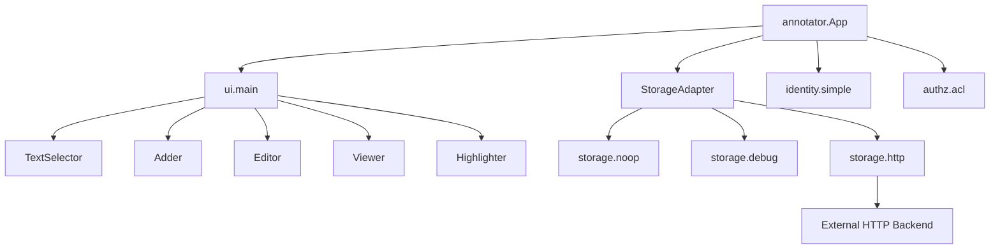

# Open Annotation Annotator Assessment

> Cloned to `infrastructure/third_party/annotator/` for deep evaluation.

## Overview

**Annotator** ([openannotation/annotator](https://github.com/openannotation/annotator)) is a JavaScript library for building browser-based annotation systems. Originally backed by the Open Knowledge Foundation and used by Hypothesis in its early history, the project was heavily developed from 2013 to 2017, then went unmaintained for approximately 11 years.

| Attribute | Value |
|-----------|-------|
| Version | `2.0.0-alpha.3` |
| License | MIT + GPL dual |
| Language | JavaScript (CommonJS, Browserify) |
| Dependencies | jQuery 1.11, xpath-range, es6-promise |
| Test Suite | 288 tests (Karma + Mocha, now running in Chrome Headless) |
| Last Active | ~2017 (recently assessed April 2026) |

## Architecture

The design is **modular and well-separated**, which is its strongest asset:



### Core Components

| Module | File | Purpose |
|--------|------|---------|
| `App` | [app.js](file:///home/mohammadi/repos/cytognosis/org/infrastructure/third_party/annotator/src/app.js) | Composition root that wires all modules |
| `TextSelector` | [textselector.js](file:///home/mohammadi/repos/cytognosis/org/infrastructure/third_party/annotator/src/ui/textselector.js) | Captures text selection via mouseup, normalizes to XPath ranges |
| `Highlighter` | [highlighter.js](file:///home/mohammadi/repos/cytognosis/org/infrastructure/third_party/annotator/src/ui/highlighter.js) | Wraps text nodes in `<span class="annotator-hl">`, manages draw/undraw lifecycle |
| `Editor` | [editor.js](file:///home/mohammadi/repos/cytognosis/org/infrastructure/third_party/annotator/src/ui/editor.js) | Form for creating/editing annotations (text, tags, permissions) |
| `Viewer` | [viewer.js](file:///home/mohammadi/repos/cytognosis/org/infrastructure/third_party/annotator/src/ui/viewer.js) | Read-only display of annotation content on hover |
| `StorageAdapter` | [storage.js](file:///home/mohammadi/repos/cytognosis/org/infrastructure/third_party/annotator/src/storage.js) | Hook-based lifecycle (before/after create/update/delete) |
| `Filter` | [filter.js](file:///home/mohammadi/repos/cytognosis/org/infrastructure/third_party/annotator/src/ui/filter.js) | Client-side annotation filtering by field values |
| `Markdown` | [markdown.js](file:///home/mohammadi/repos/cytognosis/org/infrastructure/third_party/annotator/src/ui/markdown.js) | Optional markdown rendering in annotation text |

### Annotation Data Model

```json
{
  "id": "abc123",
  "quote": "selected text from the page",
  "text": "user's annotation comment",
  "ranges": [
    {
      "start": "/html/body/div[1]/p[3]",
      "startOffset": 42,
      "end": "/html/body/div[1]/p[3]",
      "endOffset": 87
    }
  ],
  "tags": ["cell-atlas", "single-cell"],
  "user": "shahin",
  "permissions": { "read": [], "update": ["shahin"], "delete": ["shahin"] }
}
```

### Storage Contract

Storage is pluggable via a clean interface:

- `create(annotation)` → POST
- `update(annotation)` → PUT  
- `delete(annotation)` → DELETE
- `query(queryObj)` → GET

The `http` storage uses `prefix + urls[action]` pattern (e.g., `/store/annotations/{id}`).

## Strengths for Cytognosis

| Strength | Why it Matters |
|----------|---------------|
| **Explicit storage abstraction** | We can swap the jQuery HTTP backend for our FastAPI/Neo4j backend, keeping the UI layer intact |
| **XPath-based range selectors** | Compatible with W3C Web Annotation (WADM) selector model; `xpath-range` library handles range normalization |
| **Hook-based lifecycle** | `beforeAnnotationCreated` / `annotationCreated` hooks map cleanly to our WADM workflow |
| **Test suite intact** | 288 tests pass, providing a safety net for modernization |
| **Pluggable identity/authz** | We can inject our own user model and permission system |
| **Text + tags model** | Tags map directly to our topic ontology in the Cytos KG |

## Weaknesses / Technical Debt

| Weakness | Severity | Mitigation |
|----------|----------|------------|
| jQuery 1.11 dependency | **High** | Replace with vanilla DOM APIs |
| Browserify build system | **Medium** | Migrate to Vite/esbuild |
| Node 0.10 era toolchain | **Medium** | Already fixed for modern Node (see ASSESSMENT.md) |
| CSS injected via `insert-css` | **Low** | Extract to standalone CSS files |
| No TypeScript types | **Medium** | Add `.d.ts` declarations or rewrite in TS |
| PhantomJS test runner | **Fixed** | Already migrated to Chrome Headless |
| 80 npm vulnerabilities | **High** | Full dependency audit needed |
| No PDF annotation | **High** | Need separate PDF.js integration (like Hypothesis) |

## Comparison with Hypothesis and Memex

| Feature | Annotator | Hypothesis | Memex |
|---------|-----------|------------|-------|
| Text selection | XPath ranges | W3C selectors | Custom |
| Data model | Custom JSON | W3C WADM | Custom + tags |
| Storage | Pluggable HTTP | h.readthedocs.io | IndexedDB + Sync |
| PDF support | No | Yes (PDF.js) | No |
| Chrome extension | No (embeddable) | Yes | Yes |
| Highlighting | `<span>` wrap | `<span>` wrap | Custom overlay |
| License | MIT/GPL | BSD 2-Clause | MIT |
| Active | Dormant (revival started) | Active | Active |
| WADM compliance | **Partial** (ranges map) | **Full** | **None** |
| Codebase size | ~80KB JS | ~500KB+ | ~2MB+ |

## WADM Compatibility Analysis

The Annotator's data model predates WADM but maps well:

| Annotator Field | WADM Equivalent | Gap |
|----------------|-----------------|-----|
| `quote` | `TextQuoteSelector.exact` | Direct mapping |
| `ranges[].start` | `XPathSelector.value` | XPath already used |
| `ranges[].startOffset` | `TextPositionSelector.start` | Needs conversion layer |
| `text` | `body[0].value` | Restructure to body array |
| `tags` | `body[].purpose: "tagging"` | Restructure to body array |
| `user` | `creator.id` | Flatten to WADM creator |
| `permissions` | N/A in WADM core | Custom extension |

**Verdict**: A thin adapter layer (~100 lines) can convert between Annotator's internal format and our WADM schema. The XPath range selector is the hardest part to get right, and Annotator already handles it.

## Recommendation for Cytognosis

> [!IMPORTANT]
> Annotator is the **most reusable component** of the three annotation tools evaluated (Hypothesis, Memex, Annotator), specifically because of its clean separation of concerns and pluggable storage.

### Proposed Integration Path

1. **Extract the core modules**: `TextSelector`, `Highlighter`, `Editor`, `Viewer`
2. **Remove jQuery dependency**: Replace `$.ajax` in `HttpStorage` with `fetch()`, `$(el)` with `document.querySelector`
3. **Add WADM adapter**: Convert annotation objects to/from W3C WADM format for our Neo4j storage
4. **Integrate into CytoExplorer**: Mount the text selector on the PDF reader and asset description panels
5. **Connect to Cytos KG**: Store annotations as WADM entities linked to asset nodes via our FastAPI backend

### Priority Assessment

| Component | Reuse Value | Effort to Modernize |
|-----------|------------|---------------------|
| `TextSelector` + `Highlighter` | **Very High** | Low (remove jQuery wrapper) |
| `StorageAdapter` lifecycle hooks | **High** | Low (already clean) |
| `Editor` UI | **Medium** | Medium (restyle to Cytognosis design system) |
| `Viewer` UI | **Medium** | Medium (restyle) |
| `Filter` | **Low** | Skip; we have our own search |
| `Markdown` plugin | **Low** | Skip; we have our own renderer |

### Next Steps

- [ ] Create `src/lib/annotation/` in CytoExplorer
- [ ] Port `TextSelector` and `Highlighter` to vanilla TypeScript
- [ ] Implement WADM ↔ Annotator format adapter
- [ ] Connect `StorageAdapter` to our FastAPI annotation endpoints
- [ ] Build CytoExplorer annotation sidebar using the Cytognosis design system
