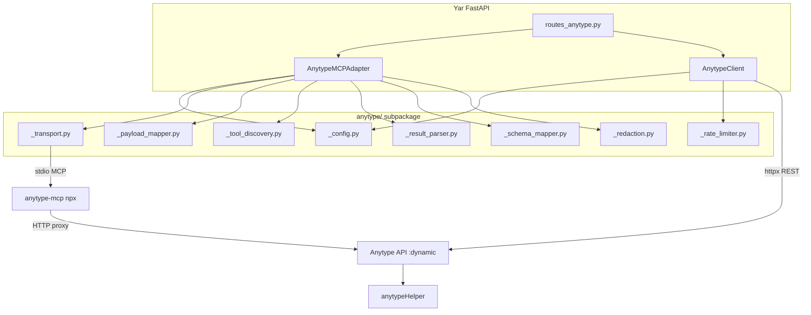

# Anytype Integration Refactor Plan

> [!NOTE]
> Updated 2026-05-17. Tracks Phase 2 (modularization) and Phase 3 (REST client + API alignment) completion.

## Architecture



## Status Tracker

| # | Task | Status | Notes |
|---|---|---|---|
| 1 | Decompose monolith → 8 modules | ✅ Done | 1,283 → 558 lines |
| 2 | Update all imports codebase-wide | ✅ Done | 127/127 pass |
| 3 | Backward-compat re-exports | ✅ Done | `integrations/__init__.py` |
| 4 | **Direct REST client (`client.py`)** | ✅ Done | 36 endpoints, rate-limited |
| 5 | **Port auto-discovery** | ✅ Done | `ss -tlnp` + `ANYTYPE_API_BASE_URL` fallback |
| 6 | **Rate limiter** | ✅ Done | Token bucket, 1 req/s sustained, burst 60 |
| 7 | **Config extended** | ✅ Done | `rest_configured`, `mcp_configured`, `api_base_url` |
| 8 | **Comprehensive test suite** | ✅ Done | 35 new tests (config, port discovery, rate limiter, all endpoints, errors) |
| 9 | **API reference doc** | ✅ Done | `anytype_api_reference.md` artifact |
| 10 | Extract business logic to `anytype_service.py` | 🔲 TODO | Move `_apply_cap_lite_to_plan()` from routes |
| 11 | Split `models/anytype.py` | 🔲 TODO | `anytype_status.py`, `anytype_search.py`, `anytype_write.py` |
| 12 | Shared `_ensure_connected()` decorator | 🔲 TODO | Remove repetitive status checks |
| 13 | Wire `AnytypeClient` into routes (dual-mode) | 🔲 TODO | Prefer REST, fallback to MCP |
| 14 | Live integration tests | 🔲 BLOCKED | Awaiting local Anytype API key config |

## Test Results

```
162 passed, 1 warning in 5.97s
```

| Test File | Count | Status |
|---|---|---|
| `test_anytype_client.py` | 35 | ✅ All pass |
| `test_anytype_readonly_integration.py` | — | ✅ Pass |
| `test_anytype_write_execution.py` | — | ✅ Pass |
| `test_anytype_gap_regressions.py` | — | ✅ Pass |
| `test_mvp_e2e_no_stub.py` | — | ✅ Pass (fixed for port discovery) |
| All others | — | ✅ Pass |

## Files Changed (This Session)

| File | Action |
|---|---|
| `src/yar/integrations/anytype/client.py` | **NEW** — Direct REST client |
| `src/yar/integrations/anytype/_rate_limiter.py` | **NEW** — Token bucket |
| `src/yar/integrations/anytype/_config.py` | **REVISED** — Port discovery, `api_base_url` |
| `src/yar/integrations/anytype/__init__.py` | **REVISED** — Export new classes |
| `src/yar/integrations/__init__.py` | **REVISED** — Export `AnytypeClient` |
| `tests/test_anytype_client.py` | **NEW** — 35 comprehensive tests |
| `tests/test_mvp_e2e_no_stub.py` | **FIXED** — Handle `ss` in monkeypatch |
