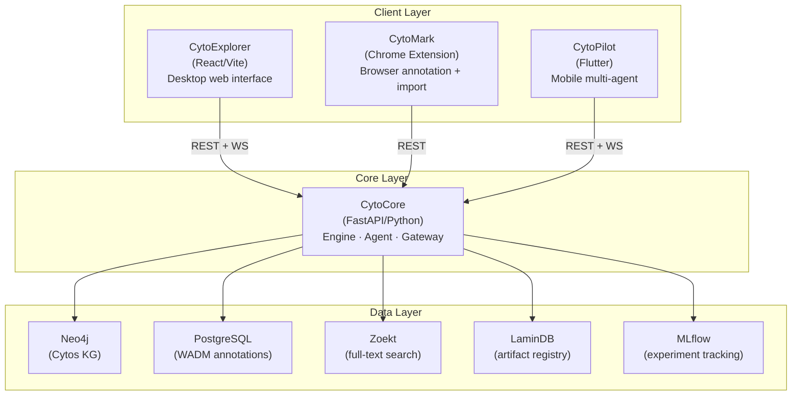
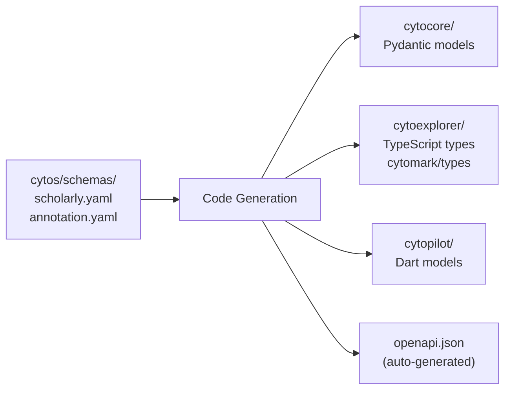
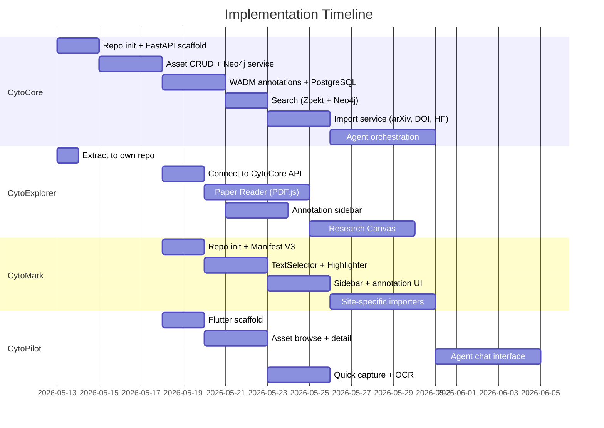

# Cytognosis Platform — 4-Repo Architecture

> Revised plan: decompose the monolithic approach into 4 independent, focused repositories.

## Architecture Overview



---

## Repository Summary

| Repo | Purpose | Stack | Location |
|------|---------|-------|----------|
| **cytocore** | Backend engine, API gateway, agent orchestration | Python 3.13, FastAPI, Neo4j, PostgreSQL, LaminDB | `/home/mohammadi/repos/cytognosis/cytocore/` |
| **cytoexplorer** | Desktop web interface (Asset Zoo, Paper Reader, Canvas) | React 19, Vite, TypeScript | `/home/mohammadi/repos/cytognosis/cytoexplorer/` |
| **cytomark** | Chrome extension (annotation, highlighting, asset import) | TypeScript, Manifest V3, React, CRXJS | `/home/mohammadi/repos/cytognosis/cytomark/` |
| **cytopilot** | Mobile app for multi-agent system prototyping | Flutter/Dart, REST client | `/home/mohammadi/repos/cytognosis/cytopilot/` |

---

## 1. CytoCore — Engine / Agent / Gateway

The single backend that all clients talk to. Manages assets, annotations, search, import, and agent orchestration.

### Directory Structure

```
cytocore/
├── src/
│   └── cytocore/
│       ├── __init__.py
│       ├── main.py                 # FastAPI app, lifespan, middleware
│       ├── config.py               # Pydantic Settings (Neo4j, PG, Zoekt, LaminDB)
│       ├── models/
│       │   ├── scholarly.py        # Pydantic models from scholarly.yaml (LinkML)
│       │   ├── annotation.py       # WADM annotation models from annotation.yaml
│       │   └── agent.py            # Agent task/message models
│       ├── routers/
│       │   ├── assets.py           # /api/assets CRUD + search + facets
│       │   ├── annotations.py      # /api/annotations CRUD (WADM)
│       │   ├── search.py           # /api/search (Zoekt + Neo4j unified)
│       │   ├── import_.py          # /api/import (DOI, HF, GitHub, arXiv)
│       │   └── agents.py           # /api/agents (task submission, status)
│       ├── services/
│       │   ├── neo4j_service.py    # Cypher query builder, KG traversal
│       │   ├── zoekt_service.py    # Zoekt search integration
│       │   ├── lamindb_service.py  # LaminDB artifact registry
│       │   ├── mlflow_service.py   # MLflow experiment/model registry
│       │   ├── import_service.py   # Asset import from external sources
│       │   └── agent_service.py    # Multi-agent orchestration
│       ├── importers/
│       │   ├── base.py             # Abstract importer interface
│       │   ├── arxiv.py            # arXiv → Paper
│       │   ├── doi.py              # DOI/Crossref → Paper
│       │   ├── huggingface.py      # HuggingFace → Model/Dataset
│       │   ├── github.py           # GitHub → SoftwareSourceCode
│       │   ├── pubmed.py           # PubMed → Paper
│       │   └── zenodo.py           # Zenodo → Dataset/Code
│       ├── agents/
│       │   ├── base.py             # Base agent protocol
│       │   ├── research.py         # Research assistant agent
│       │   ├── curator.py          # Asset curation agent
│       │   └── reviewer.py         # Paper review agent
│       └── db/
│           ├── postgres.py         # Async PostgreSQL (asyncpg)
│           └── migrations/         # Alembic migrations
├── tests/
│   ├── test_assets.py
│   ├── test_annotations.py
│   └── test_importers.py
├── pyproject.toml
├── README.md
└── .github/
    └── workflows/
        └── ci.yml
```

### API Contract (shared with all clients)

| Endpoint | Method | Description |
|----------|--------|-------------|
| `/api/assets` | GET | List/search assets with facets |
| `/api/assets/{id}` | GET | Get single asset detail |
| `/api/assets` | POST | Create asset (manual or import) |
| `/api/assets/{id}` | PUT | Update asset |
| `/api/assets/{id}` | DELETE | Delete asset |
| `/api/annotations` | GET | Query WADM annotations |
| `/api/annotations` | POST | Create WADM annotation |
| `/api/annotations/{id}` | PUT | Update annotation |
| `/api/annotations/{id}` | DELETE | Delete annotation |
| `/api/search` | POST | Unified search (Zoekt + Neo4j) |
| `/api/import` | POST | Import from external source |
| `/api/agents/tasks` | POST | Submit agent task |
| `/api/agents/tasks/{id}` | GET | Get task status |
| `/ws/events` | WS | Real-time asset/annotation events |

### Key Dependencies

```toml
[project]
dependencies = [
    "fastapi>=0.115",
    "uvicorn[standard]>=0.32",
    "neo4j>=5.25",
    "asyncpg>=0.30",
    "pydantic>=2.10",
    "pydantic-settings>=2.6",
    "lamindb>=1.0",
    "mlflow>=2.18",
    "httpx>=0.28",
]
```

---

## 2. CytoExplorer — Desktop Web Interface

The primary desktop application. Already bootstrapped at `org/cytoexplorer/`, will be moved to a top-level repo.

### Key Pages

| Page | Route | Components |
|------|-------|------------|
| Explore | `/` | AssetGrid, AssetCard, TypeChips, SearchBar, Sidebar |
| Asset Detail | `/asset/:id` | Breadcrumb, StatsPanel, Tabs (Overview/Lineage/Annotations/Related) |
| Paper Reader | `/reader/:id` | PDFViewer, EntityOverlay, AnnotationSidebar |
| Research Canvas | `/canvas/:id` | InfiniteCanvas, AssetBlocks, Connectors |
| Favorites | `/favorites` | Filtered AssetGrid |
| Collections | `/collections` | CollectionList, CollectionDetail |

### Communication with CytoCore

```typescript
// src/lib/api.ts
const API_BASE = import.meta.env.VITE_CYTOCORE_URL || 'http://localhost:8000';

export const api = {
  assets: {
    list: (params) => fetch(`${API_BASE}/api/assets?${qs(params)}`),
    get: (id) => fetch(`${API_BASE}/api/assets/${id}`),
    create: (data) => fetch(`${API_BASE}/api/assets`, { method: 'POST', body: JSON.stringify(data) }),
  },
  annotations: {
    list: (target) => fetch(`${API_BASE}/api/annotations?target=${target}`),
    create: (data) => fetch(`${API_BASE}/api/annotations`, { method: 'POST', body: JSON.stringify(data) }),
  },
  search: (query) => fetch(`${API_BASE}/api/search`, { method: 'POST', body: JSON.stringify(query) }),
};
```

---

## 3. CytoMark — Chrome Extension

Browser extension for annotation and asset import, combining the best of Hypothesis (WADM compliance), Memex (UX), and Annotator (modularity).

### Directory Structure

```
cytomark/
├── src/
│   ├── manifest.json               # Manifest V3
│   ├── background/
│   │   ├── service-worker.ts       # Background service worker
│   │   └── api-client.ts           # CytoCore API client
│   ├── content/
│   │   ├── injector.ts             # Injects annotation layer into pages
│   │   ├── text-selector.ts        # Text selection → WADM (from Annotator)
│   │   ├── highlighter.ts          # Highlight rendering (from Annotator)
│   │   └── page-detector.ts        # Detects arXiv, HF, PubMed, GitHub pages
│   ├── sidebar/
│   │   ├── App.tsx                 # Sidebar root (React)
│   │   ├── AnnotationList.tsx      # Annotations for current page
│   │   ├── AnnotationEditor.tsx    # Create/edit WADM annotation
│   │   ├── ImportPanel.tsx         # Import current page as asset
│   │   └── SearchPanel.tsx         # Search CytoCore assets
│   ├── popup/
│   │   ├── Popup.tsx               # Browser action popup
│   │   └── popup.html
│   ├── options/
│   │   ├── Options.tsx             # Extension settings
│   │   └── options.html
│   └── shared/
│       ├── types.ts                # Shared types (mirrors CytoCore models)
│       ├── wadm.ts                 # WADM adapter (Annotator ↔ W3C format)
│       └── design-tokens.css       # Cytognosis design tokens subset
├── package.json
├── vite.config.ts                  # CRXJS Vite Plugin
├── tsconfig.json
└── README.md
```

### Feature Matrix (Heritage from 3 tools)

| Feature | From Annotator | From Hypothesis | From Memex | CytoMark |
|---------|---------------|-----------------|------------|----------|
| Text selection | TextSelector + XPath | W3C selectors | Custom | XPath + TextQuote + CSS selectors |
| Highlighting | `<span>` wrap | `<span>` wrap | Overlay | `<span>` with design system colors |
| Sidebar | N/A | Annotation list | Rich sidebar | Full sidebar with tabs |
| Storage | Pluggable HTTP | hypothesis.is API | IndexedDB | CytoCore REST API |
| WADM | Partial (ranges map) | Full | None | Full (adapter layer) |
| Asset import | N/A | N/A | Page save | Asset-type-specific importers |
| PDF annotation | N/A | PDF.js | N/A | PDF.js + WADM |
| KG integration | N/A | N/A | N/A | Neo4j entity linking |

### Site-Specific Importers

| Site | Detected by | Imports as | Extracted fields |
|------|------------|-----------|-----------------|
| `arxiv.org/abs/*` | URL pattern | Paper | title, authors, abstract, PDF, arXiv ID |
| `doi.org/*` | URL pattern | Paper | Crossref metadata |
| `pubmed.ncbi.nlm.nih.gov/*` | URL pattern | Paper | PMID, MeSH terms |
| `huggingface.co/*/models/*` | URL pattern | MLModel | name, params, tags, card |
| `huggingface.co/datasets/*` | URL pattern | Dataset | name, card, features |
| `github.com/*/*` | URL pattern | Code | name, language, stars, README |
| `zenodo.org/records/*` | URL pattern | Dataset/Code | DOI, metadata |
| Any page | Manual trigger | Bookmark/Note | URL, title, selected text |

---

## 4. CytoPilot — Flutter Mobile App

Mobile companion for the multi-agent system. Designed for on-the-go interaction with the Cytognosis platform.

### Directory Structure

```
cytopilot/
├── lib/
│   ├── main.dart
│   ├── app/
│   │   ├── app.dart                # MaterialApp with theme
│   │   ├── router.dart             # GoRouter configuration
│   │   └── theme.dart              # Cytognosis theme (dark mode)
│   ├── core/
│   │   ├── api/
│   │   │   ├── cytocore_client.dart  # REST client for CytoCore
│   │   │   └── models.dart           # Dart models (from OpenAPI)
│   │   ├── auth/
│   │   │   └── auth_provider.dart
│   │   └── config.dart
│   ├── features/
│   │   ├── explore/
│   │   │   ├── explore_screen.dart   # Asset browsing
│   │   │   ├── asset_card.dart       # Asset card widget
│   │   │   └── search_bar.dart       # Search with filters
│   │   ├── asset_detail/
│   │   │   ├── detail_screen.dart    # Full asset view
│   │   │   └── annotation_tab.dart   # WADM annotations
│   │   ├── agents/
│   │   │   ├── agents_screen.dart    # Agent dashboard
│   │   │   ├── chat_screen.dart      # Chat with agents
│   │   │   └── task_card.dart        # Agent task status
│   │   ├── capture/
│   │   │   ├── capture_screen.dart   # Quick capture (photo, link, voice)
│   │   │   └── ocr_service.dart      # On-device OCR
│   │   └── notifications/
│   │       └── notification_screen.dart
│   └── widgets/
│       ├── cyto_card.dart            # Glassmorphic card
│       ├── cyto_badge.dart           # Entity badge
│       └── gradient_bar.dart         # Signature gradient
├── pubspec.yaml
├── README.md
└── test/
```

### Key Mobile Features

| Feature | Description |
|---------|-------------|
| **Asset Browse** | Explore papers, datasets, models on the go |
| **Agent Chat** | Conversational interface to research/curation agents |
| **Quick Capture** | Photo → OCR → import as asset, Share sheet → import link |
| **Notifications** | Agent task completions, new annotations, KG updates |
| **Offline Cache** | Recently viewed assets cached locally (Hive/Isar) |

---

## Shared Contracts

All 4 repos share a common data contract derived from the LinkML schemas in `cytos/`:



### Type Generation Pipeline

1. **Source of truth**: LinkML schemas in `cytos/schemas/`
2. **Python models**: `linkml-pydantic` → `cytocore/src/cytocore/models/`
3. **OpenAPI spec**: FastAPI auto-generates from Pydantic models
4. **TypeScript types**: `openapi-typescript` → shared `types.ts`
5. **Dart models**: `openapi-generator` → `cytopilot/lib/core/api/models.dart`

---

## Implementation Order



---

## Immediate Next Steps

1. **Create 4 GitHub repos** under `cytognosis` org
2. **Initialize CytoCore**: FastAPI scaffold with asset/annotation models
3. **Extract CytoExplorer**: Move from `org/cytoexplorer/` to top-level with fresh git
4. **Scaffold CytoMark**: Manifest V3 + CRXJS Vite Plugin + sidebar shell
5. **Scaffold CytoPilot**: Flutter project with Cytognosis theme
6. **Build CytoCore first**: Everything else depends on it
