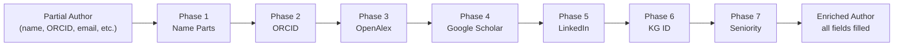

# Author Identity Enrichment Pipeline

## Deliverables

### 1. `enrich_author()` — Automated Identity Enrichment

[author_identity.py](file:///home/mohammadi/repos/cytognosis/cytos/src/cytos/scholarly/author_identity.py#L869-L1047)

Single function that takes a partially-filled `AuthorIdentity` (or dict) and fills all missing fields by cascading through 5 sources:



**Usage:**

```python
from cytos.scholarly.author_identity import enrich_author

# From just an ORCID
author = enrich_author({"orcid": "0000-0001-8734-2326"})

# From just a name
author = enrich_author({"full_name": "Aviv Regev"})

# From a dict with any fields
author = enrich_author({
    "full_name": "Fabian Theis",
    "current_affiliation": "Helmholtz",
})

# Save to KG automatically
author = enrich_author({"orcid": "..."}, save_to_kg=True)

# Skip slow sources
author = enrich_author({"full_name": "..."}, skip_sources=["scholar", "linkedin"])

# Batch
from cytos.scholarly.author_identity import enrich_authors
results = enrich_authors([{"full_name": "A"}, {"orcid": "..."}])
```

**Enrichment behavior per source:**

| Source | Triggered By | Fields Added |
|--------|-------------|-------------|
| ORCID | orcid known or discovered from name | name, affiliations, education, past positions, LinkedIn URL, external IDs, country |
| OpenAlex | orcid→filter or name search | h-index, citations, works count, research topics, country code |
| Google Scholar | scholar_id known or discovered | h-index, i10-index, citations, pubs count, interests, seniority |
| LinkedIn | linkedin_url in ORCID researcher-urls | name confirmation |

### 2. LinkedIn-Aligned LinkML Schema

[person.yaml](file:///home/mohammadi/repos/cytognosis/cytos/schemas/domains/person.yaml)

**10 classes, 107 attributes, 2 enums** — all aligned with LinkedIn API v2 entities:

| LinkML Class | LinkedIn Entity | ORCID Entity | OpenAlex Entity |
|-------------|----------------|--------------|-----------------|
| `Person` | Profile (r_fullprofile) | Person | Author |
| `Position` | Position fields | employment-summary | — |
| `EducationRecord` | Education fields | education-summary | — |
| `Certification` | Certification fields | — | — |
| `Patent` | Patent fields | — | — |
| `Honor` | Honor fields | — | — |
| `VolunteerExperience` | Volunteering Experience | — | — |
| `Project` | Project fields | — | — |
| `LanguageProficiency` | Language fields | — | — |
| `ContactInfo` | Contact Interest + Phone + IM + Website | emails | — |

### 3. Publication Schema Updates

[publication.yaml](file:///home/mohammadi/repos/cytognosis/cytos/schemas/domains/publication.yaml) — Author class extended:

- Added `google_scholar_id`, `email`, `seniority_level`
- Added `person_ref` (CURIE link to full Person entity)
- Cross-references person.yaml for the full professional profile

## Verified Test Results

| Input | Output |
|-------|--------|
| `{"orcid": "0000-0001-8734-2326"}` | Shahin Mohammadi, h=22, 4805 cites, 30 pubs, LinkedIn, 4 education, 3 past affiliations |
| `{"full_name": "Aviv Regev"}` | ORCID discovered, h=24, 8247 cites, 150 pubs, topics: single-cell, immune, cancer |
| `{"full_name": "Fabian Theis", "current_affiliation": "Helmholtz"}` | h=126, 83K cites, 1087 pubs, Helmholtz Zentrum München |
