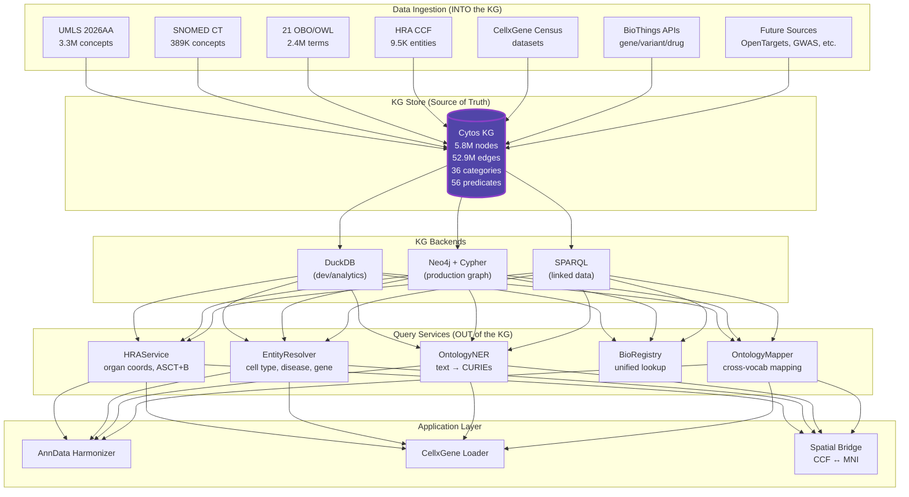
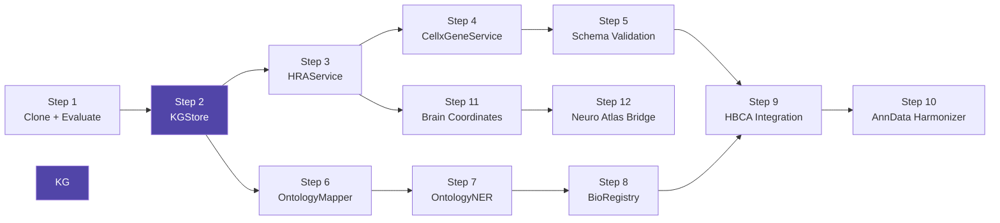

# BioAtlas Implementation Plan v2: KG-Centric Architecture

> Created: 2026-05-12 06:49 UTC | Revised from v1 with KG-as-source-of-truth principle
> Aligns with: [ARCHITECTURE.md](file:///home/mohammadi/repos/cytognosis/cytos/design/ARCHITECTURE.md), [REQUIREMENTS.md](file:///home/mohammadi/repos/cytognosis/cytos/design/REQUIREMENTS.md), [ROADMAP.md](file:///home/mohammadi/repos/cytognosis/cytos/design/ROADMAP.md)

## Core Design Principle

> [!IMPORTANT]
> **The Cytos KG (5.8M nodes × 52.9M edges) is the single source of truth.** All services are query interfaces to this KG. All data ingestion flows INTO the KG. All lookups, mappings, NER, and harmonization flow OUT of the KG. External tools (bionty, biothings, cellxgene) are either ingested into the KG or used as validation oracles.



---

## Architecture: KGStore Abstraction

The critical new component is `KGStore` — a backend-agnostic interface to the KG:

```python
class KGStore(Protocol):
    """Backend-agnostic KG query interface."""

    # --- Node lookups ---
    def get_node(self, curie: str) -> NodeRecord | None: ...
    def search_nodes(self, query: str, category: str = None, limit: int = 20) -> list[NodeRecord]: ...
    def get_nodes_by_category(self, category: str) -> pl.DataFrame: ...

    # --- Edge traversal ---
    def get_edges(self, subject: str = None, predicate: str = None, object: str = None) -> pl.DataFrame: ...
    def get_neighbors(self, curie: str, predicate: str = None, direction: str = "both") -> list[str]: ...
    def get_ancestors(self, curie: str, predicate: str = "biolink:subclass_of") -> list[str]: ...
    def get_descendants(self, curie: str, predicate: str = "biolink:subclass_of") -> list[str]: ...

    # --- Cross-reference ---
    def get_xrefs(self, curie: str, target_prefix: str = None) -> list[str]: ...
    def map_curie(self, curie: str, target_prefix: str) -> str | None: ...

    # --- Specialized ---
    def get_all_labels(self, prefixes: list[str] = None) -> dict[str, str]: ...
    def get_synonyms(self, curie: str) -> list[str]: ...
    def cypher(self, query: str, params: dict = None) -> pl.DataFrame: ...  # Neo4j only
```

**Backends:**

| Backend | Use Case | Implementation |
|---------|----------|---------------|
| `DuckDBStore` | Development, analytics, KG construction | DuckDB in-memory or file-backed over Parquet |
| `Neo4jStore` | Production graph queries, Cypher | Neo4j bolt driver |
| `SparqlStore` | Linked data, federated queries | rdflib + SPARQL endpoint |

All services take a `KGStore` instance, never touch raw files.

---

## File Layout

```
src/cytos/
├── kg/
│   ├── store.py                # KGStore protocol + DuckDBStore + Neo4jStore
│   ├── builder.py              # KGBuilder (existing, extended)
│   ├── hra_ingest.py           # HRA CCF OWL parser (existing)
│   ├── exporter.py             # Neo4j/Parquet/RDF exports (existing)
│   ├── semantic_overlay.py     # TUI→BioLink (existing)
│   └── source_resolver.py     # Manifest URI resolution (existing)
├── services/
│   ├── __init__.py
│   ├── hra.py                  # HRAService (queries KGStore)
│   ├── cellxgene.py            # CellxGeneService (census + ingest to KG)
│   └── bioregistry.py          # BioRegistry (unified lookup via KGStore)
├── harmonize/
│   ├── __init__.py
│   ├── ontology_mapper.py      # Cross-ontology mapping via KG edges
│   ├── ner.py                  # Named entity recognition from KG labels
│   ├── resolvers.py            # Entity-type resolvers (CellType, Disease, etc.)
│   └── anndata_harmonizer.py   # AnnData obs standardization
├── spatial/
│   ├── __init__.py
│   ├── neuro_atlas.py          # Neuroimaging atlas loaders
│   └── ccf_bridge.py           # HRA CCF ↔ MNI/Talairach bridge
└── ingest/
    └── linkmlize/
        ├── cellxgene.py        # (existing) CXG obs → LinkML
        └── biothings.py        # (existing) DDE schema → LinkML
```

---

## Phase A: Foundation (Steps 1-2)

### Step 1: Clone & Evaluate External Tools

**Action:**
1. Clone repos to `third_party/`:
   - `laminlabs/bionty` — ontology + bioentity resolution patterns
   - `chanzuckerberg/single-cell-curation` — CXG schema validation
   - `biothings/biothings_client.py` — REST client patterns
   - `biothings/biothings_schema.py` — schema validation patterns
   - `biothings/mygene.info` — gene annotation API source

2. Evaluate each for:
   - Entity model: what types, what identifiers, what cross-refs
   - Query patterns: how lookups work, what's cached
   - What data they have that we DON'T have in our KG yet
   - What data we have that they DON'T

3. Produce evaluation artifact

**Test:** Evaluation document produced; gaps identified

### Step 2: Build KGStore Backend Abstraction

**Action:** Create `src/cytos/kg/store.py`:
- `KGStore` protocol with all query methods
- `DuckDBStore` — loads nodes/edges Parquet into DuckDB, supports all queries
- `Neo4jStore` stub — Cypher-based backend for production
- Factory: `KGStore.from_config(backend="duckdb", kg_dir="data/kg")`

**Key queries the DuckDBStore must support efficiently:**

```sql
-- Get all HRA structures for organ
SELECT * FROM nodes WHERE source = 'hra' AND id LIKE 'UBERON:%'

-- Cross-reference mapping
SELECT e.object FROM edges e WHERE e.subject = ? AND e.predicate IN ('skos:exactMatch', 'skos:closeMatch')

-- Ancestors via recursive CTE
WITH RECURSIVE ancestors AS (
    SELECT object AS ancestor FROM edges WHERE subject = ? AND predicate = 'biolink:subclass_of'
    UNION
    SELECT e.object FROM edges e JOIN ancestors a ON e.subject = a.ancestor WHERE e.predicate = 'biolink:subclass_of'
)
SELECT * FROM ancestors

-- Full-text label search
SELECT * FROM nodes WHERE name ILIKE '%hepatocyte%' ORDER BY LENGTH(name) ASC LIMIT 20
```

**Test:**
- `test_store_get_node("UBERON:0002107")` → returns liver node
- `test_store_search_nodes("hepatocyte")` → returns CL:0000182
- `test_store_get_xrefs("MONDO:0005015")` → returns SNOMED, ICD-10, DOID mappings
- `test_store_ancestors("CL:0000182")` → returns epithelial cell → cell → ...
- `test_store_backend_swap()` → same results from DuckDB and Neo4j

---

## Phase B: Core Services (Steps 3-5)

### Step 3: HRAService (Queries KGStore)

**Action:** Build `src/cytos/services/hra.py` — operates entirely through `KGStore`:

```python
class HRAService:
    """Spatial scaffold service backed by the Cytos KG."""

    def __init__(self, store: KGStore): ...

    # --- Organ catalog ---
    def list_organs(self) -> list[dict]:
        """All ASCT+B organs from KG nodes where source=hra, asctb_type=AS, with organ grouping."""

    def get_organ_structures(self, organ_uberon: str) -> pl.DataFrame:
        """All anatomical structures for organ via ccf_part_of edges in KG."""

    def get_organ_cell_types(self, organ_uberon: str) -> pl.DataFrame:
        """Cell types via ccf_located_in edges from KG, filtered by organ."""

    def get_organ_biomarkers(self, organ_uberon: str) -> pl.DataFrame:
        """Biomarker genes/proteins via ASCT+B biomarker edges in KG."""

    # --- Spatial ---
    def get_spatial_coordinates(self, organ: str = None) -> pl.DataFrame:
        """3D placement data from hra_spatial_placements.parquet."""

    def get_organ_bounding_box(self, organ_uberon: str) -> dict:
        """Bounding box from spatial entity dimensions."""

    # --- Scaffold mapping ---
    def map_tissue_to_organ(self, tissue_uberon: str) -> str | None:
        """Resolve tissue to containing organ via KG part_of hierarchy."""

    def validate_cell_types_for_organ(self, cell_types: list[str], organ: str) -> dict:
        """Check which cell types are valid for organ per ASCT+B (KG edges)."""

    # --- Disease context ---
    def get_diseases_for_organ(self, organ_uberon: str) -> pl.DataFrame:
        """Diseases affecting organ via KG UMLS/SNOMED relationships."""

    def get_diseases_for_cell_type(self, cl_id: str) -> pl.DataFrame:
        """Diseases associated with cell type via KG edges."""
```

**Test:**
- `test_hra_list_organs()` → returns 41+ organs with UBERON IDs
- `test_hra_brain_cell_types()` → returns Allen brain cell types from KG
- `test_hra_kidney_coordinates()` → returns 3D bounding box for kidney
- `test_hra_diseases_for_liver()` → returns cirrhosis, hepatitis, etc from KG
- `test_hra_validate_cell_types()` → hepatocyte valid in liver, rejected in brain

### Step 4: CellxGene Data Ingestion & Service

**Action:**
1. Install `cellxgene-census` and `tiledbsoma`
2. Build `src/cytos/services/cellxgene.py`:
   - Census API wrapper for querying collections/datasets
   - **Ingestion path**: load obs metadata → map annotations to KG CURIEs → add to KG as new nodes/edges
   - Schema validation: wrap `cellxgene_schema.validate()` AND validate via our LinkML

```python
class CellxGeneService:
    """CellxGene Census interface backed by KG for alignment."""

    def __init__(self, store: KGStore, census_version: str = "stable"): ...

    # --- Census queries ---
    def query_collection(self, collection_id: str) -> dict: ...
    def list_datasets(self, collection_id: str = None) -> list[dict]: ...
    def load_obs_metadata(self, dataset_id: str, obs_filter: dict = None) -> pl.DataFrame: ...

    # --- KG-aligned ingestion ---
    def ingest_dataset_to_kg(self, dataset_id: str) -> dict:
        """Load CXG dataset obs, align annotations to KG, produce KGX nodes/edges."""

    def align_annotations_to_kg(self, obs: pl.DataFrame) -> pl.DataFrame:
        """Map all ontology term columns to verified KG CURIEs."""

    # --- Schema validation ---
    def validate_cxg_native(self, h5ad_path: str) -> dict:
        """Validate using chanzuckerberg/single-cell-curation tooling."""

    def validate_linkml(self, h5ad_path: str) -> dict:
        """Validate using our LinkML cellxgene schema."""

    # --- HBCA convenience ---
    HBCA_COLLECTION_ID = "283d65eb-dd53-496d-adb7-7570c7caa443"

    def load_hbca_metadata(self) -> pl.DataFrame: ...
    def load_hbca_cell_types(self) -> pl.DataFrame: ...
    def ingest_hbca_to_kg(self) -> dict: ...
```

**Test:**
- `test_cxg_query_hbca()` → returns collection metadata
- `test_cxg_align_annotations()` → all CL/UBERON CURIEs resolve in KG
- `test_cxg_validate_both_schemas()` → CXG native + LinkML agree

### Step 5: CXG Schema Validation Layer

**Action:**
1. Wrap `single-cell-curation` validator for easy use
2. Build parallel LinkML validator using our schema
3. Compare on real data

**Test:**
- `test_cxg_native_passes()` → compliant HBCA passes
- `test_linkml_passes()` → same data passes our schema
- `test_validation_agreement()` → both agree on valid/invalid

---

## Phase C: Entity Resolution (Steps 6-8)

### Step 6: OntologyMapper (via KG edges)

**Action:** Build `src/cytos/harmonize/ontology_mapper.py`:

All mappings come from KG edges (SSSOM, UMLS CUI-links, MRMAP, SNOMED maps):

```python
class OntologyMapper:
    """Cross-ontology mapping via KG edge traversal."""

    def __init__(self, store: KGStore): ...

    def map(self, curie: str, target_prefix: str) -> list[MappingResult]:
        """Direct mapping via KG skos:exactMatch / skos:closeMatch edges."""

    def map_via_cui(self, curie: str, target_prefix: str) -> list[MappingResult]:
        """Transitive mapping via UMLS CUI hub: source → CUI → target."""

    def map_chain(self, curie: str, target_prefix: str, max_hops: int = 2) -> list[MappingResult]:
        """Multi-hop mapping when direct mapping unavailable."""

    def map_batch(self, curies: list[str], target_prefix: str) -> dict[str, str | None]:
        """Batch mapping for performance."""

    # --- Entity-type convenience ---
    def map_cell_type(self, curie: str, target: str = "CL") -> str | None: ...
    def map_disease(self, curie: str, target: str = "MONDO") -> str | None: ...
    def map_anatomy(self, curie: str, target: str = "UBERON") -> str | None: ...
    def map_gene(self, curie: str, target: str = "HGNC") -> str | None: ...
```

**Test:**
- `test_map_snomed_to_mondo()` → diabetes maps correctly
- `test_map_via_cui()` → DOID → (UMLS CUI) → MONDO
- `test_map_batch_performance()` → 1000 mappings in <2s

### Step 7: OntologyNER (via KG labels)

**Action:** Build `src/cytos/harmonize/ner.py`:

Build label index from KG nodes (5.8M names + synonyms):

```python
class OntologyNER:
    """Named Entity Recognition using KG node labels."""

    def __init__(self, store: KGStore): ...

    def build_index(self, prefixes: list[str] = None, categories: list[str] = None):
        """Build trie from KG node labels. Optionally filter by prefix/category."""

    def annotate(self, text: str, tier_priority: list[str] = None) -> list[NERMatch]:
        """Find all ontology terms in text, ranked by tier priority."""

    def annotate_column(self, series: pl.Series, entity_type: str = None) -> pl.DataFrame:
        """Annotate all values in a column (e.g., AnnData obs['cell_type'])."""

    # --- Specialized ---
    def resolve_cell_type(self, text: str) -> str | None:
        """Resolve free text to best CL term."""

    def resolve_tissue(self, text: str) -> str | None:
        """Resolve free text to best UBERON term."""

    def resolve_disease(self, text: str) -> str | None:
        """Resolve free text to best MONDO term."""
```

**Test:**
- `test_ner_b_cell()` → "B cell" → CL:0000236
- `test_ner_sentence()` → sentence → multiple matches with spans
- `test_ner_column()` → annotates full obs column

### Step 8: BioRegistry & Entity Resolvers

**Action:**
1. Build entity-type resolvers in `src/cytos/harmonize/resolvers.py`:
   - Each resolver knows which KG prefixes serve its entity type
   - Uses OntologyMapper internally for cross-reference resolution

2. Build `src/cytos/services/bioregistry.py`:
   - Unified lookup: KG first, BioThings REST fallback for missing entities
   - Implements bionty's pattern: ontology terms (CL, UBERON) + bioentity tables (HGNC genes, UniProt proteins)

```python
class BioRegistry:
    """Unified bioentity registry: KG as primary, REST APIs as fallback."""

    def __init__(self, store: KGStore): ...

    def lookup(self, curie: str) -> EntityRecord | None:
        """Look up entity by CURIE. KG first, then REST APIs if missing."""

    def search(self, term: str, entity_type: str = None) -> list[EntityRecord]:
        """Search by label. Uses KG full-text search."""

    def xref(self, curie: str, target_ns: str) -> str | None:
        """Cross-reference. Delegates to OntologyMapper."""

    # --- Typed accessors ---
    def get_gene(self, symbol_or_id: str) -> GeneRecord | None: ...
    def get_protein(self, uniprot_id: str) -> ProteinRecord | None: ...
    def get_disease(self, term_or_id: str) -> DiseaseRecord | None: ...
    def get_cell_type(self, term_or_id: str) -> CellTypeRecord | None: ...
    def get_anatomy(self, term_or_id: str) -> AnatomyRecord | None: ...
```

**Test:**
- `test_bioregistry_lookup()` → MONDO:0005015 returns full record from KG
- `test_bioregistry_gene()` → "TP53" returns HGNC:11998 with xrefs
- `test_bioregistry_xref()` → cross-refs match OntologyMapper output

---

## Phase D: Data Integration (Steps 9-10)

### Step 9: Human Brain Cell Atlas v1.0

**Action:**
1. Query HBCA collection via CellxGeneService
2. Load obs metadata: cell_type_ontology_term_id, tissue_ontology_term_id, etc.
3. Validate ALL annotation CURIEs exist in KG (use KGStore.get_node)
4. Map brain regions to HRA anatomical structures (use HRAService)
5. Produce coverage report: how many CXG annotations resolve in our KG

**Test:**
- `test_hbca_all_cell_types_in_kg()` → >95% cell types resolve
- `test_hbca_brain_regions_in_hra()` → brain UBERON IDs match HRA structures
- `test_hbca_disease_context()` → disease annotations map to KG MONDO terms

### Step 10: AnnData Harmonizer

**Action:** Build `src/cytos/harmonize/anndata_harmonizer.py`:

```python
class AnnDataHarmonizer:
    """Harmonize AnnData obs columns against the KG source of truth."""

    def __init__(self, store: KGStore): ...

    def harmonize(self, adata: "AnnData", target_schema: str = "cxg_7x") -> "AnnData":
        """Full harmonization: map all obs ontology columns to KG-verified CURIEs."""

    def map_column(self, series: pl.Series, entity_type: str) -> pl.DataFrame:
        """Map a single obs column. Uses NER for free-text, OntologyMapper for CURIEs."""

    def validate_against_kg(self, adata: "AnnData") -> dict:
        """Check all ontology term columns against KG. Report missing/unmapped."""

    def suggest_mappings(self, unmapped_terms: list[str], entity_type: str) -> dict:
        """Use NER + fuzzy matching to suggest KG CURIEs for unmapped free text."""
```

**Test:**
- `test_harmonize_free_text()` → "B cell" → CL:0000236
- `test_harmonize_cross_ontology()` → DOID → MONDO via KG
- `test_harmonize_validates()` → harmonized data passes CXG schema

---

## Phase E: Spatial Bridge (Steps 11-12)

### Step 11: HRA Brain Coordinate Extraction

**Action:**
1. Use HRAService to get all brain-related spatial entities from KG
2. Map HBCA cell types to CCF coordinates:
   - cell_type (CL) → located_in (UBERON brain region) → spatial_placement (CCF x,y,z)
3. Build lookup: `(cell_type, brain_region) → CCF coordinate`

**Test:**
- `test_brain_spatial_entities()` → returns Allen brain reference organs from KG
- `test_cell_type_to_ccf()` → astrocyte in prefrontal cortex → (x, y, z)

### Step 12: Neuroimaging Atlas Bridge

**Action:** Build `src/cytos/spatial/`:
1. `neuro_atlas.py` — load MNI152, Talairach, Allen CCFv3, Desikan-Killiany
2. `ccf_bridge.py` — coordinate mapping between HRA CCF and neuroimaging spaces
3. Use UBERON as the join key: HRA UBERON regions ↔ neuroimaging atlas labels

**Dependencies:** `nilearn`, `nibabel` (optional install group)

**Test:**
- `test_mni_atlas_load()` → loads atlas with expected regions
- `test_uberon_to_mni_region()` → UBERON brain region → MNI coordinate
- `test_cross_modal_consistency()` → HRA → MNI → back is consistent

---

## Dependency Installation

```bash
# Phase A-B (Core)
uv add cellxgene-census tiledbsoma anndata

# Phase C (Entity Resolution)
# ahocorasick for NER trie (or use custom DuckDB full-text)
uv add biothings-client

# Phase E (Spatial, optional group)
uv add --optional neuro nilearn nibabel templateflow
```

---

## Integration with Existing Roadmap

This plan maps to the existing roadmap:

| Roadmap Item | Plan Coverage |
|-------------|--------------|
| P2.1 BioCypher | KGStore.Neo4jStore enables this |
| P2.3 Harmonize | Steps 6-8 (OntologyMapper, NER, Resolvers) |
| FR-5.4 OLS4 SSSOM | OntologyMapper uses all KG edges including SSSOM |
| FR-5.5 OAK mapping | OntologyMapper.map_chain() |
| FR-6.1 BioCypher adapter | KGStore → Neo4jStore → BioCypher input |

---

## Execution Sequence & Test Gates



Each step has a **test gate**: all tests for that step must pass before the next step begins. Steps 3+6 can run in parallel (both depend only on Step 2).

---

## Success Criteria

| Phase | Gate |
|-------|------|
| A | External tools evaluated; KGStore passes all query tests on 5.8M-node KG |
| B | HRAService returns correct organ data from KG; CXG annotations align with KG |
| C | OntologyMapper achieves >80% cross-ontology mapping; NER resolves known terms |
| D | HBCA >95% annotation coverage in KG; AnnData harmonizer standardizes obs |
| E | Brain coordinates extracted; MNI ↔ CCF bridge demonstrated |
