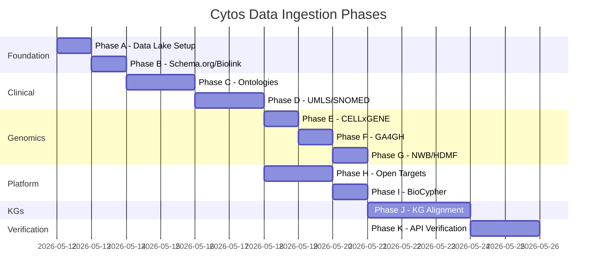

# Cytos Data Ingestion Master Plan

> **Scope**: Ingest, normalize, and integrate ~400 GB of biomedical data from 15+ sources into the Cytos knowledge graph, with full provenance tracking, schema validation, and API verification.
>
> **Constraint**: NEVER modify, delete, or alter any original data files. Always use symlinks or copies.

---

## 1. Data Lake Architecture

```
cytos/data/
├── raw/                          # Symlinks to original data (read-only)
│   ├── ols4/ → /home/mohammadi/datasets/latest/ols4/
│   ├── opentargets/ → /home/mohammadi/datasets/latest/opentargets/
│   ├── snomed_int/ → /home/mohammadi/datasets/latest/SnomedCT/..._INT_.../
│   ├── snomed_us/ → /home/mohammadi/datasets/latest/SnomedCT/..._US_.../
│   ├── umls_meta/ → /home/mohammadi/datasets/latest/UMLS/umls-2026AA-metathesaurus-full/
│   ├── umls_full/ → /home/mohammadi/datasets/latest/UMLS/umls-2026AA-full/
│   ├── ontologies/
│   │   ├── singlecell/ → /home/mohammadi/datasets/ontologies/singlecell/
│   │   ├── clinical/ → /home/mohammadi/datasets/ontologies/clinical/
│   │   └── experiments/ → /home/mohammadi/datasets/ontologies/experiments/
│   └── kgs/
│       ├── pheknowlator/ → /home/mohammadi/datasets/KGs/pheknowlator/
│       ├── primekg/ → /home/mohammadi/datasets/KGs/PrimeKG/
│       ├── petagraph/ → /home/mohammadi/datasets/KGs/Petagraph/
│       ├── monarch/ → /home/mohammadi/datasets/KGs/monarchinitiative/
│       └── pubmedkg/ → /home/mohammadi/datasets/KGs/PMK/
│
├── staged/                       # Parsed intermediates (Parquet, OWL, JSON)
│   ├── umls/                     # Merged from neuro-pheno + new processing
│   │   ├── parquet/              # MRCONSO.parquet, MRREL.parquet, etc.
│   │   ├── owl/                  # Per-vocabulary OWL (ICD10CM.ttl, etc.)
│   │   ├── semantic_network/     # SRDEF.parquet, UMLS_SemanticNetwork.ttl
│   │   └── sssom/                # UMLS_cross_mappings.sssom.tsv
│   ├── snomed/
│   │   ├── international/        # RF2 Parquet files
│   │   ├── us/                   # US Edition Parquet files
│   │   ├── owl/                  # snomed_ct_int.owl
│   │   └── sssom/                # SNOMED mapping files
│   ├── ontologies/               # Parsed ontology intermediates
│   │   ├── obo/                  # OBO-parsed term lists
│   │   └── owl/                  # OWL class extractions
│   ├── opentargets/              # Already Parquet, staged as-is
│   ├── ols4/                     # Processed SSSOM files
│   └── kgs/                      # Parsed KG node/edge tables
│       ├── primekg/
│       ├── pheknowlator/
│       ├── petagraph/
│       ├── monarch/
│       └── pubmedkg/
│
├── normalized/                   # LinkML-conformant output (Parquet + YAML)
│   ├── {source}/{version}/{TargetClass}.parquet
│   └── {source}/{version}/{TargetClass}.provenance.yaml
│
├── mappings/                     # Consolidated SSSOM mapping sets
│   ├── ols4_consolidated.sssom.tsv
│   ├── umls_cross_mappings.sssom.tsv
│   ├── snomed_icd10.sssom.tsv
│   └── cytos_entity_mappings.sssom.tsv
│
└── provenance/                   # Global provenance registry
    ├── registry.yaml             # Master list of all ingested datasets
    └── checksums/                # SHA-256 checksums for all source files
```

---

## 2. Universal Identifier System

All entities use **CURIEs** (Compact URIs) as primary identifiers:

| Prefix | Expansion | Example |
|--------|-----------|---------|
| `cytos:` | `https://w3id.org/cytognosis/cytos/` | `cytos:Gene_BRAF` |
| `MONDO:` | `http://purl.obolibrary.org/obo/MONDO_` | `MONDO:0005148` |
| `HP:` | `http://purl.obolibrary.org/obo/HP_` | `HP:0001250` |
| `CL:` | `http://purl.obolibrary.org/obo/CL_` | `CL:0000540` |
| `UBERON:` | `http://purl.obolibrary.org/obo/UBERON_` | `UBERON:0000955` |
| `HGNC:` | `https://www.genenames.org/.../HGNC:` | `HGNC:1097` |
| `SNOMEDCT:` | `http://snomed.info/id/` | `SNOMEDCT:73211009` |
| `UMLS:` | `http://identifiers.org/umls/` | `UMLS:C0011849` |
| `OT:` | `https://platform.opentargets.org/` | `OT:ENSG00000157764` |
| `biolink:` | `https://w3id.org/biolink/vocab/` | `biolink:Gene` |

The prefix registry lives at `cytos/configs/prefixes/prefix_map.yaml` and is used by all parsers and linkmlize transforms.

---

## 3. Provenance Tracking

Every normalized artifact gets a **sidecar** YAML file conforming to `core.yaml#ProvenanceRecord`:

```yaml
# normalized/opentargets/26.03/Gene.provenance.yaml
source: opentargets
source_version: "26.03"
retrieval_date: "2026-05-11"
license_class: open
license_spdx: "Apache-2.0"
sha256: "abc123..."
transform_commit: "cytos@abc1234"
agent: cytos
```

Additionally, a **global registry** at `data/provenance/registry.yaml` indexes every source:

```yaml
sources:
  - name: opentargets
    version: "26.03"
    format: parquet
    raw_path: data/raw/opentargets/
    staged_path: data/staged/opentargets/
    normalized_path: data/normalized/opentargets/26.03/
    retrieval_date: "2026-05-11"
    license: Apache-2.0
    license_class: open
    api_url: https://platform.opentargets.org/api
    verification_status: pending
```

---

## 4. Execution Phases

### Phase A: Foundation (data lake + symlinks + prefix registry) ✅

| Task | Status |
|------|--------|
| Create `data/` directory hierarchy | ✅ |
| Create symlinks to all raw data sources (20 symlinks) | ✅ |
| Write `configs/prefixes/prefix_map.yaml` (116 lines) | ✅ |
| Write `data/provenance/registry.yaml` (316 lines, 20 sources) | ✅ |
| Add `DatasetManifest` + `VerificationStatusEnum` to `core.yaml` | ✅ |

### Phase B: Schema.org / Bioschemas / BioLink Model (foundations) ✅

| Task | Status |
|------|--------|
| Fetch Biolink Model LinkML schema (14,858 lines) | ✅ |
| Import into `data/staged/biolink/` as reference | ✅ |
| Implement `BiolinkLinkMLizer` with alignment validation | ✅ |
| Fetch Bioschemas profiles (Gene, Dataset, MolecularEntity, Taxon) | ✅ |
| Implement `SchemaOrgLinkMLizer` with JSON-LD extraction | ✅ |
| Download Schema.org full vocab (1.5 MB JSON-LD) | ✅ |

### Phase C: Ontologies

| Ontology Source | Format | Files | Size | Approach |
|----------------|--------|-------|------|----------|
| CL (Cell Ontology) | OWL | 1 | ~350 MB | `OWLParser.parse_owl` → OBO terms, align to `CellType` |
| UBERON | OWL | 1 | ~200 MB | Parse → align to `AnatomicalEntity` |
| MONDO | OWL | 1 | ~180 MB | Parse → align to `Disease` |
| HPO | OBO | 1 | ~50 MB | `OWLParser.parse_obo` → align to `Phenotype` |
| EFO | OWL | 1 | ~100 MB | Parse → assay/experiment types |
| HANCESTRO | OWL | 1 | ~1 MB | Parse → ancestry terms |
| HsapDv | OWL | 1 | ~1 MB | Parse → development stages |
| NCBITaxon | OWL | 1 | ~7 GB | Parse (selective) → taxon terms |
| ChEBI | OWL | 1 | ~500 MB | Parse → `ChemicalEntity` |
| PATO | OWL | 1 | ~10 MB | Parse → `PhenotypicQuality` |
| GO | OWL | (already in OT data) | - | Parse → `BiologicalProcess`, `MolecularFunction`, `CellularComponent` |
| ICD-10-CM | OWL/TTL | 2 | ~100 MB | Parse → disease cross-refs |
| LOINC | OWL/TTL | 2 | ~500 MB | Parse → lab test types |
| RXNORM | OWL/TTL | 2 | ~200 MB | Parse → drug names |
| MeSH | OWL/TTL | 2 | ~300 MB | Parse → publication descriptors |
| OMIM | OWL/TTL | 2 | ~50 MB | Parse → Mendelian disease refs |
| Maxo | OWL | 3 | ~30 MB | Parse → treatment actions |
| ENVO | OWL | 1 | ~50 MB | Parse → environmental factors |
| FoodOn | OWL | 1 | ~300 MB | Parse → nutrition/dietary |
| BAO | OWL | 2 | ~100 MB | Parse → bioassay ontology |
| EDAm | OWL | 2 | ~50 MB | Parse → data format types |
| HED | XML | 3 | ~10 MB | Parse → event descriptors |

**Strategy**: Parse with `OWLParser`, produce OBO-format term lists as Parquet. For CELLxGENE-required ontologies, generate validation enum sets. Store in `data/staged/ontologies/`.

### Phase D: UMLS / SNOMED CT

> [!IMPORTANT]
> The neuro-pheno project has already processed these into Parquet. We merge those outputs into cytos staged data.

| Task | Source | Status |
|------|--------|--------|
| Symlink neuro-pheno UMLS Parquet to `data/staged/umls/parquet/` | neuro-pheno | ✅ |
| Symlink neuro-pheno SNOMED Parquet to `data/staged/snomed/` | neuro-pheno | ✅ |
| Copy `convert_vocab.py` logic into `cytos.ingest.parsers.rrf` | neuro-pheno | ✅ |
| Absorb phase1+2+3+4 into `UMLSLinkMLizer` (504 lines) | neuro-pheno | ✅ |
| `UMLSLinkMLizer._normalize_diseases()` | cytos | ✅ (code ready) |
| `UMLSLinkMLizer._normalize_drugs()` | cytos | ✅ (code ready) |
| `UMLSLinkMLizer._normalize_phenotypes()` | cytos | ✅ (code ready) |
| `UMLSLinkMLizer._generate_sssom()` | cytos | ✅ (code ready) |
| `UMLSLinkMLizer._build_semantic_network_owl()` | cytos | ✅ (code ready) |
| `UMLSLinkMLizer._generate_vocab_owl()` | cytos | ✅ (code ready) |
| Verify against UMLS API (`UMLSClient` ready) | cytos | ⬜ (needs run) |

### Phase E: CELLxGENE Single-Cell

| Task | Status |
|------|--------|
| Generate ontology validation enums from Phase C ontologies | ⬜ |
| Validate existing AnnData `.obs` against `CellMetadataRow` schema | ⬜ |
| Harmonize a non-conformant dataset using linkmlize transform | ⬜ |
| Write `tests/integration/test_cellxgene_validation.py` | ⬜ |

### Phase F: GA4GH Schemas

| Task | Status |
|------|--------|
| Convert VRS 2.x YAML JSON Schema → LinkML | ⬜ |
| Convert VA-Spec → LinkML | ⬜ |
| Import linkml-phenopackets (cmungall port) | ⬜ |
| Convert Pedigree Standard → LinkML | ⬜ |
| Align with existing `ga4gh.yaml` domain schema | ⬜ |
| Validate with example VRS allele + phenopacket | ⬜ |

### Phase G: NWB / HDMF Schemas

| Task | Status |
|------|--------|
| Parse `hdmf-common-schema` YAML via `HDMFParser` | ⬜ |
| Parse `nwb-schema` YAML | ⬜ |
| Generate LinkML mirrors of DynamicTable, TimeSeries, etc. | ⬜ |
| Align with existing `nwb.yaml` domain schema | ⬜ |
| Validate against a sample NWB file | ⬜ |

### Phase H: Open Targets Ingestion

| Dataset | OT Path | Target Class | Status |
|---------|---------|-------------|--------|
| `target/` | 55 dirs | `Gene` | ⬜ |
| `disease/` | | `Disease` | ⬜ |
| `drug_molecule/` | | `Drug` | ⬜ |
| `evidence_*` (13 types) | | `CytosAssociation` subclasses | ⬜ |
| `association_*` (6 types) | | Aggregate scores | ⬜ |
| `go/` | | `BiologicalProcess` / `MolecularFunction` | ⬜ |
| `interaction/` | | Protein-protein interactions | ⬜ |
| `expression/` | | `GeneExpression` | ⬜ |
| `variant/` | | `SequenceVariant` | ⬜ |
| `pharmacogenomics/` | | Drug-variant associations | ⬜ |
| `disease_hpo/` + `disease_phenotype/` | | `PhenotypeAssociation` | ⬜ |

**API verification**: Use Open Targets GraphQL API to spot-check 100 random entities.

### Phase I: BioCypher Integration

| Task | Status |
|------|--------|
| Install BioCypher | ⬜ |
| Write `biocypher_config.yaml` | ⬜ |
| Write `schema_config.yaml` for Cytos entities | ⬜ |
| Implement Open Targets adapter | ⬜ |
| Test Neo4j ingestion with OT subset | ⬜ |

### Phase J: Knowledge Graph Alignment

| KG | Format | Size | Key Entity Types | Approach |
|----|--------|------|-------------------|----------|
| **PrimeKG** | CSV | 3.9 GB | gene, drug, disease, phenotype, pathway | CSV → Polars → map to cytos classes |
| **PheKnowLator** | OWL/KGX | 156 GB | OWL-encoded, OBO-aligned | RDF parse selective subsets |
| **Petagraph/UBKG** | CSV/Neo4j dump | 24 GB | UBKG-encoded, cross-ontology | CSV extraction from zips |
| **Monarch** | KGX/DuckDB/Neo4j | 114 GB | Biolink-typed nodes/edges | DuckDB or KGX TSV parse |
| **PubMedKG** | TSV | 51 GB | papers, authors, bio-entities, trials | TSV → Polars → `Publication`, `Author` |

**For each KG**:
1. Parse node/edge tables
2. Map entity types → cytos LinkML classes
3. Identify new attributes not in current schema → expand schema
4. Generate SSSOM crosswalks for entity reconciliation
5. Produce normalized Parquet keyed by target class
6. Create provenance sidecars

### Phase K: API Verification Interfaces (clients ✅, tests ⬜)

| API | Client | Tests | What We Verify |
|-----|--------|-------|----------------|
| **OLS4** | ✅ `sources/ols4/client.py` (167 lines) | ⬜ | Ontology term lookups match our parsed terms |
| **Open Targets** | ✅ `sources/opentargets/client.py` (186 lines) | ⬜ | Gene/disease/drug entities match our Parquet |
| **UMLS** | ✅ `sources/umls/client.py` (169 lines) | ⬜ | CUI lookups match our MRCONSO Parquet |
| **Monarch** | ✅ `sources/monarch/client.py` (148 lines) | ⬜ | Association lookups match our KG parse |
| **UBKG** | ⬜ | ⬜ | Entity lookups match Petagraph parse |

API clients implemented with:
- Typed entity lookup methods
- `verify_*()` methods for round-trip testing
- `httpx`-based HTTP client with proper error handling

---

## 5. Schema Expansion Strategy

As KGs are aligned, new attributes will surface that our current 13 domain schemas don't cover. Strategy:

1. **Log missing fields** during alignment into `data/staged/kgs/{kg}/unmapped_fields.yaml`
2. **Group by domain** (e.g., new drug fields → `drug.yaml`)
3. **Add as optional attributes** with clear provenance comments
4. **Never break existing schemas** — only additive changes
5. **PR-style review** — each expansion logged in the provenance registry

---

## 6. neuro-pheno Merge Checklist

| neuro-pheno Asset | Destination in cytos | Action |
|-------------------|---------------------|--------|
| `scripts/convert_vocab.py` | `src/cytos/ingest/parsers/rrf.py` | Logic already merged into RRF parser |
| `scripts/phase1_semantic_network.py` | `src/cytos/ingest/linkmlize/umls.py` | Absorb semantic network builder |
| `scripts/phase2_snomed_owl.py` | `src/cytos/ingest/linkmlize/umls.py` (SNOMED section) | Absorb OWL assembler |
| `scripts/phase3_umls_owl.py` | `src/cytos/ingest/linkmlize/umls.py` | Absorb per-vocab OWL generator |
| `scripts/phase4_nbb_mapping.py` | `src/cytos/ingest/linkmlize/umls.py` | Absorb NBB mapper (generalize for any ICD-10 cohort) |
| `data/UMLS/*.parquet` | `data/staged/umls/parquet/` | Symlink (already processed) |
| `data/SnomedCT/{Int,US}/*.parquet` | `data/staged/snomed/{international,us}/` | Symlink (already processed) |
| `data/UMLS/SemanticNetwork/` | `data/staged/umls/semantic_network/` | Symlink |
| `data/UMLS/owl/*.ttl` | `data/staged/umls/owl/` | Symlink |
| `data/SnomedCT/owl/` | `data/staged/snomed/owl/` | Symlink |

After all merges verified, neuro-pheno can be archived.

---

## 7. Execution Priority



---

## 8. Success Metrics

| Metric | Target |
|--------|--------|
| Domain schemas cover all KG entity types | 100% |
| Every normalized artifact has ProvenanceRecord | 100% |
| Ontology terms parseable from local files | ≥95% (some OWL edge cases) |
| UMLS MRCONSO round-trip vs API | ≥99.9% match |
| Open Targets gene/disease/drug vs API | 100% match |
| SSSOM crosswalk coverage (entity reconciliation) | ≥90% |
| Integration test pass rate | 100% |
| All source data reachable via CURIE lookup | 100% |
