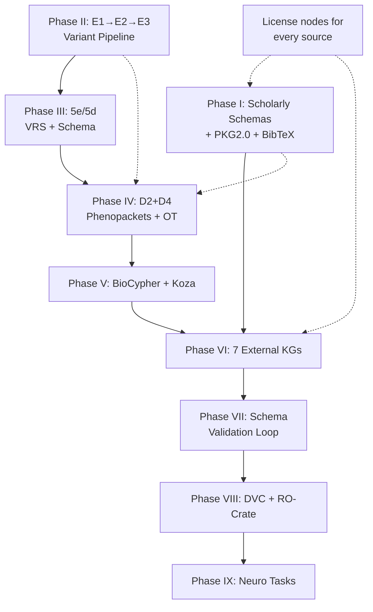

# Cytos: Complete Remaining Task Execution Plan (Revised)

> Updated: 2026-05-12 | Phases: 10 | Based on full schema review

## Design Inputs Reviewed

| Document | Location | Key Takeaways |
|----------|----------|---------------|
| **Scholarly KG v0.4.0** | [cytognosis_scholarly_kg_v0.4.0.yaml](file:///home/mohammadi/Documents/Sorted/infra/schemas/cytognosis_scholarly_kg_v0.4.0.yaml) | 2,627-line unified LinkML: License, BibliographicResource, BioEntity, ClinicalTrial, CodeRepository, Dataset, MLModel, Workflow, Protocol, ResearchObject, Annotation, ArtifactRelationship, NCATS Translator compat |
| **Papers schema** | [papers.yaml](file:///home/mohammadi/Documents/Sorted/infra/schemas/resource_schemas/papers.yaml) | BibTeX→FABIO mapping, OpenAlex types, SemOpenAlex, UMLS slots, all 20 BibTeX entry types, AIMLPaper/BiomedicalPaper subtypes, OnlineContent hierarchy |
| **Datasets schema** | [datasets.yaml](file:///home/mohammadi/Documents/Sorted/infra/schemas/resource_schemas/datasets.yaml) | DCAT 3 + DATS + Croissant + DataCite + RO-Crate, DataAccessLevel, RecordSet, DataDistribution |
| **Models schema** | [models.yaml](file:///home/mohammadi/Documents/Sorted/infra/schemas/resource_schemas/models.yaml) | HuggingFace Model Card, PublishedModel/LocalModel split, BenchmarkResult, DisaggregatedResult, MLTask/MLFramework enums |
| **Code schema** | [code.yaml](file:///home/mohammadi/Documents/Sorted/infra/schemas/resource_schemas/code.yaml) | CodeMeta + CFF + SWH + RO-Crate, 127 software fields mapped |
| **Protocols schema** | [protocols.yaml](file:///home/mohammadi/Documents/Sorted/infra/schemas/resource_schemas/protocols.yaml) | ProtocolType enum, step-by-step, reagents, instruments |
| **Workflows schema** | [workflows.yaml](file:///home/mohammadi/Documents/Sorted/infra/schemas/resource_schemas/workflows.yaml) | CWL/WDL/Nextflow/Snakemake, FormalParameter, Bioschemas alignment |
| **Research Objects** | [research_objects.yaml](file:///home/mohammadi/Documents/Sorted/infra/schemas/resource_schemas/research_objects.yaml) | RO-Crate profiles (base/workflow/WRROC/Five Safes/ARC), has_part_* composition |
| **Relationships** | [relationships.yaml](file:///home/mohammadi/Documents/Sorted/infra/schemas/resource_schemas/relationships.yaml) | CiTO/PROV-O predicates, PaperCode/PaperModel/PaperDataset typed edges |
| **Sensor/Data/Model Stack** | [unified-report.md](file:///home/mohammadi/Documents/Sorted/infra/schemas/sesors,%20data,%20and%20models/unified-report.md) | SOSA/SSN grammar, HRA scaffold, ISA hierarchy, Croissant ML, BIDS+HED, AnnData/TileDB-SOMA, ONNX+MLflow, feature manifests |
| **Software Standards** | [INDEX.md](file:///home/mohammadi/Documents/Sorted/infra/schemas/software%20schemas/INDEX.md) | 127 fields across CodeMeta/CFF/Schema.org/Zenodo/SWH, LinkML implementation patterns |

---

## Current KG State (Measured)

| Metric | Value |
|--------|-------|
| **KG Nodes** | **9,673,136** |
| **KG Edges** | **60,111,215** |
| BioLink Categories | 39 |
| Distinct Edge Sources | 907 |
| OWL Ontologies parsed | 32 (5.4 GB) |
| OLS4 SSSOM files | 45 (1,273,903 mapping edges) |
| UMLS SABs | 36+ (3.2M nodes) |
| SNOMED CT | 389K nodes, 4.1M edges |
| HRA/CCF | 6,565 nodes |
| Services | AnnData, SOMA, OntologyMapper, OLS4, Biothings, OpenTargets |

> Full audit: [cytos_full_audit.md](file:///home/mohammadi/.gemini/antigravity/brain/cd6537fc-9f66-43c5-80fd-f9d2c8fe6893/artifacts/cytos_full_audit.md)

---

## Cross-Cutting: License as First-Class KG Type

> [!IMPORTANT]
> Every ingested database/source gets a `License` node linked via `has_license` edge. The `License` class already exists in v0.4.0 schema (line 839).

### License Node Schema (from v0.4.0)

```yaml
License:
  is_a: NamedThing
  class_uri: spdx:License
  slots:
    - spdx_id          # e.g., "CC-BY-4.0", "MIT", "Apache-2.0"
    - license_family    # permissive, copyleft, creative_commons, open_data, responsible_ai, proprietary
    - license_scope     # software, data, model, content, mixed
    - license_url
    - is_osi_approved
    - is_fsf_libre
    - is_copyleft
    - permissions       # use, modify, distribute, sublicense, patent_grant
    - license_conditions # attribution, share_alike, notice, disclose_source
    - limitations       # no_liability, no_warranty, trademark_use
    - use_restrictions  # OpenRAIL specific
    - deprecated
```

### Source License Registry

| Source | License | SPDX ID | Family | Scope |
|--------|---------|---------|--------|-------|
| Monarch KG | BSD-3-Clause | BSD-3-Clause | permissive | data |
| PrimeKG | CC-BY-4.0 | CC-BY-4.0 | creative_commons | data |
| NeuroKG | CC-BY-4.0 | CC-BY-4.0 | creative_commons | data |
| PheKnowLator | MIT | MIT | permissive | mixed |
| Petagraph/UBKG | Custom (xconsortia) | LicenseRef-UBKG | other | data |
| PKG 2.0 | CC-BY-4.0 | CC-BY-4.0 | creative_commons | data |
| PharmaProjects | Proprietary (Citeline) | LicenseRef-Citeline | proprietary | data |
| Open Targets | Apache-2.0 | Apache-2.0 | permissive | mixed |
| UMLS | Custom (NLM UMLS) | LicenseRef-UMLS | other | data |
| OBO Ontologies | CC-BY-4.0 (most) | CC-BY-4.0 | creative_commons | data |
| OpenAlex | CC0-1.0 | CC0-1.0 | public_domain | data |
| CellxGene/HBCA | CC-BY-4.0 | CC-BY-4.0 | creative_commons | data |
| Pan-UKBB | CC-BY-4.0 | CC-BY-4.0 | creative_commons | data |
| GWAS Catalog | CC0-1.0 | CC0-1.0 | public_domain | data |

**Implementation**: `IngestSource` node per source → `has_license` → `License` node. Source provenance tracked on every node via `data_source` slot.

---

## Phase I: Scholarly Resource Schemas + PKG2.0

> Integrate the existing v0.4.0 resource schemas into cytos as the unified scholarly layer.

### I.1: Consolidate LinkML Schemas into `src/cytos/schemas/`

Port from the reviewed YAML files into our schema directory:

| Schema File | Classes | Source |
|-------------|---------|--------|
| `scholarly_base.yaml` | NamedThing, ScholarlyEntity, HasTimestamps, HasMetrics, HasExternalIds, HasLicense, HasProvenance, HasUMLS, HasSemOpenAlex, HasROCrateMetadata, HasTranslatorCompat | v0.4.0 base |
| `papers.yaml` | BibliographicResource, Article, Book, Thesis, InProceedings, BookChapter, TechReport, Preprint, AIMLPaper, BiomedicalPaper, OnlineContent, BlogPost, NotebookEntry, VideoContent | papers.yaml |
| `datasets.yaml` | Dataset, DataDistribution, RecordSet | datasets.yaml |
| `models.yaml` | MLModel, PublishedModel, LocalModel, BenchmarkResult, DisaggregatedResult | models.yaml |
| `code.yaml` | CodeRepository | code.yaml |
| `protocols.yaml` | Protocol | protocols.yaml |
| `workflows.yaml` | ComputationalWorkflow, FormalParameter | workflows.yaml |
| `research_objects.yaml` | ResearchObject | research_objects.yaml |
| `relationships.yaml` | ArtifactRelationship, PaperCodeRelationship, PaperModelRelationship, PaperDatasetRelationship | relationships.yaml |
| `license.yaml` | License, LicenseFamily, LicenseScope | v0.4.0 |
| `agents.yaml` | Person, Institution, Funder, Authorship | v0.4.0 |
| `bio_entities.yaml` | BiologicalEntity, Gene, Protein, Disease, Drug, etc. | v0.4.0 |
| `clinical.yaml` | ClinicalTrial, TrialPhase, TrialStatus | v0.4.0 |

### I.2: BibTeX Import/Export Service (`services/bibtex.py`)

From the papers schema, full round-trip support:
- All 20 BibtexEntryType values (article → preprint)
- Auto-generate citation keys from author+year
- Import: `.bib` file → `BibliographicResource` nodes → KG
- Export: KG node IDs → `.bib` file
- Cross-reference: DOI → PMID → OpenAlex → PKG2.0

### I.3: PKG2.0 Ingestion (`ingest/pkg2.py`)

| PKG2.0 File | → Our Schema Class | Nodes |
|-------------|-------------------|-------|
| `C01_Papers.tsv` (36.5M) | ScholarlyArticle | 36.5M |
| `C23_BioEntities.tsv` (360K) | BiologicalEntity subtypes | 360K |
| `C21_Bioentity_Relationships.tsv` (61.8M) | BioAssociation edges | 61.8M |
| `C06_Link_Papers_BioEntities.tsv.gz` (~500M) | mentions edges | ~500M |
| `C07_Authors.tsv` | Person nodes | ~40M |
| `C11_ClinicalTrials.tsv` | ClinicalTrial nodes | ~1M |
| `C15_Patents.tsv` | PatentEntry nodes | ~5M |
| `C05_PIs.tsv` | Person (PI role) | ~3M |
| `C10_Link_Papers_Journals.tsv` | Source (Journal) | ~50K |

**Strategy**: DuckDB streaming (51 GB total). Batch-insert 100K rows at a time.

### I.4: OpenAlex REST Client (`services/openalex.py`)

- Works, Authors, Institutions, Sources, Topics, Concepts
- Fetch metadata for DOIs not in PKG2.0
- Map OpenAlex concept IDs → our ontology CURIEs
- Rate-limited polite pool with email header

---

## Phase II: Variant/Genomics Pipeline (E1 → E2 → E3)

> [!IMPORTANT]
> Supports both **common variants** (GWAS summary statistics) and **rare variants** (WGS/WES/array individual-level data). Original files are never modified.

### Variant Categories

| Category | Data Type | Sources | Storage |
|----------|-----------|---------|---------|
| **Common (GWAS)** | Summary statistics | Pan-UKBB, GWAS Catalog | Parquet (per-phenotype) |
| **Rare (WGS/WES)** | Individual genotypes | VCF files | TileDB-VCF arrays |
| **Array (imputed)** | Imputed genotypes | PsychENCODE, biobanks | TileDB-VCF arrays |

### Test Datasets

#### Test 1: Olivia WGS (1 individual, temporary — drop after testing)

| File | Type | Size | Order |
|------|------|------|-------|
| `Olivia*.snp-indel.genome.vcf.gz` | SNP/Indel | 284M | **1st** |
| `Olivia*.sv.vcf.gz` | Structural Variants | 732K | **2nd** |
| `Olivia*.cnv.vcf.gz` | Copy Number Variants | 28K | **3rd** |
| `Olivia*.1.fq.gz` | FASTQ R1 | 38G | Ref only |
| `Olivia*.2.fq.gz` | FASTQ R2 | 38G | Ref only |

Path: `/home/mohammadi/datasets/genotype/personal/Olivia/`
**Policy**: Do NOT persist. Parse, validate pipeline, then drop results. Do NOT modify originals.

#### Test 2: PsychENCODE WGS-Derived Imputed (cohort, permanent)

| File | Type | Size | Samples |
|------|------|------|---------|
| `brainSCOPE_PEC_sample_genotypes_no_rna.vcf.gz` | Imputed genotypes | 94M | Multi-sample cohort |

Path: `/home/mohammadi/datasets/neuro/PEC/synapse/genotype/WGS-Derived-ImputedGenotypes/`
**Policy**: Harmonize → persist in TileDB-VCF. Do NOT modify originals.

### E1: VRS 2.0 + VCF Pipeline

| Component | Implementation |
|-----------|---------------|
| `schemas/vrs.yaml` | GA4GH VRS 2.0 LinkML: Allele, CopyNumberChange, Haplotype, SequenceLocation |
| VRS digest IDs | `vrs-python` integration for content-addressable variant IDs |
| SNP VCF parser | VCF → VRS Allele (test: Olivia SNP, then PsychENCODE) |
| SV/CNV parser | VCF → VRS CopyNumberChange/Adjacency (test: Olivia SV/CNV) |
| TileDB-VCF backend | Variant arrays keyed by VRS digest |
| Ensembl VEP wrapper | REST client for variant consequence annotation |

### E2: Common Variant (GWAS) Module

| Component | Implementation |
|-----------|---------------|
| **Pan-UKBB** ingestion | Phenotype manifest → download queue → summary stats |
| **GWAS Catalog** ingestion | EBI GWAS Catalog API + FTP bulk download |
| Summary stats schema | Effect size, p-value, allele freq, ancestry, sample size |
| Parquet storage | Per-phenotype summary stat tables |
| VRS normalization | rsID → VRS Allele digest mapping |

### E3: GraphLD/LDGM

| Component | Implementation |
|-----------|---------------|
| LD precision matrices | Ancestry-specific LD from reference panels |
| Graph LD structure | Variant-variant LD edges in KG |

---

## Phase III: Schema Refinement (5e → 5d)

### 5e: GA4GH VRS Integration
- VRS 2.0 → LinkML class alignment
- Ensembl Variation FTP → VRS bulk conversion
- VRS digest IDs for all KG variants

### 5d: Schema Profiling & Promotion
- Profile each provisional schema against live data distributions
- Validate all resource schemas against actual ingested data
- Promote schemas after 3+ source validation

---

## Phase IV: Phenopackets + Open Targets Bulk (D2 → D4)

### D2: Phenopacket → LinkML
Maps to our existing bio entity classes:

| Phenopacket Class | Our Schema Class |
|-------------------|-----------------|
| Individual | `Case` (new, extends NamedThing) |
| PhenotypicFeature | `PhenotypicFeature` (bio_entities) |
| Disease | `Disease` (bio_entities) |
| MedicalAction | `Protocol` (protocols) |
| Biosample | `Dataset` (datasets, with specimen metadata) |
| GenomicInterpretation | `SequenceVariant` + VRS |

### D4: Open Targets Bulk Ingestion
- Download OT Platform FTP dumps (JSONL)
- Parse target-disease associations, drug mechanisms
- Map to our BioAssociation edges with evidence scores

---

## Phase V: BioCypher + Koza Automation (F1)

### F1: BioCypher Adapter

| Component | Purpose |
|-----------|---------|
| `BioCypherAdapter` base class | Standardized ingestion interface |
| Schema config YAML | Map our BioLink categories → Neo4j labels |
| Ontology head/tail grafts | Extend BioLink with domain-specific classes |
| `biocypher_config.yaml` | DB connection + schema + import settings |

### Koza Integration

| Component | Purpose |
|-----------|---------|
| Source YAML templates | Declarative per-source configs |
| Transform functions | Python mappers for non-trivial transforms |
| KGX merge bridge | Koza output → our KGX pipeline |
| Scaffold generator | Auto-create Koza configs from data samples |

---

## Phase VI: External KG Integration

> [!IMPORTANT]
> Each source gets a `License` node + `IngestSource` provenance node. All nodes carry `data_source` provenance.

### VI.1: Monarch Initiative KG (BioLink-native, direct merge)

| Property | Value |
|----------|-------|
| Format | DuckDB (KGX-native) |
| Scale | 1.38M nodes, 15.36M edges, 1.26M SSSOM mappings |
| License | BSD-3-Clause |
| Strategy | Direct DuckDB table merge — already BioLink format |
| Schema gaps | None expected (Monarch defines BioLink) |

### VI.2: PrimeKG

| Property | Value |
|----------|-------|
| Format | CSV (nodes.csv, edges.csv) |
| Scale | 129K nodes (10 types), 8.1M edges (30 relations) |
| License | CC-BY-4.0 |
| Strategy | Map node_type → BioLink category, relation → BioLink predicate |

### VI.3: NeuroKG (PrimeKG + neuro extensions)

| Property | Value |
|----------|-------|
| Format | CSV (same as PrimeKG + 5 neuro types) |
| Scale | 147K nodes (15 types) |
| License | CC-BY-4.0 |
| New types | `cell_subcluster`, `cell_cluster`, `cell_subtype`, `cell_type`, `brain_structure` |

### VI.4: PheKnowLator

| Property | Value |
|----------|-------|
| Format | OWL/RDF (instance + subclass builds) |
| License | MIT |
| Strategy | RDFLib parse → KGX conversion |

### VI.5: Petagraph/UBKG

| Property | Value |
|----------|-------|
| Format | Zipped Neo4j CSVs |
| License | Custom (xconsortia) |
| Strategy | Unzip → parse → normalize CURIEs → KGX |

### VI.6: PKG2.0 Bio-entities (from Phase I)

Already handled in Phase I. 360K entities + 61.8M relationships.

### VI.7: PharmaProjects

| Property | Value |
|----------|-------|
| Format | JSON (drugs, diseases, genes, programs) |
| License | Proprietary (Citeline) |
| Strategy | Parse JSON → Drug/Disease/Gene nodes |

---

## Phase VII: Schema Validation Iteration

For **every** integrated KG, verify and iterate until 100% compliance:

1. **ID normalization** → all CURIEs with recognized Bioregistry prefixes
2. **Category coverage** → every node has valid `biolink:` category
3. **Predicate coverage** → every edge has valid `biolink:` predicate
4. **License tracking** → every source has a `License` node
5. **Cross-reference alignment** → shared entities linked via `same_as`
6. **Schema completeness** → no orphan nodes or dangling edges
7. **Resource schema compliance** → papers/datasets/models/code/protocols validate against our LinkML

If gaps found → iterate:
- Add new LinkML classes for uncovered entity types
- Add new predicates for uncovered relationship types
- Add prefix mappings for new ID schemes
- Re-run validation until 100% compliance

---

## Phase VIII: Infrastructure — DVC + RO-Crate (Priority)

### DVC Setup

| Component | Implementation |
|-----------|---------------|
| `.dvc/config` | Remote storage (GCS bucket) |
| `data/kg/*.dvc` | Track KG files |
| Pipeline DAG | `dvc.yaml`: download → parse → merge → validate → export |
| Metrics | Node/edge counts per `dvc metrics` |
| Params | `params.yaml` for ontology versions, UMLS release |

### RO-Crate Integration

| Profile | Use |
|---------|-----|
| Base RO-Crate | Per-dataset source packaging |
| Workflow RO-Crate | KG build pipeline provenance |
| WRROC | Execution records with timing |
| Five Safes | Controlled-access data (UKBB, dbGaP) |

### Additional Phase 9

| Task | Details |
|------|---------|
| CI/CD | `ci.yml` (lint+test), `kg-build.yml` (rebuild KG) |
| Docker | `Dockerfile` + `docker-compose.yml` (Neo4j + app) |
| MkDocs | API docs with schema visualization |

---

## Phase IX: Neuro-Specific Tasks

### B6: Allen Brain Atlas Bridge
- Allen structure IDs → UBERON mapping
- HRA → Allen → HBCA cross-reference edges
- NeuroKG brain_structure integration

### C: Neuroimaging Metadata
- BIDS → KG edges (SOSA/SSN grammar)
- HED event descriptors → KG nodes
- fMRI atlas coordinates → HRA spatial placements
- NWB → LinkML (D3)

---

## Execution Order



## Estimated Final KG Scale

| Source | New Nodes | New Edges | License |
|--------|-----------|-----------|---------|
| PKG2.0 papers+entities | ~37M | ~124M | CC-BY-4.0 |
| Monarch KG | ~1.4M | ~15.4M | BSD-3-Clause |
| PrimeKG | ~129K | ~8.1M | CC-BY-4.0 |
| NeuroKG | ~147K | ~10M | CC-BY-4.0 |
| PheKnowLator | ~100K | ~5M | MIT |
| Petagraph/UBKG | ~500K | ~10M | Custom |
| PharmaProjects | ~50K | ~200K | Proprietary |
| Open Targets bulk | ~80K | ~15M | Apache-2.0 |
| VRS variants | ~1M | ~5M | CC0 |
| OpenAlex concepts | ~250K | ~2M | CC0 |
| **Subtotal new** | **~41M** | **~195M** | |
| **+ Current KG** | **9.66M** | **60.07M** | |
| **Final KG** | **~50M nodes** | **~255M edges** | |
