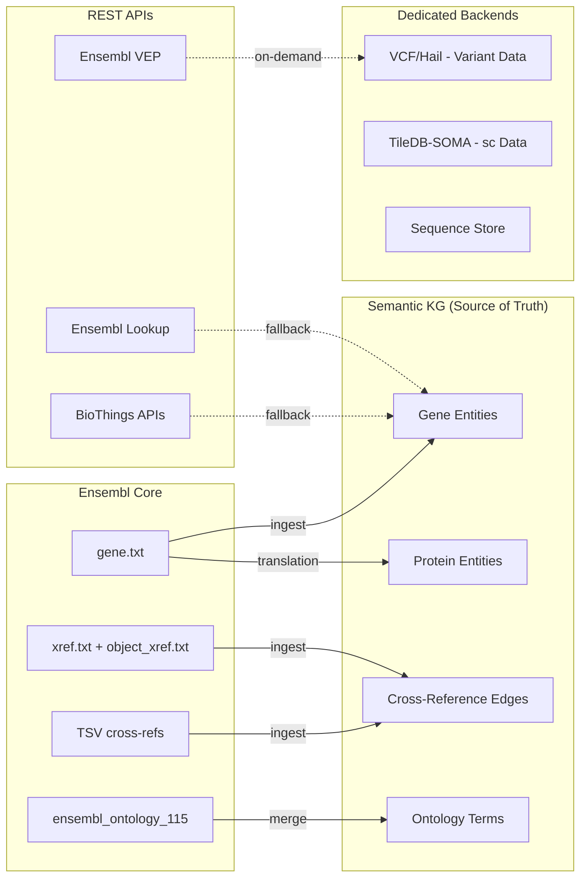

# Ensembl Data Landscape & GA4GH Integration

> Created: 2026-05-12 08:50 UTC | Ensembl release 115 (GRCh38)

## 1. Ensembl Data Organization

Ensembl provides data in **7 parallel formats**, each containing overlapping but complementary views:

| Format | Path | Best For | Size (human) |
|--------|------|----------|-------------|
| **MySQL dumps** | `mysql/homo_sapiens_core_115_38/` | Full relational schema with all cross-refs | ~3 GB |
| **TSV** | `tsv/homo_sapiens/` | ID mapping (Ensembl↔Entrez/UniProt/RefSeq) | ~50 MB |
| **GFF3** | `gff3/homo_sapiens/` | Gene models with coordinates | ~500 MB |
| **GTF** | `gtf/homo_sapiens/` | Transcript annotations | ~500 MB |
| **FASTA** | `fasta/homo_sapiens/` | DNA/protein sequences | ~3 GB |
| **VCF** | `variation/vcf/homo_sapiens/` | Variant calls (SNP, SV, ClinVar) | ~20 GB |
| **Solr** | `solr_srch/` | Pre-built search indexes | ~1 GB |
| **REST API** | `rest.ensembl.org` | On-demand queries | N/A |

## 2. MySQL Database Landscape

### 2a. Core Database (`homo_sapiens_core_115_38`)

**~80 tables.** The foundational gene/transcript/protein model.

#### Priority Tables for Ingestion

| Table | Purpose | Records (est.) | KG Entity Type |
|-------|---------|---------------|----------------|
| **`gene`** | Gene definitions (stable_id, biotype, coordinates) | ~60K | Gene |
| **`transcript`** | Transcript isoforms per gene | ~250K | Transcript |
| **`translation`** | Protein sequences (translation of coding transcripts) | ~110K | Protein |
| **`exon`** | Exon coordinates | ~750K | Exon |
| **`xref`** | Cross-references to external databases | ~2M | Mapping |
| **`external_db`** | Registry of 300+ external databases | ~300 | Registry |
| **`object_xref`** | Links genes/transcripts to xrefs | ~5M | Mapping |
| **`external_synonym`** | Gene name synonyms | ~500K | Synonym |
| **`identity_xref`** | Sequence identity for xrefs | ~1M | QC |
| **`ontology_xref`** | GO term associations for genes | ~500K | Annotation |
| **`interpro`** | Protein domain annotations | ~50K | Domain |
| **`protein_feature`** | Protein domain positions | ~1M | Feature |
| **`stable_id_event`** | ID versioning/migration history | ~200K | Provenance |

#### Gene Table Schema
```sql
CREATE TABLE gene (
  gene_id INT,
  biotype VARCHAR(40),        -- protein_coding, lncRNA, miRNA, etc.
  analysis_id SMALLINT,
  seq_region_id INT,
  seq_region_start INT,
  seq_region_end INT,
  seq_region_strand TINYINT,
  display_xref_id INT,        -- link to symbol via xref
  source VARCHAR(40),          -- ensembl, havana, etc.
  description TEXT,
  is_current BOOLEAN,
  stable_id VARCHAR(128),      -- ENSG00000141510
  version SMALLINT,
  created_date DATETIME,
  modified_date DATETIME
);
```

#### External DB Coverage (key ones)
| external_db | Description | Entity Linked |
|-------------|-------------|---------------|
| HGNC | Hugo Gene Names | Gene |
| UniProt/SWISSPROT | Reviewed proteins | Protein |
| UniProt/TrEMBL | Unreviewed proteins | Protein |
| EntrezGene | NCBI Gene IDs | Gene |
| RefSeq_mRNA | NCBI RefSeq transcripts | Transcript |
| RefSeq_peptide | NCBI RefSeq proteins | Protein |
| GO | Gene Ontology terms | Function |
| Interpro | Protein domains | Domain |
| CCDS | Consensus CDS | Transcript |
| MIM_GENE | OMIM gene entries | Disease |
| MIM_MORBID | OMIM phenotype entries | Disease |
| HGNC_trans_name | Transcript names | Transcript |

### 2b. Variation Database (`homo_sapiens_variation_115_38`)

**~60 tables.** Genetic variation data (SNP, indel, SV, clinical).

#### Priority Tables

| Table | Purpose | Records (est.) | VRS Class |
|-------|---------|---------------|-----------|
| **`variation`** | Variant definitions (rs IDs) | ~900M | Allele |
| **`variation_feature`** | Genomic coordinates per variant | ~1B | SequenceLocation |
| **`transcript_variation`** | Consequence on transcripts (VEP results) | ~5B | — |
| **`phenotype`** | Phenotype terms | ~300K | — |
| **`phenotype_feature`** | Variant-phenotype associations | ~2M | — |
| **`phenotype_ontology_accession`** | Links phenotypes to ontology terms | ~200K | — |
| **`allele`** | Allele frequencies per population | ~3B | — |
| **`population`** | Population definitions (1000G, gnomAD) | ~12K | — |
| **`structural_variation`** | CNVs, inversions, translocations | ~30M | CopyNumberChange |
| **`variation_citation`** | PubMed links | ~200K | — |
| **`variation_synonym`** | Variant name aliases (ClinVar, COSMIC) | ~5M | — |
| **`variation_hgvs`** | HGVS notation strings | ~2B | — |

> [!WARNING]
> The variation database is **massive** (~900M variants). We should NOT ingest all of it into our KG. Instead:
> 1. Ingest the **schema** and **ID registry** (variation.txt + variation_synonym.txt)
> 2. Ingest **phenotype associations** (phenotype_feature + phenotype_ontology_accession)
> 3. Use REST API for on-demand variant annotation (VEP)
> 4. Store variant-level data in dedicated VCF/Hail format, NOT in the KG

### 2c. Ontology Database (`ensembl_ontology_115`)

**Core tables + 130+ auxiliary slim/subset map tables.**

| Table | Purpose |
|-------|---------|
| **`ontology`** | List of loaded ontologies (GO, CL, EFO, HP, MONDO, SO, etc.) |
| **`term`** | All ontology terms with accessions |
| **`synonym`** | Term synonyms |
| **`relation`** | Parent-child relationships (is_a, part_of) |
| **`relation_type`** | Relationship type definitions |
| **`closure`** | Transitive closure (all ancestors for each term) |
| **`subset`** | Ontology subsets/slims |
| **`alt_id`** | Alternative/deprecated IDs |
| `aux_*_map` | Pre-computed slim mappings (CL→HRA, GO→slim, EFO→disease, etc.) |

> [!IMPORTANT]
> **Critical finding**: Ensembl's ontology database includes pre-computed slim maps for our key ontologies:
> - `aux_CL_human_reference_atlas_map` — CL terms in HRA
> - `aux_CL_cellxgene_subset_map` — CL terms used in CellxGene
> - `aux_EFO_human_reference_atlas_map` — EFO terms in HRA
> - `aux_GO_goslim_generic_map` — GO slim for generic analysis
>
> These are EXACTLY what we need for CellxGene↔HRA alignment.

### 2d. BioMart (`ensembl_mart_115`)
Pre-joined denormalized tables for bulk download. ~2,000 tables covering all organisms. Not needed for ingestion (we get the same data from core + variation).

## 3. Pre-Built TSV Cross-Reference Files

| File | Content | Columns |
|------|---------|---------|
| `*.entrez.tsv.gz` | Ensembl ↔ Entrez Gene | gene_stable_id, xref |
| `*.uniprot.tsv.gz` | Ensembl ↔ UniProt | gene_stable_id, xref |
| `*.refseq.tsv.gz` | Ensembl ↔ RefSeq | gene_stable_id, xref |
| `*.ena.tsv.gz` | Ensembl ↔ ENA | gene_stable_id, xref |

> [!TIP]
> These TSV files are the **fastest path** to build cross-reference edges. No MySQL parsing needed.

## 4. Ensembl REST API

**Version 15.10** with 70+ endpoints across 13 categories:

| Category | Key Endpoints | Use Case |
|----------|--------------|----------|
| **Lookup** | `/lookup/id/:id`, `/lookup/symbol/:species/:symbol` | Gene/transcript info |
| **Cross References** | `/xrefs/id/:id`, `/xrefs/symbol/:species/:symbol` | ID mapping |
| **Sequence** | `/sequence/id/:id` | DNA/protein sequences |
| **VEP** | `/vep/:species/hgvs/:hgvs`, `/vep/:species/region/:region/:allele` | Variant annotation |
| **Variation** | `/variation/:species/:id`, `/variant_recoder/:species/:id` | Variant lookup + HGVS |
| **Ontology** | `/ontology/id/:id`, `/ontology/ancestors/:id` | Term hierarchy |
| **Phenotype** | `/phenotype/gene/:species/:gene` | Gene-phenotype links |
| **GA4GH** | `/ga4gh/variants/:id`, `/ga4gh/variantannotations/search` | Standards-compliant |
| **Overlap** | `/overlap/region/:species/:region` | Genes/variants in region |

## 5. GA4GH Schema Integration

### 5a. VRS 2.0 (Variation Representation Specification)

**Core types** for representing genomic variation:

| VRS Class | Description | Ensembl Equivalent |
|-----------|-------------|-------------------|
| **Allele** | A state at a Location (single change) | `variation_feature` |
| **CopyNumberChange** | Gain/loss of copies | `structural_variation` (CNV) |
| **CopyNumberCount** | Absolute copy number | `structural_variation` |
| **Adjacency** | Breakpoint junction | `structural_variation` (BND) |
| **SequenceLocation** | Position on a sequence | `seq_region` + coordinates |
| **ReferenceLengthExpression** | Repeat expansions | `structural_variation` |

**Key design decisions for our integration:**
1. Store VRS `Allele` as the **canonical variant representation** in our schema
2. Generate VRS IDs (GA4GH digests) for each variant for global interoperability
3. Map Ensembl `rs` IDs ↔ VRS IDs via cross-reference edges

### 5b. Other GA4GH Standards

| Standard | Purpose | Integration Point |
|----------|---------|-------------------|
| **Phenopackets** | Structured phenotype data | Clinical annotation |
| **Beacon v2** | Variant discovery API | Ensembl already implements |
| **refget** | Sequence retrieval by hash | Sequence verification |
| **htsget** | Streaming genomic data | VCF/BAM access |
| **DRS** | Data Repository Service | Dataset registration |

## 6. Prioritized Ingestion Plan

### Phase 1: Core Biomolecules (P1, do now)

| Source | Tables/Files | Target | Size | Strategy |
|--------|-------------|--------|------|----------|
| **TSV cross-refs** | `*.entrez.tsv.gz`, `*.uniprot.tsv.gz`, `*.refseq.tsv.gz` | KG mapping edges | ~50 MB | DuckDB direct load |
| **Core gene** | `gene.txt.gz` + `xref.txt.gz` + `external_synonym.txt.gz` | Gene entity table | ~200 MB | Parse → Parquet |
| **Core transcript** | `transcript.txt.gz` | Transcript table | ~100 MB | Parse → Parquet |
| **Core translation** | `translation.txt.gz` + `protein_feature.txt.gz` | Protein table | ~150 MB | Parse → Parquet |
| **External DB** | `external_db.txt.gz` | Prefix registry | ~10 KB | Direct load |
| **Ontology DB** | `term.txt.gz` + `relation.txt.gz` + `closure.txt.gz` | Supplement KG ontologies | ~500 MB | Merge with existing |
| **Ontology slims** | `aux_CL_human_reference_atlas_map.txt.gz`, `aux_CL_cellxgene_subset_map.txt.gz` | HRA/CXG alignment | ~1 MB | Direct ingest |

### Phase 2: Variation Metadata (P2, next)

| Source | Tables/Files | Target | Size | Strategy |
|--------|-------------|--------|------|----------|
| **Phenotype** | `phenotype.txt.gz` + `phenotype_feature.txt.gz` + `phenotype_ontology_accession.txt.gz` | Gene-disease links | ~100 MB | Parse → KG edges |
| **Variation synonyms** | `variation_synonym.txt.gz` | rs↔ClinVar/COSMIC mapping | ~200 MB | ID registry only |
| **VCF (ClinVar subset)** | `homo_sapiens_clinically_associated.vcf.gz` | Clinically relevant variants | ~500 MB | VRS conversion |

### Phase 3: REST API Wrappers (P2)

| Endpoint | Wrapper Function | Use Case |
|----------|-----------------|----------|
| `/lookup/symbol/:species/:symbol` | `ensembl.lookup_gene(symbol)` | Gene info by symbol |
| `/xrefs/id/:id` | `ensembl.get_xrefs(ensembl_id)` | Cross-references |
| `/vep/:species/hgvs/:hgvs` | `ensembl.annotate_variant(hgvs)` | VEP annotation |
| `/sequence/id/:id` | `ensembl.get_sequence(id)` | DNA/protein sequence |
| `/phenotype/gene/:species/:gene` | `ensembl.get_phenotypes(gene)` | Gene-phenotype links |
| `/ga4gh/variants/:id` | `ensembl.get_variant_ga4gh(id)` | GA4GH-compliant variant |

### Phase 4: VRS Schema Integration (P3)

- Create LinkML schema for VRS 2.0 classes
- Build Ensembl variation → VRS converter
- Generate GA4GH digest IDs for interoperability
- Store VRS-encoded variants in dedicated backend (NOT in semantic KG)

## 7. Download Script (for Phase 1)

```bash
ENSEMBL_BASE="https://ftp.ensembl.org/pub/current"
OUT_DIR="$HOME/datasets/latest/Ensembl/release-115"

# Core cross-reference TSVs (fast, small)
mkdir -p "$OUT_DIR/tsv"
for f in entrez uniprot refseq ena; do
  wget -P "$OUT_DIR/tsv" "$ENSEMBL_BASE/tsv/homo_sapiens/Homo_sapiens.GRCh38.115.${f}.tsv.gz"
done

# Core MySQL tables (gene model)
mkdir -p "$OUT_DIR/core"
for f in gene transcript translation exon xref external_db \
         external_synonym object_xref ontology_xref \
         identity_xref interpro protein_feature stable_id_event; do
  wget -P "$OUT_DIR/core" "$ENSEMBL_BASE/mysql/homo_sapiens_core_115_38/${f}.txt.gz"
done
# Schema
wget -P "$OUT_DIR/core" "$ENSEMBL_BASE/mysql/homo_sapiens_core_115_38/homo_sapiens_core_115_38.sql.gz"

# Ontology database
mkdir -p "$OUT_DIR/ontology"
for f in ontology term synonym relation relation_type closure subset alt_id; do
  wget -P "$OUT_DIR/ontology" "$ENSEMBL_BASE/mysql/ensembl_ontology_115/${f}.txt.gz"
done
# Ontology slim maps (critical for HRA/CXG alignment)
for f in aux_CL_human_reference_atlas_map aux_CL_cellxgene_subset_map \
         aux_EFO_human_reference_atlas_map aux_GO_goslim_generic_map; do
  wget -P "$OUT_DIR/ontology" "$ENSEMBL_BASE/mysql/ensembl_ontology_115/${f}.txt.gz"
done
wget -P "$OUT_DIR/ontology" "$ENSEMBL_BASE/mysql/ensembl_ontology_115/ensembl_ontology_115.sql.gz"

# Variation phenotype tables
mkdir -p "$OUT_DIR/variation"
for f in phenotype phenotype_feature phenotype_feature_attrib \
         phenotype_ontology_accession variation_synonym source; do
  wget -P "$OUT_DIR/variation" "$ENSEMBL_BASE/mysql/homo_sapiens_variation_115_38/${f}.txt.gz"
done
wget -P "$OUT_DIR/variation" "$ENSEMBL_BASE/mysql/homo_sapiens_variation_115_38/homo_sapiens_variation_115_38.sql.gz"

# ClinVar VCF
wget -P "$OUT_DIR/variation" "$ENSEMBL_BASE/variation/vcf/homo_sapiens/homo_sapiens_clinically_associated.vcf.gz"
```

## 8. Architecture Decision: Where Ensembl Fits



## 9. Key Design Principles

1. **Ensembl is the primary source for biomolecular entities** (genes, transcripts, proteins). BioThings/bionty are REST fallbacks.
2. **Ontology slim maps from Ensembl** provide the CellxGene↔HRA alignment we need without building it ourselves.
3. **Variant data stays in dedicated stores** (VCF/Hail), NOT in the semantic KG. Only phenotype associations and ID mappings go into the KG.
4. **GA4GH VRS is the canonical variant schema**. All variant representations should be convertible to/from VRS.
5. **REST API wrappers** provide on-demand access for entities too large or volatile for bulk ingestion.
