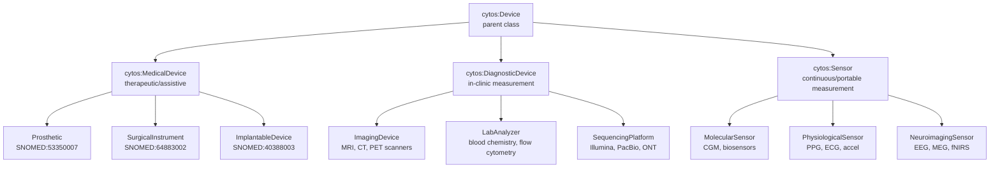

# Entity & Naming Revisions

> **Date**: 2026-05-12 | **Scope**: Naming convention + 13 entity type revisions

## 1. Naming the Three Constituent Graphs

### Proposed: Ontology Graph / Catalog Graph / Evidence Graph

| Old Name | New Name | Mnemonic | Content |
|----------|----------|----------|---------|
| Semantic World | **Ontology Graph** | What things ARE | Definitions, hierarchies, identifiers, vocabularies, mappings |
| Scholarly World | **Catalog Graph** | What has been CREATED | Papers, datasets, models, software, protocols, workflows, trials |
| Molecular/Clinical World | **Evidence Graph** | What has been OBSERVED | Measured/inferred associations, interactions, annotations |

### Why These Names

| Criterion | Ontology Graph | Catalog Graph | Evidence Graph |
|-----------|---------------|---------------|----------------|
| **Intuitive** | Ontologies define entities | A catalog lists artifacts | Evidence supports claims |
| **Accurate** | Contains OWL/OBO ontologies, SSSOM, UMLS vocabs | Contains all human-created artifacts (not just papers) | Contains empirical observations (not just molecular) |
| **Avoids** | "Semantic" (too jargon-heavy) | "Scholarly" (too narrow, excludes datasets/models) | "Molecular" (too narrow), "Experimental" (excludes clinical observations) |
| **Maps to platform** | Cytoverse (The Map) | — | Cytoscope (The Sensor) |

### Terminology Rules

- **Graph** (not world, layer, or domain): Each is a subgraph of the unified Cytos KG
- Always capitalize: "the Ontology Graph", "the Catalog Graph", "the Evidence Graph"
- Abbreviations: OG, CG, EG (in technical docs only)
- Collectively: "the three constituent graphs" or "the Cytos KG triad"

### Alternative Considered

| Option | Pro | Con |
|--------|-----|-----|
| Terms / Artifacts / Evidence | Short, punchy | "Terms" is too informal for ontologies |
| Definitional / Creative / Observational | Precise | Too academic, not memorable |
| Map / Catalog / Notebook | Intuitive | "Map" clashes with Cytoverse; "Notebook" too casual |
| Semantic / Scholarly / Empirical | Precise | "Semantic" and "Empirical" are jargon |

---

## 2. Entity Type Revisions

### 2a. GeographicLocation (5,046 nodes)

**Source**: UMLS (counties, states, countries, regions)

**Ontologies to incorporate**:

| Ontology | Coverage | Use |
|----------|----------|-----|
| **GAZ** (Gazetteer) | ~600K place names | Primary geographic ontology, OBO Foundry |
| **ISO 3166** | Countries (249), subdivisions | Country/region codes |
| **GeoNames** | 12M+ features | Most comprehensive gazetteer |
| **GADM** | Administrative boundaries | Spatial polygons |
| **SDMX-GEO** | Statistical regions | WHO/UN regional groupings |

**Schema fields**:
```yaml
GeographicLocation:
  id: GAZ:00002747            # Gazetteer ID
  name: "California"
  iso_code: "US-CA"           # ISO 3166-2
  country: GAZ:00002459       # United States
  parent_region: GAZ:00002459
  latitude: 36.778
  longitude: -119.418
  population: 39_538_223
  admin_level: 1              # 0=country, 1=state/province, 2=county
  type: state                 # country | state | county | city | region
```

**Graph placement**: Ontology Graph (geographic entities are definitional)

---

### 2b. Case → ClinicalCase (8,207 nodes)

**Source**: Monarch (Phenopacket Store — individual patient case reports)

All 8,207 nodes are GA4GH Phenopacket patient records (e.g., `phenopacket.store:ACBD6.PMID_37951597_Family_11_Subject_1`).

**Rename to**: `biolink:ClinicalCase` or `cytos:PatientCase`

**Schema**: GA4GH Phenopackets v2.0

```yaml
ClinicalCase:
  id: "phenopacket.store:ACBD6.PMID_37951597_F11_S1"
  name: "Family 11 Subject 1"
  sex: FEMALE                        # Phenopacket sex enum
  age_at_onset: "P3Y"                # ISO 8601 duration
  phenotypes: [HP:0001250, HP:0002187]  # Observed phenotypes
  diseases: [MONDO:0012345]          # Diagnosed diseases
  variants: [ClinVar:12345]          # Identified variants
  genes: [HGNC:1234]                 # Candidate genes
  source_publication: "PMID:37951597"
  pedigree_role: proband             # proband | mother | father | sibling
```

**Graph placement**: Evidence Graph (individual patient observations)
**Scholarly bridge**: `source_publication` links to Catalog Graph

---

### 2c. Agent → split into Organization + OccupationalRole (3,480 + 7,829 nodes)

**Source**: UMLS

The data shows TWO distinct entity types currently merged:

| Current Category | Actual Content | New Category | Examples |
|-----------------|---------------|-------------|----------|
| `biolink:Agent` (3,480) | Healthcare services, companies, agencies | `cytos:Organization` | "Cardiac surgery service", "Armour Pharmaceutical Co" |
| `biolink:IndividualOrganism` (7,829) | Occupational roles, professional titles | `cytos:OccupationalRole` | "Recovery nurse", "Ship mate", "Media planner" |

**Organization schema** (Schema.org + FOAF + ROR):
```yaml
Organization:
  id: ROR:03vek6s52           # ROR ID (preferred) or UMLS CUI
  name: "NIH Clinical Center"
  type: healthcare_provider   # pharma_company | healthcare_provider | research_institution | regulatory_agency
  country: GAZ:00002459
  ror_id: "03vek6s52"
  homepage: "https://clinicalcenter.nih.gov"
```

**OccupationalRole schema** (ISCO-08 + SNOMED):
```yaml
OccupationalRole:
  id: SNOMED:106292003         # or UMLS CUI
  name: "Registered Nurse"
  isco_code: "2221"            # International Standard Classification of Occupations
  domain: healthcare           # healthcare | research | industry
```

**Graph placement**: Organizations → Catalog Graph (they CREATE artifacts). Roles → Ontology Graph (definitional).

---

### 2d. CellLine (167,186 nodes) — Full Schema

**Sources to integrate**:

| Source | Coverage | Key Fields |
|--------|----------|------------|
| **CLO** (Cell Line Ontology) | 40K+ cell lines | Hierarchical classification, species, tissue |
| **Cellosaurus** (ExPASy) | 148K+ cell lines | Most comprehensive: STR profiles, mutations, cross-refs |
| **DepMap** | ~1,800 cancer lines | Genomic profiles, drug sensitivity |
| **ATCC** | ~4,000 lines | Commercial availability |

**Revised schema**:
```yaml
CellLine:
  # Identity
  id: CLO:0009903              # CLO preferred; also Cellosaurus CVCL
  name: "HeLa"
  cellosaurus_id: "CVCL:0030"
  synonyms: ["HELA", "HeLa S3"]

  # Classification
  cell_type_of_origin: CL:0000066        # Epithelial cell (CL ontology)
  tissue_of_origin: UBERON:0000002       # Cervix (UBERON)
  species: NCBITaxon:9606                # Human
  disease_of_origin: MONDO:0005061       # Cervical cancer
  cell_line_category: cancer             # cancer | iPSC | primary | immortalized | hybrid | stem

  # Characterization
  sex: female
  age_at_sampling: 31
  ethnicity: "African American"
  str_profile: {...}                     # Short Tandem Repeat profile (Cellosaurus)
  karyotype: "Hypertriploid"
  mutations: [TP53:c.1_?, PIK3CA:E545K]  # Known mutations

  # Provenance
  donor_case: "phenopacket:HeLa_donor"   # Link to ClinicalCase if known
  derivation_protocol: "protocol:12345"  # Link to Protocol in Catalog Graph
  derived_from: CLO:0009903              # Parent cell line (if subclone)
  established_date: "1951-02-08"
  established_by: "PMID:14426166"        # George Gey (link to Publication)

  # Availability
  atcc_id: "CCL-2"
  repositories: [ATCC, ECACC, DSMZ]

  # Cross-references
  depmap_id: "ACH-001144"
  cosmic_id: 905949
```

**Graph placement**: Ontology Graph (cell line DEFINITIONS are terminological)
**Evidence Graph links**: expression profiles, drug sensitivity, mutation data

---

### 2e. Device → Parent of MedicalDevice + Sensor (74,912 nodes)

**Current**: 74,912 UMLS medical device entries (suction tubes, prosthetics, lancing devices)

**Revised hierarchy**:



**Ontologies**:
| Ontology | Use |
|----------|-----|
| **SNOMED (device hierarchy)** | ~15K device concepts |
| **GMDN** (Global Medical Device Nomenclature) | Regulatory classification |
| **NCIT (device subtree)** | Cancer/imaging devices |
| **UDI** (Unique Device Identification) | FDA device identifiers |

**Graph placement**: Device taxonomy → Ontology Graph. Individual device instances → Catalog Graph (manufactured artifacts).

---

### 2f. Behavior → NeurobehavioralEntity (5,003 nodes) + subtypes

**Current**: 5,003 UMLS behavioral concepts (heterogeneous mix of social behaviors, relationships, parenting, even "racial segregation")

**Split into three entity types**:

| New Type | Content | Ontology | Example |
|----------|---------|----------|---------|
| `cytos:NeurobehavioralPhenotype` | Observable behavioral symptoms mapped to brain circuits | NBO (Neurobehavior Ontology) | Anhedonia, hypervigilance, psychomotor retardation |
| `cytos:BehavioralAssessment` | Validated clinical instruments that MEASURE behavior | `cytos:` (custom, linked to NCIT instruments) | PHQ-9, GAD-7, MMSE, MoCA |
| `cytos:SocialDeterminant` | Social/environmental factors that influence health | SDOH (Social Determinants of Health) | Housing instability, food insecurity |

**DSM-5 Integration**: Each DSM-5 disorder is modeled as a set of gain/loss of behavioral phenotypes:

```
Major Depressive Disorder (MONDO:0002050)
  ├── GAIN: NBO:anhedonia
  ├── GAIN: NBO:psychomotor_retardation
  ├── GAIN: NBO:insomnia OR NBO:hypersomnia
  ├── GAIN: NBO:fatigue
  ├── LOSS: NBO:concentration
  ├── LOSS: NBO:appetite (or GAIN)
  └── criterion: ≥5 of 9 symptoms for ≥2 weeks
```

**PHQ-9 mapping**: Each PHQ-9 item maps to a NeurobehavioralPhenotype:

| PHQ-9 Item | Behavioral Phenotype | NBO Term |
|------------|---------------------|----------|
| Q1: "Little interest or pleasure" | Anhedonia | `NBO:0000185` |
| Q2: "Feeling down, depressed" | Depressed mood | `NBO:0000186` |
| Q3: "Trouble sleeping" | Insomnia/hypersomnia | `NBO:0000136` |
| Q4: "Feeling tired" | Fatigue | `NBO:0000149` |
| Q5: "Poor appetite or overeating" | Appetite change | `NBO:0000130` |
| Q6: "Feeling bad about yourself" | Guilt/worthlessness | — (custom) |
| Q7: "Trouble concentrating" | Attention deficit | `NBO:0000101` |
| Q8: "Moving slowly/restlessly" | Psychomotor change | `NBO:0000148` |
| Q9: "Thoughts of self-harm" | Suicidal ideation | `NBO:0000178` |

**Graph placement**: 
- NeurobehavioralPhenotype → Ontology Graph (definitions)
- BehavioralAssessment (instruments) → Catalog Graph (created tools)
- Assessment SCORES → Evidence Graph (measured values)

---

### 2g. Exposure & Lifestyle Entities

**Current**: `ExposureEvent` (21K) + `EnvironmentalExposure` (818) + `EnvironmentalFeature` (364K) are fragmented.

**Ontologies to incorporate**:

| Ontology | Coverage | Use |
|----------|----------|-----|
| **ECTO** (Environmental Conditions, Treatments, and Exposures) | ~14K terms | Primary exposure ontology |
| **ExO** (Exposure Ontology) | ~300 terms | Exposure types and routes |
| **ENVO** (Environment Ontology) | ~6K terms | Environmental features/biomes |
| **SDOH** (Social Determinants of Health) | ~500 terms | Social/behavioral exposures |
| **ONS** (Open Nutrition and Fitness Schema) | Dietary patterns | Nutritional exposure |
| **LOINC (social history)** | Clinical social hx | Smoking, alcohol, drug use |

**Revised hierarchy**:

```yaml
ExposureEntity:  # parent class
  subtypes:
    - ChemicalExposure        # ECTO: pesticides, pollutants, medications
    - RadiationExposure        # ECTO: UV, ionizing radiation
    - InfectiousExposure       # pathogen contact (NCIT)
    - DietaryExposure          # ONS: diet patterns, nutrients, supplements
    - PhysicalActivityExposure # Exercise, sedentary behavior
    - SubstanceUseExposure     # Smoking, alcohol, recreational drugs (LOINC social hx)
    - OccupationalExposure     # ECTO: workplace hazards
    - SocialExposure           # SDOH: isolation, poverty, discrimination
    - EnvironmentalExposure    # ENVO: air quality, water quality, climate
```

**Graph placement**: Exposure taxonomy → Ontology Graph. Measured exposures → Evidence Graph.

---

### 2h. ClinicalFinding / ClinicalAttribute / Procedure (2.8M nodes)

**Current**: 2.8M nodes from UMLS, all provisional. Three categories:

| Category | Count | What's in it |
|----------|------:|-------------|
| ClinicalFinding | 1,393,204 | SNOMED findings: symptoms, signs, lab results |
| ClinicalAttribute | 732,925 | SNOMED observable entities: BP, heart rate, BMI |
| Procedure | 707,855 | SNOMED/CPT/MAXO: surgeries, therapies, tests |

**Alignment strategy**: Map to OMOP CDM domains for interoperability:

| BioLink Category | OMOP Domain | SNOMED Hierarchy | Schema Alignment |
|-----------------|------------|-----------------|-----------------|
| ClinicalFinding | Condition, Observation | Clinical Finding (404684003) | OMOP Condition_Occurrence |
| ClinicalAttribute | Measurement | Observable Entity (363787002) | OMOP Measurement |
| Procedure | Procedure | Procedure (71388002) | OMOP Procedure_Occurrence |

**Schema fields to add** (from PharmaProject/trial context):

```yaml
ClinicalFinding:
  id: SNOMED:22298006          # Myocardial infarction
  name: "Myocardial infarction"
  snomed_concept_id: 22298006
  icd10_code: "I21"
  omop_concept_id: 4329847
  finding_type: diagnosis      # diagnosis | symptom | sign | lab_result
  body_site: UBERON:0000948    # Heart
  severity: SNOMED:24484000    # Severe (if applicable)
  acuity: acute                # acute | chronic | subacute
  clinical_status: confirmed   # confirmed | provisional | refuted

ClinicalAttribute:
  id: SNOMED:75367002          # Blood pressure
  name: "Blood pressure"
  loinc_code: "85354-9"
  omop_concept_id: 3004249
  measurement_unit: UO:0000272 # mmHg
  normal_range: {low: 90/60, high: 120/80}
  body_site: UBERON:0003822    # Upper arm
  sensor_type: cytos:BloodPressureSensor  # Link to Device/Sensor

Procedure:
  id: SNOMED:232717009         # Coronary artery bypass
  name: "Coronary artery bypass grafting"
  cpt_code: "33533"
  maxo_id: MAXO:0000164
  omop_concept_id: 2107034
  procedure_type: surgical     # surgical | therapeutic | diagnostic | preventive
  body_site: UBERON:0000948    # Heart
  required_devices: [SNOMED:64883002]  # Surgical instruments
  indication: SNOMED:22298006  # MI (link to ClinicalFinding)
```

---

### 2i. Genome/Variant: A Dual-Graph Entity

Like Clinical Trials, genomic entities span two graphs:

| Aspect | Graph | Content |
|--------|-------|---------|
| **Reference genome** (GRCh38, T2T-CHM13) | Ontology Graph | Definitional: chromosome structure, gene coordinates, reference alleles |
| **Common variant catalog** (dbSNP 15M+, gnomAD) | Ontology Graph | Definitional: variant identity, position, allele frequencies |
| **Variant-disease associations** (GWAS, ClinVar) | Evidence Graph | Empirical: measured effect sizes, p-values, pathogenicity classifications |
| **Papers describing variants** | Catalog Graph | Artifact: publications that discovered/characterized variants |

```
Ontology Graph                    Evidence Graph
┌──────────────────────┐          ┌──────────────────────────┐
│ dbSNP:rs1234567      │          │                          │
│  position: chr1:12345│──assoc──→│ rs1234567 → T2D          │
│  ref: A, alt: G      │          │   OR: 1.3, p: 5e-8       │
│  MAF: 0.15           │          │   source: GWAS Catalog    │
│  consequence: missense│         │   PMID: 12345678          │
│  gene: BRCA1         │          │                          │
└──────────────────────┘          └──────────────────────────┘
     (definition)                      (measurement)
```

---

### 2j. QuantityValue → MeasurementUnit (5,981 nodes)

**Source**: UO (Units of Measurement Ontology) — these are UNIT DEFINITIONS (length, mass, time, etc.)

**Rename to**: `cytos:MeasurementUnit`
**Graph placement**: Ontology Graph (definitional)
**Schema**: UO + QUDT (Quantities, Units, Dimensions, Types)

---

### 2k. Attribute → PhenotypicAttribute (5,647 nodes)

**Source**: FlyBase Controlled Vocabulary (FBcv) — Drosophila phenotype terms

**Rename to**: `cytos:PhenotypicAttribute`
**Graph placement**: Ontology Graph (definitional)
**Merge into**: PhenotypicFeature schema (already stable), with species tag `NCBITaxon:7227` (D. melanogaster)

---

### 2l. PopulationOfIndividualOrganisms → PopulationGroup (12,109 nodes)

**Source**: UMLS ethnic groups, tribal entities

**Rename to**: `cytos:PopulationGroup`
**Ontology**: OMB race/ethnicity + GAZ geographic origins
**Graph placement**: Ontology Graph (definitional categories)

---

## 3. Updated Entity Type Summary

### Ontology Graph (Definitions)

| Entity Type | Count | Schema Status | Key Ontologies |
|-------------|------:|:------------:|---------------|
| Disease | 1,094K | 🟢 | MONDO, DOID |
| Protein | 895K | 🟢 | UniProt, PR |
| Gene | 846K | 🟢 | HGNC, Ensembl |
| ClinicalAttribute | 733K | 🟡→🟢 | SNOMED, LOINC, OMOP |
| Procedure | 708K | 🟡→🟢 | SNOMED, CPT, MAXO, OMOP |
| ChemicalEntity | 630K | 🟢 | CHEBI, PubChem |
| Drug | 593K | 🟢 | DrugBank, ChEMBL |
| AnatomicalEntity | 485K | 🟢 | UBERON, HRA |
| PhenotypicFeature | 428K | 🟢 | HP, MP |
| EnvironmentalFeature | 364K | 🟡 | ENVO, ECTO |
| BiologicalProcess | 292K | 🟢 | GO (BP) |
| SequenceVariant | 219K | 🟢 | VRS, dbSNP |
| OrganismTaxon | 184K | 🟡 | NCBITaxon |
| CellLine | 167K | 🟡→🟢 | CLO, Cellosaurus |
| Genotype | 139K | 🟢 | VRS |
| Cell | 99K | 🟢 | CL |
| ExperimentalFactor | 97K | 🟡 | EFO |
| Device | 75K | 🟡→🟢 | SNOMED, GMDN |
| MolecularActivity | 52K | 🟢 | GO (MF) |
| Pathway | 28K | 🟢 | Reactome, KEGG |
| ExposureEntity | 22K | 🟡→🟢 | ECTO, ExO, ENVO |
| CellularComponent | 18K | 🟢 | GO (CC) |
| NucleicAcidEntity | 17K | 🟡 | SO |
| PopulationGroup | 12K | 🔴→🟡 | OMB, GAZ |
| MeasurementUnit | 6K | 🔴→🟢 | UO, QUDT |
| PhenotypicAttribute | 6K | 🔴→🟡 | FBcv → merge into HP/MP |
| GeographicLocation | 5K | 🔴→🟢 | GAZ, ISO 3166 |
| NeurobehavioralPhenotype | 5K | 🔴→🟡 | NBO, DSM-5 |
| Organization | 3K | 🔴→🟡 | ROR, Schema.org |
| LifeStage | 2K | 🟡 | HsapDv, MmusDv |
| OccupationalRole | 8K | 🔴→🟡 | SNOMED, ISCO-08 |

### Catalog Graph (Artifacts)

| Entity Type | Count | Schema Status | Key Standards |
|-------------|------:|:------------:|--------------|
| Publication | 1,000K | 🟢 | DataCite, CiTO, OpenAlex |
| ClinicalTrial (metadata) | 481K | 🟢 | ClinicalTrials.gov, WHO ICTRP |
| Dataset | — (future) | 🟡 | DCAT, Croissant, RO-Crate |
| Model | — (future) | 🟡 | HuggingFace model cards |
| Software | 1K | 🟡 | CodeMeta, CITATION.cff |
| Workflow | — (future) | 🟡 | CWL, Bioschemas |
| Protocol | — (future) | 🟡 | protocols.io |
| BehavioralAssessment | — (subset) | 🔴→🟡 | NCIT instruments |
| Organization | 3K | 🔴→🟡 | ROR, Schema.org |

### Evidence Graph (Observations)

| Entity Type | Count | Schema Status | Key Predicates |
|-------------|------:|:------------:|---------------|
| ClinicalFinding | 1,393K | 🟡→🟢 | SNOMED findings, OMOP Conditions |
| ClinicalCase | 8K | 🔴→🟡 | GA4GH Phenopackets |
| *(All edges here, few dedicated node types)* | — | — | interacts_with, expressed_in, gene_associated, treats |

> [!IMPORTANT]
> The Evidence Graph is primarily EDGES between nodes that are defined in the Ontology Graph. It has relatively few exclusive node types (ClinicalFinding, ClinicalCase). Most "evidence" is relationships between ontology-defined entities.
