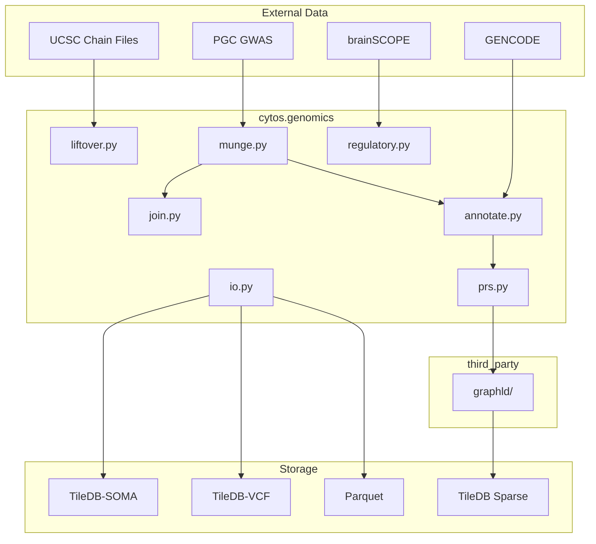

# Cytos Genomics Module — Complete Report

> **Session**: 2026-05-12 | **Commits**: `1c6b689`, `5d0096d`

## Architecture



## Module Summary

| Module | Functions | Lines | Test Status |
|--------|----------|------:|:-----------:|
| [liftover.py](file:///home/mohammadi/repos/cytognosis/cytos/src/cytos/genomics/liftover.py) | `ensure_chain_file`, `normalize_chromosomes`, `liftover_variants` | 135 | ✅ |
| [munge.py](file:///home/mohammadi/repos/cytognosis/cytos/src/cytos/genomics/munge.py) | `harmonize_columns`, `align_alleles`, `compute_variant_id`, `filter_quality`, `deduplicate`, `or_to_beta`, `munge` | 240 | ✅ 93K/5M variants |
| [join.py](file:///home/mohammadi/repos/cytognosis/cytos/src/cytos/genomics/join.py) | `join_gwas`, `compute_meta_analysis` | 130 | ✅ 80K shared variants |
| [annotate.py](file:///home/mohammadi/repos/cytognosis/cytos/src/cytos/genomics/annotate.py) | `compute_vrs_id`, `add_vrs_ids`, `load_gencode_regions`, `annotate_with_regions` | 215 | ✅ VRS IDs generated |
| [prs.py](file:///home/mohammadi/repos/cytognosis/cytos/src/cytos/genomics/prs.py) | `prs_clump_threshold`, `GraphLDAdapter.compute_blup_prs`, `store_ldgm_sparse` | 230 | ✅ 8 thresholds |
| [regulatory.py](file:///home/mohammadi/repos/cytognosis/cytos/src/cytos/genomics/regulatory.py) | `load_cres`, `load_grn`, `load_eqtl_edges`, `link_cres_to_genes`, `link_variants_to_genes` | 310 | ✅ 5.2K CRE→gene links |
| [io.py](file:///home/mohammadi/repos/cytognosis/cytos/src/cytos/genomics/io.py) | `CellxGeneInputAdapter`, `GWASInputAdapter`, `SOMAOutputAdapter`, `GWASOutputAdapter`, `ObservationPipeline` | 370 | ✅ |

## Key Capabilities

### 1. GWAS Munging (`munge.py`)
- **40+ column aliases** covering PGC, METAL, plink, BOLT-LMM, SAIGE formats
- OR→beta conversion, deterministic variant_id, dedup, quality filter
- Pipeline: `harmonize → or_to_beta → variant_id → dedup → quality_filter`

### 2. Variant Annotation (`annotate.py`)
- **VRS v2.0 IDs**: Deterministic `ga4gh:VA.<digest>` for every variant
- **GENCODE regions**: Gene, exon, UTR, CDS overlap with nearest-gene fallback
- GENCODE v47 GTF available at `04-identifiers/databases/Gencode/`

### 3. Regulatory Integration (`regulatory.py`)

brainSCOPE data loaded and linked:
- **253,638 CREs** (145K dELS, 67K pELS, 29K PLS, 5.4K CA-CTCF)
- **24 cell-type GRNs** (Ast, Chandelier, End, Immune, L2.3.IT, L4.IT, L5.6.NP, L5.ET, L5.IT, L6.CT, L6.IT.Car3, L6.IT, L6b, Lamp5.Lhx6, Lamp5, Mic, OPC, Oli, Pax6, Pvalb, Sncg, Sst, VLMC, Vip)
- L4.IT GRN: **1.1M edges**, 386 TFs → 10,283 target genes
- L4.IT eQTL: **2,132 edges**, 109 genes, 290 variants
- **CRE→gene linking** via GRN enhancer overlap: 5,192 links from 1,000 CREs

### 4. GraphLD Integration (`prs.py` + `third_party/graphld`)

GraphLD cloned at `third_party/graphld/` with:
- `PrecisionOperator`: LDGM sparse precision matrices per ancestry
- `BLUP`: Best Linear Unbiased Predictor PRS = (P + I/n·h²)⁻¹ · β̂
- `heritability`: h² estimation via LDGM likelihood
- LDGM sparse storage: edgelist → TileDB sparse array per population

### 5. BioCypher I/O Adapters (`io.py`)

Extended BioCypher adapter pattern:

```python
# Input: validate + ingest
adapter = CellxGeneInputAdapter()
data = adapter.read(Path("hbca.h5ad"), dataset_id="hbca_cortex")
adapter.validate(data)
nodes = list(adapter.get_nodes())  # Dataset node
edges = list(adapter.get_edges())  # Cell type, tissue, disease edges

# Output: transform + export
pipeline = ObservationPipeline()
pipeline.ingest(
    input_adapter=CellxGeneInputAdapter(),
    source=Path("hbca.h5ad"),
    output_adapter=SOMAOutputAdapter(),
    target=Path("hbca.soma"),
    transforms=[filter_primary, normalize],
)

# GWAS pipeline: munge + liftover + export
pipeline.ingest(
    input_adapter=GWASInputAdapter(),
    source=Path("scz2022.parquet"),
    output_adapter=GWASOutputAdapter(),
    target=Path("scz_harmonized.parquet"),
    transforms=[liftover_to_hg38, add_vrs_ids],
)
```

### 6. DatasetSchema Pattern

Each adapter validates against a `DatasetSchema` that bridges:
- **Data schema** (CellxGene 5.2, VRS 2.0, GWAS-SSF 1.0)
- **Storage schema** (TileDB-SOMA layout, VCF format, Parquet schema)
- **Ontology mappings** (CL, UBERON, MONDO, EFO → KG linkage)

## Data Flow Example

```
PGC SCZ GWAS (zip)
  → Extract primary TSV
  → munge(): harmonize columns, OR→beta, dedup, quality filter
  → liftover(): hg19→hg38 (if needed)
  → annotate(): VRS IDs + GENCODE gene overlap
  → regulatory(): eQTL→gene links per cell type
  → join(): merge with BIP, ADHD studies
  → prs(): C+T or GraphLD BLUP weights
  → io.GWASOutputAdapter(): export to Parquet/TileDB-VCF
  → KG edges: dataset → MONDO:0005090, OBI:0001271, NCBITaxon:9606
```
