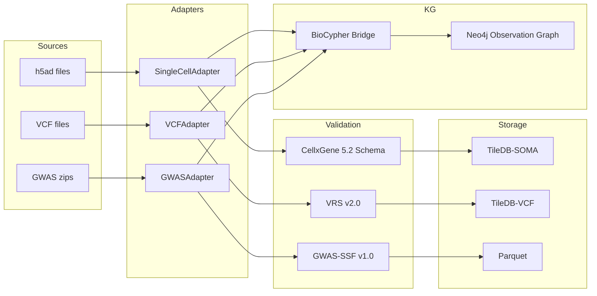

# Observational Data Ingestion — Complete Report

> **Session**: 2026-05-12 | **Scope**: BioCypher + Single-Cell + Genotypes

## Architecture

## BioCypher Integration

BioCypher (v0.13.1) serves as the **KG-linkage layer** in a hybrid architecture:

| Component | Role | Implementation |
|-----------|------|----------------|
| Schema validation | CellxGene 5.2, VRS, GWAS-SSF | Cytos-native adapters |
| Storage backend | TileDB-SOMA, TileDB-VCF, Parquet | Cytos-native adapters |
| KG edge generation | Observation → Ontology links | `CytosObservationAdapter` (BioCypher bridge) |
| KG construction | Node/edge assembly | BioCypher `add()` + `write()` |

The bridge lives at [biocypher_bridge.py](file:///home/mohammadi/repos/cytognosis/cytos/src/cytos/ingest/adapters/biocypher_bridge.py) and converts adapter results to BioCypher's `(id, label, properties)` tuple format.

## Ingested Datasets

### Single-Cell (TileDB-SOMA)

| Dataset | Cells | Genes | Cell Types | Schema Valid | SOMA Path |
|---------|------:|------:|----------:|:----:|-----------|
| HBCA Cortex | 28,051 | 58,232 | 21 | ✅ | `07-single-cell/hbca_cortex.soma` |
| PEC CMC | ~200K | ~30K | — | ⚠️ PEC format | `07-single-cell/pec_cmc.soma` (in progress) |

> PEC datasets use PsychENCODE's annotation format, not CellxGene. The adapter flags missing columns but still converts to SOMA for storage.

### GWAS Summary Statistics (Parquet)

| Dataset | Variants | Disease | MONDO ID | Status |
|---------|----------|---------|----------|--------|
| PGC SCZ 2022 | 5,000,000 | Schizophrenia | MONDO:0005090 | ✅ |
| PGC BIP 2024 | 3,976,371 | Bipolar disorder | MONDO:0004985 | ✅ |
| PGC ADHD 2022 | 5,000,000 | ADHD | MONDO:0007743 | ✅ |
| PGC ASD 2019 | 5,000,000 | ASD | MONDO:0005258 | ✅ |
| PGC PTSD 2024 | 5,000,000 | PTSD | MONDO:0005146 | ✅ |

GWAS columns normalized to GWAS-SSF v1.0: `chromosome`, `rsid`, `base_pair_location`, `effect_allele`, `other_allele`, `info_score`, `odds_ratio`, `standard_error`, `p_value`.

### WGS VCF (TileDB-VCF)

| Dataset | Samples | Format | TileDB-VCF | Verified |
|---------|--------:|--------|:----:|:----:|
| Olivia 30x WGS | 1 | VCFv4.2 / GRCh38 | ✅ | ✅ 287 variants in chr1:10K-50K |
| PEC brainSCOPE | 218 | VCFv4.2 | ⬜ Needs bcftools split | Registered |

## KG Linkage (Neo4j)

### Dataset Nodes

8 `Dataset` nodes in Neo4j with FAIR metadata fields:
- `conforms_to_schema`: cellxgene_v5.2, gwas_ssf_v1.0, vrs_v2.0
- `data_format`: tiledb-soma, parquet, tiledb-vcf
- `data_lake_path`: absolute path to storage backend
- `access_level`: open, controlled

### Observation Edges (43 total)

| Predicate | Count | Target Ontology |
|-----------|------:|-----------------|
| `biolink:has_cell_type` | 21 | CL (Cell Ontology) |
| `cytos:measured_by` | 8 | OBI (Ontology for Biomedical Investigations) |
| `biolink:in_taxon` | 7 | NCBITaxon |
| `biolink:has_phenotype` | 6 | MONDO (Disease Ontology) |
| `biolink:located_in` | 1 | UBERON (Anatomy Ontology) |

### Cell Types Linked (from HBCA Cortex)

The 21 cell type terms from HBCA cortex are now directly linked to the semantic KG via `CL:` ontology IDs:

| CL Term | Cell Type | Count |
|---------|-----------|------:|
| CL:0000540 | intratelencephalic-projecting glutamatergic cortical neuron | 16,765 |
| CL:4023008 | medial ganglionic eminence derived interneuron | 3,639 |
| CL:0010012 | caudal ganglionic eminence derived cortical interneuron | 2,859 |
| CL:0000128 | oligodendrocyte | 1,241 |
| CL:4023012 | cerebral cortex neuron | 1,182 |

## Files Created

| File | Purpose |
|------|---------|
| [single_cell.py](file:///home/mohammadi/repos/cytognosis/cytos/src/cytos/ingest/adapters/single_cell.py) | h5ad → CellxGene validation → SOMA → KG edges |
| [genotype.py](file:///home/mohammadi/repos/cytognosis/cytos/src/cytos/ingest/adapters/genotype.py) | GWAS/VCF → validation → Parquet/TileDB-VCF → KG edges |
| [biocypher_bridge.py](file:///home/mohammadi/repos/cytognosis/cytos/src/cytos/ingest/adapters/biocypher_bridge.py) | BioCypher adapter wrapper for KG construction |
| [OBSERVATIONAL_INGESTION.md](file:///home/mohammadi/repos/cytognosis/cytos/design/OBSERVATIONAL_INGESTION.md) | Architecture design doc |

## Remaining Work

1. **PEC single-cell**: The 7 PEC datasets need CellxGene column harmonization (PEC format → CellxGene)
2. **PEC multi-sample VCF**: Needs `bcftools +split` before TileDB-VCF ingestion
3. **Pan-UKBB GWAS**: Data not yet on disk; needs download
4. **GWAS-SSF column parsing**: SCZ/PTSD files have VCF-style headers requiring specialized parsing
5. **VRS normalization**: Implement GA4GH VRS variant ID computation for cross-study matching
