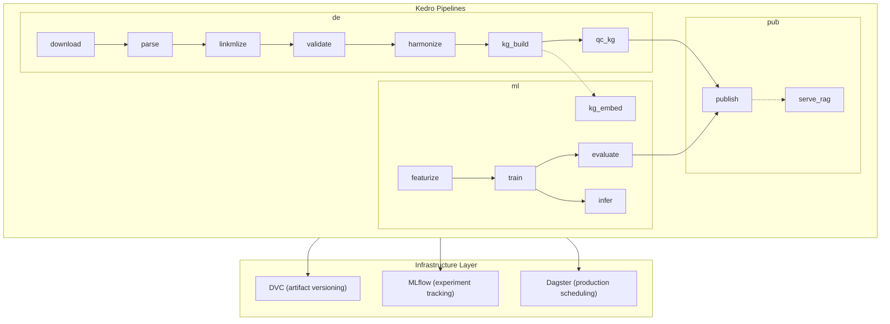

# Cytos Pipeline Tool Recommendation

> Decision: **Kedro + DVC + MLflow + Dagster (production)**
> Replaces: Prefect 2.x flows

## Executive Summary

After evaluating Kedro, DVC, Dagster, ZenML, MLflow, and Prefect against the cytos 14-stage pipeline requirements, the recommended stack is:

| Layer | Tool | Role |
|-------|------|------|
| **Pipeline framework** | **Kedro** | Code structure, Data Catalog, pipeline DAG, node composition |
| **Data versioning** | **DVC** | Large artifact versioning (KG snapshots, checkpoints, feature stores) |
| **Experiment tracking** | **MLflow** | Training runs, model registry, model cards |
| **Production orchestration** | **Dagster** (optional) | Asset-based scheduling via `kedro-dagster` plugin |

## Why Kedro is the Right Framework

### 1. Data Catalog = Stage IO Contracts

The design doc specifies typed IO contracts for every stage. Kedro's Data Catalog maps directly:

```yaml
# conf/base/catalog.yml (Kedro)
raw_biolink:
  type: pandas.ParquetDataset
  filepath: data/raw/biolink/${version}/
  metadata:
    source: biolink
    license_class: open

normalized_biolink:
  type: pandas.ParquetDataset
  filepath: data/normalized/biolink/${version}/
  versioned: true
```

Every stage's input/output is declared in YAML. The pipeline code only references dataset names, not file paths. This is exactly the "typed SourceDescriptor" pattern from the design doc.

### 2. Pipeline Nodes = Pure Functions

Each cytos module (`ingest.parsers.rrf`, `kg.biocypher.runner`, etc.) becomes a Kedro node:

```python
from kedro.pipeline import Pipeline, node, pipeline

def create_data_engineering_pipeline() -> Pipeline:
    return pipeline([
        node(func=fetch_source, inputs="source_descriptor", outputs="raw_data", name="download"),
        node(func=parse_raw, inputs="raw_data", outputs="interim_data", name="parse"),
        node(func=linkmlize, inputs=["interim_data", "schemas"], outputs="normalized_data", name="linkmlize"),
        node(func=validate_linkml, inputs=["normalized_data", "schemas"], outputs="validation_report", name="validate"),
        node(func=harmonize, inputs="normalized_data", outputs="harmonized_data", name="harmonize"),
        node(func=build_kg, inputs=["harmonized_data", "schemas"], outputs="kg_working", name="kg_build"),
        node(func=qc_kg, inputs="kg_working", outputs="qc_report", name="qc_kg"),
    ])
```

### 3. Kedro-Viz = Pipeline DAG Visualization

The Mermaid DAG in the design doc becomes an interactive, explorable visualization via `kedro viz`. Zero additional work.

### 4. Kedro-MLflow = Native Experiment Tracking

The `kedro-mlflow` plugin automatically logs:
- Pipeline parameters → MLflow params
- Metrics datasets → MLflow metrics
- Model artifacts → MLflow artifacts + model registry

### 5. Kedro → Dagster for Production

`kedro-dagster` converts Kedro pipelines to Dagster assets. This gives us:
- **Dagster's scheduling** (cron for nightly fetch, weekly KG build, monthly pretrain)
- **Dagster's asset lineage** (which KG snapshot was built from which sources)
- **Dagster's sensors** (trigger KG rebuild when a source updates)

We write zero Dagster-specific code; it's generated from Kedro.

## Why Not the Alternatives

| Tool | Verdict | Reason |
|------|---------|--------|
| **Prefect** | ❌ Replaced | Prefect 2→3 migration is disruptive; less data-asset awareness than Kedro+Dagster; more general-purpose than we need |
| **ZenML** | ❌ Rejected | Abstraction layer over other tools; we already have a specific stack; adds complexity without benefit |
| **Dagster (standalone)** | ⚠️ Partial | Excellent orchestrator but lacks Kedro's project structure, Data Catalog, and code organization patterns. Use it as the production scheduler via kedro-dagster. |
| **DVC pipelines** | ⚠️ Partial | DVC can define pipelines but it's file-path-centric, not data-asset-centric. Use DVC for versioning only. |

## Mapping to Design Doc Stages



## Kedro Project Structure for Cytos

```
cytos/
├── conf/
│   ├── base/
│   │   ├── catalog.yml          # Data Catalog (all stage IO contracts)
│   │   ├── parameters.yml       # Global params (release version, cohort, etc.)
│   │   ├── logging.yml
│   │   └── mlflow.yml           # kedro-mlflow config
│   └── local/
│       └── credentials.yml      # UMLS_API_KEY, etc. (gitignored)
├── src/cytos/
│   ├── pipelines/
│   │   ├── data_engineering/    # download → qc_kg
│   │   ├── modeling/            # featurize → infer
│   │   └── publishing/          # publish → serve_rag
│   ├── settings.py              # Kedro project settings
│   └── pipeline_registry.py     # register all pipelines
```

## Changes to Cytos Design Doc

1. Replace `pipelines/` (Prefect flow modules) with Kedro pipeline registrations
2. Replace `configs/pipelines/*.yaml` (Prefect YAML manifests) with `conf/base/catalog.yml`
3. Keep `noxfile.py` sessions (they call `kedro run --pipeline=...` instead of Prefect flows)
4. Keep GitHub Actions workflows (they call `kedro run` or `nox -s`)
5. Add `conf/` directory to the folder layout (Kedro convention)

## Dependencies Change

```diff
# pyproject.toml
- prefect>=2.14
+ kedro>=0.19
+ kedro-mlflow>=0.13
+ kedro-datasets>=4.0
+ kedro-viz>=10.0  # optional, dev
+ kedro-dagster>=0.2  # optional, production
```

DVC and MLflow remain unchanged.
