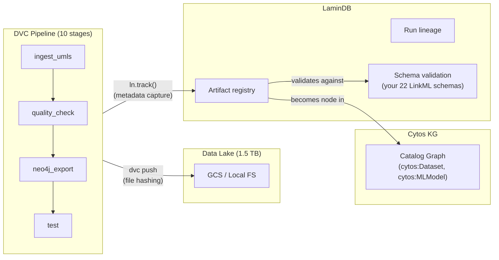
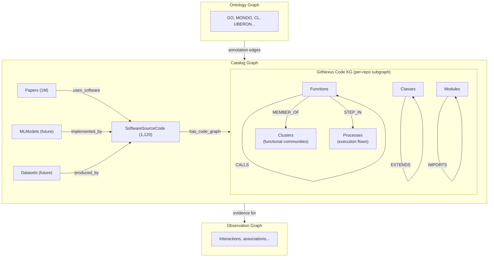
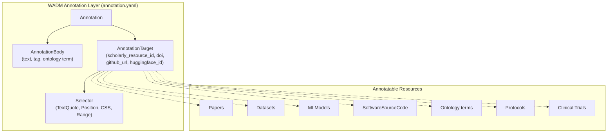
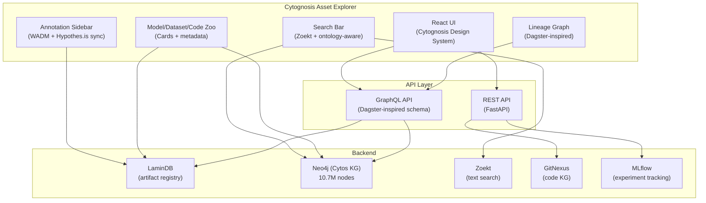

# Revised Architecture: Cytos KG Changes Everything

> After reading all design docs, the Cytos KG (10.7M nodes, 118.5M edges, 3 constituent graphs, 22 LinkML schemas, W3C WADM annotation layer) fundamentally reshapes which tools we keep, what we build ourselves, and what we extract from open-source projects.

---

## 1. Dagster: What to reuse from the Apache 2.0 repo

Dagster is **Apache 2.0** — every line of code is freely reusable. You already have a working `dagster_definitions.py` with 5 assets and 3 jobs. The question is: what parts of Dagster's architecture are worth extracting versus continuing to use as a dependency?

### Dagster repo structure (reusable modules)

```
dagster-io/dagster/                       # Apache 2.0
├── python_modules/
│   ├── dagster/                          # Core orchestration
│   │   ├── _core/                        # Asset definitions, jobs, ops, graphs
│   │   ├── _daemon/                      # Scheduler, sensor daemon
│   │   ├── _grpc/                        # gRPC server for code locations
│   │   └── _utils/                       # Utility functions
│   ├── dagster-webserver/                # Web UI server (GraphQL)
│   ├── dagster-graphql/                  # GraphQL schema + resolvers
│   ├── dagster-pipes/                    # Cross-process execution protocol
│   ├── dagit/                            # React UI (now dagster-webserver)
│   └── libraries/
│       ├── dagster-duckdb/               # DuckDB I/O manager ← DIRECTLY USEFUL
│       ├── dagster-gcp/                  # GCS integration ← DIRECTLY USEFUL
│       ├── dagster-mlflow/               # MLflow integration ← DIRECTLY USEFUL
│       ├── dagster-neo4j/                # Neo4j (community) ← MIGHT NOT EXIST
│       ├── dagster-postgres/             # PostgreSQL backend ← DIRECTLY USEFUL
│       └── dagster-docker/               # Docker executor ← USEFUL
```

### What to keep using as-is (dependency)

| Dagster module | Why keep it | How it serves Cytos |
| --- | --- | --- |
| `dagster` (core) | Asset-centric orchestration matches the Three Constituent Graphs model perfectly | Each KG layer = a Dagster asset with lineage |
| `dagster-webserver` | Free asset catalog UI with lineage visualization | Immediate visibility into the 10-stage DVC pipeline |
| `dagster-duckdb` | DuckDB I/O manager for KGBuilder | Replaces raw `subprocess` calls in your assets |
| `dagster-gcp` | GCS I/O manager for cloud storage | When data lake moves to GCS |

### What to extract/fork for Cytos-specific needs

| Pattern to extract | What it is | Why extract |
| --- | --- | --- |
| **Asset Catalog UI patterns** | React components for browsing assets, viewing metadata, lineage graphs | Build the Cytognosis Asset Explorer with your own branding + WADM annotation overlay |
| **dagster-pipes protocol** | Lightweight stdio-based protocol for external execution reporting | Extract the protocol to connect to redun workflows — let redun execute, report status back to a Cytos UI |
| **GraphQL schema for assets** | Typed queries for asset status, runs, metadata | Reuse as the API layer for the Cytognosis Asset Explorer |
| **Software-defined assets pattern** | `@asset` decorator + dependency graph | Already using this in `dagster_definitions.py` — continue |

### Concrete recommendation

**Keep Dagster as a dependency** for orchestration. Don't fork the whole thing. Instead:
1. Continue using `dagster_definitions.py` for KG pipeline orchestration
2. Extract the **Asset Catalog UI patterns** (React components, GraphQL schema) as inspiration for the Cytognosis Asset Explorer
3. Write a **dagster-cytos** integration library that maps Dagster assets → Cytos Catalog Graph nodes

---

## 2. DVC + LaminDB: How they integrate

DVC and LaminDB are **complementary, not competing**. Here's how they fit together in the Cytos architecture:

```
                    DVC                              LaminDB
                    ───                              ───────
What it tracks:     File content (SHA-256 hash)      Metadata + lineage + ontology validation
Where it stores:    Remote storage (GCS, S3)         PostgreSQL/SQLite metadata DB
                    via .dvc pointer files            pointing to the same GCS/S3 files

Granularity:        Whole file                       Artifact = file + metadata + lineage + schema
Versioning:         Git-native (dvc push/pull)       SQL-native (ln.Artifact.versions)

KG integration:     None                             Artifacts become Catalog Graph nodes
```

### Integration model for Cytos



**Key integration point**: When `dvc repro` runs a pipeline stage, a LaminDB `ln.track()` call at the start and `ln.finish()` at the end captures:
- Git commit hash
- Input artifact hashes
- Output artifact hashes
- Environment (Python version, package versions)
- The LinkML schema the output conforms to

The output artifact is then registered as a `cytos:Dataset` node in the Catalog Graph.

### What you get that neither tool provides alone

| Capability | DVC alone | LaminDB alone | DVC + LaminDB |
| --- | --- | --- | --- |
| File versioning | ✅ | ❌ (tracks metadata, not file versions) | ✅ |
| Lineage tracking | ❌ (only pipeline DAG) | ✅ (Run → Transform → Artifact) | ✅ |
| Ontology validation | ❌ | ✅ (via bionty/schemas) | ✅ |
| KG integration | ❌ | ✅ (artifacts become KG nodes) | ✅ |
| Reproducibility | ✅ (`dvc repro`) | Partial (records env, doesn't re-execute) | ✅ |

---

## 3. GitNexus in the Catalog Graph: Code Intelligence Subgraph

This is the key insight from your question. GitNexus's code knowledge graph maps directly onto the **Catalog Graph**, specifically the `SoftwareSourceCode` and `SoftwareApplication` schema entities.

### How GitNexus fits the Three Constituent Graphs



### Per-repo code KG as Catalog Graph subgraph

When you run `npx gitnexus analyze` on a Cytognosis repository:

1. GitNexus builds a code KG (functions, classes, imports, calls, clusters, processes)
2. The KG is stored locally in `.gitnexus/` using LadybugDB
3. Via the MCP interface, your agents can query it for impact analysis, blast radius, etc.

**The integration with the Cytos Catalog Graph** works like this:

| GitNexus node | Maps to Cytos schema | Relationship |
| --- | --- | --- |
| Repository root | `cytos:SoftwareSourceCode` (scholarly.yaml) | 1:1 — the repo IS the scholarly resource |
| Function/Class/Method | *Internal KG nodes* (not surfaced to Catalog Graph) | Contained within the code KG subgraph |
| Clusters (functional communities) | Could map to `cytos:Module` or `cytos:Component` | Future schema extension |
| Processes (execution flows) | Could map to `cytos:Workflow` | Future: CWL/Nextflow alignment |

### WADM annotations on code

Your `annotation.yaml` already supports annotating `SoftwareSourceCode` targets. The `AnnotationTarget.github_url` field links annotations to specific code locations. Combined with GitNexus's `TextQuoteSelector` and `TextPositionSelector`, you can:

1. Annotate a specific function in a paper's code repository
2. Link the annotation to the paper in the Catalog Graph
3. Link the annotated function to an observation in the Observation Graph
4. Query: "Show me all annotations on code that processes single-cell data for Alzheimer's"

---

## 4. WADM Annotation Layer: The Universal Backbone

You already have a comprehensive `annotation.yaml` (455 lines) that implements the full W3C WADM spec in LinkML. This is the annotation backbone for **everything** — not just papers.

### What WADM annotates across the Three Graphs



### Hypothes.is integration path

The `annotation.yaml` already has `hypothes_is_id` and `hypothes_is_group` fields. The integration:

1. **Chrome extension** (Hypothes.is-based) creates W3C WADM annotations on web content
2. Annotations sync to the Cytos backend via Hypothes.is API → stored as `Annotation` objects
3. Each annotation's `AnnotationTarget.scholarly_resource_id` links it to the Cytos Catalog Graph
4. NER on annotation bodies extracts ontology terms → creates edges to the Ontology Graph

This creates a **human-in-the-loop curation pipeline** where every highlight, comment, tag, and favorite flows into the KG.

---

## 5. The Cytognosis Asset Explorer: Dagster UI patterns + LaminDB + WADM

What you're describing is a **Cytognosis-native asset catalog** that goes beyond what Dagster's UI or LaminDB Hub provides. Here is the architectural vision:

### What the Asset Explorer needs

| Feature | Source |
| --- | --- |
| Asset lineage visualization | Extract patterns from Dagster Asset Catalog UI (Apache 2.0) |
| Metadata query + filtering | LaminDB `ln.Artifact.filter()` API |
| Ontology-aware search | Cytos Ontology Graph (MONDO, CL, UBERON, GO, HP) |
| WADM annotations | `annotation.yaml` + Hypothes.is sync |
| Code search | Zoekt (trigram text search) |
| Code intelligence | GitNexus (blast radius, dependency graph) |
| Full-text scholarly search | Zoekt over paper PDFs + PKG2.0 metadata |
| Model/Dataset/Code zoo | `scholarly.yaml` (Paper, ScientificDataset, MLModel, SoftwareSourceCode) |

### Architecture



### What you build vs what you reuse

| Component | Build or Reuse | Source |
| --- | --- | --- |
| UI framework | Build | React + Cytognosis Design System (dark theme, Phosphor icons) |
| Lineage visualization | Extract patterns from | Dagster Asset Catalog UI (Apache 2.0 React components) |
| Asset metadata API | Build on top of | LaminDB Python API + Neo4j Cypher |
| Search | Deploy | Zoekt (text) + Neo4j (graph) |
| Code intelligence | Deploy | GitNexus (MCP server) |
| Annotation layer | Build | WADM `annotation.yaml` + Hypothes.is sync |
| Model zoo cards | Build | `scholarly.yaml` MLModel schema |
| Dataset zoo cards | Build | `scholarly.yaml` ScientificDataset schema |

---

## 6. Bionty replacement: Cytos's own bioregistry

You're right that bionty becomes redundant. Your `ontology/registry.py` already loads **51 resources** from `registry.yaml`, covering a much broader scope than bionty's 18 entity types.

### Comparison

| Dimension | bionty | Cytos Ontology Graph |
| --- | --- | --- |
| Entity types | 18 (Gene, Protein, CellType, Disease, Tissue, etc.) | **42 canonical** + Classification Layer |
| Sources | ~30 ontologies | **51 resources** from `registry.yaml` |
| Total entities | ~1M | **10.7M nodes** |
| Relationships | ~3M | **118.5M edges** |
| UMLS coverage | None | **8.7M nodes** (UMLS 2026AA) |
| Spatial scaffold | None | **HRA** (9,493 nodes, 3,481 spatial placements) |
| Cross-references | Limited | **UniChem** (10M) + **Ensembl** (1.65M) + **SSSOM** (1.26M) |
| Clinical coverage | None | SNOMED, ICD-10, LOINC, CPT, OMOP |
| Validation | Per-field enum check | **LinkML schema validation** + **ROBOT OWL reasoning** |

### Practical impact on LaminDB integration

When you deploy LaminDB, instead of `--schema bionty`, you'd:

```python
import lamindb as ln

# Instead of: lamin init --schema bionty
# You register YOUR ontology graph as the validation source:

class CytosValidator:
    """Validates artifacts against the Cytos Ontology Graph (51 resources)."""

    def validate_gene(self, curie: str) -> bool:
        # Query Neo4j: MATCH (n:Gene {id: $curie}) RETURN n
        ...

    def validate_cell_type(self, curie: str) -> bool:
        # Query Neo4j: MATCH (n:Cell {id: $curie}) RETURN n
        ...

    def validate_disease(self, curie: str) -> bool:
        # Query Neo4j: MATCH (n:Disease {id: $curie}) RETURN n
        ...
```

This means LaminDB's Curator API calls your Cytos Ontology Graph for validation instead of bionty. The schema is richer (42 types vs 18), the coverage is broader (10.7M vs ~1M), and you control the ontology release cycle.

---

## Summary: Revised Tool Strategy

| Tool | Previous Status | Revised Status | Rationale |
| --- | --- | --- | --- |
| **Dagster** | Listed in L8 | **✅ Keep as orchestration dependency + extract UI patterns** | Already in use (5 assets, 3 jobs). Apache 2.0 UI patterns are the foundation for the Asset Explorer |
| **DVC** | ✅ primary | **✅ primary (no change)** | 10-stage pipeline, file-level versioning. Complements LaminDB |
| **LaminDB** | ✅ primary | **✅ primary (deploy without bionty)** | Use `ln.track()` to connect DVC pipeline outputs to Catalog Graph nodes. Skip bionty — use Cytos Ontology Graph |
| **GitNexus** | ✅ primary | **✅ primary (as Catalog Graph code subgraph)** | Per-repo code KG → subgraph of `SoftwareSourceCode` nodes. PolyForm NC OK for 501(c)(3) |
| **Zoekt** | ✅ primary | **✅ primary** | Text search across repos + paper PDFs. Feed into Asset Explorer search |
| **MLflow** | ✅ primary | **✅ primary + MCP** | Model Registry → `MLModel` nodes in Catalog Graph |
| **WADM** | Already built | **✅ core (annotation.yaml is the universal backbone)** | Every annotatable resource in all three graphs gets WADM annotations |
| **bionty** | Was LaminDB dependency | **❌ replaced by Cytos Ontology Graph** | 42 types > 18 types. 10.7M entities > ~1M. UMLS + HRA + SNOMED coverage |
| **DagsHub** | Was ✅ primary | **🟡 alternative** | No added value over self-hosted stack |
| **Kedro** | Not listed | **❌ rejected** | Redundant |

### Three actions

1. **Deploy LaminDB** *without* bionty, using Cytos Ontology Graph as the validation backend
2. **Deploy GitNexus** on all Cytognosis repos, integrate code KG as Catalog Graph subgraph
3. **Start designing** the Cytognosis Asset Explorer: extract Dagster UI patterns, wire to LaminDB + Neo4j + Zoekt + WADM
