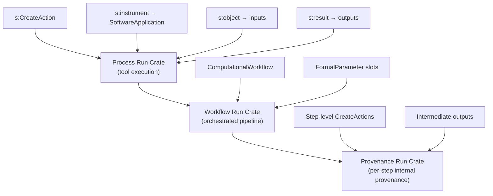
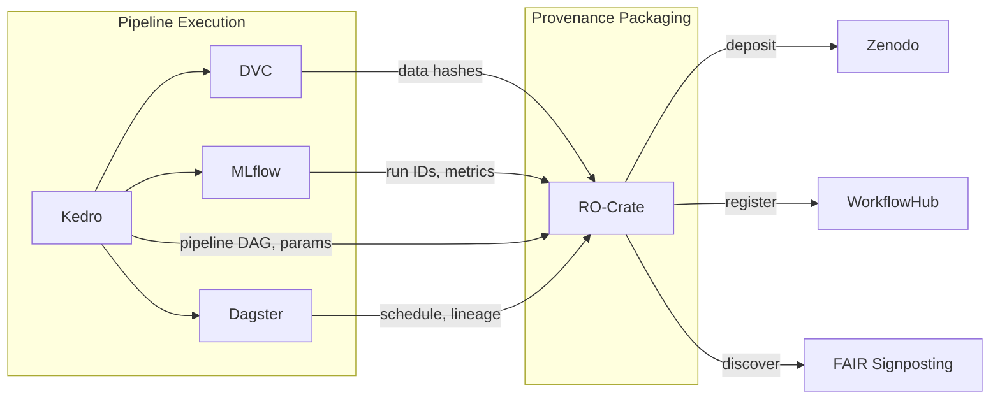

# RO-Crate Integration Plan for Cytos

> **Verdict: Adopt RO-Crate as the provenance packaging layer.**
> RO-Crate doesn't replace anything in our Kedro + DVC + MLflow + Dagster stack. It's the missing FAIR envelope that unifies provenance across all four tools into a single, standards-compliant, machine-actionable bundle.

## What is RO-Crate?

[RO-Crate](https://www.researchobject.org/ro-crate/) (Research Object Crate) is a community-driven specification (v1.2, June 2025) for packaging research data, software, and workflows with their metadata using Schema.org annotations in JSON-LD.

In its simplest form, an RO-Crate is a directory with an `ro-crate-metadata.json` file describing its contents:

```
snapshot/
├── ro-crate-metadata.json    ← self-describing JSON-LD metadata
├── nodes.tsv
├── edges.tsv
├── schemas/
├── model-card.yaml
└── PROV-O.ttl
```

## Ecosystem: Key Tools

| Tool | Role | PyPI | Status |
|------|------|------|--------|
| **`rocrate`** (ro-crate-py) | Create/read/write RO-Crates; Python API + CLI | `rocrate>=0.12` | Production, Apache-2.0 |
| **`runcrate`** | Workflow Run RO-Crate manipulation, CWLProv→WRROC, re-execution | `runcrate>=0.6` | Production, Apache-2.0 |
| **WorkflowHub** | Registry for computational workflows as RO-Crates | Web service | Production |
| **Zenodo** | RO-Crate-aware DOI minting + deposit | Web service | Production |
| **FAIR Signposting** | HTTP Link headers for discovering RO-Crate metadata | Spec | Adopted |
| **Galaxy** | Full RO-Crate integration for analysis histories | Web platform | Production |

## Workflow Run RO-Crate Profiles (WRROC)

Three hierarchical profiles for recording computational provenance:



| Profile | Granularity | Cytos Use Case |
|---------|------------|----------------|
| **Process Run Crate** | Single tool execution | Source download, schema generation, single parser run |
| **Workflow Run Crate** | Full pipeline execution | `kedro run --pipeline=data_engineering` |
| **Provenance Run Crate** | Per-step within pipeline | Full provenance for `cytos publish` snapshots |

## Five Safes RO-Crate

The [Five Safes RO-Crate](https://w3id.org/5s-crate/0.4) is a specialized profile for Trusted Research Environments (TREs). It formalizes:

- **Safe People**: researcher accreditation metadata
- **Safe Projects**: ethics approval, project context
- **Safe Settings**: approved computational environment
- **Safe Data**: data de-identification status
- **Safe Outputs**: disclosure control review

> [!IMPORTANT]
> This directly maps to our controlled-access source handling (UMLS, SNOMED). Five Safes RO-Crate replaces ad-hoc `CYTOS_LICENSE_*` env vars with a formal, machine-actionable access control metadata layer.

## Integration Architecture

### How RO-Crate Fits the Cytos Stack



RO-Crate is the **envelope**; Kedro/DVC/MLflow/Dagster are the **contents**.

### Concrete Module Mapping

| Cytos Component | Current | With RO-Crate |
|----------------|---------|---------------|
| `sources/_manifest.json` | Custom JSON sidecar | **Process Run Crate** per source download |
| `kg/snapshots/<release>/LOCK_MANIFEST.json` | Custom lock file | **RO-Crate root metadata** for the snapshot |
| `cytos publish snapshot` | Custom bundler | **Generates distributable RO-Crate ZIP** with subcrates |
| `cytos publish zenodo` | Ad-hoc upload | **Uploads RO-Crate** to Zenodo with DOI |
| `ProvenanceHeader` model | Pydantic → JSON | **Maps to WRROC `CreateAction`** + `FormalParameter` |
| Policy gates (Rego) | Env var checks | **Five Safes RO-Crate profile** for controlled sources |
| MLflow run metadata | MLflow tracking server | **Embedded as `CreateAction`** in WRROC |
| DVC data hashes | `.dvc` files | **Referenced as `contentUrl` + `sha256`** in RO-Crate |
| Training recipes | Custom YAML | **`ComputationalWorkflow` entities** in Workflow Run Crate |
| Kedro pipeline DAG | Kedro catalog | **Workflow definition** in Workflow Run Crate |

### New Module: `cytos.publish.rocrate`

```python
# src/cytos/publish/rocrate.py

from rocrate.rocrate import ROCrate
from rocrate.model.person import Person
from rocrate.model.contextentity import ContextEntity

def create_source_crate(source_id: str, version: str, ...) -> ROCrate:
    """Process Run Crate for a source download."""
    crate = ROCrate()
    # Add downloaded files as data entities
    # Add CreateAction for the download
    # Add license, provenance metadata
    return crate

def create_snapshot_crate(release: str, ...) -> ROCrate:
    """Workflow Run Crate for a KG snapshot release."""
    crate = ROCrate()
    # Add KG files (nodes.tsv, edges.tsv)
    # Add schemas as subcrates
    # Add model cards
    # Add PROV-O graph
    # Add all source crates as nested subcrates
    return crate

def create_training_run_crate(mlflow_run_id: str, ...) -> ROCrate:
    """Provenance Run Crate for a training run."""
    crate = ROCrate()
    # Add recipe YAML as ComputationalWorkflow
    # Add FormalParameter slots from recipe
    # Add CreateAction for the training run
    # Link MLflow run ID, DVC hashes, checkpoint path
    return crate

def deposit_to_zenodo(crate: ROCrate, ...) -> str:
    """Upload RO-Crate ZIP to Zenodo, return DOI."""
    ...
```

### LinkML ↔ RO-Crate Synergy

LinkML and RO-Crate are complementary:

| Layer | LinkML Role | RO-Crate Role |
|-------|------------|---------------|
| **Schema** | Defines the data model (classes, slots, enums) | Describes the package contents |
| **Validation** | Validates data conforms to schema | Validates metadata conforms to profile |
| **Serialization** | JSON-LD, RDF, Pydantic, SQL | JSON-LD (Schema.org) |
| **Discovery** | w3id.org namespace | FAIR Signposting + Zenodo |

LinkML schemas can be exported to JSON-LD contexts that are compatible with RO-Crate's Schema.org foundation. This means our cytos LinkML schemas can serve as the `conformsTo` profile for our RO-Crates.

## Dependency Changes

```diff
# pyproject.toml [project.dependencies]
+ "rocrate>=0.12",

# pyproject.toml [project.optional-dependencies]
+ rocrate_extra = ["runcrate>=0.6"]
```

## New Files

```
src/cytos/publish/rocrate.py          — RO-Crate generation (source, snapshot, training)
src/cytos/publish/zenodo.py           — Zenodo deposit via RO-Crate
src/cytos/publish/signposting.py      — FAIR Signposting HTTP headers
schemas/profiles/cytos-snapshot.json   — Custom RO-Crate profile for cytos snapshots
schemas/profiles/cytos-source.json     — Custom RO-Crate profile for source downloads
schemas/profiles/cytos-training.json   — Custom RO-Crate profile for training runs
tests/unit/test_rocrate.py             — Unit tests for RO-Crate generation
```

## Updated CLI Commands

```diff
# cytos publish
  cytos publish snapshot <release>   # now generates RO-Crate ZIP
  cytos publish prov <release>       # now generates WRROC-compliant provenance
+ cytos publish rocrate <release>    # explicit RO-Crate generation
  cytos publish zenodo <release>     # now uploads RO-Crate to Zenodo
  cytos publish dde <schema>         # unchanged

# cytos sources
  cytos sources fetch <id>           # now writes Process Run Crate sidecar
  cytos sources doctor               # now validates RO-Crate metadata
```

## Summary

RO-Crate is the natural provenance packaging standard for cytos because:

1. **Schema.org + JSON-LD** foundation matches LinkML's serialization targets
2. **WRROC profiles** formalize our pipeline provenance (currently ad-hoc `_manifest.json`)
3. **Five Safes** formalizes our controlled-access handling (currently env var checks)
4. **Zenodo integration** gives us DOI minting out of the box
5. **Subcrates** enable per-source provenance within a release bundle
6. **`ro-crate-py`** is a mature, Apache-2.0, Python library that handles creation and consumption
7. **WorkflowHub** gives us a place to register our Kedro pipelines as discoverable workflows
8. **FAIR Signposting** enables machine discovery of our published snapshots
