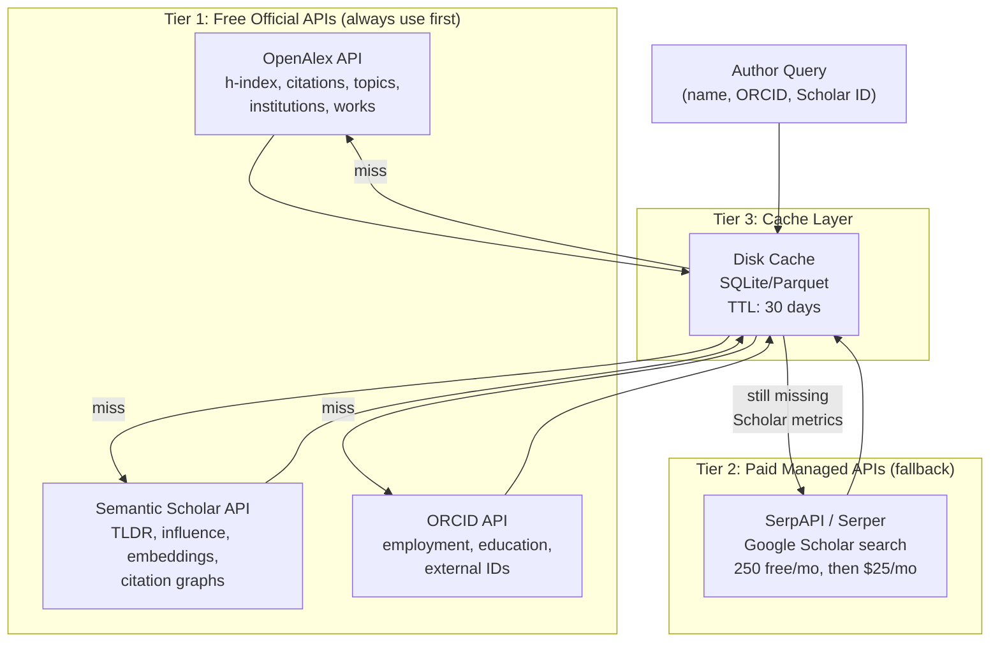

# Scholarly Data Access Strategy

## Problem Statement

The `scholarly` Python library is blocked by Google CAPTCHA/rate-limiting, making Google Scholar data unreliable. LinkedIn public profile scraping returns minimal metadata. We need a durable, cost-effective multi-source data access architecture for the Cytognosis scholarly KG.

## Source Evaluation Matrix

| Source | Reliability | Cost | Coverage | Legal Risk | Maintenance | Recommendation |
|--------|-------------|------|----------|------------|-------------|----------------|
| **Semantic Scholar API** | ★★★★★ | Free | 200M+ papers, STEM-focused | None (official API) | Low | **Primary** |
| **OpenAlex API** | ★★★★★ | Free ($1/day) | 250M+ works, all disciplines | None (official API, CC0) | Low | **Primary** |
| **ORCID API** | ★★★★★ | Free | 17M+ researchers | None (official API) | Low | **Primary** |
| **SerpAPI (Scholar)** | ★★★★☆ | $25-75/mo | Scholar search proxy | Low (managed service) | Very Low | **Paid fallback** |
| **`scholarly` library** | ★★☆☆☆ | Free | Scholar scraping | Medium (ToS violation) | High | **Deprecate** |
| **LinkedIn scraping** | ★☆☆☆☆ | Free | Professional profiles | High (ToS, legal risk) | Very High | **Replace** |

---

## Recommended Architecture



---

## Tier 1: Free Official APIs

### OpenAlex (Already Integrated)

Our current primary source. Provides h-index, i10-index, citations, works count, topics, institutions.

**Current status**: Working well. Provides the `mailto` parameter for polite pool access.

**Action items**:
- Register for an API key at [openalex.org](https://openalex.org) (free, $1/day included)
- Add `api_key` header to all requests
- The free daily allowance covers ~10K simple lookups/day

### Semantic Scholar API (New Integration)

The strongest free alternative to Google Scholar. Operated by Allen Institute for AI. Official, stable, structured JSON.

**What it provides that we don't have yet**:
- AI-generated paper TLDRs
- "Highly influential citations" flag (subset of citations that are truly impactful)
- Paper embeddings (SPECTER vectors for similarity)
- Author search with disambiguation
- Citation context extraction
- Recommended papers

**Rate limits**:
| Access | Limit |
|--------|-------|
| No API key | 100 requests / 5 min (shared pool) |
| With API key (free) | 1 request/sec (dedicated) |
| Bulk endpoint | 500 papers/request (no auth needed) |

**Author endpoint**: `GET /graph/v1/author/search?query={name}`

Returns: `authorId`, `name`, `affiliations`, `paperCount`, `citationCount`, `hIndex`, `papers[]`

**Action items**:
1. Request free API key at [semanticscholar.org/product/api](https://www.semanticscholar.org/product/api)
2. Implement `SemanticScholarClient` in `cytos.scholarly`
3. Add as second-priority source after OpenAlex in the enrichment cascade

### ORCID API (Already Integrated)

Working well for researchers who maintain their records. No changes needed.

---

## Tier 2: Paid Managed API (SerpAPI)

For cases where we specifically need Google Scholar data (Scholar IDs, Google's citation counts, citation-per-year histograms, co-author networks) that aren't available from Semantic Scholar or OpenAlex.

### SerpAPI

**Pricing**:
| Plan | Searches/mo | Cost | Cost/search |
|------|------------|------|-------------|
| Free | 250 | $0 | $0.00 |
| Developer | 1,000 | $25 | $0.025 |
| Production | 5,000 | $75 | $0.015 |

**Google Scholar endpoints**:
- `google_scholar_profiles` — author search → Scholar ID, affiliation, interests
- `google_scholar_author` — full profile with h-index, i10, citations/year, pubs
- `google_scholar` — paper search, citation lookup

**For our volume** (tens of authors/month, not thousands), the **free tier (250/mo) is sufficient**. Upgrade to $25/mo if we hit limits.

**Action items**:
1. Register at [serpapi.com](https://serpapi.com) (free, no credit card)
2. Store API key in `~/.config/cytos/secrets.yaml`
3. Implement `SerpScholarClient` as the Scholar backend in `google_scholar.py`
4. Replace `scholarly` library calls with SerpAPI for all Scholar access

> [!IMPORTANT]
> SerpAPI returns **exactly the same data** as Google Scholar (it proxies and parses the real page), so Scholar IDs, citation histograms, and co-author graphs are all available. This is the direct replacement for the broken `scholarly` library.

---

## Tier 3: Caching Layer

All API responses should be cached to minimize requests and enable offline operation.

**Design**:
```python
# Cache structure
~/.cache/cytos/scholarly/
├── openalex/          # Keyed by OpenAlex ID
├── semantic_scholar/  # Keyed by S2 author ID
├── orcid/             # Keyed by ORCID
├── serpapi_scholar/   # Keyed by Scholar ID or query hash
└── cache_index.db     # SQLite: key → file → TTL → last_accessed
```

**TTL policy**:
| Data Type | TTL |
|-----------|-----|
| Author profile (h-index, citations) | 30 days |
| Paper metadata | 90 days |
| Institution data | 180 days |
| ORCID record | 14 days (authors update these) |

---

## LinkedIn Strategy

### Current State

LinkedIn aggressively blocks automated access. Proxycurl (the most popular scraping service) was shut down by LinkedIn legal action in 2025. Direct scraping requires login and violates ToS.

### Recommended Approach

**Do NOT scrape LinkedIn.** Instead:

1. **Use ORCID researcher-urls** — many researchers list their LinkedIn in ORCID (we already extract this)
2. **Manual entry** — for key researchers in our KG, manually add LinkedIn vanity names
3. **Public metadata only** — when a LinkedIn URL is known, extract only the public `<meta>` tags (title, og:description) which are freely accessible without login. This is what our current `analyze_linkedin_profile()` does.
4. **Schema readiness** — keep the Person schema LinkedIn-aligned so that if we obtain data through legitimate means (user-consented OAuth, manual entry), it maps cleanly

> [!CAUTION]
> Do not integrate any LinkedIn scraping service that uses fake accounts or login-based access. This creates legal liability for Cytognosis as a 501(c)(3).

---

## Enrichment Cascade (Revised)

```python
def enrich_author(partial: dict) -> AuthorIdentity:
    """Revised cascade with reliable sources."""
    # 1. Cache check (instant)
    cached = cache.get(partial)
    if cached and not cached.expired:
        return cached

    # 2. ORCID (if ORCID known or discoverable from name)
    #    → name, affiliations, education, external IDs
    enrich_from_orcid(author)

    # 3. OpenAlex (free, high reliability)
    #    → h-index, citations, works, topics, institution
    enrich_from_openalex(author)

    # 4. Semantic Scholar (free, NEW)
    #    → S2 author ID, influential citations, paper embeddings
    enrich_from_semantic_scholar(author)

    # 5. SerpAPI → Google Scholar (paid, fallback)
    #    → Scholar ID, i10-index, citations/year, co-authors
    if not author.google_scholar_id:
        enrich_from_serpapi_scholar(author)

    # 6. LinkedIn (public meta only, no scraping)
    if author.linkedin_url:
        enrich_from_linkedin_meta(author)

    # 7. Intelligence layer
    enrich_person_intelligence(author)

    # 8. Cache result
    cache.put(author)
    return author
```

---

## Implementation Plan

| Phase | Task | Effort | Priority |
|-------|------|--------|----------|
| 1 | Register SerpAPI free account, store key | 15 min | P0 |
| 2 | Implement `SerpScholarClient` in `google_scholar.py` | 2 hr | P0 |
| 3 | Register Semantic Scholar API key | 15 min | P0 |
| 4 | Implement `SemanticScholarClient` in new `semantic_scholar.py` | 3 hr | P1 |
| 5 | Build disk cache layer (`~/.cache/cytos/scholarly/`) | 2 hr | P1 |
| 6 | Update `enrich_author()` cascade order | 1 hr | P1 |
| 7 | Remove `scholarly` library dependency | 30 min | P2 |
| 8 | Register OpenAlex API key | 15 min | P2 |

---

## Monthly Cost Projection (Nonprofit Budget)

| Service | Tier | Monthly Cost |
|---------|------|-------------|
| OpenAlex | Free ($1/day included) | $0 |
| Semantic Scholar | Free | $0 |
| ORCID | Free | $0 |
| SerpAPI | Free (250/mo) or Developer ($25/mo) | $0–25 |
| **Total** | | **$0–25/mo** |

For our current scale (processing tens of researchers, not thousands), the **total cost is $0/month** using free tiers everywhere.
