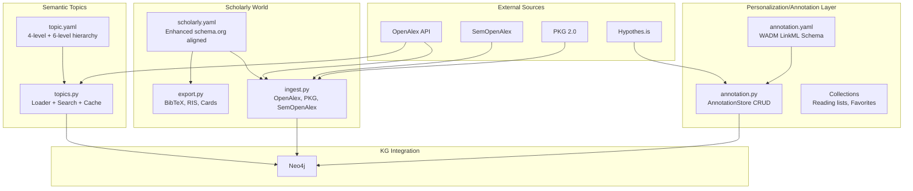

# Annotation Layer, Topic Hierarchy, and Scholarly Infrastructure

> **Commit**: `4550dbe` | **Session**: 2026-05-12 | **Files**: 8 changed, 2,417 insertions

## Architecture

## Pillar 1: Annotation/Personalization Layer

### Schema ([annotation.yaml](file:///home/mohammadi/repos/cytognosis/cytos/schemas/domains/annotation.yaml))

W3C WADM → LinkML with Cytos extensions:

| Class | Source | Fields | Purpose |
|-------|--------|--------|---------|
| `Annotation` | oa:Annotation | body, target, motivation, creator, tags, is_favorite, curation_status, hypothes_is_id | Core annotation entity |
| `AnnotationBody` | oa:Body | value, format, language, purpose | Content of annotation |
| `AnnotationTarget` | oa:Target | id, selector, doi, github_url, huggingface_id, zenodo_doi | What is annotated |
| `Selector` | oa:Selector | 9 W3C selector types (Fragment, CSS, XPath, TextQuote, TextPosition, Data, SVG, Range) | Sub-resource targeting |
| `AnnotationAgent` | oa:Agent | name, orcid, email_sha1 | Who annotated |
| `AnnotationCollection` | oa:Collection | label, collection_type, is_public, shared_with | Reading lists, favorites |

### Enums

| Enum | Values | Extension |
|------|--------|-----------|
| `AnnotationMotivation` | 12 W3C + 6 Cytos (favoriting, curating, reviewing, citing, reproducing, integrating) | Full WADM coverage |
| `SelectorType` | 8 W3C types | All WADM selectors |
| `CurationStatus` | draft, in_review, approved, rejected, archived | Workflow states |
| `CollectionType` | reading_list, favorites, project, review_queue, topic_collection, reference_library | Organization types |

### Code ([annotation.py](file:///home/mohammadi/repos/cytognosis/cytos/src/cytos/scholarly/annotation.py))

`AnnotationStore` provides:
- **CRUD**: `create()`, `get()`, `update()`, `delete()`
- **Queries**: `list_annotations()`, `get_favorites()`
- **Collections**: `create_collection()` with hierarchical nesting
- **KG Edges**: `to_kg_edges()` → BioCypher-compatible tuples
- **Hypothes.is**: `hypothes_is_id` + `hypothes_is_group` fields for cross-platform sync

## Pillar 2: Research Topic Hierarchy

### Schema ([topic.yaml](file:///home/mohammadi/repos/cytognosis/cytos/schemas/domains/topic.yaml))

| Class | Level | Count | Source |
|-------|-------|------:|--------|
| `TopicDomain` | 0 | 4 | OpenAlex |
| `TopicField` | 1 | 26 | OpenAlex |
| `TopicSubfield` | 2 | 254 | OpenAlex |
| `ResearchTopic` | 3 | 4,516 | OpenAlex Topics |
| `Concept` | 0-5 | 65,000+ | OpenAlex Concepts |

Cross-references: `mesh_id`, `umls_sn_type`, `asjc_code`, `wikidata_id`, `wikipedia_url`

Enrichment flags: `is_bio_health`, `is_ai_ml_cs`, `is_psych_neuro`

### Code ([topics.py](file:///home/mohammadi/repos/cytognosis/cytos/src/cytos/scholarly/topics.py))

- `load_full_topic_hierarchy()` → downloads + caches all 4 levels as Parquet
- `load_concept_tree()` → 19 top-level concepts with 6-level depth
- `search_topics()` → name/description/keyword search with bio_health filter
- `get_topic_ancestors()` → topic→subfield→field→domain chain

## Pillar 3: Scholarly Infrastructure

### Schema Updates ([scholarly.yaml](file:///home/mohammadi/repos/cytognosis/cytos/schemas/domains/scholarly.yaml))

**New on `ScholarlyResource` base class**:
- `topics` (multivalued CURIEs) + `topic_scores` + `primary_topic`
- `annotations` (edge to annotation layer)
- `semopenalex_id`, `type_of` (ScholarlyResourceType)
- `HasBibTeX` mixin moved from Paper to base (all resources exportable)

**New enums**:
- `ScholarlyResourceType`: 21 values aligning schema.org CreativeWork subtypes
- `CitationType`: adopts_model, uses_data, uses_software, adopts_idea, extends_work, compares_with, generic

**Resolvable identifiers added to**:
- `MLModel`: huggingface_id, github_url, zenodo_doi, model_framework, num_parameters, training_dataset
- `ScientificDataset`: zenodo_doi, huggingface_id, figshare_id, dryad_doi, data_catalog, conforms_to
- `SoftwareSourceCode`: github_url, github_owner, github_repo, gitlab_url, pypi_name, conda_channel, docker_image, zenodo_doi, stars_count, forks_count

### Ingestion ([ingest.py](file:///home/mohammadi/repos/cytognosis/cytos/src/cytos/scholarly/ingest.py))

| Function | Source | Output |
|----------|--------|--------|
| `ingest_openalex_works()` | OpenAlex API | Works DataFrame |
| `ingest_openalex_authors()` | OpenAlex API | Authors DataFrame |
| `ingest_openalex_topics()` | OpenAlex API | Topics DataFrame |
| `ingest_openalex_concepts()` | OpenAlex API | Concepts DataFrame |
| `download_semopenalex_ontology()` | SemOpenAlex | Turtle file |
| `ingest_pkg()` | PKG 2.0 dataset | Dict of DataFrames |
| `works_to_kg_nodes()` | Works DF | BioCypher node tuples |
| `works_to_kg_edges()` | Works DF | BioCypher edge tuples |

All support partial ingestion (by ID list or filter string).

### Export ([export.py](file:///home/mohammadi/repos/cytognosis/cytos/src/cytos/scholarly/export.py))

| Function | Format | Use Case |
|----------|--------|----------|
| `export_bibtex()` | BibTeX | Reference managers (Zotero, BibDesk) |
| `export_ris()` | RIS | Reference managers (Mendeley, EndNote) |
| `export_scholarly()` | Any | Unified dispatcher with format param |
| `export_model_card()` | Markdown | HuggingFace model card template |
| `export_dataset_card()` | Markdown | HuggingFace dataset card template |

## Integration Test Results

| Test | Result |
|------|--------|
| Annotation CRUD (comment, tag, favorite, highlight) | ✅ 4 annotations |
| TextQuoteSelector support | ✅ exact/prefix/suffix |
| Favorites query | ✅ 2 items |
| Collections | ✅ 1 collection |
| KG edge generation | ✅ 4 edges |
| OpenAlex topics fetch | ✅ 10 topics |
| OpenAlex concepts (L0) | ✅ 10 concepts |
| OpenAlex works ingestion | ✅ 5 works |
| BibTeX export | ✅ 10.5K chars, 5 entries |
| RIS export | ✅ 10.5K chars, 5 entries |
| Model card generation | ✅ 556 chars |
| Dataset card generation | ✅ 309 chars |
| Schema validation | ✅ annotation(6+6), topic(6+1), scholarly(17+3) |
