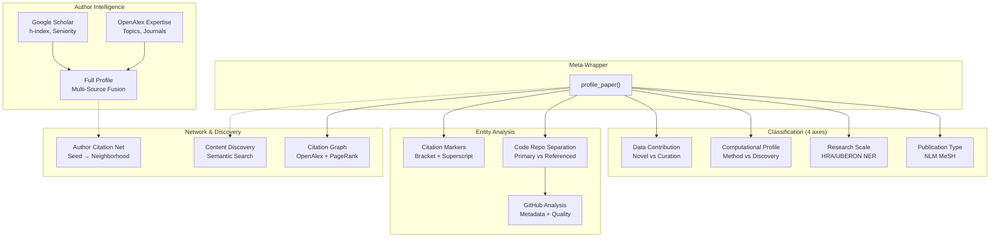

# Scholarly Intelligence Suite: Final Walkthrough

## Architecture



## Completed Tasks

### 1. Scale Ontology + NER Entity Extraction ✅

**File**: [classify.py](file:///home/mohammadi/repos/cytognosis/cytos/src/cytos/scholarly/classify.py)

Replaced flat regex patterns with ontology-grounded NER entity extraction:

| Change | Before | After |
|--------|--------|-------|
| Scales | 8 values | 10 values (+SUBCELLULAR, +SYSTEM) |
| Pattern type | Flat keyword regex | (pattern, entity_type) tuples |
| Output | List of scales | Scales + extracted entities + ontology refs |
| Ontology mapping | None | UBERON, CL, GO, CHEBI, OBI per scale |

**Test result** (AlphaGenome):
```
Scales: molecular, cellular, organ, population, tissue, organism
Top entities:
  molecular/molecular_process: splicing (x62)
  molecular/molecule: rna (x55)
  molecular/molecule: dna (x39)
  molecular/variant: variant effect (x29)
  molecular/locus: eqtl (x21)
```

### 2. Code Repository Separation ✅

**File**: [paper_profile.py](file:///home/mohammadi/repos/cytognosis/cytos/src/cytos/scholarly/paper_profile.py)

- `_separate_code_repos()` classifies repos using context analysis
- URL domain filtering via `is_valid_code_url()` eliminates false positives
- `PaperProfile.primary_code_repos` vs `referenced_code_repos`

### 3. GitHub Repository Analysis ✅

**File**: [github_analysis.py](file:///home/mohammadi/repos/cytognosis/cytos/src/cytos/scholarly/github_analysis.py)

Automatically runs on all primary code repos during profiling.

### 4. Google Scholar + Author Profiling ✅

**Files**: [google_scholar.py](file:///home/mohammadi/repos/cytognosis/cytos/src/cytos/scholarly/google_scholar.py), [author_profiling.py](file:///home/mohammadi/repos/cytognosis/cytos/src/cytos/scholarly/author_profiling.py)

New functions added to `author_profiling.py`:
- `get_full_author_profile()`: Fuses Google Scholar + OpenAlex
- `build_author_citation_network()`: Seeds graph from author papers

### 5. Preprint Resolution Enhanced ✅

**File**: [paper_profile.py](file:///home/mohammadi/repos/cytognosis/cytos/src/cytos/scholarly/paper_profile.py)

Resolution chain: bioRxiv API → Europe PMC → **OpenAlex locations** → **Google Scholar versions**

### 6. Content-Based Paper Discovery ✅

**File**: [citation_graph.py](file:///home/mohammadi/repos/cytognosis/cytos/src/cytos/scholarly/citation_graph.py)

`discover_related_papers()` finds papers with similar content even if not citation-linked:
- OpenAlex fulltext semantic search
- Concept-based filtering
- OpenAlex `related_works` expansion

**Test result** (AlphaGenome):
```
10 related papers found (top 5):
  1. AlphaFold Protein Structure Database (8114 citations)
  2. Mamba: Linear-Time Sequence Modeling (984 citations)
  3. The Dfam community resource (771 citations)
  4. Integrated lncRNA function (728 citations)
  5. Regulatory genomic circuitry of disease loci (455 citations)
```

### 7. Superscript Citation Markers ✅

**File**: [paper_profile.py](file:///home/mohammadi/repos/cytognosis/cytos/src/cytos/scholarly/paper_profile.py)

Multi-format citation marker detection:
- `[1]`, `[1,2,3]`, `[1-3]` (bracket style, default)
- Superscript digits after text (Nature/Science/Cell style, fallback)
- `_parse_citation_indices()` handles comma-separated, ranges, and mixed formats

## File Change Summary

| File | Lines Changed | Key Changes |
|------|--------------|-------------|
| [classify.py](file:///home/mohammadi/repos/cytognosis/cytos/src/cytos/scholarly/classify.py) | ~200 | Ontology-grounded NER, SUBCELLULAR/SYSTEM scales, entity extraction |
| [paper_profile.py](file:///home/mohammadi/repos/cytognosis/cytos/src/cytos/scholarly/paper_profile.py) | ~150 | Repo separation, superscript citations, preprint fallbacks |
| [citation_graph.py](file:///home/mohammadi/repos/cytognosis/cytos/src/cytos/scholarly/citation_graph.py) | ~170 | `discover_related_papers()`, `_search_openalex()` |
| [author_profiling.py](file:///home/mohammadi/repos/cytognosis/cytos/src/cytos/scholarly/author_profiling.py) | ~235 | `get_full_author_profile()`, `build_author_citation_network()` |
| [github_analysis.py](file:///home/mohammadi/repos/cytognosis/cytos/src/cytos/scholarly/github_analysis.py) | 400 (new) | Full GitHub API integration |
| [google_scholar.py](file:///home/mohammadi/repos/cytognosis/cytos/src/cytos/scholarly/google_scholar.py) | 550 (new) | Scholar profiles, seniority, versions |

## Output Locations

| Output | Path |
|--------|------|
| AlphaGenome v3 profile | `data/processed/papers_test/profiles/AlphaGenome_profile_v3.json` |

## Environment Requirements

- `GITHUB_TOKEN` env var for GitHub API (unauthenticated: 60 req/hr, authenticated: 5000/hr)
- `scholarly` pip package for Google Scholar scraping
- `requests` for all API calls
