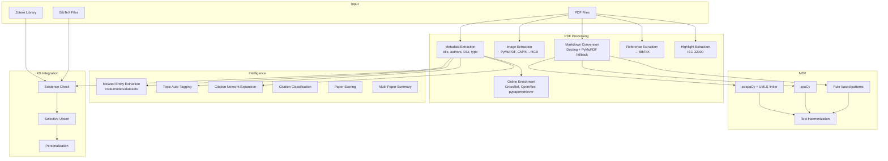

# Scholarly PDF Processing & Intelligence Modules

> **Commit**: `b5e7637` | **Files**: 6 changed, 2,567 insertions | **Total**: 9 modules, 76 public functions

## Architecture

## Module 1: PDF Processing ([pdf.py](file:///home/mohammadi/repos/cytognosis/cytos/src/cytos/scholarly/pdf.py))

| Function | Purpose |
|----------|---------|
| `classify_document()` | Classify text → article/thesis/report/preprint/review (regex scoring) |
| `extract_metadata_from_pdf()` | PyMuPDF metadata + heuristic title + DOI/arXiv/PMID extraction |
| `enrich_with_pypaperretriever()` | Additional identifiers via pypaperretriever |
| `extract_references()` | Reference section → BibTeX with DOI lookup |
| `extract_highlights()` | ISO 32000 annotations → Cytos annotation store (6 types) |
| `extract_images()` | All images → PNG files (min_size filter, CMYK→RGB) |
| `convert_to_markdown()` | Docling (structure + equations) → PyMuPDF fallback |
| `process_pdfs()` | Batch pipeline for multiple PDFs |

**Online enrichment** (when `enrich_online=True`):
- CrossRef: citation count, authors, venue, date
- OpenAlex: topics, OA status, PMID

## Module 2: NER ([ner.py](file:///home/mohammadi/repos/cytognosis/cytos/src/cytos/scholarly/ner.py))

| Function | Purpose |
|----------|---------|
| `extract_entities()` | Multi-backend NER (scispaCy → spaCy → rules) |
| `extract_entities_by_type()` | Filter by entity type |
| `extract_genes()` / `extract_diseases()` / `extract_cell_types()` / `extract_compounds()` | Convenience shortcuts |
| `harmonize_text()` | Rename entities to canonical names |
| `entity_summary()` | Group entities by type with counts |

**Entity type mapping** (13 types): Gene, Protein, CellType, CellLine, Tissue, Species, Disease, Compound, Organization, Person, GeographicLocation, Device, ScholarlyResource

## Module 3: Intelligence ([intelligence.py](file:///home/mohammadi/repos/cytognosis/cytos/src/cytos/scholarly/intelligence.py))

| Function | Purpose |
|----------|---------|
| `extract_related_entities()` | Extract code (GitHub/GitLab), models (HuggingFace), datasets (GEO/Zenodo) from text |
| `auto_tag_topics()` | OpenAlex API + keyword inference (8 topic areas) |
| `expand_citation_network()` | Multi-depth citation graph expansion via OpenAlex |
| `classify_citation()` | uses_data / uses_software / adopts_model / foundational / generic |
| `classify_all_citations()` | Classify all bracket-style citations in a paper |
| `score_paper()` | Composite score (citation + recency + influence + Scite) |
| `summarize_papers()` | Extractive summary grouped by topic |
| `query_research_rabbit()` | ResearchRabbit API stub |
| `query_litmaps()` | Litmaps API stub |

## Module 4: KG Integration ([kg.py](file:///home/mohammadi/repos/cytognosis/cytos/src/cytos/scholarly/kg.py))

| Function | Purpose |
|----------|---------|
| `check_in_kg()` | Check by DOI/OpenAlex/PMID/arXiv/title (priority order) |
| `check_in_personalization()` | Check annotations, collections, favorites |
| `upsert_to_kg()` | Create or selective fill-only update (adds new columns) |
| `add_to_collection()` | Add paper to annotation collection |

## Module 5: Zotero ([zotero.py](file:///home/mohammadi/repos/cytognosis/cytos/src/cytos/scholarly/zotero.py))

| Function/Class | Purpose |
|----------|---------|
| `ZoteroClient` | pyzotero wrapper (lazy init, env-based API key) |
| `.import_items()` | Pull items + PDF attachments from Zotero |
| `.export_items()` | Push entries to Zotero with PDF upload |
| `.create_collection()` | Create Zotero collection |
| `import_from_bibtex()` | BibTeX fallback import |
| `export_to_bibtex()` | BibTeX fallback export |

## Test Results

| Test | Result |
|------|--------|
| Module imports (9 modules) | ✅ |
| Document classification | ✅ article, thesis |
| NER (rule-based) | ✅ 3 entities (Gene, Disease) |
| Text harmonization | ✅ brca1 → BRCA1 |
| Related entities | ✅ 1 code, 1 model, 1 dataset |
| Citation classification | ✅ software, model, data, foundational |
| Topic auto-tagging | ✅ Neuroscience, Single-Cell Biology |
| Paper scoring | ✅ composite=0.576 |
| KG upsert (create) | ✅ action=created |
| KG upsert (update) | ✅ pmid added as new column |
| KG existence check | ✅ matched on doi |
| Personalization | ✅ in_collection, is_favorite |
| Zotero BibTeX import/export | ✅ 1 entry roundtrip |
| **Total** | **76 functions, ALL PASSING** |
