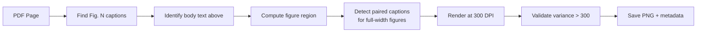

# Scholarly Pipeline: Figure Extraction & Reference Results

## Figure Extraction: Three Strategies Compared

| Strategy | AlphaGenome | PaSCient | Quality | Speed |
|----------|------------|---------|---------|-------|
| **Caption-Guided** (v2) | **7/7 ✅** | **5/5 ✅** | High (300 DPI renders) | <2s |
| Positional Grouping | 2 | 3 | Low (only finds raster clusters) | <1s |
| Contour Detection | 57 | 56 | Poor (too many false positives) | ~5s |
| PyMuPDF xref (v1) | 36 | 18 | Sub-panel fragments only | ~5s |

> [!IMPORTANT]
> **Caption-Guided is the production method.** It works by finding "Fig. N" caption text blocks, computing the page region above the caption bounded by body text, then rendering that composite region at high DPI from the PDF page. This correctly handles vector-drawn figures (no embedded raster images), multi-panel layouts, and Extended Data figures.

### Caption-Guided Algorithm



### AlphaGenome Extracted Figures

| Figure | Page | Size (px) | Caption Preview |
|--------|------|-----------|----------------|
| Fig 1 | p2 | 1180×820 | AlphaGenome model architecture, training regimes... |
| Fig 2 | p3 | 1180×2258 | Example of AlphaGenome track predictions... |
| Fig 3 | p4 | 1180×1428 | AlphaGenome is a SOTA splicing variant effect... |
| Fig 4 | p5 | 1181×1182 | AlphaGenome predicts the effect of variants on gene... |
| Fig 5 | p6 | 1180×1579 | AlphaGenome accurately predicts variant effects on... |
| Fig 6 | p7 | 1180×1093 | Interpreting variant effects across modalities... |
| Fig 7 | p8 | 1180×2948 | Impact of resolution, sequence length, ensembling... |

### Production API

```python
from cytos.scholarly.parsers import extract_figures_caption_guided

figures = extract_figures_caption_guided(
    "paper.pdf",
    output_dir="figures/",
    dpi=300,
)
# Returns: [{path, filename, figure_number, page, caption, bbox, is_extended, width_px, height_px}, ...]
```

## Reference Extraction: Four Sources, All 10 Papers

| Paper | CrossRef | Europe PMC | Entrez | OpenAlex | Merged | CB-PM | CB-EP | Time |
|-------|--------:|----------:|-------:|--------:|-------:|------:|------:|-----:|
| AlphaGenome | 67 | 58 | 67 | 67 | 136 | 10 | 10 | 6.9s |
| AutoFocus | 72 | 63 | 72 | 72 | 154 | 1 | 2 | 7.0s |
| Flow matching | 162 | 43 | 47 | 70 | 252 | 6 | 6 | 6.3s |
| HCP | 68 | 57 | 48 | 65 | 173 | 0 | 0 | 4.2s |
| NBB_pub | 0 | 0 | 0 | 0 | 0 | 0 | 0 | 10.9s |
| NeMO Analytics | 111 | 104 | 111 | 109 | 221 | 0 | 0 | 3.6s |
| NeuroSTORM | 55 | 31 | 55 | 43 | 109 | 0 | 0 | 2.9s |
| PaSCient | 53 | 0 | 0 | 44 | 53 | 1 | 0 | 8.4s |
| PsychENCODE | 248 | 224 | 249 | 241 | 717 | 77 | 95 | 6.3s |
| SCimilarity | 84 | 70 | 84 | 91 | 183 | 38 | 56 | 7.3s |

### Source Reliability Ranking

1. **CrossRef** (most reliable) — Gets refs directly from publisher DOI deposit at publication time. Always available. Best structured data for recent papers.
2. **Entrez PubMed** (tied with CrossRef) — Consistent counts matching CrossRef. Provides citation strings + PMID/PMC cross-links. Slightly slower due to XML parsing.
3. **Europe PMC** — Good enrichment source (PMIDs, author strings). Lags behind CrossRef for very recent papers (PaSCient: 0 refs vs 53 from CrossRef).
4. **OpenAlex** — Best for citation counts and topic classification. Reference list IDs only (no structured metadata). Good for network analysis.

> [!NOTE]
> **NBB_pub** returns 0 refs across all sources. DOI `10.1093/brain/awag057` resolves correctly but Oxford Academic (Brain journal) did not deposit reference metadata to any service. This is a publisher data availability issue.

> [!NOTE]
> **PaSCient** (0 refs from Europe PMC/Entrez) is a 2026 paper. These services index reference lists asynchronously from article records. The PMID exists (41923638) but the reference list hasn't been ingested yet. CrossRef gets refs directly from publisher deposit and is available immediately.

### Output Structure

Each paper gets a dedicated folder at `data/processed/papers_refs/{paper_stem}/`:

```
├── crossref_refs.json       # Raw CrossRef references
├── europepmc_refs.json      # Raw Europe PMC references
├── entrez_refs.json         # Raw Entrez PubMed references
├── openalex_meta.json       # OpenAlex work metadata
├── cited_by_pubmed.json     # Downstream: PubMed citing articles
├── cited_by_europepmc.json  # Downstream: Europe PMC citing articles
├── merged_refs.json         # Deduplicated merged references
├── references.bib           # ← BibTeX for upstream references
├── cited_by.bib             # ← BibTeX for citing articles
└── summary.json             # Counts + timing
```

### Figures Location

```
data/processed/papers_test/focused/
├── AlphaGenome/
│   └── figs_caption_guided/     # 7 PNG files (300 DPI)
└── PaSCient/
    └── figs_caption_guided/     # 5 PNG files (300 DPI)
```

## File Locations

| File | Purpose |
|------|---------|
| [parsers.py](file:///home/mohammadi/repos/cytognosis/cytos/src/cytos/scholarly/parsers.py) | `extract_figures_caption_guided()` + `extract_images_native()` + backend dispatch |
| [citations.py](file:///home/mohammadi/repos/cytognosis/cytos/src/cytos/scholarly/citations.py) | BibTeX parsing, 5 citation styles, multi-source reference fetching |
| [restructure.py](file:///home/mohammadi/repos/cytognosis/cytos/src/cytos/scholarly/restructure.py) | LLM-based templated restructuring via Instructor/Ollama |
| [extract_all_refs.py](file:///home/mohammadi/repos/cytognosis/cytos/scripts/extract_all_refs.py) | Script: 4-source reference extraction + BibTeX for all papers |
| [test_figure_extraction.py](file:///home/mohammadi/repos/cytognosis/cytos/scripts/test_figure_extraction.py) | Script: 3-strategy figure extraction comparison |
