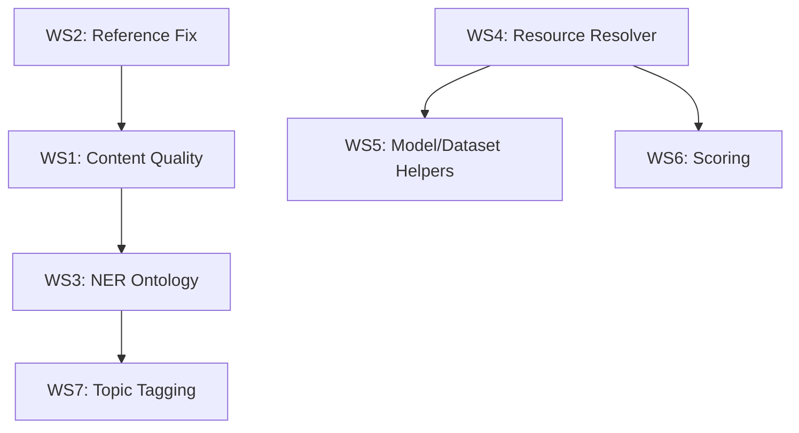

# Scholarly Pipeline V2 — Revision Plan

> Addresses all 14 comments from validation review. 7 workstreams, 4 new modules, ~15 new functions.

## Investigation Findings

| Comment | Finding |
|---------|---------|
| "What about the 2 comments in VariantFormer?" | ✅ Both captured: `content="Worth reimplementing using AlphaGenome"` and `content="This does not include a prior of tissues"` on pages 30-31. They're in the `content` field of Highlight annotations. |
| "Many main figures missing" | Root cause: AutoFocus/Flow Matching figures are **vector-drawn** (PDF path operators), not raster images. `get_images()` only finds raster. Need page rendering or `pdffigures2`. |
| "Unnecessary tiny figures" | Confirmed: Flow Matching has 8 images all <100px (math symbols). AutoFocus has 5 <100px. Need caption-matching filter. |
| "5 papers 0 references" | `_extract_reference_section()` requires `\nReferences\n` on own line. Multi-column and supplementary PDFs don't match. |
| "Citation network ranks most generic papers" | Correct: WGCNA (28K citations) ranked top because expansion uses raw citation count, not topic relevance. |

---

## WS1: Structural Content Quality

**Goal**: Replace naive PyMuPDF text extraction with structured scientific document parsing.

### 1a. GROBID Integration (`pdf.py`)

```python
def _convert_with_grobid(pdf_path: Path) -> str:
    """Parse via GROBID service → TEI XML → structured Markdown."""
```

- Run GROBID as Docker service (`grobid/grobid:0.8.1`)
- Parse TEI XML output: sections, figures w/ captions, tables, equations, references
- Fall back to Docling → PyMuPDF if GROBID unavailable
- Priority chain: GROBID → Docling → PyMuPDF

### 1b. Figure Extraction with Captions (`pdf.py`)

```python
def extract_figures(pdf_path, output_dir, *, method="auto") -> list[dict]:
    """Extract figures paired with captions. Returns [{path, caption, fig_id, page}]."""
```

- **GROBID method**: Parse `<figure>` elements from TEI XML (includes caption + coordinates)
- **Render method**: Render each page as image, detect figure regions via bounding boxes from text layout
- **pdffigures2 method**: Use Allen AI's pdffigures2 (Java CLI) for figure+caption extraction
- Filter: minimum area (not just dimension), skip icons/logos
- Name files by figure ID from paper: `fig1.png`, `fig2a.png`, `supp_fig_s1.png`

### 1c. Inline Highlights in Markdown (`pdf.py`)

```python
def convert_to_markdown(pdf_path, *, inline_annotations=True, annotation_format="criticmarkup") -> str:
```

- Support 3 annotation formats:
  - **CriticMarkup**: `{==highlighted text==}{>>comment text<<}`
  - **MyST directive**: `{note} comment` blocks
  - **HTML spans**: `<mark>text</mark> <!-- comment -->`
- Merge highlight positions with extracted text to inline them

### 1d. Template-Based Reshaping

```python
def reshape_to_template(markdown: str, template: str = "imrad") -> str:
    """Reorganize extracted content into standardized sections."""
```

- Templates: `imrad` (Intro/Methods/Results/Discussion), `review`, `preprint`, `thesis`
- Detect existing sections, reorder to match template
- Flag missing sections

**Verification**: Re-run on AutoFocus + Flow Matching → expect main figures with captions. Re-run on VariantFormer → expect inline highlights in markdown.

---

## WS2: Reference Extraction Fix

**Goal**: Extract references from all 16 papers (currently 5 return 0).

### 2a. Fix `_extract_reference_section()` (`pdf.py`)

```python
def _extract_reference_section(text: str) -> str:
    # Add patterns for: multi-column, numbered-only, "Literature Cited", end-of-doc
```

- Add patterns: `LITERATURE CITED`, `LITERATURE`, numbered refs at end, `\nR E F E R E N C E S`
- Detect reference start by numbered pattern density (`[1]`, `1.`, etc.) in last 30% of text
- Handle supplementary: split main vs supplementary references

### 2b. GROBID Reference Parsing

When GROBID is available, extract structured references from TEI XML `<biblStruct>` elements — gives title, authors, DOI, year directly (no regex needed).

### 2c. PubMed/Preprint Search for Missing IDs (`pdf.py`)

```python
def search_identifiers(meta: dict) -> dict:
    """Search PubMed, arXiv, bioRxiv, medRxiv for missing identifiers."""
```

- PubMed E-utilities: title search → PMID + PMCID
- arXiv API: title search → arXiv ID
- bioRxiv/medRxiv API: DOI lookup → preprint ID
- Called during `_enrich_metadata_online()` when DOI is missing

**Verification**: All 16 papers should have >0 references. Papers without DOI should get PubMed/arXiv IDs.

---

## WS3: NER Ontology Alignment

**Goal**: Define target entity types from our KG schema; add UMLS/MeSH concept lookup.

### 3a. Target Ontologies (from our KG)

| NER Type | Target Ontology | CURIE Prefix | Source |
|----------|----------------|--------------|--------|
| Gene | HGNC, Entrez Gene | `HGNC:`, `NCBIGene:` | MyGene.info |
| Disease | DOID, MONDO, ICD-10 | `DOID:`, `MONDO:` | MyDisease.info |
| CellType | CL (Cell Ontology) | `CL:` | OLS |
| Tissue | UBERON | `UBERON:` | OLS |
| Species | NCBITaxon | `NCBITaxon:` | NCBI Taxonomy |
| Compound | CHEBI, DrugBank | `CHEBI:` | MyChem.info |
| Phenotype | HP (Human Phenotype) | `HP:` | HPO |
| Pathway | GO, Reactome | `GO:`, `R-HSA-` | GO API |
| Variant | dbSNP, ClinVar | `rs`, `ClinVar:` | MyVariant.info |

### 3b. UMLS/MeSH Concept Tagging (`ner.py`)

```python
def tag_with_mesh(text: str, *, max_concepts: int = 20) -> list[dict]:
    """Tag text with MeSH descriptors using UMLS API or local MRCONSO."""

def tag_with_umls(text: str, *, semantic_types: list[str] | None = None) -> list[dict]:
    """Tag text with UMLS concepts, optionally filtered by semantic type."""
```

- Use our existing UMLS/SNOMED data (from conversation `8c49eb5d`)
- Local lookup via MRCONSO parquet files
- Online fallback via UMLS REST API

### 3c. scispaCy Comparison Function

```python
def compare_ner_backends(text: str) -> dict:
    """Run all backends and compare: rules vs spaCy vs scispaCy vs UMLS."""
```

**Verification**: PsychENCODE NER should return ontology-grounded CL: cell types, UBERON: brain regions, DOID: diseases.

---

## WS4: Resource Resolution (`NEW: resource_resolver.py`)

**Goal**: Resolve short-form references to full metadata; extract licenses; find data access info.

### 4a. URL Resolution Helpers

```python
def resolve_github(owner_repo: str) -> dict:
    """GitHub API → license, stars, language, description, topics."""

def resolve_huggingface_model(model_id: str) -> dict:
    """HF API → model card, license, tags, pipeline_tag, downloads, params."""

def resolve_huggingface_dataset(dataset_id: str) -> dict:
    """HF API → dataset card, license, tags, size, features."""

def resolve_geo_accession(gse_id: str) -> dict:
    """GEO API → title, organism, platform, samples, access level."""

def resolve_zenodo_doi(doi: str) -> dict:
    """Zenodo API → metadata, license, access_right, files."""
```

### 4b. License & Access Classification

```python
def classify_data_access(resource_meta: dict) -> dict:
    """Classify access level using DUO (Data Use Ontology).
    Returns: {access_class, duo_terms, request_url, repository_url}
    """
```

- Access classes: `open`, `open-with-registration`, `controlled`, `restricted`
- Map to DUO ontology terms (DUO:0000004 = no restriction, DUO:0000006 = health/medical only, etc.)
- For controlled data: auto-discover request URLs (dbGaP, NDA, EGA, etc.)

### 4c. Data Access Search

```python
def search_data_access(resource_name: str, identifiers: dict) -> dict:
    """Find data access request pages for controlled datasets.
    
    Handles: dbGaP (phs→NDA), NBB (→nda.nih.gov/nbb), UK Biobank,
    ENCODE, GTEx, PsychENCODE, HCP, ADNI, etc.
    """
```

- Known repository mapping (NBB → `https://nda.nih.gov/nbb`, UK Biobank → `https://www.ukbiobank.ac.uk/register-apply/`)
- Generic: search for "data access" or "data use agreement" pages linked from resource
- Store both `access_request_url` and `repository_info_url`

### 4d. Bio/Medical Domain Tagging

```python
def classify_resource_domain(meta: dict) -> dict:
    """Classify if model/dataset is bio/medical/health.
    Returns: {is_biomedical, domain_tags, data_types_kg}
    """
```

- Check HF tags, GitHub topics, GEO organism
- Map data types to our KG schema (single-cell, genotype, imaging, etc.)
- Add `BiomedicalMLModel` / `BiomedicalDataset` subtype flags

**Verification**: NBB paper → auto-discovers `nda.nih.gov/nbb` access URL. PaSCient's GEO datasets → access level = "open". scCLIP model on HF → license + param count.

---

## WS5: Model & Dataset Helpers (`NEW: model_helpers.py`, `dataset_helpers.py`)

### 5a. HuggingFace Model Intelligence (`model_helpers.py`)

```python
def fetch_model_card(model_id: str) -> dict:
    """Fetch and parse HF model card → structured metadata."""

def compute_model_params(model_id_or_path: str) -> dict:
    """Load model config → compute parameter count and FLOPs estimate."""

def convert_model_format(model_id: str, target: str = "onnx", output_dir: Path) -> Path:
    """Convert model to ONNX/TorchScript/SafeTensors using optimum."""

def visualize_model_architecture(model_id: str) -> str:
    """Generate Mermaid diagram of model architecture from config."""
```

### 5b. Dataset Intelligence (`dataset_helpers.py`)

```python
def fetch_dataset_metadata(identifier: str, source: str = "auto") -> dict:
    """Unified metadata fetch: GEO, Zenodo, HF Datasets, Figshare, dbGaP."""

def classify_dataset_type(meta: dict) -> str:
    """Map to our KG data types: single-cell, genotype, imaging, proteomics, etc."""

def estimate_dataset_size(meta: dict) -> dict:
    """Estimate storage requirements: samples × features × dtype."""
```

**Verification**: For a known HF model (e.g., `facebook/esm2_t33_650M_UR50D`) → returns 650M params, ESMFold architecture, MIT license, protein sequence input type.

---

## WS6: Scoring & Ranking Improvements

### 6a. Relevance-Weighted Citation Scoring (`intelligence.py`)

```python
def score_paper(paper, *, method="relevance_weighted") -> dict:
```

Current scoring uses raw citation count (produces generic results). Replace with:

- **Topic similarity**: Score citing papers by topic overlap with seed (using OpenAlex topic vectors)
- **Recency weighting**: Newer citations weighted higher
- **Field-normalized**: Divide by field median (via OpenAlex `cited_by_percentile`)
- **Influence score**: Use Semantic Scholar's `influentialCitationCount` (citations in intro/methods, not just background)

### 6b. Citation Network Relevance Filter

```python
def expand_citation_network(seed_ids, *, relevance_method="topic_similarity", min_relevance=0.3):
```

- After fetching citing papers, compute topic similarity to seed
- Filter out off-topic citations (WGCNA cited by everything, not informative)
- Rank by: `relevance × log(citations) × recency`

### 6c. Document Scoring Explanation

Add `score_explanation` field to each scored paper showing the formula and component values.

**Verification**: AutoFocus citation network → molecular biology papers ranked above generic methods papers.

---

## WS7: Topic Tagging with UMLS/MeSH (`intelligence.py`)

```python
def auto_tag_topics(text, *, sources=("openalex", "mesh", "umls", "keyword")) -> list[dict]:
    """Multi-source topic tagging."""

def tag_with_mesh_headings(text: str) -> list[dict]:
    """Tag with MeSH descriptors using NLM API or local MeSH tree."""

def tag_with_snomed(text: str) -> list[dict]:
    """Tag with SNOMED-CT concepts from our local SNOMED data."""
```

- Combine OpenAlex topics + MeSH headings + UMLS concepts + keyword matching
- Each tag includes: `{id, name, source, score, ontology}`
- Use our existing UMLS/SNOMED parquet files from the ontology pipeline

**Verification**: PsychENCODE → MeSH: "Transcriptome", "Brain", "Single-Cell Analysis"; SNOMED: "Cerebral cortex structure".

---

## Execution Order & Dependencies



| Phase | Workstreams | New Files | Est. Functions |
|-------|-------------|-----------|---------------|
| 1 | WS2 (ref fix) + WS1 (content) | — (modify `pdf.py`) | ~8 |
| 2 | WS3 (NER ontology) + WS7 (topics) | — (modify `ner.py`, `intelligence.py`) | ~6 |
| 3 | WS4 (resource resolver) | `resource_resolver.py` | ~8 |
| 4 | WS5 (model/dataset helpers) | `model_helpers.py`, `dataset_helpers.py` | ~8 |
| 5 | WS6 (scoring) | — (modify `intelligence.py`) | ~3 |
| **Total** | | **3 new files** | **~33 functions** |

## New Files Summary

| File | Purpose |
|------|---------|
| `src/cytos/scholarly/resource_resolver.py` | GitHub/HF/GEO/Zenodo URL resolution, license extraction, data access search |
| `src/cytos/scholarly/model_helpers.py` | HF model card, param counting, format conversion, architecture viz |
| `src/cytos/scholarly/dataset_helpers.py` | Unified dataset metadata, type classification, size estimation |
