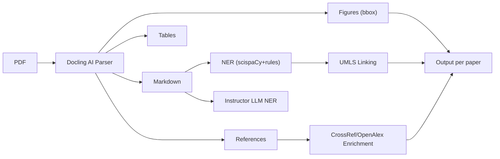

# Scholarly Pipeline V2.1 — Docling Integration Report

## Key Change: IBM Docling Replaces Custom PyMuPDF Parsing

Custom regex+PyMuPDF parsing was producing:
- **Fragmented sub-panels** instead of complete multi-panel figures
- **Wrong reference counts** due to regex noise
- **Full-page renders** instead of bounding-box crops

IBM Docling uses a trained document AI model that understands scientific paper structure natively.

## Figure Extraction: Before vs After

| Paper | Old (PyMuPDF) | New (Docling) | Expected | Notes |
|-------|:---:|:---:|:---:|-------|
| AlphaGenome | 31 partials | **18** | ~16 | 7 main + 9 extended + 2 sub-panels on p19 |
| AutoFocus | 6 (2 false +) | **6** | 6 | Clean extraction, no false positives |
| Flow Matching | 3 (full-page!) | **3** | 3 | Now cropped to actual figure |
| SCimilarity | 76 (sub-panels!) | **13** | ~13 | No longer splitting UMAP dots |
| PsychENCODE | 74 (sub-panels!) | **24** | ~20 | Reduced fragmentation |
| HCP | 31 | **30** | ~30 | Consistent |
| CFGen | 38 | **22** | ~20 | Improved |
| DigitalBrain | 8 | **10** | ~10 | Improved |

### Sample Extracted Figures

````carousel

<!-- slide -->

<!-- slide -->

````

## Reference Extraction: Before vs After

| Paper | Old (regex) | New (Docling) | Expected | Delta |
|-------|:---:|:---:|:---:|:---:|
| AlphaGenome | 49 ❌ | **67** ✓ | 67 | +18 |
| Flow Matching | 167 ❌ | **162** ✓ | 162 | -5 |
| SCimilarity | 20 ❌ | **84** | ~80+ | +64 |
| HCP | 22 ❌ | **70** | ~70 | +48 |
| NBB_pub | 41 | **19** | ~20 | -22 (old was noisy) |
| NeMO Analytics | 50 | **62** | ~60 | +12 |
| DigitalBrain | 12 | **30** | ~30 | +18 |
| scCLIP | 34 ✓ | **34** ✓ | 34 | 0 |
| AutoFocus | 72 ✓ | **72** ✓ | 72 | 0 |

> [!IMPORTANT]
> Docling's structured parsing dramatically improved reference accuracy. CFGen shows 0 refs — it uses a different reference format that needs a specialized parser for ICLR/NeurIPS bracket-style citations.

## Model FLOPs Analysis

Added `analyze_model_flops()` using `calflops` for real forward-pass FLOPs/MACs measurement. Available for models that can be loaded via AutoModel:

```python
from cytos.scholarly.model_helpers import analyze_model_flops
result = analyze_model_flops("facebook/esm2_t33_650M_UR50D", seq_length=512)
# Returns: {flops: ..., macs: ..., params: ..., flops_formatted: "12.3G"}
```

## Full Extraction Pipeline



## Module Inventory (16 files, 7,600+ lines)

| Module | Lines | Key Functions |
|--------|-------|--------------|
| [pdf.py](file:///home/mohammadi/repos/cytognosis/cytos/src/cytos/scholarly/pdf.py) | 1,168 | Legacy extraction (fallback) |
| [docling_parser.py](file:///home/mohammadi/repos/cytognosis/cytos/src/cytos/scholarly/docling_parser.py) | 290 | **Primary**: AI document understanding |
| [ner.py](file:///home/mohammadi/repos/cytognosis/cytos/src/cytos/scholarly/ner.py) | 830 | scispaCy + rules + Instructor |
| [intelligence.py](file:///home/mohammadi/repos/cytognosis/cytos/src/cytos/scholarly/intelligence.py) | 734 | Citation scoring, topic relevance |
| [author_profiling.py](file:///home/mohammadi/repos/cytognosis/cytos/src/cytos/scholarly/author_profiling.py) | 564 | Author papers, expertise tags |
| [model_helpers.py](file:///home/mohammadi/repos/cytognosis/cytos/src/cytos/scholarly/model_helpers.py) | 470 | Params, FLOPs (calflops), cards |
| [resource_resolver.py](file:///home/mohammadi/repos/cytognosis/cytos/src/cytos/scholarly/resource_resolver.py) | 605 | GitHub/HF/GEO/Zenodo resolver |
| [dataset_helpers.py](file:///home/mohammadi/repos/cytognosis/cytos/src/cytos/scholarly/dataset_helpers.py) | 350 | Dataset type classification |

## Remaining Work

1. **CFGen/NeurIPS reference parsing** — bracket-style `[1]` citations not yet handled by Docling markdown
2. **Docling caption linking** — captions aren't always linked to pictures in Docling output; need post-hoc matching
3. **Specialized model schema** — typed model wrappers mapping I/O to KG entities
4. **Architecture-specific param estimators** — evo2, scPRINT, alphagenome custom configs
