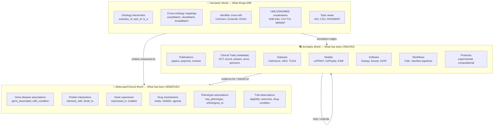
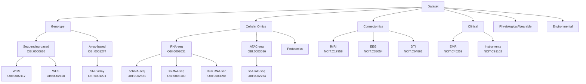
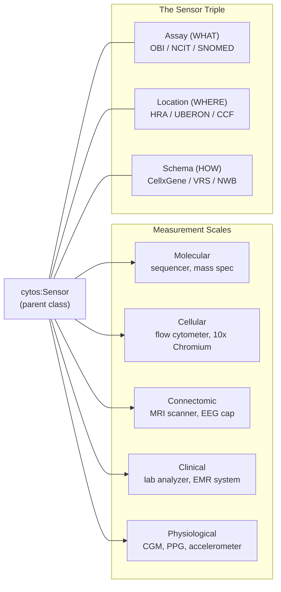
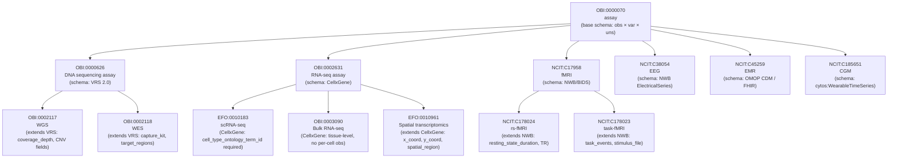
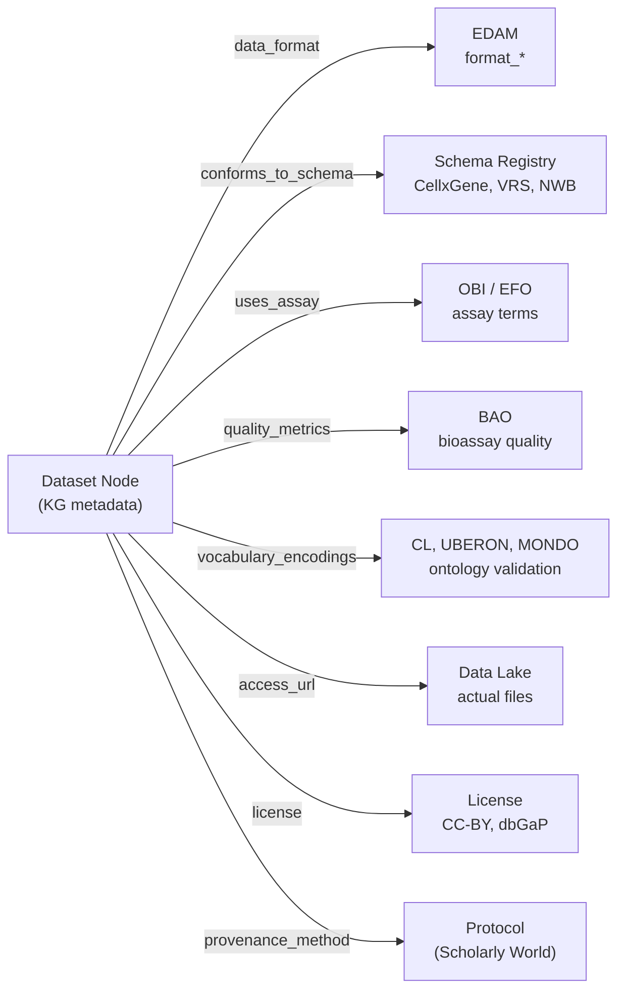
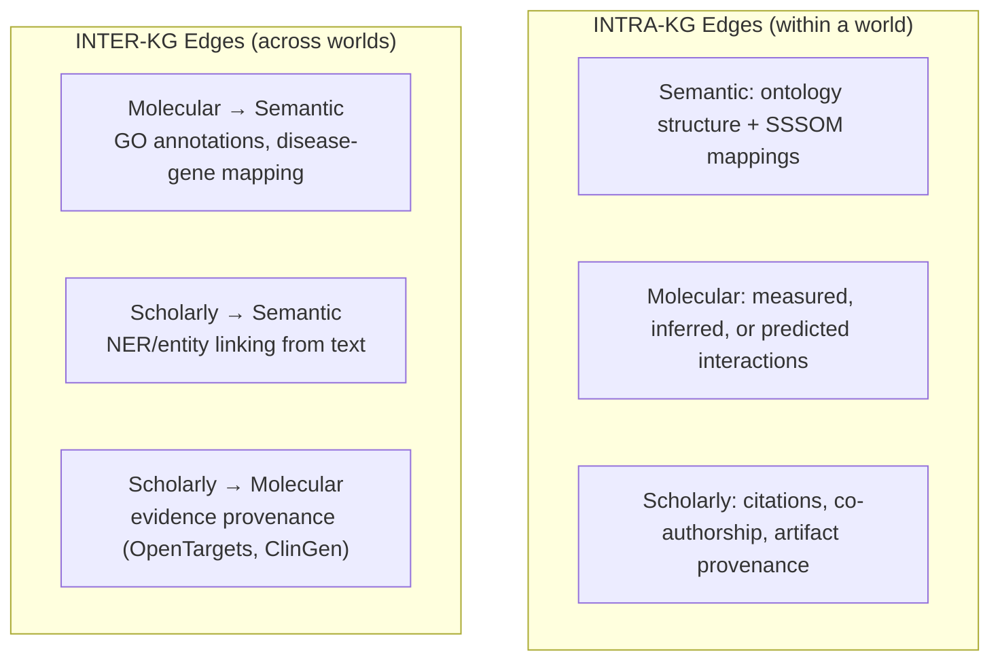

# Cytos Three Constituent Graphs — Architecture Plan

> **Scope**: Ontology Graph, Catalog Graph, Observation Graph architecture, registry system, CLI tooling
> **Date**: 2026-05-12 | **Naming**: Ontology Graph / Catalog Graph / Observation Graph

## 1. The Three KG Worlds

Based on empirical analysis of all 118.5M edges across 10 KG layers:



### Key Distinction

| Aspect | Semantic | Scholarly | Molecular/Clinical |
|--------|----------|-----------|-------------------|
| **Content** | Definitions, hierarchies, identifiers | Human-created artifacts | Experimental observations |
| **Analogy** | Dictionary/Thesaurus | Library catalog | Lab notebook |
| **Stability** | Slow-changing (ontology releases) | Growing (new papers, models) | Growing (new experiments) |
| **Nodes** | Ontology terms, vocab concepts | Papers, datasets, models, software | Gene-disease-drug triples |
| **Internal edges** | is_a, part_of, exactMatch | cites, extends, trained_on | interacts, expressed_in, treats |
| **Bridge edges** | → Scholarly: "about" annotation | → Semantic: "operates_on" | → Semantic: references entities |

### Clinical Trial: A Dual-World Entity

Clinical trials span two worlds. The **trial itself** (NCT record) is a scholarly artifact, but its **results and observations** generate molecular/clinical edges:

```
ClinicalTrial (Scholarly World)                 Trial Observations (Molecular World)
┌──────────────────────────────┐               ┌─────────────────────────────────────┐
│ NCT:05123456                 │               │                                     │
│  title, phase, sponsor,      │──studies──→   │ Drug X ──affects──→ Disease Y        │
│  start_date, status,         │               │ Drug X ──has_active_ingredient──→ Z  │
│  enrollment, arms            │──has_output─→ │ Disease A ──eligibility_incl──→ Cond │
│  principal_investigator      │               │ Gene G ──gene_assoc_condition──→ D   │
│  registered_at: clinicaltrials.gov           │ Drug X ──inhibits──→ Target T        │
└──────────────────────────────┘               └─────────────────────────────────────┘
       480K nodes (PKG)                         3.8M edges (PlaNet)
       edges: cites, related_to                 edges: eligibility, affects,
                                                       has_output, drug mechanisms
```

| Aspect | Scholarly (trial metadata) | Molecular (trial observations) |
|--------|--------------------------|-------------------------------|
| **Node** | `ClinicalTrials:NCT05123456` | Disease, Drug, Gene, Condition nodes |
| **Edges** | cites (→ papers), related_to | eligibility_inclusion/exclusion, affects, has_output |
| **Source** | PKG2.0 (480K trial records) | PlaNet (3.8M edges from 185K entity nodes) |
| **Content** | WHO registered, phases, sponsors | Drug-condition, eligibility criteria, mechanisms |
| **Analogy** | The protocol document | The experimental results |

> [!NOTE]
> PlaNet's 185K `NamedThing` nodes (diseases, drugs, conditions identified by MeSH/CUI) belong to the **Semantic World** (they ARE ontology concepts). The PlaNet EDGES connecting them (eligibility, affects, has_output) belong to the **Molecular/Clinical World** (they capture observed/curated relationships from trials).

### Scholarly World Entity Types

| Entity Type | Schema | Example Instances | From Our Schemas |
|-------------|--------|------------------|-----------------|
| **Publication** | `papers.yaml` | PMID:14907713, DOI:10.1038/... | BibliographicResource, Article, Preprint |
| **ClinicalTrial** | `papers.yaml` | NCT:05123456 | ClinicalTrial |
| **Dataset** | `datasets.yaml` | CXG:283d65eb, GEO:GSE123456 | Dataset, RecordSet |
| **Model** | `models.yaml` | HF:scprint-v2, HF:esm2_t33 | MLModel, PublishedModel, LocalModel |
| **Software** | `code.yaml` | GitHub:scverse/scanpy | CodeRepository |
| **Workflow** | `workflows.yaml` | WF:nf-core/scrnaseq | ComputationalWorkflow |
| **Protocol** | `protocols.yaml` | protocols.io:12345 | Protocol |

### Scholarly → Semantic Bridge Edges

These edges connect scholarly artifacts to the semantic world, describing WHAT biological entities/concepts each artifact relates to:

#### For Models (e.g., scPRINT, CellTypist, ESM-2)

| Predicate | Target Semantic Entity | Example |
|-----------|----------------------|---------|
| `cytos:requires_modality` | EFO assay type | scPRINT → `EFO:0010183` (scRNA-seq) |
| `cytos:operates_on_species` | NCBITaxon organism | scPRINT → `NCBITaxon:9606` (H. sapiens) |
| `cytos:operates_on_cell_type` | CL cell type | CellTypist → `CL:0000540` (neuron) |
| `cytos:operates_on_tissue` | UBERON anatomy | scPRINT → `UBERON:0000955` (brain) |
| `cytos:predicts_entity` | BioLink category | CellTypist → `biolink:Cell` (cell type annotation) |
| `cytos:trained_on_genes` | Gene set | ESM-2 → UniProt proteins |
| `cytos:implements_method` | AIO/EDAM algorithm | scPRINT → `AIO:0000036` (transformer) |
| `cytos:has_input_format` | EDAM format | scPRINT → `EDAM:format_3590` (h5ad) |
| `cytos:has_output_format` | EDAM format | scPRINT → `EDAM:data_2048` (embedding) |

#### For Datasets (e.g., CellxGene collections, GEO, TCGA)

| Predicate | Target Semantic Entity | Example |
|-----------|----------------------|---------|
| `cytos:measures_entity` | Gene/Protein | HBCA → ENSG00000139618 (BRCA2) |
| `cytos:samples_from_tissue` | UBERON anatomy | HBCA → `UBERON:0000956` (cerebral cortex) |
| `cytos:samples_cell_type` | CL cell type | HBCA → `CL:0000127` (astrocyte) |
| `cytos:samples_species` | NCBITaxon organism | HBCA → `NCBITaxon:9606` (H. sapiens) |
| `cytos:uses_assay` | EFO/OBI assay | HBCA → `EFO:0010183` (10x 3' scRNA-seq) |
| `cytos:disease_context` | MONDO disease | TCGA → `MONDO:0004992` (cancer) |
| `cytos:development_stage` | HsapDv stage | HBCA → `HsapDv:0000087` (adult) |
| `cytos:has_data_format` | EDAM format | HBCA → `EDAM:format_3590` (h5ad) |

#### For Software (e.g., Scanpy, GATK, Seurat)

| Predicate | Target Semantic Entity | Example |
|-----------|----------------------|---------|
| `cytos:processes_modality` | EFO assay type | Scanpy → `EFO:0010183` (scRNA-seq) |
| `cytos:processes_format` | EDAM format | Scanpy → `EDAM:format_3590` (h5ad) |
| `cytos:implements_operation` | EDAM operation | Scanpy → `EDAM:operation_3432` (clustering) |
| `cytos:domain_topic` | EDAM/AIO topic | Scanpy → `EDAM:topic_3308` (transcriptomics) |

#### For Protocols

| Predicate | Target Semantic Entity | Example |
|-----------|----------------------|---------|
| `cytos:protocol_for_assay` | EFO/OBI assay | 10x_protocol → `EFO:0010183` |
| `cytos:targets_tissue` | UBERON anatomy | biopsy_protocol → `UBERON:0000955` |
| `cytos:uses_reagent` | CHEBI chemical | staining_protocol → `CHEBI:34718` (DAPI) |

### Edge Distribution by World

| World | Total Edges | % of KG | Primary Sources |
|-------|------------|---------|-----------------|
| **Semantic** | ~34.6M | 29.2% | Core ontologies, UniChem, Ensembl, Topics, SSSOM |
| **Scholarly** | ~51.2M | 43.2% | PKG2.0 + future (datasets, models, software catalogs) |
| **Molecular/Clinical** | ~32.7M | 27.6% | Monarch, PrimeKG, Open Targets, PlaNet |

### Per-Source World Assignment

| Source | Semantic | Scholarly | Molecular | Notes |
|--------|:--------:|:---------:|:---------:|-------|
| Core (43.3M) | 50.3% | 35.3% | 14.4% | Mixed: UMLS `related_to` needs decomposition |
| PKG2.0 (34.6M) | 0% | 100% | 0% | Publications + clinical trials |
| Monarch (15.4M) | 5.1% | 6.9% | **88.1%** | Mostly experimental associations |
| UniChem (10.0M) | 100% | 0% | 0% | Pure identifier cross-refs |
| PrimeKG (8.1M) | 0% | 3.5% | **96.5%** | Mostly PPI + expression |
| PlaNet (3.8M) | 7.7% | 0% | **92.3%** | Clinical trial eligibility |
| Ensembl (1.6M) | 100% | 0% | 0% | Gene/protein ID mappings |
| Open Targets (466K) | 0% | 0% | **100%** | Gene-disease-drug |
| Topics (55K) | 100% | 0% | 0% | CS/AI ontology hierarchies |
| New Ontologies (10K) | 95.6% | 0% | 4.4% | SO, MI, SBO, EDAM |

### How This Maps to Our Schemas

| World | Node Schemas | Edge Schemas | Storage |
|-------|-------------|-------------|---------|
| Semantic | anatomy, disease, gene, drug, pathway, taxonomy, clinical, environment, hra, information, semantic_network | subclass_of, part_of, exactMatch, same_as, has_attribute | Ontology files + KGX + Neo4j |
| Scholarly | publication, `datasets.yaml`, `models.yaml`, `code.yaml`, `workflows.yaml`, `protocols.yaml` | cites, extends, trained_on, **annotation bridge edges** (operates_on, measures, samples_from) | KGX + Neo4j |
| Molecular | gene, disease, drug, variant, phenotype, expression, pathway | interacts_with, expressed_in, has_phenotype, treats, gene_associated_with_condition | KGX + Neo4j |

### Scholarly ↔ Molecular Bridge

The Scholarly World also connects to the Molecular World via evidence edges:

| Predicate | Direction | Example |
|-----------|-----------|---------|
| `cytos:provides_evidence_for` | Paper → Gene-Disease assoc. | PMID:12345 provides evidence for TP53→cancer |
| `cytos:trained_on` | Model → Dataset | scPRINT trained_on HBCA cortex |
| `cytos:benchmarked_on` | Model → Dataset | CellTypist benchmarked_on Tabula Sapiens |
| `cytos:produced_by` | Dataset → Protocol | HBCA produced_by 10x Chromium protocol |
| `cytos:analyzed_by` | Dataset → Software | HBCA analyzed_by Scanpy |
| `cytos:implements` | Software → Workflow | Scanpy implements scRNA-seq QC workflow |

---

## 1b. Dataset Modality Taxonomy

Datasets are subtyped by measurement modality. Each modality maps to specific ontology terms from OBI, EFO, or NCIT, creating the bridge from scholarly artifacts to the semantic world:



### Full Assay → Ontology Term Mapping

#### Genotype

| Assay | OBI/EFO Term | CURIE | Parent |
|-------|-------------|-------|--------|
| DNA sequencing assay | DNA sequencing assay | `OBI:0000626` | — |
| WGS | whole genome sequencing assay | `OBI:0002117` | `OBI:0000626` |
| WES | exome sequencing assay | `OBI:0002118` | `OBI:0000626` |
| SNP array | genotyping by SNP array assay | `OBI:0001274` | — |
| Tiling array | genotyping by tiling array assay | `OBI:0002030` | `OBI:0001274` |

#### Cellular Omics (Transcriptomics, Epigenomics, Proteomics)

| Assay | OBI/EFO Term | CURIE | Parent |
|-------|-------------|-------|--------|
| RNA-seq | RNA-seq assay | `OBI:0002631` | — |
| scRNA-seq | single-cell RNA sequencing assay | `EFO:0010183` / `OBI:0002631` | `OBI:0002631` |
| snRNA-seq | single-nucleus RNA sequencing assay | `OBI:0003109` | `OBI:0002631` |
| Bulk RNA-seq | bulk RNA-seq assay | `OBI:0003090` | `OBI:0002631` |
| ATAC-seq | chromatin accessibility assay | `OBI:0003686` | — |
| scATAC-seq | single-cell ATAC-seq | `OBI:0002764` | `OBI:0003686` |
| snATAC-seq | single-nucleus ATAC-seq | `OBI:0002762` | `OBI:0003686` |
| Bulk ATAC-seq | bulk ATAC-seq | `OBI:0003089` | `OBI:0003686` |
| Spatial transcriptomics | spatial transcriptomics | `EFO:0010961` | `OBI:0002631` |
| CITE-seq | CITE-seq | `EFO:0030005` | multimodal |
| Mass cytometry (CyTOF) | mass cytometry assay | `OBI:0003096` | — |
| Flow cytometry | flow cytometry assay | `OBI:0000916` | — |
| Proteomics (MS) | mass spectrometry assay | `OBI:0000470` | — |
| Metabolomics | metabolite profiling | `OBI:0000366` | — |

#### Connectomics / Neuroimaging

| Assay | NCIT Term | CURIE | Notes |
|-------|----------|-------|-------|
| PET | Positron Emission Tomography | `NCIT:C17007` | Molecular imaging |
| DTI | Diffusion Tensor Imaging | `NCIT:C64862` | Structural connectivity |
| fMRI | Functional MRI | `NCIT:C17958` | Functional connectivity |
| rs-fMRI | Resting State fMRI | `NCIT:C178024` | Subtype of fMRI |
| task-fMRI | Task fMRI | `NCIT:C178023` | Subtype of fMRI |
| fNIRS | Functional Near-Infrared Spectroscopy | `NCIT:C175235` | Portable neuroimaging |
| EEG | Electroencephalography | `NCIT:C38054` | Electrophysiology |
| MEG | Magnetoencephalography | `NCIT:C16811` | Magnetic field recording |
| MRI (structural) | Magnetic Resonance Imaging | `NCIT:C16809` | Anatomical |
| CT | Computed Tomography | `NCIT:C17204` | Structural |

#### Clinical

| Assay | NCIT Term | CURIE | Notes |
|-------|----------|-------|-------|
| EMR | Electronic Medical Record | `NCIT:C45259` | Structured clinical data |
| Clinical assessment | Clinical or Research Assessment Question | `NCIT:C91102` | Instruments/questionnaires |
| Laboratory test | Laboratory Test | `NCIT:C15199` | Blood chemistry, CBC, etc. |
| Pathology report | Pathology Report | `NCIT:C28277` | Tissue diagnosis |
| Clinical trial data | Clinical Trial Data | `NCIT:C142695` | Trial-specific measurements |

#### Physiological / Wearable

> [!WARNING]
> Wearable/physiological assay terms are fragmented across ontologies. Harmonization is needed.

| Assay | Best Available Term | Source | Harmonization Notes |
|-------|-------------------|--------|---------------------|
| CGM (continuous glucose) | Continuous Glucose Monitor | `NCIT:C185651` | NCIT has term |
| Heart rate (PPG) | Photoplethysmography | `NCIT:C185635` | NCIT; also IEEE 11073 |
| Accelerometry | Accelerometry | `NCIT:C175060` | Activity tracking |
| ECG (wearable) | Electrocardiography | `NCIT:C38036` | Same as clinical ECG |
| SpO2 (pulse ox) | Pulse Oximetry | `NCIT:C38037` | Standard term |
| Sleep staging | Polysomnography | `NCIT:C147423` | Clinical term for full PSG |
| Skin temperature | — | — | No standard term; needs `cytos:SkinTemperatureMeasurement` |
| Blood pressure (cuff) | Blood Pressure Measurement | `NCIT:C25298` | Standard |
| Bioimpedance | Bioelectrical Impedance Analysis | `NCIT:C94497` | Body composition |

#### Environmental / Exposure

| Assay | Best Available Term | Source | Notes |
|-------|-------------------|--------|-------|
| Air quality sensor | Environmental Monitoring | `ECTO:0000001` | ECTO top-level |
| UV exposure | UV radiation exposure | `ECTO:0001818` | ECTO |
| Dietary intake | Dietary assessment | `ONS:0000004` | ONS term |

### Modality → Ontology Source Priority

| Dataset Domain | Primary Ontology | Secondary | Gaps |
|---------------|-----------------|-----------|------|
| **Genotype** | OBI | EFO | None — well covered |
| **Cellular Omics** | OBI + EFO | NCIT | Well covered; EFO has CellxGene-specific terms |
| **Connectomics** | NCIT | NEMO, COGAT | BIDS terms not in any ontology |
| **Clinical** | NCIT + SNOMED | LOINC, ICD | Well covered |
| **Physiological/Wearable** | NCIT (partial) | IEEE 11073 | **Gaps**: several wearable modalities lack terms |
| **Environmental** | ECTO + ENVO | ONS, HHEAR | Sparse for consumer-grade sensors |

### How Dataset Modality Connects to the KG

```
Dataset node (Scholarly World)
    ├─ cytos:uses_assay ──→ OBI/EFO/NCIT term (Semantic World)
    ├─ cytos:measures_entity ──→ Gene/Protein/Metabolite (Semantic World)
    ├─ cytos:samples_from_tissue ──→ UBERON term (Semantic World)
    ├─ cytos:samples_species ──→ NCBITaxon term (Semantic World)
    ├─ cytos:disease_context ──→ MONDO term (Semantic World)
    └─ cytos:analyzed_by ──→ Software node (Scholarly World)
```

The `cytos:uses_assay` edge is the primary bridge from Dataset → Semantic. The assay type determines which other semantic annotations are valid (e.g., scRNA-seq datasets must have CL cell types, neuroimaging datasets map to UBERON brain regions).

---

## 1c. Sensor → Assay → Schema → Location Model

The term **Sensor** is Cytognosis's unifying parent class for ALL measurement devices/technologies across biological scales. This is the conceptual backbone of the **Cytoscope** platform component.



### The Sensor Triple

Every measurement in the Cytos platform is described by three dimensions:

| Dimension | Question | Source Ontology | Example |
|-----------|----------|----------------|---------|
| **Assay** | WHAT is being measured? | OBI, NCIT, SNOMED, EFO | `OBI:0002631` (RNA-seq assay) |
| **Location** | WHERE on/in the body? | HRA, UBERON, CCF | `UBERON:0000955` (brain) |
| **Schema** | HOW is the data structured? | CellxGene, VRS, NWB, OMOP | CellxGene AnnData schema |

```
Sensor instance → measures_using → Assay ontology term (Semantic)
              → measures_at → HRA/UBERON location (Semantic)
              → produces_data_conforming_to → Schema (Semantic)
```

### Schema Inheritance Follows Assay Hierarchy

Data schemas attach to assay ontology nodes and **inherit downward**. Child assay types can specialize the parent schema with additional required fields:



### Full Sensor × Assay × Schema × Location Mapping

| Scale | Sensor Examples | Assay (WHAT) | Schema (HOW) | Location (WHERE) |
|-------|----------------|-------------|-------------|-----------------|
| **Molecular** | Illumina NovaSeq, Oxford Nanopore | `OBI:0002117` WGS | VRS 2.0 + GA4GH | Tissue biopsy → `UBERON:*` |
| | | `OBI:0002118` WES | VRS 2.0 + GA4GH | Tissue biopsy → `UBERON:*` |
| | PacBio Revio | `OBI:0002631` RNA-seq | CellxGene | Tissue → `UBERON:*` |
| **Cellular** | 10x Chromium, Parse Bio | `EFO:0010183` scRNA-seq | CellxGene (full) | Cell type → `CL:*`, Tissue → `UBERON:*` |
| | 10x Visium, MERFISH | `EFO:0010961` Spatial | CellxGene + spatial ext. | Spatial coords → `CCF:*` (HRA) |
| | BD FACSymphony | `OBI:0000916` Flow cytometry | FCS/AnnData | Cell type → `CL:*` |
| **Connectomic** | Siemens Prisma (3T MRI) | `NCIT:C17958` fMRI | NWB + BIDS | Brain region → `UBERON:*` / `CCF:*` |
| | BioSemi ActiveTwo | `NCIT:C38054` EEG | NWB ElectricalSeries | Scalp (10-20 system) |
| | MEG system | `NCIT:C16811` MEG | NWB | Brain region → `UBERON:*` |
| **Clinical** | Epic/Cerner EMR | `NCIT:C45259` EMR | OMOP CDM / FHIR | Whole patient |
| | Lab analyzer | `NCIT:C15199` Lab test | LOINC-coded values | Blood → `UBERON:0000178` |
| | Pathology scanner | `NCIT:C28277` Path report | HL7/DICOM | Tissue → `UBERON:*` |
| **Physiological** | Dexcom G7 (CGM) | `NCIT:C185651` CGM | `cytos:WearableTimeSeries` | Interstitial fluid |
| | Apple Watch (PPG) | `NCIT:C185635` PPG | `cytos:WearableTimeSeries` | Wrist → `UBERON:0004088` |
| | Oura Ring (accel) | `NCIT:C175060` Accelerometry | `cytos:WearableTimeSeries` | Finger → `UBERON:0001725` |
| | Withings BPM | `NCIT:C25298` Blood pressure | `cytos:WearableTimeSeries` | Upper arm → `UBERON:0003822` |

### Schema Attachment Rules

1. **Root schema** attaches to the broadest assay class (e.g., CellxGene → `OBI:0002631` RNA-seq)
2. **Child assays** inherit all parent schema fields, then add specializations
3. **Validation**: a dataset declaring `EFO:0010183` (scRNA-seq) must conform to the scRNA-seq schema, which includes CellxGene fields PLUS `cell_type_ontology_term_id`
4. **Multiple schemas**: a multimodal assay (e.g., CITE-seq) may conform to multiple schemas simultaneously

### How Sensor Integrates with KG Worlds

```
┌─────────────────────────────────────────────────────────────┐
│                    SEMANTIC WORLD                            │
│                                                             │
│  Assay Ontology (OBI/NCIT)  ←→  Schema Registry            │
│         │                            │                      │
│    subclass_of               conforms_to                    │
│         │                            │                      │
│  HRA / UBERON (Location)    Data Schema (CellxGene, VRS)   │
│         │                            │                      │
└─────────┼────────────────────────────┼──────────────────────┘
          │ measures_at                │ produces_data
          │                            │
┌─────────┼────────────────────────────┼──────────────────────┐
│         ▼          SCHOLARLY WORLD   ▼                      │
│                                                             │
│  Sensor (device)  ──→  Dataset  ──→  Software               │
│        │                  │            │                     │
│   manufactured_by    analyzed_by   implements               │
│        │                  │            │                     │
│   Company node       Model node    Workflow node            │
│                                                             │
└─────────────────────────────────────────────────────────────┘
          │ provides_evidence_for
          ▼
┌─────────────────────────────────────────────────────────────┐
│                  MOLECULAR/CLINICAL WORLD                    │
│                                                             │
│  Gene-disease associations, PPI, expression, drug targets   │
│                                                             │
└─────────────────────────────────────────────────────────────┘
```

### Cytoscope Implication

This Sensor model IS the Cytoscope architecture:
- The **Sensor** class hierarchy defines what Cytoscope can ingest
- The **Assay → Schema** mapping defines how each data type is standardized
- The **HRA Location** mapping defines where on the body each measurement originates
- The **Schema inheritance** means adding a new sensor type requires only: (1) identify assay ontology term, (2) extend parent schema if needed, (3) map to HRA location

Future wearable sensors (Cytoscope devices) will be first-class Sensor instances, with their own assay terms (potentially in `cytos:` namespace for novel biosensors), schemas (extending `cytos:WearableTimeSeries`), and HRA mappings.

---

## 1d. FAIR Data Access Layer

Dataset nodes in the KG are **catalog entries** (metadata), not the actual measurements. The measurements live in a separate data storage/lake. FAIR-compliant fields on each Dataset node describe how to find, access, and validate the actual data.

### The Separation

```
┌──────────────────────────────────┐     ┌───────────────────────────────┐
│     KNOWLEDGE GRAPH (metadata)   │     │   DATA LAKE (measurements)    │
│                                  │     │                               │
│  Dataset node                    │     │  /datasets/06-omics/          │
│    id: CXG:283d65eb              │────→│    scRNA/HBCA/adata.h5ad      │
│    name: "Human Brain Cell Atlas"│     │                               │
│    uses_assay: EFO:0010183       │     │  /datasets/08-neuro/          │
│    samples_tissue: UBERON:0000955│────→│    BIDS/sub-01/func/bold.nii  │
│    data_format: EDAM:format_3590 │     │                               │
│    access_url: gs://bucket/...   │     │  gs://cytos-data/             │
│    conforms_to: CellxGene v5     │     │    census/2024-07/...         │
│                                  │     │                               │
└──────────────────────────────────┘     └───────────────────────────────┘
        KG node (tiny)                     Actual files (GB-TB)
```

### FAIR Fields on Dataset Nodes

#### F — Findable

| Field | Ontology/Standard | Description | Example |
|-------|------------------|-------------|---------|
| `identifier` | `datacite:identifier` | Globally unique persistent ID | `DOI:10.1234/hbca`, `CXG:283d65eb` |
| `alternate_identifiers` | `schema:sameAs` | Other IDs for same dataset | `GEO:GSE123456`, `SRA:SRP456789` |
| `repository` | `dcat:catalog` | Source repository/catalog | `CellxGene Census`, `GEO`, `TCGA` |
| `landing_page` | `dcat:landingPage` | Human-readable dataset page | `https://cellxgene.cziscience.com/...` |
| `keywords` | `dcat:keyword` | Searchable terms | `["brain", "scRNA-seq", "human"]` |

#### A — Accessible

| Field | Ontology/Standard | Description | Example |
|-------|------------------|-------------|---------|
| `access_url` | `dcat:accessURL` | Direct download/API endpoint | `gs://cytos-data/hbca.h5ad` |
| `download_url` | `dcat:downloadURL` | Direct file download | `https://datasets.cellxgene.../hbca.h5ad` |
| `access_protocol` | `dcat:accessService` | How to retrieve data | `HTTPS`, `GCS`, `S3`, `FTP`, `API` |
| `authentication` | `cytos:access_level` | Auth requirements | `public`, `dbGaP`, `institutional` |
| `access_restrictions` | `dcterms:accessRights` | Legal/ethical restrictions | `open`, `controlled`, `embargoed` |
| `data_lake_path` | `cytos:local_path` | Local data lake location | `06-omics/scRNA/HBCA/` |

#### I — Interoperable

| Field | Ontology/Standard | Description | Example |
|-------|------------------|-------------|---------|
| `data_format` | `EDAM:format_*` | File format ontology term | `EDAM:format_3590` (h5ad) |
| `media_type` | `dcat:mediaType` | MIME type | `application/x-hdf5` |
| `compression` | `EDAM:format_*` | Compression format | `EDAM:format_3989` (gzip) |
| `encoding` | `dcterms:format` | Character encoding | `UTF-8` |
| `conforms_to_schema` | `dcterms:conformsTo` | Data schema reference | `CellxGene v5.2`, `VRS 2.0`, `NWB 2.7` |
| `conforms_to_standard` | `dcterms:conformsTo` | Community standard | `BIDS 1.9`, `GA4GH`, `OMOP CDM v5.4` |
| `vocabulary_encodings` | `cytos:uses_vocabulary` | Which ontologies are used in data | `[CL, UBERON, EFO, MONDO]` |

#### R — Reusable

| Field | Ontology/Standard | Description | Example |
|-------|------------------|-------------|---------|
| `license` | `dcterms:license` | Data license | `CC-BY-4.0`, `dbGaP`, `proprietary` |
| `provenance_method` | `prov:wasGeneratedBy` | How data was produced | Protocol reference |
| `quality_metrics` | `cytos:quality_report` | QC metrics | `{cells: 1.2M, genes: 33K, mt_pct: <5%}` |
| `completeness` | `dqv:hasQualityMeasurement` | Data completeness score | `0.95` |
| `version` | `pav:version` | Dataset version | `2024-07-01` |
| `checksum` | `schema:sha256` | File integrity hash | `sha256:a1b2c3...` |
| `size_bytes` | `dcat:byteSize` | Total data size | `42949672960` (40 GB) |
| `record_count` | `croissant:recordCount` | Number of observations | `1,200,000 cells` |

### Data Format Ontology Mapping

Using EDAM and related ontologies for format specification:

| Data Type | Format | EDAM Term | MIME Type |
|-----------|--------|-----------|-----------|
| scRNA-seq | h5ad (AnnData) | `EDAM:format_3590` | `application/x-hdf5` |
| scRNA-seq | Seurat RDS | `EDAM:format_2333` | `application/x-rds` |
| scRNA-seq | loom | `EDAM:format_3915` | `application/x-hdf5` |
| Genotype | VCF | `EDAM:format_3016` | `text/x-vcf` |
| Genotype | CRAM/BAM | `EDAM:format_3462` | `application/octet-stream` |
| Genotype | FASTQ | `EDAM:format_1930` | `text/x-fastq` |
| Neuroimaging | NIfTI | `EDAM:format_4001` | `application/x-nifti` |
| Neuroimaging | NWB | — (needs `cytos:format_nwb`) | `application/x-hdf5` |
| Clinical | FHIR JSON | `EDAM:format_3464` | `application/fhir+json` |
| Clinical | OMOP CSV | `EDAM:format_3752` | `text/csv` |
| Wearable | Parquet | `EDAM:format_3867` | `application/x-parquet` |
| Tabular | TSV | `EDAM:format_3475` | `text/tab-separated-values` |

### Data Constraint Schema

Each assay type has expected constraints on the stored data. These are validation rules that can be checked automatically:

```yaml
# Example: scRNA-seq data constraints
assay: EFO:0010183  # scRNA-seq
conforms_to: CellxGene v5.2
constraints:
  format:
    required: [EDAM:format_3590]           # h5ad
    accepted: [EDAM:format_3590, EDAM:format_3915]  # h5ad or loom
  dimensions:
    obs_min: 100                            # At least 100 cells
    var_min: 500                            # At least 500 genes
  required_obs_columns:                     # From CellxGene schema
    - cell_type_ontology_term_id            # Must be CL:* term
    - tissue_ontology_term_id               # Must be UBERON:* term
    - disease_ontology_term_id              # Must be MONDO:* or PATO:* term
    - assay_ontology_term_id                # Must match declared assay
    - organism_ontology_term_id             # Must be NCBITaxon:* term
  required_var_columns:
    - feature_id                            # Must be Ensembl gene ID
    - feature_name                          # HGNC symbol
  quality:
    max_mitochondrial_pct: 20               # QC threshold
    min_genes_per_cell: 200
    min_cells_per_gene: 3
  ontology_validation:                      # Ontology terms must resolve
    - field: cell_type_ontology_term_id
      ontology: cl
      must_be_leaf: false                   # Can be any level
    - field: tissue_ontology_term_id
      ontology: uberon
```

```yaml
# Example: WGS data constraints
assay: OBI:0002117  # WGS
conforms_to: VRS 2.0
constraints:
  format:
    required: [EDAM:format_3016]            # VCF
    accepted: [EDAM:format_3016, EDAM:format_3462]  # VCF or CRAM
  quality:
    min_coverage: 30                        # 30x minimum
    min_mapping_quality: 20
  reference_genome:
    accepted: [GRCh38, T2T-CHM13]
  variant_calling:
    caller: [GATK, DeepVariant, Strelka2]   # Accepted callers
```

### How FAIR Fields Map to Ontologies



### RO-Crate Alignment

Every Dataset node can be exported as an RO-Crate, with the FAIR fields mapping directly to RO-Crate properties:

| FAIR Field | RO-Crate Property | JSON-LD Key |
|-----------|-------------------|-------------|
| `identifier` | `@id` | `"@id": "https://doi.org/..."` |
| `data_format` | `encodingFormat` | `"encodingFormat": "application/x-hdf5"` |
| `conforms_to_schema` | `conformsTo` | `"conformsTo": {"@id": "https://schema.cellxgene.org/5.2"}` |
| `access_url` | `contentUrl` | `"contentUrl": "gs://..."` |
| `license` | `license` | `"license": "https://creativecommons.org/licenses/by/4.0/"` |
| `checksum` | `sha256` | `"sha256": "a1b2c3..."` |
| `size_bytes` | `contentSize` | `"contentSize": "40 GB"` |
| `provenance_method` | `wasGeneratedBy` | `"prov:wasGeneratedBy": {"@id": "protocol:..."}` |

---

## 1e. Topic and Classification Networks

Topics (AIO, CSO, ROADMAP) and the UMLS Semantic Network are NOT ontologies in the traditional sense. They are **annotation/classification layers** that organize and cluster nodes across ALL three KG worlds. They sit orthogonally to the three worlds, providing navigational structure.

### What Classification Networks Are

```
┌─────────────────────────────────────────────────────────────────────┐
│           CLASSIFICATION NETWORKS (orthogonal to worlds)            │
│                                                                     │
│  ┌─────────────┐  ┌──────────┐  ┌──────────┐  ┌────────────────┐  │
│  │ UMLS Seman. │  │   AIO    │  │   CSO    │  │ BioLink cats   │  │
│  │ Network     │  │ (AI/ML)  │  │ (CS)     │  │ (node types)   │  │
│  │ 127 types   │  │ 442 terms│  │ 14K terms│  │ 53 categories  │  │
│  │ HIGH cov.   │  │ PARTIAL  │  │ PARTIAL  │  │ FULL coverage  │  │
│  └──────┬──────┘  └────┬─────┘  └────┬─────┘  └───────┬────────┘  │
│         │              │             │                 │            │
│         ▼              ▼             ▼                 ▼            │
│  ┌─────────────────────────────────────────────────────────────┐    │
│  │           ALL KG NODES (10.7M+)                             │    │
│  │   Semantic World ∪ Scholarly World ∪ Molecular World        │    │
│  └─────────────────────────────────────────────────────────────┘    │
└─────────────────────────────────────────────────────────────────────┘
```

### Classification Network Types

| Network | Terms | Coverage | Propagatable? | What It Labels |
|---------|------:|----------|:-------------:|---------------|
| **UMLS Semantic Network** | 127 semantic types | HIGH (~80%+ of biomedical nodes) | ✅ Yes | Every UMLS CUI → 1+ Semantic Types (T001–T204) |
| **BioLink categories** | 53 categories | FULL (100%) | ✅ Already done | Every node has a `category` field |
| **MeSH Tree Numbers** | ~29K descriptors | MEDIUM (publications, clinical) | Partial | Papers, diseases, drugs, anatomy |
| **AIO** | 442 terms | LOW (AI/ML nodes only) | ❌ No | AI methods, architectures, tasks |
| **CSO** | 14,736 terms | LOW (CS papers only) | ❌ No | Computer science research topics |
| **ROADMAP Epigenomics** | ~200 terms | LOW (epigenomics only) | ❌ No | Epigenomic assay types, tissues |

### Coverage Tiers

**Tier 1 — Full coverage** (every node gets a label):
- `biolink:category` — already assigned to all 10.7M nodes
- UMLS Semantic Types — can be propagated to most biomedical nodes via CUI→STY mapping

**Tier 2 — High coverage** (majority of nodes in a domain):
- MeSH tree numbers — covers most publications, diseases, chemicals
- Gene Ontology aspect (BP/MF/CC) — covers all GO-annotated genes

**Tier 3 — Partial coverage** (specialized subsets):
- AIO, CSO, ROADMAP — only label nodes within their narrow domain
- These are useful for faceted search but cannot organize the full graph

### UMLS Semantic Network: The Canonical Classifier

The UMLS Semantic Network is special because:
1. It has 127 hierarchical semantic types organized in a tree
2. Every UMLS CUI maps to 1+ semantic types (via MRSTY)
3. Most of our ontology terms have UMLS CUI mappings (via SSSOM/MRMAP)
4. This means we can propagate semantic types to ~80%+ of biomedical nodes

```
UMLS Semantic Network (top-level groups):
├── Entity (T071)
│   ├── Physical Object (T072)
│   │   ├── Organism (T001) → NCBITaxon nodes
│   │   ├── Anatomical Structure (T017) → UBERON nodes
│   │   ├── Cell (T025) → CL nodes
│   │   ├── Gene or Genome (T028) → HGNC/Ensembl nodes
│   │   ├── Chemical (T103) → CHEBI nodes
│   │   └── Medical Device (T074) → Sensor nodes
│   └── Conceptual Entity (T077)
│       ├── Disease or Syndrome (T047) → MONDO/DOID nodes
│       ├── Therapeutic Procedure (T061) → MAXO nodes
│       └── Laboratory Procedure (T059) → OBI assay nodes
└── Event (T051)
    ├── Biologic Function (T038) → GO BP nodes
    └── Phenomenon or Process (T067) → Pathway nodes
```

### Propagation Strategy

```yaml
# How to propagate classification networks
propagation_rules:
  umls_semantic_types:
    source: MRSTY table (CUI → TUI mapping)
    method: >
      1. For each node with a UMLS CUI (via direct ID or SSSOM mapping)
      2. Look up CUI → Semantic Type(s) in MRSTY
      3. Add edge: node → cytos:has_semantic_type → UMLS_STY:Txxx
    coverage: ~80% of biomedical nodes
    edge_predicate: cytos:has_semantic_type

  biolink_category:
    source: Already assigned during ingestion
    method: Every node has category field
    coverage: 100%
    edge_predicate: rdf:type (implicit)

  mesh_tree:
    source: MeSH descriptor → tree number mapping
    method: >
      1. For nodes with MeSH IDs (via SSSOM)
      2. Look up tree number(s) in MeSH hierarchy
      3. Add edge: node → cytos:has_mesh_heading → MESH:Dxxxxxx
    coverage: ~60% of disease/drug/anatomy nodes
    edge_predicate: cytos:has_mesh_heading
```

### How This Differs from Ontology Edges

| Aspect | Ontology Edge | Classification Edge |
|--------|--------------|-------------------|
| **Relationship** | is_a, part_of (definitional) | has_semantic_type, has_topic (navigational) |
| **Direction** | Child → Parent (inheritance) | Node → Category (tagging) |
| **Transitivity** | Yes (CL → UBERON via part_of) | No (a gene tagged T028 is NOT a child of T028) |
| **Purpose** | Define what an entity IS | Help FIND/GROUP entities |
| **World** | Semantic World (internal) | Orthogonal (overlays all worlds) |

### Implementation

Classification networks are stored as:
1. **Edges**: `node_id → cytos:has_semantic_type → UMLS_STY:T028` (in edges TSV)
2. **Node properties**: `semantic_types: [T028, T116]` (denormalized for fast queries)
3. **Neo4j labels**: Each semantic type becomes a Neo4j label for index-accelerated queries

```cypher
-- Find all "Gene or Genome" entities with disease associations
MATCH (g:T028)-[:gene_associated_with_condition]->(d:T047)
RETURN g.name, d.name
```

---

## 1f. Interaction Taxonomy (Intra-KG and Inter-KG Edges)

Edges in the KG are not monolithic. They differ in type, evidence basis, and directionality depending on whether they connect nodes WITHIN the same world (intra-KG) or ACROSS worlds (inter-KG).

### Overview



---

### Intra-KG: Semantic World Edges

Two primary sources of edges within the semantic world:

| Type | Predicate | Source | Example |
|------|-----------|--------|---------|
| **Ontology structure** | `subclass_of`, `part_of`, `develops_from`, `has_quality` | OWL axioms | `CL:0000540` (neuron) subclass_of `CL:0000393` (electrically responsive cell) |
| **Cross-ontology mappings** | `skos:exactMatch`, `skos:closeMatch`, `skos:broadMatch`, `skos:narrowMatch` | SSSOM files | `CL:0000540` exactMatch `UMLS:C0027882` |
| **Identifier xrefs** | `skos:exactMatch` | UniChem, Ensembl xrefs | `CHEBI:15365` exactMatch `DrugBank:DB00945` |
| **Vocabulary links** | `biolink:same_as`, `biolink:has_attribute` | UMLS MRCONSO, MRSTY | `UMLS:C0027882` has_attribute `UMLS_STY:T025` |

These are all definitional/structural: they describe what things ARE, not what happens to them.

---

### Intra-KG: Molecular/Clinical World Edges

Based on the MI ontology classification from the [Harmonizing Interaction Networks](file:///home/mohammadi/repos/cytognosis/cytocast/Harmonizing%20Interaction%20Networks.pdf) report, molecular interactions are classified into 4 major types:

```mermaid
graph TD
    INT["Molecular Interaction<br/>MI:0190"]
    INT --> FUNC["Functional/Causal<br/>(mechanistic understanding)"]
    INT --> MOLX["Molecular/Experimental<br/>(experimentally detected)"]
    INT --> PRED["Predicted<br/>(computationally inferred)"]
    INT --> PHEN["Phenotypic/Genetic<br/>(genetic interactions)"]

    FUNC --> F1["Epigenetic<br/>acetylation, methylation"]
    FUNC --> F2["Regulatory<br/>DNA/RNA cleavage, elongation"]
    FUNC --> F3["Signaling<br/>phosphorylation, GTPase"]
    FUNC --> F4["PTMs<br/>ubiquitination, sumoylation"]
    FUNC --> F5["Metabolism<br/>carboxylation, ADP-ribosylation"]
    FUNC --> F6["Processing<br/>protein/lipid cleavage"]

    MOLX --> M1["Direct<br/>X-ray, NMR, cryo-EM, SPR, ITC"]
    MOLX --> M2["Direct HT<br/>Y2H, phage display"]
    MOLX --> M3["Indirect<br/>co-IP, PLA, microscopy"]
    MOLX --> M4["Indirect HT<br/>ChIP-seq, CLIP, arrays"]

    PRED --> P1["Co-expression<br/>cellular abundance correlation"]
    PRED --> P2["Text-mining<br/>literature co-occurrence"]
    PRED --> P3["Homology<br/>sequence/structure conservation"]
    PRED --> P4["Colocalization<br/>subcellular proximity"]
```



#### Functional/Causal Interactions (from MI ontology)

These have known mechanistic understanding. Classified by enzymatic reaction type:

| Subtype | MI Root | Key Reactions | KG Predicates |
|---------|---------|--------------|---------------|
| **Epigenetic** | `MI:0414` descendants | acetylation, methylation, demethylation, formylation | `biolink:affects_expression_of` |
| **Regulatory** | `MI:2245` descendants | DNA/RNA cleavage, strand elongation | `biolink:regulates`, `biolink:positively_regulates` |
| **Signaling** | `MI:0414` descendants | phosphorylation, dephosphorylation, GTPase | `biolink:phosphorylates`, `biolink:activates` |
| **PTMs** | `MI:0414` descendants | ubiquitination, sumoylation, neddylation, palmitoylation | `biolink:post_translational_modification` |
| **Metabolism** | `MI:0414` descendants | carboxylation, ADP-ribosylation, aminoacylation | `biolink:catalyzes` |
| **Processing** | `MI:0414` descendants | protein cleavage, lipid addition/cleavage | `biolink:cleaves` |

**Source databases**: SIGNOR, Reactome, OmniPath (curated causal)

#### Molecular/Experimental Interactions

Classified by detection method along two axes (direct vs indirect, low vs high throughput):

| Subtype | Key Methods | Evidence Strength | Source DBs |
|---------|------------|-------------------|------------|
| **Direct** | X-ray crystallography, NMR, cryo-EM, SPR, ITC, co-IP, pull-down, TAP | HIGH | IntAct, BioGRID |
| **Direct HT** | Y2H, phage display, AVEXIS, virotrap, BFG-Y2H | MEDIUM-HIGH | BioGRID, IntAct |
| **Indirect** | co-sedimentation, PLA, proximity labeling (BioID), microscopy | MEDIUM | IntAct |
| **Indirect HT** | ChIP-seq, CLIP-seq, PAR-CLIP, protein arrays, chromatography | MEDIUM | TFLink, IntAct |
| **Genetic** | synthetic lethality, RNAi, CRISPR screens | MEDIUM | BioGRID |

#### Predicted Interactions

Computationally inferred, NOT experimentally validated:

| Subtype | Data Source | Confidence Proxy | Source DBs |
|---------|-----------|-------------------|------------|
| **Co-expression** | mRNA/protein abundance correlation | Spearman/Pearson ρ | Co-abundance Atlas, STRING |
| **Text-mining** | Literature NLP co-occurrence | NLP confidence score | STRING (textmining channel) |
| **Homology** | Sequence/structure conservation | % identity, E-value | STRING (homology channel) |
| **Colocalization** | Subcellular compartment co-occurrence | GO CC overlap | STRING |

#### Evidence Typing on Edges

Every molecular edge should carry evidence metadata:

```yaml
# Edge metadata schema for molecular interactions
edge:
  subject: "UniProtKB:P04637"           # TP53
  predicate: "biolink:physically_interacts_with"
  object: "UniProtKB:Q00987"            # MDM2
  evidence:
    interaction_type: "MI:0407"          # direct interaction
    detection_method: "MI:0018"          # two hybrid
    evidence_class: molecular            # functional | molecular | predicted | phenotypic
    evidence_subclass: direct_ht         # direct | direct_ht | indirect | indirect_ht | genetic
    confidence_score: 0.95               # 0-1 normalized
    source_database: "intact"            # IntAct, BioGRID, STRING, etc.
    publication: "PMID:12345678"         # Supporting paper
    curation_method: manual              # manual | automated | predicted
```

---

### Intra-KG: Scholarly World Edges

| Edge Type | Predicate | Subtypes | Notes |
|-----------|-----------|----------|-------|
| **Citation** | `cito:cites` | `cito:usesMethodIn` (adopts method), `cito:usesDataFrom` (uses data), `cito:extends` (builds on), `cito:discusses` (generic) | CiTO ontology provides 40+ citation types |
| **Co-authorship** | `cytos:co_author_of` | — | Inferred from shared author lists |
| **First/last authorship** | `cytos:first_author_of`, `cytos:last_author_of` | — | Positional authorship roles |
| **Artifact provenance** | `cytos:introduces_model`, `cytos:releases_dataset`, `cytos:develops_software` | — | Links papers to artifacts they created |
| **Model-Dataset** | `cytos:trained_on`, `cytos:benchmarked_on` | — | Model provenance |
| **Dataset-Protocol** | `cytos:produced_by` | — | How data was generated |
| **Software-Workflow** | `cytos:implements` | — | Tool-pipeline relationship |

#### Citation Subtyping

Citations are not all equal. Subtypes capture the NATURE of the reference:

| CiTO Type | Meaning | How to Detect |
|-----------|---------|---------------|
| `cito:usesMethodIn` | Adopts a method from cited paper | NLP: "we used the method described in..." |
| `cito:usesDataFrom` | Uses dataset from cited paper | NLP: "data from [ref]", dataset DOI match |
| `cito:extends` | Builds on the work | NLP: "extending the approach of..." |
| `cito:citesAsAuthority` | Foundational reference | Position in intro, high citation count |
| `cito:discusses` | Generic/weak citation | Default when type unknown |
| `cito:critiques` | Disagrees with findings | NLP: "however, [ref] showed...", "in contrast to..." |

---

### Inter-KG Edges (Cross-World Bridges)

These are the most valuable edges: they connect different types of knowledge.

#### 1. Molecular/Clinical → Semantic (Annotation Edges)

These annotate molecular entities with semantic terms. They are prevalent and well-established:

| Pattern | Predicate | Example | Source |
|---------|-----------|---------|--------|
| Gene → GO term | `biolink:enables`, `biolink:actively_involved_in`, `biolink:located_in` | BRCA1 → `GO:0006281` (DNA repair) | UniProt-GOA |
| Gene → Disease | `biolink:gene_associated_with_condition` | TP53 → `MONDO:0004992` (cancer) | OMIM, ClinGen, OpenTargets |
| Drug → Disease | `biolink:treats` | Aspirin → `MONDO:0005083` (cardiovascular disease) | DrugBank, ChEMBL |
| Gene → Phenotype | `biolink:has_phenotype` | CFTR → `HP:0002110` (bronchiectasis) | Monarch, HPO annotations |
| Protein → Cell type | `biolink:expressed_in` | CD4 → `CL:0000624` (CD4+ T cell) | HPA, CellxGene |
| Drug → Target | `biolink:inhibits`, `biolink:agonist_of` | Imatinib → BCR-ABL | OpenTargets, DrugBank |

These edges link the measured/observed world back to definitional vocabulary.

#### 2. Scholarly → Semantic (NER/Entity Linking)

These are inferred/computed from text using Named Entity Recognition, or ingested from pre-computed NER databases:

| Pattern | Method | Source | Coverage |
|---------|--------|--------|----------|
| Paper → Gene mention | NER + linking | PubTator, PKG | ~1M papers × ~5 genes/paper |
| Paper → Disease mention | NER + linking | PubTator, SemMedDB | ~1M papers × ~2 diseases/paper |
| Paper → Drug mention | NER + linking | PubTator | ~500K papers × ~3 drugs/paper |
| Paper → Cell type mention | NER + linking | Custom (future) | Low coverage currently |
| Paper → Species mention | NER + linking | PubTator | ~1M papers |
| Trial → Condition | Structured field | ClinicalTrials.gov | 480K trials |
| Trial → Intervention | Structured field | ClinicalTrials.gov | 480K trials |

```yaml
# NER-derived edge metadata
edge:
  subject: "PMID:12345678"
  predicate: "cytos:mentions_entity"
  object: "HGNC:11998"               # TP53
  evidence:
    method: ner                       # ner | structured_field | manual_curation
    ner_tool: pubtator3               # PubTator, SciSpacy, custom
    confidence: 0.92
    text_span: "mutations in TP53 are associated with..."
    section: abstract                 # abstract | methods | results | full_text
```

#### 3. Scholarly → Molecular (Evidence Provenance)

These trace which publications provide evidence for molecular/clinical assertions. This is what OpenTargets, ClinGen, and CIViC curate:

| Pattern | Predicate | Example | Source |
|---------|-----------|---------|--------|
| Paper → Gene-Disease assoc. | `cytos:provides_evidence_for` | PMID:12345 → (TP53, cancer) | OpenTargets, ClinGen |
| Paper → Drug mechanism | `cytos:provides_evidence_for` | PMID:67890 → (Imatinib, inhibits, BCR-ABL) | ChEMBL, DrugBank |
| Paper → Variant pathogenicity | `cytos:provides_evidence_for` | PMID:11111 → (BRCA1:p.C61G, pathogenic) | ClinVar, CIViC |
| Dataset → Expression pattern | `cytos:demonstrates` | GSE123 → (CD4 expressed_in T-cell) | GEO, CellxGene |

Evidence strength/type from OpenTargets:

| OT Evidence Type | Description | Scholarly Source |
|-----------------|-------------|-----------------|
| `genetic_association` | GWAS/WES evidence | GWAS Catalog papers |
| `somatic_mutation` | Cancer driver evidence | COSMIC, IntOGen papers |
| `known_drug` | Approved drug mechanism | ChEMBL, FDA labels |
| `affected_pathway` | Pathway disruption | Reactome papers |
| `literature` | Text-mined co-occurrence | EuropePMC NER |
| `animal_model` | Model organism phenotype | MGI, ZFIN papers |

### Summary: Edge Type Matrix

| | Semantic (target) | Scholarly (target) | Molecular (target) |
|---|---|---|---|
| **Semantic (source)** | subclass_of, part_of, exactMatch (INTRA) | — | — |
| **Scholarly (source)** | mentions_entity, uses_vocabulary (NER) | cites, co_author_of (INTRA) | provides_evidence_for (PROVENANCE) |
| **Molecular (source)** | enables, has_phenotype, treats (ANNOTATION) | — | interacts_with, expressed_in (INTRA) |

---

## 2. Semantic World Architecture

### Two Resource Types

| Type | Description | Examples | Storage |
|------|-------------|----------|---------|
| **Structured Ontology** | Hierarchical class definitions with is_a/part_of relationships | CL, UBERON, GO, MONDO, HP | OWL/OBO files |
| **Identifier Registry** | Flat ID→name mappings with cross-references | Ensembl genes, UniProt proteins, HGNC symbols, DrugBank | TSV/Parquet + SSSOM for xrefs |

Both unified under a single **registry** metadata layer.

### Registry Metadata Schema (OLS4-inspired, extended)

```yaml
# Per-resource entry in registry.yaml
cl:
  id: cl
  title: Cell Ontology
  prefix: CL                        # Bioregistry canonical prefix
  type: ontology                     # ontology | vocabulary | identifier_registry
  source_authority: obo_foundry      # obo_foundry | bioportal | ebi | nlm | custom
  domain: [anatomy, cell_biology]    # Taggable domain classification
  entity_types:                      # BioLink entity types this resource defines
    - biolink:Cell
    - biolink:NeuralCell
    - biolink:ImmuneCell
  biolink_category: biolink:Cell     # Primary BioLink mapping
  purl: http://purl.obolibrary.org/obo/cl.owl
  homepage: https://obophenotype.github.io/cell-ontology/
  repository: https://github.com/obophenotype/cell-ontology
  license: CC-BY-4.0
  format: owl                        # owl | obo | ttl | parquet | tsv
  reasoner: elk                      # elk | hermit | none
  el_profile: true                   # EL++ compatible?
  version_ours: "2026-03-26"
  version_latest: "2026-03-26"
  file_path: 01-ontologies/owl/cl.owl     # Relative to data lake root
  node_count: 21039
  edge_count: 25000                  # Estimated hierarchy edges
  imports: [uberon, go, chebi, pato] # Ontology imports
  imported_by: [mondo, efo, pcl]     # Reverse imports
  sssom_available: true              # Has SSSOM mapping file?
  sssom_path: 01-ontologies/mappings/ols4/cl.ols.sssom.tsv
  cellxgene_required: true           # Required by CellxGene schema?
  biolink_core: true                 # Core BioLink entity?
  validation_status: passed          # passed | failed | pending | skipped
  robot_report: null                 # Path to ROBOT report if generated
  last_validated: "2026-05-12"
  tags: [cellxgene, obo_foundry, biolink_core, human, model_organism]
```

### Data Lake Layout (After Cleanup)

```
/home/mohammadi/datasets/01-ontologies/
├── registry.yaml              ← SINGLE SOURCE OF TRUTH for all semantic resources
├── owl/                        ← Flat directory: one canonical OWL per ontology
│   ├── cl.owl                  │  No subdirectories. Filename = registry ID + .owl
│   ├── uberon.owl              │  Deduplicated (no more 3 copies of cl.owl)
│   ├── mondo.owl               │
│   ├── go.owl                  │
│   ├── so.owl                  │  ← Newly added
│   ├── mi.owl                  │  ← Newly added
│   ├── sbo.owl                 │  ← Newly added
│   ├── edam.owl                │  ← Newly added
│   └── ... (45+ files)
├── mappings/                   ← SSSOM cross-ontology mappings
│   ├── ols4/                   │  ← 37 OLS4 SSSOM files
│   │   ├── cl.ols.sssom.tsv
│   │   └── ...
│   ├── monarch/                │  ← Monarch SSSOM (1.26M mappings)
│   │   └── monarch.sssom.tsv
│   ├── umls/                   │  ← UMLS MRMAP-derived SSSOM
│   │   └── mrmap.sssom.tsv
│   └── snomed/                 │  ← SNOMED→ICD crosswalks
│       └── snomed_icd10.sssom.tsv
├── reports/                    ← ROBOT validation reports
│   ├── cl.robot_report.tsv
│   └── ...
└── archive/                    ← Old messy structure preserved for reference
    ├── biomedical/
    ├── clinical/
    ├── experimental/
    ├── neuro/
    └── singlecell/
```

**Note**: UMLS (02-vocabularies/) and Ensembl/UniChem (04-identifiers/) stay where they are physically. The `registry.yaml` references them by path. They're part of the same "semantic world" logically, just stored separately due to size.

---

## 3. Ontology Manager Module

### Module Structure

```
src/cytos/ontology/
├── __init__.py
├── registry.py        ← OntologyRegistry: CRUD on registry.yaml
├── fetcher.py         ← Download/update from PURLs
├── converter.py       ← Format conversion (OBO→OWL, OWL→KGX)
├── validator.py       ← ROBOT, schema, CURIE validation
├── reasoner.py        ← ELK, HermiT wrapper (via ROBOT)
├── visualizer.py      ← Graph viz (Graphviz, interactive HTML)
├── exporter.py        ← KGX/TSV/Parquet export
└── cli.py             ← Typer CLI subcommand group
```

### Key Classes

```python
class OntologyRegistry:
    """Central registry for all semantic resources."""
    def load() -> dict[str, ResourceEntry]
    def get(id: str) -> ResourceEntry
    def query(domain=None, type=None, tags=None, expr=None) -> list[ResourceEntry]
    def list_outdated() -> list[ResourceEntry]
    def update_metadata(id: str, **kwargs)
    def add(entry: ResourceEntry)

class OntologyFetcher:
    """Download and version-control ontology files."""
    def fetch(id: str, version: str = "latest") -> Path
    def fetch_batch(ids: list[str])
    def fetch_by_query(domain=None, tags=None)
    def check_updates() -> list[tuple[str, str, str]]  # id, ours, latest

class OntologyConverter:
    """Format conversion pipeline."""
    def to_owl(source: Path) -> Path      # OBO/TTL → OWL
    def to_kgx(source: Path) -> tuple[Path, Path]  # → nodes.tsv, edges.tsv
    def to_parquet(source: Path) -> Path
    def merge_kgx(sources: list[Path]) -> tuple[Path, Path]

class OntologyValidator:
    """Validation pipeline."""
    def robot_report(owl_path: Path) -> ValidationReport
    def validate_el_profile(owl_path: Path) -> bool
    def validate_curie_format(kgx_path: Path) -> list[str]
    def validate_against_schema(kgx_path: Path, schema: str) -> ValidationReport

class OntologyReasoner:
    """Logical reasoning wrappers."""
    def classify(owl_path: Path, reasoner: str = "elk") -> Path  # → inferred OWL
    def check_consistency(owl_path: Path) -> bool
    def extract_inferred_hierarchy(owl_path: Path) -> list[Edge]
```

### CLI Commands

```bash
# List all registered ontologies
cytos ontology list
cytos ontology list --domain anatomy --type ontology
cytos ontology list --tags cellxgene_required

# Show details for one
cytos ontology info cl

# Update/download
cytos ontology fetch cl                    # Fetch latest CL
cytos ontology fetch cl --version 2026-01  # Specific version
cytos ontology fetch --domain anatomy      # All anatomy ontologies
cytos ontology fetch --all                 # Everything
cytos ontology fetch --query "tags:cellxgene_required AND type:ontology"

# Check for updates
cytos ontology check-updates

# Validate
cytos ontology validate cl                 # ROBOT + schema check
cytos ontology validate --all
cytos ontology reason cl --reasoner elk    # EL++ classification

# Convert
cytos ontology convert cl --to kgx         # OWL → KGX nodes+edges
cytos ontology convert cl --to parquet

# Visualize
cytos ontology viz cl                      # Interactive HTML tree
cytos ontology viz cl --format svg --depth 3  # Static export
cytos ontology viz cl --enrichment scores.tsv  # Overlay data

# Export
cytos ontology export cl --format kgx      # To KGX TSV
cytos ontology export --all --format parquet
```

---

## 4. Execution Plan

### Phase A: Archive & Cleanup (15 min)
1. `mv` all 7 subdirs under `01-ontologies/` → `01-ontologies/archive/`
2. Create `01-ontologies/owl/` flat directory
3. Copy canonical (deduplicated) OWL files from `archive/latest/` → `owl/`
4. Create `01-ontologies/mappings/{ols4,monarch,umls,snomed}/`
5. Move SSSOM files to appropriate mapping subdirs
6. Verify no broken symlinks

### Phase B: Registry Creation (30 min)
1. Create `01-ontologies/registry.yaml` with entries for all ~50 resources
2. Populate metadata from OWL file introspection (version, class count)
3. Cross-reference with our KG node counts
4. Include vocabulary entries (UMLS SABs) pointing to `02-vocabularies/`
5. Include identifier entries (Ensembl, UniProt) pointing to `04-identifiers/`

### Phase C: Ontology Manager Module (1.5 hours)
1. Create `src/cytos/ontology/` package
2. Implement `registry.py` (load, query, update)
3. Implement `fetcher.py` (download from PURLs with version tracking)
4. Implement `converter.py` (pronto OBO→OWL, pronto/rdflib OWL→KGX)
5. Implement `validator.py` (ROBOT subprocess, CURIE check)
6. Implement `cli.py` (Typer subcommands)
7. Stub `reasoner.py` and `visualizer.py`

### Phase D: Update References (20 min)
1. Rewrite `ontology.py` linkmlize to use registry
2. Update `params.yaml` with new canonical paths
3. Update `design/SCHEMAS.md` and `design/ARCHITECTURE.md`

### Phase E: KG World Classification (20 min)
1. Create `src/cytos/kg/worlds.py` — edge classifier
2. Add `world` column to edge metadata (semantic/scholarly/molecular)
3. Update design docs with Three Worlds taxonomy

---

## 5. Questions / Decisions Needed

> [!IMPORTANT]
> **Q1**: Should UMLS and SNOMED vocabulary entries stay in `02-vocabularies/` physically, with the registry just referencing them? (Proposed: YES, they're too large to move.)
>
> **Q2**: Should the `registry.yaml` be committed to the cytos repo (design artifact) or live in the data lake (data artifact)? (Proposed: BOTH — canonical in data lake, copy in repo.)
>
> **Q3**: For identifier registries like HGNC/Ensembl, should we store them as SSSOM-formatted TSVs (primary_id → other_ids) to unify with the mapping layer? (Proposed: YES for cross-refs, raw TSV for full metadata.)
>
> **Q4**: Should `cytos ontology fetch` automatically convert to OWL if downloaded as OBO? (Proposed: YES, OWL is canonical.)
>
> **Q5**: For ROBOT validation — install as a subprocess (`robot.jar`) or use a Python wrapper? (Proposed: subprocess, ROBOT is Java and very mature.)
