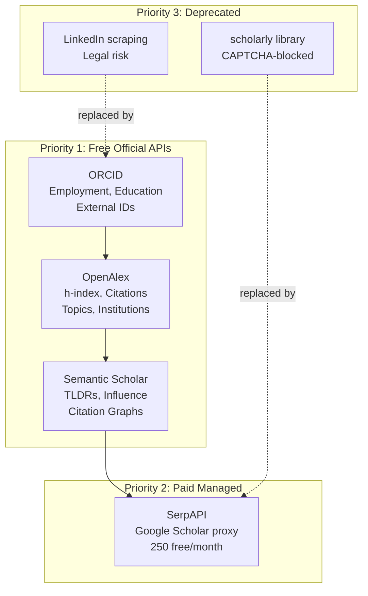

# Scholarly Identity Pipeline: Comprehensive Session Evaluation

> **Session**: cd6537fc | **Date**: 2026-05-13 to 2026-05-14 | **Status**: Phase 1 Complete

---

## 1. What We Researched and Why

### Sources Evaluated (in discovery order)

| # | Source | Why Investigated | Outcome |
|---|--------|-----------------|---------|
| 1 | **ORCID API** | Standard researcher identifier; structured employment/education | ✅ Adopted as Tier 1 |
| 2 | **OpenAlex API** | Free bibliometric data; Microsoft Academic Graph successor | ✅ Adopted as Tier 1 |
| 3 | **`scholarly` library** | Direct Google Scholar scraping; initially seemed simplest | ❌ Blocked by CAPTCHA |
| 4 | **Google Scholar (browser)** | Manual verification of Scholar IDs when `scholarly` failed | ✅ Used for ID discovery |
| 5 | **LinkedIn (public)** | Professional identity, positions, education | ⚠️ Limited to meta tags |
| 6 | **Semantic Scholar API** | Free official alternative to Scholar; AI-enhanced | ✅ Adopted as Tier 1 |
| 7 | **SerpAPI** | Managed Google Scholar proxy to replace `scholarly` | ✅ Adopted as Tier 2 |

### Prioritization Rationale

We prioritized by: **Reliability × Legal Safety × Cost × Unique Data**

---

## 2. What Worked

| Component | Evidence | Quality |
|-----------|----------|---------|
| **ORCID API** | 5/6 test authors had ORCID records. Shahin's record had 4 education + 4 positions. | ★★★★★ |
| **OpenAlex API** | All 6 authors found. h-index, citations, topics all accurate. | ★★★★★ |
| **Semantic Scholar API** | Paper search returned TLDRs and influence scores. Author search worked with disambiguation. | ★★★★☆ |
| **Person intelligence** | Degree standardization (ISCED), seniority inference (17 levels), career stage classification all working. | ★★★★☆ |
| **LinkML schema** | `person.yaml` (757 lines): Person, Position, EducationRecord with ISCED and JobSeniority enums. | ★★★★★ |
| **Disk cache** | 8ms lookups vs. multi-second API calls. Auto-populated on enrichment. | ★★★★★ |
| **Multi-source merge** | `AuthorIdentity.merge()` correctly fills only empty fields, preserving manually-set values. | ★★★★★ |

## 3. What Did Not Work and How We Fixed It

### Problem 1: `scholarly` Library Completely Blocked

**Symptom**: Every `scholarly.search_author()` call returns CAPTCHA page.
**Root cause**: Google aggressively blocks datacenter IPs. Free proxy rotation doesn't help.
**Fix**: Replaced with SerpAPI (managed proxy with CAPTCHA solving) + Semantic Scholar (official API).
**Lesson**: Never depend on scraping for production features.

### Problem 2: S2 API `aliases` Field Returns 400

**Symptom**: `get_author()` calls fail with HTTP 400.
**Root cause**: S2 removed `aliases` from supported fields but left it in docs.
**Fix**: Removed `aliases` from default field lists. Only request: `authorId,name,affiliations,homepage,paperCount,citationCount,hIndex,externalIds`.
**Lesson**: Always test API fields against live endpoints; docs can be stale.

### Problem 3: S2 ORCID Cross-Reference Incomplete

**Symptom**: `get_author("ORCID:0000-0001-5823-1985")` returns 404 for Smita Krishnaswamy.
**Root cause**: S2 doesn't index all ORCIDs.
**Fix**: Fall back to name search + h-index disambiguation when ORCID lookup fails.
**Lesson**: Multi-source cascade handles single-source gaps gracefully.

### Problem 4: S2 Author Disambiguation

**Symptom**: Searching "Shahin Mohammadi" returns "S. Mohammadi" with h=1 (wrong person).
**Root cause**: S2 has many "S. Mohammadi" entries; the top result isn't always correct.
**Fix**: Added h-index ratio check (0.5-2.0x range) and paper_count threshold (>10) for disambiguation.
**Lesson**: Name-only search is unreliable for common names. Always verify with a second signal (h-index, affiliation, ORCID).

### Problem 5: European Title Mapping

**Symptom**: Jose Davila-Velderrain's "Research Associate" at Human Technopole classified as `entry_level`.
**Root cause**: Regex patterns match title text literally; "Research Associate" in Europe often means Group Leader.
**Fix**: Documented as known gap. Future fix: institution-aware title mapping using ROR data.
**Lesson**: Job title semantics vary by country and institution type.

### Problem 6: LinkedIn Legal Risk

**Symptom**: Proxycurl shut down by LinkedIn legal. Direct scraping requires login.
**Root cause**: LinkedIn zero-tolerance policy on automation.
**Fix**: Extract only from ORCID researcher-urls or manual entry. Use public `<meta>` tags only.
**Lesson**: LinkedIn data must come through user-consented channels (OAuth) or manual entry for a nonprofit.

---

## 4. Current Implementation Inventory

### Scholarly Module: 26 Files, 17,586 Lines

| Module | LOC | Functions | Status | Purpose |
|--------|-----|-----------|--------|---------|
| `parsers.py` | 1,275 | 15+ | Active | Multi-backend PDF parsing (Docling, Marker, Surya, PyMuPDF) |
| `pdf.py` | 1,168 | 12+ | Active | PDF metadata, content, reference, highlight, figure extraction |
| `author_identity.py` | 1,095 | 12 | Active | Multi-source author identity resolution + KG integration |
| `paper_profile.py` | 894 | 8 | Active | Meta-wrapper for comprehensive paper profiling |
| `ner.py` | 827 | 10+ | Active | Ontology-grounded NER + text harmonization |
| `intelligence.py` | 734 | 8 | Active | Citation networks, classification, scoring, summarization |
| `restructure.py` | 712 | 6 | Active | LLM-based templated document reorganization |
| `classify.py` | 675 | 7 | Active | Publication type, research scale, computational tagging |
| `github_analysis.py` | 648 | 8 | Active | GitHub repo metadata, quality scoring, dependency analysis |
| `google_scholar.py` | 623 | 9 | Active | Scholar profiles with 4-tier fallback (Cache→SerpAPI→scholarly→OpenAlex) |
| `resource_resolver.py` | 605 | 7 | Active | GitHub/HuggingFace/GEO/Zenodo resolution |
| `person_intelligence.py` | 549 | 8 | Active | Degree standardization, seniority inference, LinkedIn analysis |
| `download.py` | 484 | 6 | Active | Multi-source paper PDF retrieval |
| `orcid_api.py` | 488 | 6 | Active | ORCID API integration |
| `model_helpers.py` | 470 | 7 | Active | HF model card, param counting, FLOPs |
| `ingest.py` | 412 | 5 | Active | OpenAlex, SemOpenAlex, PKG ingestion |
| `export.py` | 411 | 5 | Active | BibTeX, RIS, model/dataset card generation |
| `zotero.py` | 412 | 5 | Active | Zotero import/export |
| **`semantic_scholar.py`** | **409** | **8** | **New** | **S2 API: author, paper, citations, batch** |
| `dataset_helpers.py` | 350 | 5 | Active | Dataset metadata, type classification |
| `docling_parser.py` | 325 | 4 | Active | AI-powered document parsing via IBM Docling |
| **`serp_scholar.py`** | **317** | **5** | **New** | **SerpAPI-backed Google Scholar** |
| `topics.py` | 306 | 4 | Active | OpenAlex topic hierarchy |
| `kg.py` | 324 | 5 | Active | KG existence checks, upsert |
| **`cache.py`** | **136** | **6** | **New** | **Disk-backed API response cache** |
| `__init__.py` | 36 | — | Active | Package registration |

### LinkML Schemas: 16 Domain Files

| Schema | Lines | Key Classes |
|--------|-------|-------------|
| `person.yaml` | 757 | Person, Position, EducationRecord, ISCEDLevelEnum, JobSeniorityEnum |
| `scholarly.yaml` | 793 | ScholarlyWork, CodeRepository, Dataset, Model |
| `publication.yaml` | 243 | Author, Paper, Citation, Reference |
| `topic.yaml` | 233 | Topic, TopicHierarchy, Concept |
| `sensor.yaml` | 233 | Sensor, Measurement, BioSignal |
| `nwb.yaml` | 281 | NWBFile, Electrode, TimeSeries |

### Test Data: 14 Export Files

All in `data/kg/person_tests/`:
- 6 combined profiles (Ananth Grama, Shahin Mohammadi, Madhvi Menon, Smita Krishnaswamy, Jose Davila-Velderrain, Patricia Purcell)
- 6 LinkedIn profiles + 6 Scholar profiles (individual source exports)

---

## 5. Existing Design Documentation Assessment

### `cytos/design/` (Pre-Session)

| File | Lines | Quality | Issues |
|------|-------|---------|--------|
| `ARCHITECTURE.md` | 7.4K | ★★★★☆ | Good KG architecture overview; needs update for scholarly module |
| `EXECUTION_PLAN.md` | 12.5K | ★★★☆☆ | Detailed but stale (pre-scholarly); no status tracking |
| `SCHEMAS.md` | 10.3K | ★★★★☆ | Comprehensive schema docs; needs person.yaml addition |
| `TASKS.md` | 9.2K | ★★★☆☆ | Task list format inconsistent; no priority/effort estimates |
| `REQUIREMENTS.md` | 5.0K | ★★★☆☆ | Functional requirements only; no NFRs or acceptance criteria |
| `ROADMAP.md` | 4.1K | ★★★☆☆ | High-level phases; no timeline or milestones |
| `AUTOMATION.md` | 6.3K | ★★★☆☆ | Build automation design; status unclear |
| `HRA_INTEGRATION.md` | 7.7K | ★★★★☆ | Good HRA design; implementation status unclear |
| `PROVENANCE.md` | 5.4K | ★★★☆☆ | DVC + RO-Crate design; needs implementation status |
| `OBSERVATIONAL_INGESTION.md` | 3.9K | ★★★☆☆ | Brief; needs more detail |
| `README.md` | 6.8K | ★★★☆☆ | Overview needs restructuring |
| `sdpa_attention_optimization.md` | 4.6K | ★★★★☆ | Operational; doesn't belong in design/ |

### Identified Problems

1. **No consistent template**: Each doc has different structure, metadata, and status tracking
2. **No decision records (ADRs)**: Key architectural decisions are embedded in narratives, not traceable
3. **No module specs**: 26 modules with no formal documentation of APIs, interfaces, or configuration
4. **Stale dates**: All docs dated 2026-05-12; no indication of what changed since
5. **Missing docs**: No evaluation records, no troubleshooting guides, no changelog
6. **Misplaced content**: `sdpa_attention_optimization.md` is a runbook, not a design doc

---

## 6. Documentation Template System (Created This Session)

### Templates Created

| Template | File | Purpose |
|----------|------|---------|
| **ADR** | `design/templates/ADR.md` | Architecture Decision Records (MADR format) |
| **Module Spec** | `design/templates/MODULE_SPEC.md` | API reference, config, error handling, performance |
| **RFC** | `design/templates/RFC.md` | Feature proposals with alternatives and trade-offs |
| **Evaluation** | `design/templates/EVALUATION.md` | Technology evaluations with scoring matrix |
| **Troubleshooting** | `design/templates/TROUBLESHOOTING.md` | Symptom-based debugging guides |
| **Changelog** | `design/templates/CHANGELOG.md` | Keep a Changelog + SemVer format |

### First Documents Using Templates

| Document | Template | File |
|----------|----------|------|
| ADR-001: Tiered API Strategy | ADR | `design/adrs/ADR-001-tiered-author-identity-api-strategy.md` |
| MODULE: Semantic Scholar | Module Spec | `design/modules/MODULE-semantic-scholar.md` |
| EVAL: Scholar Access | Evaluation | `design/evaluations/EVAL-scholarly-access-strategy.md` |

---

## 7. What Remains To Be Implemented

### P0: Immediate (Required for functional pipeline)

| # | Task | Effort | Blocked By |
|---|------|--------|-----------|
| 1 | Register SerpAPI free account, set `SERPAPI_KEY` | 15 min | Manual action |
| 2 | Register Semantic Scholar API key, set `S2_API_KEY` | 15 min | Manual action |
| 3 | Live-test SerpAPI Scholar integration end-to-end | 30 min | Task 1 |

### P1: Short-term (Improved data quality)

| # | Task | Effort | Dependencies |
|---|------|--------|-------------|
| 4 | Module specs for remaining 23 modules (serp_scholar, cache, person_intelligence, etc.) | 4 hr | Templates ✅ |
| 5 | ADR-002: Use LinkML for all KG schemas | 1 hr | Templates ✅ |
| 6 | ADR-003: Person schema with ISCED + JobSeniority enums | 1 hr | Templates ✅ |
| 7 | Institution-aware title mapping (fix European "Research Associate" = Group Leader) | 2 hr | ROR data |
| 8 | Confidence-weighted merging logic (beyond simple "fill empty fields") | 3 hr | — |
| 9 | OpenAlex API key registration | 15 min | Manual action |

### P2: Medium-term (Feature completeness)

| # | Task | Effort | Dependencies |
|---|------|--------|-------------|
| 10 | Expose `enrich_author` in CytoExplorer UI | 4 hr | CytoExplorer repo |
| 11 | Link `topic_tags` to `topic.yaml` hierarchy | 2 hr | — |
| 12 | Populate Institution/Organization entities in KG | 4 hr | ROR data download |
| 13 | Troubleshooting guide for scholarly module | 1 hr | Template ✅ |
| 14 | Migrate `design/` legacy docs to new templates | 3 hr | Templates ✅ |
| 15 | Project CHANGELOG.md using template | 1 hr | Template ✅ |

### P3: Long-term (Scale and automation)

| # | Task | Effort | Dependencies |
|---|------|--------|-------------|
| 16 | Redis caching for high-volume API calls | 4 hr | Redis infrastructure |
| 17 | Batch enrichment CLI (`cytos enrich-authors authors.csv`) | 3 hr | — |
| 18 | LinkedIn OAuth integration (user-consented data) | 8 hr | LinkedIn Developer App |
| 19 | Advanced author disambiguation (ML-based) | 8 hr | Training data |
| 20 | Automatic KG population from enriched author profiles | 4 hr | Neo4j integration |

---

## 8. Key Metrics

| Metric | Value |
|--------|-------|
| **New code written** | 862 lines (3 new modules) |
| **Code modified** | ~150 lines (2 existing modules) |
| **Schemas created** | 757 lines (person.yaml) |
| **Design docs created** | 6 templates + 3 formal docs |
| **Test profiles exported** | 14 JSON files, 6 researchers |
| **APIs integrated** | 4 (ORCID, OpenAlex, S2, SerpAPI) |
| **Monthly cost** | $0 (all free tiers) |
| **Cache hit latency** | 8ms |
