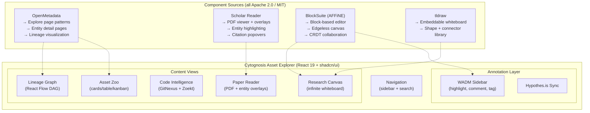

# UI Platform Evaluation: Cytognosis Asset Explorer

> Evaluating every open-source UI that could serve as the substrate for a unified dataset/model/code/paper browser with annotation, highlighting, commenting, and optionally an infinite canvas.

---

## Evaluation Criteria

| Criterion | Weight | What we need |
| --- | --- | --- |
| **Asset browsing** | Critical | Browse/search datasets, models, code, papers in one interface |
| **Paper reading** | Critical | In-browser PDF reading with text selection, citation popups |
| **Annotation/WADM** | Critical | Highlighting, commenting, tagging (W3C WADM compatible) |
| **Canvas/whiteboard** | Important | Infinite canvas for brainstorming, linking assets visually |
| **Self-hosted** | Critical | Full data sovereignty, no cloud dependency |
| **Open license** | Critical | Apache 2.0 / MIT — no AGPL, no proprietary backend |
| **React/Next.js** | Important | Integrates with our existing React 19 + Vite + shadcn/ui stack |
| **Extensibility** | Important | Can we add custom entity types (cytos:Dataset, cytos:MLModel)? |

---

## Candidate Matrix

| # | Tool | License | Assets | Papers | Annotations | Canvas | Repo |
| --- | --- | --- | --- | --- | --- | --- | --- |
| 1 | **AFFiNE** | MIT (frontend) / BSL (backend) | ⬜ | ⬜ | ✅ block-based | ✅ Edgeless Mode | `third_party/affine` |
| 2 | **Scholar Reader** | Apache 2.0 | ⬜ | ✅ PDF reader | ✅ highlights + citations | ⬜ | `third_party/semantic-reader` |
| 3 | **OpenMetadata** | Apache 2.0 | ✅ 120+ connectors | ⬜ | ✅ conversations | ⬜ | `third_party/openmetadata` |
| 4 | **Renku** | Apache 2.0 | ✅ data+code+envs | ⬜ | ⬜ | ⬜ | `third_party/renku` |
| 5 | **Argilla** | Apache 2.0 | ✅ NLP datasets | ⬜ | ✅ text annotation | ⬜ | `third_party/argilla` |
| 6 | **Label Studio** | Apache 2.0 | ✅ multi-modal | ⬜ | ✅ rich annotation | ⬜ | — (not cloned) |
| 7 | **FiftyOne** | Apache 2.0 | ✅ CV datasets | ⬜ | ✅ data curation | ⬜ | — (not cloned) |
| 8 | **Marimo** | Apache 2.0 | ⬜ | ⬜ | ⬜ | ⬜ | — (not cloned) |
| 9 | **tldraw** | Apache 2.0 | ⬜ | ⬜ | ⬜ | ✅ library | Already in L15 catalog |
| 10 | **Excalidraw** | MIT | ⬜ | ⬜ | ⬜ | ✅ library | Already in L15 catalog |

---

## 1. AFFiNE — The Closest to "One Platform"

**Cloned to**: `infrastructure/third_party/affine`

### What it is
AFFiNE is a Notion+Miro replacement that hyper-merges docs, databases, and an infinite canvas into one workspace. Built on **BlockSuite**, an open editor framework.

### Architecture

```
AFFiNE
├── blocksuite/              ← MIT, the editor engine
│   ├── framework/           ← Core CRDT + block system (Yjs-based)
│   ├── affine/              ← AFFiNE-specific blocks + themes
│   └── playground/          ← Interactive demo
├── packages/
│   ├── frontend/            ← MIT, the web application
│   │   ├── core/            ← Main app shell (React + Lit)
│   │   ├── component/       ← UI component library
│   │   └── web/             ← Web entry point
│   ├── backend/             ← BSL (Business Source License) ⚠️
│   │   └── server/          ← GraphQL API, auth, sync
│   └── common/
│       └── native/          ← BSL (Rust binaries) ⚠️
```

### License analysis

| Component | License | Reusable? |
| --- | --- | --- |
| BlockSuite (editor engine) | **MIT** | ✅ Fully reusable |
| Frontend packages | **MIT** | ✅ Fully reusable |
| Backend server | **BSL** (Business Source License) | ⚠️ Converts to Apache 2.0 after 3 years. Cannot compete with AFFiNE Cloud |
| Native Rust modules | **BSL** | ⚠️ Same as above |

### What's reusable for Cytognosis

| Component | What it gives us | Integration path |
| --- | --- | --- |
| **BlockSuite editor** | Block-based rich text with CRDT collaboration, inline code blocks, tables, images | Embed as the annotation/commenting layer in the Asset Explorer |
| **Edgeless Mode** (infinite canvas) | Canvas with shapes, connectors, embedded docs, freeform drawing | Use for brainstorming whiteboard with asset cards |
| **Database views** | Table, Kanban, list views of structured data | Map to `scholarly.yaml` entity views |
| **Surface blocks** | Embeddable blocks (code, image, table) on the canvas | Drag datasets, models, papers onto a research board |

### Verdict
**BlockSuite (MIT) is the highest-value extraction target.** It gives you the block-based editor + infinite canvas without the BSL-encumbered backend. Write your own backend (FastAPI + PostgreSQL, which you already have) and use BlockSuite as the rendering engine.

---

## 2. Scholar Reader — The Paper Reading Interface

**Cloned to**: `infrastructure/third_party/semantic-reader`

### What it is
AI2's augmented PDF reader built on pdf.js with React. Extracts entities (terms, citations, symbols) from papers and renders interactive overlays.

### Architecture

```
scholar-reader/
├── ui/                      ← React application (Apache 2.0)
│   ├── src/
│   │   ├── components/      ← PDF viewer, entity overlays, sidebars
│   │   ├── api/             ← API client for entity data
│   │   └── types/           ← TypeScript type definitions
│   └── pdf.js/              ← Bundled PDF.js fork
├── api/                     ← Python Flask API (entity serving)
├── data-processing/         ← NLP pipeline for entity extraction
│   ├── entities/            ← Term, citation, symbol extractors
│   └── bounding_boxes/      ← PDF coordinate extraction
```

### Key features

| Feature | Description | WADM alignment |
| --- | --- | --- |
| **Entity highlighting** | Overlays colored highlights on detected terms, citations, symbols | Maps to `AnnotationTarget` + `TextPositionSelector` |
| **Citation popovers** | Inline citation cards with metadata, abstracts, influence scores | Maps to `AnnotationBody` with `linking` motivation |
| **Definition tooltips** | Term definitions appear on hover | Maps to `AnnotationBody` with `describing` motivation |
| **Symbol cross-references** | Mathematical symbol usage tracking across paper | Maps to `Selector.type: TextQuoteSelector` |
| **Sidebar panels** | Filterable lists of all entities in the paper | Could be extended to show WADM annotations |

### What's reusable for Cytognosis

This is the **paper reading component** of the Asset Explorer. The entity extraction pipeline (`data-processing/`) directly aligns with your existing GROBID + scispacy stack from the scholarly pipeline.

Integration path:
1. Replace the Flask API with calls to your Neo4j Catalog Graph (paper metadata, citations)
2. Add WADM annotation support via the Hypothes.is sidebar protocol
3. Extend entity types to include your Ontology Graph terms (MONDO, CL, GO, etc.)

---

## 3. OpenMetadata — The Asset Catalog Engine

**Cloned to**: `infrastructure/third_party/openmetadata`

### What it is
The most comprehensive open-source metadata catalog. Built for enterprise data governance but the architecture is highly relevant.

### Architecture

```
OpenMetadata
├── openmetadata-ui/         ← React + Ant Design (Apache 2.0)
│   └── src/main/resources/ui/
│       ├── src/
│       │   ├── components/  ← Entity pages, lineage views, search
│       │   ├── pages/       ← Explore, Data Quality, Glossary, Tags
│       │   └── rest/        ← API client
├── openmetadata-service/    ← Java (Dropwizard) backend
├── openmetadata-spec/       ← JSON Schema definitions for all entities
└── ingestion/               ← Python connectors (120+)
```

### Key features

| Feature | Description | Cytos alignment |
| --- | --- | --- |
| **Unified entity model** | Table, Topic, Dashboard, Pipeline, MLModel, Container, StoredProcedure, SearchIndex, DataProduct | Maps to your `scholarly.yaml` entity types |
| **Lineage visualization** | Interactive DAG showing data flow between assets | Maps to LaminDB Run→Transform→Artifact lineage |
| **Search + discovery** | Elasticsearch-backed full-text + faceted search | Would be replaced by Zoekt + Neo4j |
| **Conversations/threads** | Per-asset threaded discussions | Maps to WADM `AnnotationCollection` with `commenting` motivation |
| **Glossary + tags** | Controlled vocabulary management | Maps to your Ontology Graph terms |
| **Data quality** | Test definitions, results tracking | Could validate against LinkML schemas |
| **MCP server** | Yes, they have an MCP server for AI agents | Direct alignment with your MCP strategy |

### What's reusable for Cytognosis

| Pattern | Extract from OpenMetadata | Build for Cytos |
| --- | --- | --- |
| **Entity detail pages** | Layout pattern: header + tabs (Schema/Activity/Lineage/Custom) | Entity page for `cytos:Dataset`, `cytos:MLModel`, `cytos:SoftwareSourceCode` |
| **Explore page** | Left sidebar filters + card grid + table toggle | Asset zoo browse experience |
| **Lineage view** | React Flow-based DAG renderer | DVC pipeline + LaminDB lineage visualization |
| **JSON Schema entity specs** | `openmetadata-spec/` defines every entity type | Translate patterns to LinkML-generated JSON Schema |

### Verdict
**Best-in-class asset catalog UI patterns.** The React components are Apache 2.0 and provide the exact browsing/search/lineage experience needed. The Java backend is heavyweight (Dropwizard + Elasticsearch + Airflow) — you'd replace it with FastAPI + Neo4j + Zoekt.

---

## 4. Renku — Reproducible Science Platform

**Cloned to**: `infrastructure/third_party/renku`

### What it is
Swiss Data Science Center's platform for reproducible data science. Bundles data connectors, code repos, compute sessions, and a knowledge graph into one Kubernetes deployment.

### Architecture (Renku 2.0)

```
Renku 2.0
├── renku-data-services/     ← Python backend (Apache 2.0)
│   ├── projects/            ← Project management
│   ├── sessions/            ← Compute session lifecycle
│   └── connected_services/  ← S3, WebDAV, GitHub, GitLab
├── renku-ui/                ← React frontend (Apache 2.0)
├── renku-notebooks/         ← JupyterHub integration
├── amalthea/                ← Kubernetes operator for sessions
└── helm-chart/              ← Deployment manifests
```

### Key features

| Feature | Cytos alignment |
| --- | --- |
| Data connectors (S3, WebDAV, SFTP, GitHub) | Maps to your GCS data lake + GitHub repos |
| Project = data + code + environment | Maps to your Catalog Graph (Dataset + SoftwareSourceCode + Workflow) |
| Knowledge graph for provenance | Maps to LaminDB lineage + Cytos KG |
| Compute sessions (VS Code, Jupyter, RStudio) | Useful for interactive analysis |

### Verdict
**Most architecturally aligned** with what you're building, but heavyweight (requires Kubernetes + Helm + multiple services). Better as a reference architecture than a dependency. The `renku-data-services` Python backend patterns are directly useful for your FastAPI services.

---

## 5. Argilla — NLP/LLM Data Curation

**Cloned to**: `infrastructure/third_party/argilla`

### What it is
Data curation platform for NLP/LLM. Focused on text annotation, RLHF feedback, and instruction dataset management.

> [!WARNING]
> **Maintenance mode.** The original authors have moved on. The README states: "The codebase is mature and stable... While we won't be adding new features going forward." This is a red flag for long-term dependency.

### Key features

| Feature | Cytos alignment |
| --- | --- |
| Text span annotation with confidence | Maps to WADM `TextQuoteSelector` + `assessing` motivation |
| Multi-annotator agreement tracking | Maps to WADM `AnnotationCollection` with `reviewing` motivation |
| HuggingFace integration | Maps to your `scholarly.yaml` `MLModel.huggingface_id` |
| Search + filter datasets | Maps to Neo4j + Zoekt search |

### Verdict
**Useful patterns, risky dependency.** Extract the text annotation UI patterns but don't depend on the project. Your WADM `annotation.yaml` already covers the schema side more comprehensively.

---

## 6–10: Quick Assessments

| # | Tool | Verdict | Key takeaway |
| --- | --- | --- | --- |
| 6 | **Label Studio** (Apache 2.0) | ✅ Deploy as-is for multi-modal annotation | Most flexible annotation tool. Embed via iframe or API. Has review workflows, ML-assisted labeling |
| 7 | **FiftyOne** (Apache 2.0) | 🟡 Reference only | Best for CV dataset curation. Not relevant for paper/model/code browsing |
| 8 | **Marimo** (Apache 2.0) | 🟡 Complementary | Reactive Python notebooks. Could serve as the "compute" pane in the Asset Explorer. Not a catalog |
| 9 | **tldraw** (Apache 2.0) | ✅ Embed as whiteboard | Best embeddable canvas library. 90KB, pure React. Use as the brainstorming layer |
| 10 | **Excalidraw** (MIT) | 🟡 Alternative to tldraw | More polished standalone app, but heavier to embed as a component |

---

## Synthesis: The Optimal Architecture

No single tool covers everything. The Cytognosis Asset Explorer is a **composite** built from the best pieces:



### Component mapping

| Explorer component | Primary source | Extract what | License |
| --- | --- | --- | --- |
| **Asset Zoo** (browse/search/filter) | OpenMetadata | Explore page layout, entity cards, filter sidebar | Apache 2.0 |
| **Paper Reader** | Scholar Reader | PDF.js viewer, entity overlay components, citation popovers | Apache 2.0 |
| **Annotation sidebar** | BlockSuite (AFFiNE) | Block-based comment editor, threaded discussions | MIT |
| **WADM persistence** | Your `annotation.yaml` | LinkML schema → FastAPI CRUD → Neo4j | Apache 2.0 |
| **Lineage graph** | OpenMetadata / React Flow | DAG renderer for DVC pipeline + LaminDB runs | Apache 2.0 / MIT |
| **Code browser** | GitNexus + Zoekt | MCP tools (already built) | PolyForm NC / Apache 2.0 |
| **Research canvas** | tldraw OR BlockSuite Edgeless | Infinite canvas with connectable asset cards | Apache 2.0 / MIT |
| **Search** | Zoekt (text) + Neo4j (graph) | Already planned in infrastructure | Apache 2.0 |

### Canvas evaluation: tldraw vs BlockSuite Edgeless vs Excalidraw

| Dimension | tldraw | BlockSuite Edgeless | Excalidraw |
| --- | --- | --- | --- |
| **License** | Apache 2.0 | MIT | MIT |
| **Embed as React component** | ✅ `<Tldraw />` | ✅ (Lit + Yjs) | ✅ `<Excalidraw />` |
| **Custom shapes** | ✅ Shape API | ✅ Custom blocks | 🟡 Limited |
| **Connectors** | ✅ Arrow binding | ✅ Connection system | ✅ Basic arrows |
| **Collaboration** | ✅ Yjs CRDT | ✅ Yjs CRDT | ✅ Yjs CRDT |
| **Embed rich content** | 🟡 Custom shapes only | ✅ Any BlockSuite block (code, table, image) | ❌ Images only |
| **Size** | ~90KB | ~500KB+ (full suite) | ~200KB |
| **Can embed code/model/dataset cards** | Via custom shapes | Natively (blocks are content) | No |

**Recommendation**: **BlockSuite Edgeless** wins for the research canvas because it natively supports embedding rich content blocks (code, tables, images, arbitrary React components) on the canvas. tldraw is the fallback if BlockSuite proves too heavy to integrate.

---

## Cloned repos summary

All cloned under `infrastructure/third_party/` (already in `.gitignore`):

| Directory | What | License | Primary extraction target |
| --- | --- | --- | --- |
| `affine/` (10,006 files) | AFFiNE full workspace | MIT frontend / BSL backend | **BlockSuite editor + Edgeless canvas** |
| `semantic-reader/` | AI2 Scholar Reader | Apache 2.0 | **PDF viewer + entity overlay components** |
| `openmetadata/` | OpenMetadata catalog | Apache 2.0 | **Explore page + entity detail + lineage UI patterns** |
| `argilla/` | Argilla annotation | Apache 2.0 | **Text annotation UI patterns** (reference only) |
| `renku/` | Renku 2.0 platform | Apache 2.0 | **Backend service patterns** (reference architecture) |
| `zoekt/` | Zoekt code search | Apache 2.0 | **Deploy as-is** (search backend) |
| `gitnexus/` | GitNexus code KG | PolyForm NC | **Deploy as-is** (code intelligence MCP) |

---

## Recommended next steps

1. **Prototype the Paper Reader**: Take Scholar Reader's `ui/` components, swap the Flask API for Neo4j Catalog Graph queries, add WADM annotation sidebar
2. **Prototype the Asset Zoo**: Extract OpenMetadata's Explore page patterns, populate with `scholarly.yaml` entities from Neo4j
3. **Prototype the Canvas**: Evaluate BlockSuite Edgeless with custom asset card blocks vs tldraw with custom shapes
4. **Wire the backend**: FastAPI + Neo4j (Cytos KG) + LaminDB (artifact registry) + Zoekt (search)

### Decision needed
**Which prototype to start with?**
- A) Paper Reader (highest immediate research value)
- B) Asset Zoo (broadest utility for the model/dataset/code zoo)
- C) Research Canvas (most visually impressive but least data-connected)
