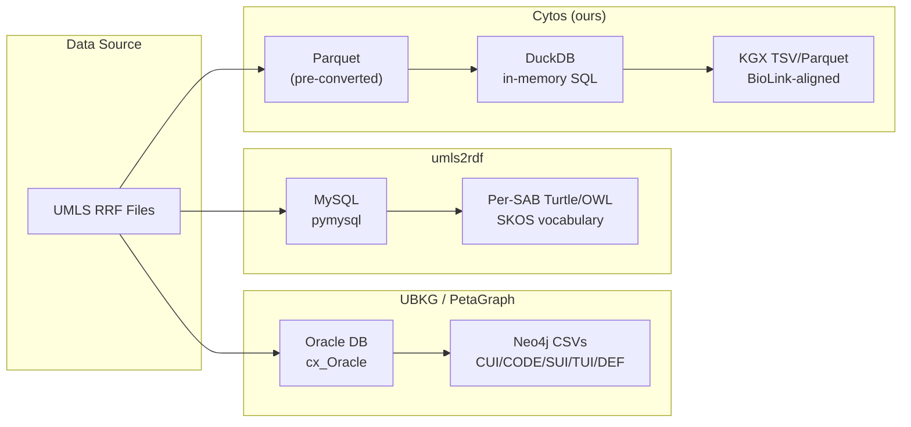

# UMLS/SNOMED Codebase Comparison: PetaGraph vs UBKG vs umls2rdf vs Cytos

> **Date**: 2026-05-12
> **Repos**: [third_party/Petagraph](file:///home/mohammadi/repos/cytognosis/cytos/third_party/Petagraph), [third_party/ubkg-etl](file:///home/mohammadi/repos/cytognosis/cytos/third_party/ubkg-etl), [third_party/umls2rdf](file:///home/mohammadi/repos/cytognosis/cytos/third_party/umls2rdf)

## Architecture Comparison

## UMLS Tables Used

| Table | Purpose | UBKG | PetaGraph | umls2rdf | **Cytos** |
|-------|---------|:----:|:---------:|:--------:|:---------:|
| **MRCONSO** | Concepts/atoms | ✅ | ✅ | ✅ | ✅ |
| **MRREL** | Relationships | ✅ | ✅ | ✅ | ✅ |
| **MRSTY** | Semantic types | ✅ | ✅ | ✅ | ✅ |
| **MRDEF** | Definitions | ✅ | ✅ | ✅ | ✅ |
| **MRSAT** | Attributes (NDC, ATC) | ✅ | ✅ | ✅ | ❌ |
| **MRRANK** | Term ranking | ❌ | ❌ | ✅ | ❌ |
| **MRSAB** | Source metadata | ❌ | ❌ | ✅ | ❌ |
| **SRDEF** | Semantic type defs | ✅ | ✅ | ❌ | ❌ |
| **SRSTRE1** | Semantic type hierarchy | ✅ | ✅ | ❌ | ❌ |
| **MRDOC** | Property documentation | ❌ | ❌ | ✅ | ❌ |

## Graph Model Comparison

| Aspect | UBKG/PetaGraph | umls2rdf | **Cytos** |
|--------|----------------|----------|-----------|
| **Node types** | CUI, CODE, SUI, TUI, DEF (5 types) | owl:Class per vocab code | Single flat KGX node |
| **Primary key** | CUI → CODE → SUI hierarchy | SAB:CODE (per vocab) | `UMLS:{CUI}` |
| **Preferred label** | ISPREF=Y, TS=P, STT=PF | MRRANK + fallback chain | TS=P, STT=PF, ISPREF=Y |
| **Relationships** | CUI↔CUI with RELA/REL | rdfs:subClassOf + object props | biolink predicates |
| **Inverse edges** | ✅ Auto-generated via RO | ❌ | ❌ |
| **Semantic types** | TUI nodes + CUI→TUI edges | umls:hasSTY property | BioLink category mapping |
| **Mappings** | CUI↔CODE edges | owl:Class per vocab | SSSOM + skos:exactMatch |
| **Output format** | Neo4j CSV | Turtle/OWL | KGX TSV, Parquet, Neo4j CSV |

## Key Findings per Codebase

### UBKG/PetaGraph
- [UMLS-Graph-Extracts.py](file:///home/mohammadi/repos/cytognosis/cytos/third_party/ubkg-etl/source_framework/UMLS-Graph-Extracts.py): Core UMLS extraction from Oracle
- [OWLNETS-UMLS-GRAPH-12.py](file:///home/mohammadi/repos/cytognosis/cytos/third_party/ubkg-etl/generation_framework/owlnets_umls_graph/OWLNETS-UMLS-GRAPH-12.py): Ontology→UMLS graph integration (1756 lines)

> [!IMPORTANT]
> UBKG's **5-node-type model** (CUI → CODE → SUI, CUI → TUI, CUI → DEF) is architecturally more expressive than our flat KGX approach. Multiple vocabulary codes map to a single CUI, and SUIs (string unique identifiers) provide term-level granularity.

Key patterns we lack:
1. **CUI preference algorithm** (lines 882-967): 4-tier: UMLS xref CUI > direct CUI > non-UMLS xref CUI > new CUI
2. **MRREL filtering** (line 93-98): `CUI1 <> CUI2 AND REL <> 'SIB'` and `NVL(RELA, REL)` for relationship specificity
3. **SRDEF + SRSTRE1** (lines 47-59): Semantic type definitions with full hierarchy (TUI→TUI `isa` edges)
4. **NDC enrichment** (lines 189-202): Drug NDC codes extracted from MRSAT and linked via RXNORM CUIs

### umls2rdf

- [umls2rdf.py](file:///home/mohammadi/repos/cytognosis/cytos/third_party/umls2rdf/umls2rdf.py): Per-vocabulary SKOS/OWL generation (897 lines)

> [!TIP]
> umls2rdf's per-vocabulary OWL output complements our unified KGX approach. It could generate individual `.ttl` files for each SAB, providing standard ontology files for SNOMED, MeSH, ICD-10, etc.

Key patterns:
1. **MRRANK-based term ranking** (lines 320-332): Most sophisticated preferred label selection using official UMLS ranking
2. **Per-SAB processing** (lines 866-895): Each source vocabulary becomes a self-contained OWL file
3. **MRDOC property metadata** (lines 853-864): Relationship property documentation (expanded_form, inverse definitions)
4. **MeSH tree reconstruction** (lines 201-217): Custom join MRREL+MRCONSO for descriptor hierarchy
5. **Semantic types as properties** (lines 476-489): umls:hasSTY, umls:hasTUI embedded per class

> [!WARNING]
> umls2rdf requires MySQL. Not directly usable with our Parquet pipeline. Value is in the *logic*, not the infrastructure.

## Adoptable Components for Cytos

### Priority 1: High Impact, Low Effort

| Component | Source | What to adopt | Impact |
|-----------|--------|---------------|--------|
| **MRREL specificity** | UBKG L93-98 | Use `COALESCE(RELA, REL)` for finer relationship types | Better edge semantics |
| **SIB exclusion** | UBKG L95 | Filter `REL <> 'SIB'` from MRREL | Cleaner graph (removes millions of noise edges) |
| **Self-ref exclusion** | UBKG L1121 | Ensure CUI1 ≠ CUI2 in MRREL edges | Already done ✅ |
| **Inverse generation** | UBKG L614 | Auto-generate `inverse_{rel}` edges | Complete bidirectional traversal |

### Priority 2: Medium Impact, Medium Effort

| Component | Source | What to adopt | Impact |
|-----------|--------|---------------|--------|
| **SRDEF parsing** | UBKG L47-52 | Parse SRDEF for semantic type definitions and STN hierarchy | Rich semantic overlay |
| **SRSTRE1 hierarchy** | UBKG L56-59 | Build TUI→TUI `isa` edges for semantic type tree | Hierarchical semantic grouping |
| **MRSAT attributes** | UBKG L189-202 | Extract NDC, ATC drug codes from MRSAT | Drug/chemical enrichment |
| **MRSAB metadata** | umls2rdf L86-90 | Extract source vocab versions, dates, languages | Better provenance |

### Priority 3: Architectural Improvements

| Component | Source | What to adopt | Impact |
|-----------|--------|---------------|--------|
| **MRRANK term ranking** | umls2rdf L322-326 | Use official UMLS rank for preferred term selection | More accurate preferred labels |
| **Per-SAB OWL export** | umls2rdf L866-895 | Generate individual OWL files per vocabulary | Standard ontology distribution |
| **MRDOC property docs** | umls2rdf L853-864 | Parse relationship property documentation | Self-documenting edges |
| **Multi-node-type model** | UBKG design | Separate CUI/CODE/SUI as distinct KGX node categories | Richer graph topology |

## What NOT to Adopt

| Component | Reason |
|-----------|--------|
| Oracle/MySQL dependency | We use Parquet+DuckDB, which is faster and dependency-free |
| Pandas-heavy processing | We use Polars/DuckDB for better memory efficiency at 5.8M+ nodes |
| Base64 CUI encoding | UBKG legacy pattern, unnecessary with proper namespacing |
| OWLNETS format | PheKnowLator-specific intermediate format, we use KGX directly |

## umls2rdf Evaluation

| Criterion | Assessment |
|-----------|------------|
| **Usefulness** | Logic is valuable, infra is not (MySQL dependency) |
| **Integration path** | Port the MRRANK term ranking and MRDOC parsing logic to DuckDB SQL |
| **Per-SAB OWL** | Worth adding as an optional export format alongside KGX/Neo4j |
| **Maintenance** | Last commit 2024, Python 3 compatible, ~900 lines — manageable to adapt |
| **License** | BSD 2-Clause — compatible with our use |

## Recommended Action Plan

### Phase 1: Quick wins (next session)
1. Add `REL <> 'SIB'` filter to MRREL query
2. Use `COALESCE(RELA, REL)` for edge relation specificity
3. Generate inverse edges automatically

### Phase 2: Semantic enrichment
4. Parse SRDEF from UMLS for semantic type definitions
5. Build SRSTRE1 semantic type hierarchy (TUI→TUI edges)
6. Extract MRSAT NDC/ATC drug attributes

### Phase 3: Quality and distribution
7. Port MRRANK logic for proper preferred term ranking
8. Add MRSAB source metadata to provenance
9. Optional per-SAB OWL export using adapted umls2rdf logic
