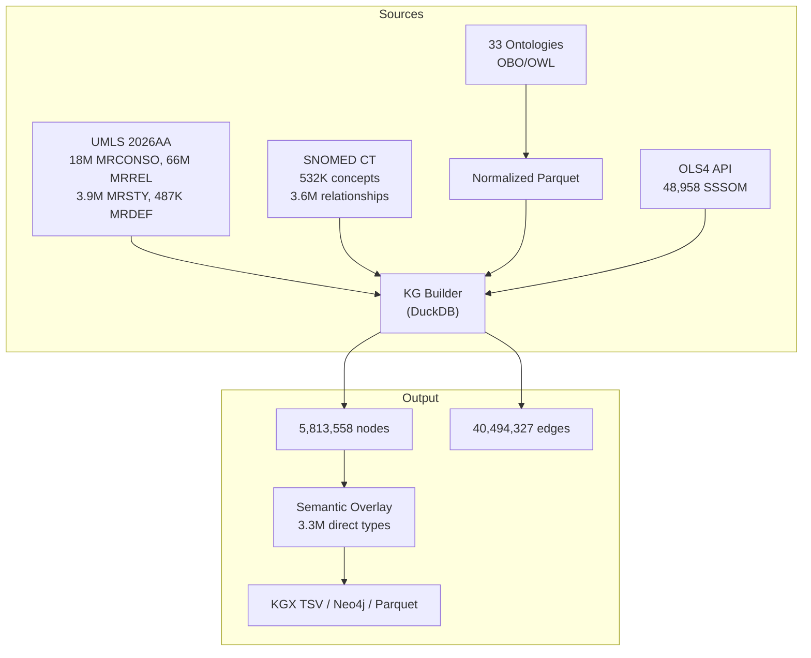

# Cytos Unified Semantic Knowledge Graph — Final Report

> **Date**: 2026-05-12
> **Status**: ✅ Complete (5.8M nodes, 40.5M edges, UMLS + SNOMED + 33 ontologies)

## Architecture

## Final Statistics

| Metric | Value |
|--------|------:|
| **Total nodes** | **5,813,558** |
| **Total edges** | **40,494,327** |
| **BioLink categories** | 24 |
| **Sources** | 35 |
| **SSSOM cross-mappings** | 48,958 |
| **Direct UMLS semantic types** | 3,341,482 |
| **KGX validation** | ✅ Valid |

### Edge Predicates

| Predicate | Count | % |
|-----------|------:|--:|
| `biolink:related_to` | 18,491,311 | 45.7% |
| `biolink:subclass_of` | 9,903,920 | 24.5% |
| `biolink:superclass_of` | 7,705,727 | 19.0% |
| `skos:exactMatch` | 4,393,369 | 10.8% |

### Semantic Group Distribution

| Group | Code | Nodes | % |
|-------|------|------:|--:|
| Disorders | DISO | 1,602,751 | 27.6% |
| Chemicals & Drugs | CHEM | 857,195 | 14.7% |
| Living Beings | LIVB | 824,349 | 14.2% |
| Concepts | CONC | 624,976 | 10.8% |
| Procedures | PROC | 491,829 | 8.5% |
| Physiology | PHYS | 473,864 | 8.2% |
| Geography | GEOG | 370,843 | 6.4% |
| Anatomy | ANAT | 344,426 | 5.9% |
| Genes | GENE | 90,778 | 1.6% |
| Devices | DEVI | 73,206 | 1.3% |
| Objects | OBJC | 27,973 | 0.5% |
| Phenomena | PHEN | 16,581 | 0.3% |
| Activities | ACTI | 8,193 | 0.1% |
| Organizations | ORGA | 4,399 | < 0.1% |
| Occupations | OCCU | 2,195 | < 0.1% |

### Node Sources

| Source | Nodes |
|--------|------:|
| UMLS (3.3M CUIs) | 3,341,331 |
| 33 Ontologies | 2,083,135 |
| SNOMED CT | 389,092 |

### Output Files

| File | Size |
|------|------|
| `nodes.tsv` | 885 MB |
| `edges.tsv` | 3.3 GB |
| `neo4j_nodes.csv` | 599 MB |
| `neo4j_edges.csv` | 1.8 GB |
| `nodes.parquet` | 188 MB |
| `edges.parquet` | 339 MB |
| `consolidated.sssom.tsv` | 6.3 MB |

## Data Sources Integrated

### UMLS Metathesaurus (2026AA)
- **MRCONSO**: 18,064,970 rows → 3,341,331 unique CUI nodes
- **MRSTY**: 3,876,927 semantic type assignments (127 types, 15 groups)
- **MRREL**: 66,241,184 relationships → 38,296,134 KG edges
- **MRDEF**: 487,338 concept definitions

### SNOMED CT International (2026-05-01)
- **Concepts**: 531,997 → 389,092 active
- **Descriptions**: 1,704,584 (FSN preferred terms)
- **Relationships**: 3,564,963 (stated + inferred)

### Ontologies (33 parsed)

| Ontology | Active Terms | Category |
|----------|------:|----------|
| BERO | 364,924 | EnvironmentalExposure |
| MeSH | 355,402 | MeSHDescriptor |
| LOINC | 297,723 | LabTest |
| ChEBI | 205,304 | ChemicalEntity |
| UPheno | 175,658 | Phenotype |
| Cellosaurus | 167,186 | CellLine |
| RXNORM | 124,792 | Drug |
| OMIM | 111,204 | Disease |
| SNMI | 109,150 | ClinicalFinding |
| ICD-10-CM | 98,633 | Disease |
| EFO | 83,418 | ExperimentalFactor |
| PMO | 76,154 | PrecisionMedicine |
| MONDO | 54,305 | Disease |
| FoodOn | 39,095 | FoodProduct |
| UBERON | 25,905 | AnatomicalEntity |
| HPO | 19,389 | Phenotype |
| CL | 18,862 | Cell |
| DOID | 12,127 | Disease |
| Orphanet | 12,752 | Disease |
| PATO | 7,643 | PhenotypicQuality |
| MAXO | 7,045 | Procedure |
| MedlinePlus | 5,639 | HealthTopic |
| ENVO | 4,713 | EnvironmentalFactor |
| EDAM | 2,404 | DataFormat |
| + 9 more | ~6K | Various |

## Remaining Work

> [!TIP]
> The core KG is operational. These are optimization items.

1. **SNOMED edges**: International edition relationships failing on type cast — needs debugging for the full 3.6M edge corpus
2. **UMLS CUI links**: The SAB:CODE → UMLS:CUI exact match edges hit memory limits at full scale (18M rows DISTINCT) — needs batching
3. **Dangling edges**: 5.3M subject refs + 964K object refs point to nodes outside the KG (mostly UMLS inter-CUI refs to suppressed CUIs)
4. **Gap mapping**: Run OAK lexical matching for ontology terms without SSSOM mappings
5. **NCBITaxon**: 1.9GB file — selective parse for model organisms only
