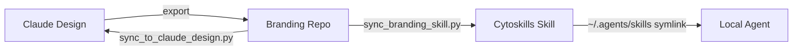

# Claude Design Bidirectional Sync Protocol

> **Status**: Active
> **Date**: 2026-07-10
> **Author**: @shahin
> **Audience**: designers, stakeholders
> **Tags**: `design`
> **Variants**: Technical (this doc) - Readable (Obsidian twin optional, same filename) - Agent (n/a)

## Overview

The Cytognosis Design System has three canonical locations that must stay synchronized:

1. **Claude Design** project (`db29365a-e44f-4ca8-a947-3b669bdb7264`)
2. **Branding repo** (`cytognosis/branding`)
3. **Cytognosis-branding skill** (`cytoskills/skills/cytognosis/cytognosis-branding`)

Each location serves a distinct role. Claude Design is the interactive authoring environment where brand decisions are made in conversation. The branding repo is the version-controlled source of truth. The cytoskills skill is the operational delivery mechanism that agents consume at runtime.

## Sync Flow



### Direction Details

| Direction | Script | What Moves |
|-----------|--------|------------|
| Claude Design -> Branding Repo | `sync_from_claude_design.py` | Guideline markdown, design tokens, profile CSS, accessibility rules |
| Branding Repo -> Cytoskills Skill | `sync_branding_skill.py` | 12 numbered guidelines, accessibility, profiles, CSS-extracted profile docs |
| Branding Repo -> Claude Design | `sync_to_claude_design.py` | Updated guidelines after repo-side edits or PR merges |
| Cytoskills Skill -> Local Agent | Symlink or `--local` flag | Complete skill references for local agent consumption |

## When to Sync

**After any Claude Design session:**
Export changed files, run `sync_from`, then run `sync_branding_skill.py`.

**After any branding repo PR merge:**
Run `sync_to_claude_design.py` to push the merged changes back into Claude Design.

**Weekly (drift detection):**
Run `claude_design_diff.py` to detect silent drift between the three locations. The CI workflow `claude-design-drift.yml` automates this check on every push to `main`.

## Step-by-Step Workflow

### 1. Export from Claude Design

Download the project files from Claude Design. The export lands as a dated folder (typically `~/Downloads/Claude_Design_<date>/`).

### 2. Sync Export into Branding Repo

```bash
cd ~/repos/cytognosis/branding
python3 scripts/sync_from_claude_design.py --input ~/Downloads/Claude_Design_<date>/
```

This copies exported guidelines into `branding/guidelines/`, updates design tokens, and reconciles any structural changes.

### 3. Sync Branding Repo into Cytoskills Skill

```bash
cd ~/repos/cytognosis/cytoskills
python3 scripts/sync_branding_skill.py --verbose
```

This copies the 12 numbered guideline files (`01_*.md` through `12_*.md`), `ACCESSIBILITY.md`, the profiles README, and generates markdown from CSS profile comment headers (companion, crisis).

### 4. Update Local Agent Skill (Optional)

```bash
cd ~/repos/cytognosis/cytoskills
python3 scripts/sync_branding_skill.py --local
```

This mirrors the same references into `~/.agents/skills/cytognosis-branding/` so the local agent can consume them without pulling from the repo.

### 5. Commit to Both Repos

```bash
cd ~/repos/cytognosis/branding
git add -A && git commit -m "chore: sync from Claude Design export"

cd ~/repos/cytognosis/cytoskills
git add -A && git commit -m "chore: sync branding skill references"
```

### 6. Push Back to Claude Design

```bash
cd ~/repos/cytognosis/branding
python3 scripts/sync_to_claude_design.py
```

This closes the loop by pushing any repo-side edits (from PR reviews, manual fixes, or CI corrections) back into the Claude Design project.

## Verification

Run these checks after any sync cycle:

```bash
# Drift detection (should report zero critical differences)
cd ~/repos/cytognosis/branding
python3 scripts/claude_design_diff.py

# Broken reference links in skill
cd ~/repos/cytognosis/cytoskills
grep -r 'references/' skills/cytognosis/cytognosis-branding/SKILL.md | \
  while read -r line; do
    ref=$(echo "$line" | grep -oP 'references/\S+')
    if [ ! -f "skills/cytognosis/cytognosis-branding/$ref" ]; then
      echo "BROKEN: $ref"
    fi
  done

# CI workflow passes
# The claude-design-drift.yml workflow runs automatically on push to main
```

## Sync Rules (sync_branding_skill.py)

The script applies these mapping rules:

| Source (branding repo) | Destination (skill references) |
|------------------------|-------------------------------|
| `guidelines/01_*.md` through `guidelines/12_*.md` | `references/01_*.md` through `references/12_*.md` |
| `guidelines/ACCESSIBILITY.md` | `references/accessibility.md` |
| `design-system/profiles/README.md` | `references/profiles.md` |
| `design-system/profiles/companion.css` (comment header) | `references/companion-profile.md` (generated) |
| `design-system/profiles/crisis.css` (comment header) | `references/crisis-profile.md` (generated) |

For CSS profile files, the script extracts the leading `/* ... */` block comment and converts it to markdown. This captures the design principles, audience, and usage patterns without requiring agents to parse CSS.

## Files Involved

| Script | Location | Purpose |
|--------|----------|---------|
| `sync_from_claude_design.py` | `branding/scripts/` | Pull from Claude Design export into branding repo |
| `sync_to_claude_design.py` | `branding/scripts/` | Push branding repo changes back to Claude Design |
| `claude_design_diff.py` | `branding/scripts/` | Detect drift between all three locations |
| `sync_branding_skill.py` | `cytoskills/scripts/` | Sync branding repo references into the cytoskills skill |

## CLI Reference (sync_branding_skill.py)

```
usage: sync_branding_skill.py [-h] [--branding-repo PATH] [--local] [--dry-run] [--verbose]

Flags:
  --branding-repo PATH   Explicit path to branding repo (default: ../../branding relative
                         to script, or ~/repos/cytognosis/branding)
  --local                Also sync to ~/.agents/skills/cytognosis-branding/
  --dry-run              Report changes without writing files
  --verbose, -v          Print detailed progress and MD5 diffs
```

## Failure Modes

| Symptom | Cause | Fix |
|---------|-------|-----|
| `MISSING: 03_*.md` | Guideline file renamed or removed | Check branding repo for the renamed file; update GUIDELINE_MAP in the script |
| MD5 diff on every run | Line ending or whitespace differences | Normalize with `dos2unix` or check `.gitattributes` |
| Version bump on unchanged content | Generated markdown has unstable output | Check `extract_css_comment_header` for whitespace normalization |
| Local skill out of date | Forgot `--local` flag | Run with `--local` after every primary sync |
