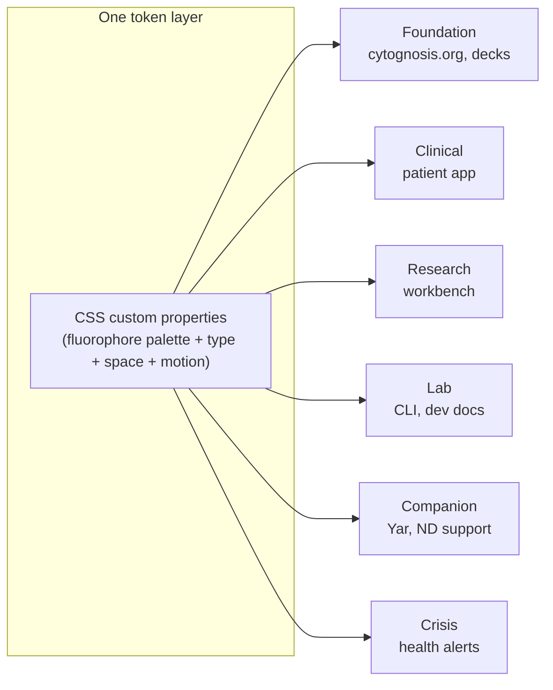
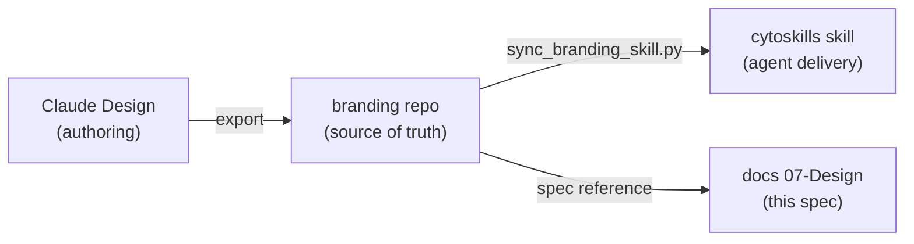

# Cytognosis Design System — Readable Guide

> **Status**: Active
> **Date**: 2026-07-10
> **Author**: @shahin
> **Audience**: designers, stakeholders
> **Tags**: `design`
> **Variants**: Technical (this doc) - Readable (Obsidian twin optional, same filename) - Agent (n/a)

> **Status:** Active · **Date:** 2026-07-01 · **Variant:** readable (ADHD-friendly) · **Technical source:** `branding-design-system-spec.md` · **Agent brief:** `design-system.agent.md`

**If you only read one thing:** One design system, six surfaces. Colors come from real fluorescent dye wavelengths; the display font is **Inter**; the public website runs a calmer, warm-light version of it. The single source of truth is the branding repo, mirrored to a Claude Design project, this spec, and the agent skill.

**Reading time:** ~4 minutes.

---

## TL;DR (the whole system in 6 lines)

- **Palette:** fluorophore-derived. Violet `#8B3FC7`, Azure `#3B7DD6`, Indigo `#5145A8`, Teal `#14A3A3`, Coral `#F26355`, Magenta `#E0309E` (accent only).
- **Type:** Inter (display and body), Newsreader (accent/quotes), JetBrains Mono (code). Lexend and Atkinson Hyperlegible for accessibility.
- **Tokens:** CSS custom properties (`--cg-violet-600`, `--space-md`, `--dur-base`), scoped per surface with `data-profile`.
- **Six profiles:** Foundation, Clinical, Research, Lab, Companion (ND), Crisis.
- **Website:** a calm variant of Foundation, warm-light theme, softened violet `#6E5BD1`.
- **Sync:** branding repo is the source; Claude Design, this docs spec, and the cytoskills skill stay in lockstep.

> [!IMPORTANT]
> Two stale facts to unlearn: the design system does **not** use Space Grotesk (it uses Inter), and it does **not** use Sage or Amber (those predate the v8 fluorophore palette). Both `CLAUDE.md` files still show the old values; treat this spec and the `brand-identity` skill as correct.

---

## The GPS-for-health metaphor drives the visuals

Each profile re-binds fonts and color emphasis inside its own `data-profile` scope, so one page can mix a Foundation header with a Research dashboard.

---

## Color, fast

| Color | Hex | Dye | Use |
|-------|-----|-----|-----|
| **Violet** | `#8B3FC7` | DAPI 461nm | Primary brand, CTAs |
| **Azure** | `#3B7DD6` | Alexa Fluor 488 | Links, data, AI |
| **Indigo** | `#5145A8` | UV 358nm | Headers, depth |
| **Teal** | `#14A3A3` | GFP 509nm | Success, harmony |
| **Coral** | `#F26355` | MitoTracker 576nm | Warmth, hope, urgency |
| **Magenta** | `#E0309E` | Rhodamine 565nm | Attention accent only |

**Neutrals** carry an indigo undertone (never pure gray). Dark backgrounds run `#0A0A14` (abyss) to `#13131F` (deep). The signature gradient is azure to violet to indigo at 135 degrees.

> [!WARNING]
> Open drift: the `brand-identity` skill (v8.0) and this spec (v10.1.0) disagree on the exact signature-gradient stops. Confirm with the founder and re-run the sync before launch. Details in `Website/00-CONSOLIDATION/CONFLICTS.md`.

---

## Type, fast

- **Headings and eyebrows:** Inter only, never on body or forms.
- **Body, labels, forms:** Inter, 16px minimum, line-height 1.6.
- **Pull quotes (3 sentences or fewer):** Newsreader.
- **Code:** JetBrains Mono.
- **Accessibility on demand:** Lexend, Atkinson Hyperlegible.

---

## The website profile (the public site)

> [!NOTE]
> The public site is a calmer, neurodiversity-first take on the Foundation profile. Same brand palette, softer defaults.

- **Calm violet** `#6E5BD1` is the site primary; `#8B3FC7` is kept as `--violet-strong` for links and gradient midpoints.
- **Warm-light theme:** page background `#F4F2EF`, surfaces white, ink `#23232B`. Dark sections use a `.dark` class, not a user toggle.
- **Calmer motion:** durations 200 / 320 / 520ms; parallax minimal; all motion collapses under `prefers-reduced-motion` (Lenis smooth-scroll is destroyed).
- Full detail in the technical spec, §14.

---

## Where it lives and how it stays in sync

The branding repo is authoritative. A CI workflow (`claude-design-drift.yml`) checks for drift on every push. When you change tokens, change them in the branding repo, then sync outward. See `claude-design-sync-protocol.md`.

---

## Gotchas checklist

- [ ] Not Space Grotesk. Inter.
- [ ] Not Sage or Amber. Fluorophore palette only.
- [ ] No Tailwind, Material, Bootstrap, or Catppuccin colors.
- [ ] No em dashes in any Cytognosis content.
- [ ] Magenta is an accent, never part of the identity triad.
- [ ] Confirm the signature-gradient stops before launch (open drift).

---

**See also:** `branding-design-system-spec.md` (full technical spec), `design-system.agent.md` (fresh-agent brief), `adhd-neurodiversity-design-research.md` (the ND evidence base), `claude-design-sync-protocol.md` (sync steps).
