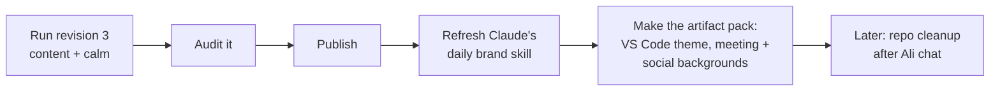

# Finishing the Design System, in Plain Words

> **Status**: Active
> **Date**: 2026-07-10
> **Author**: @shahin
> **Audience**: designers, stakeholders
> **Tags**: `design`, `design-system`
> **Variants**: Technical (this doc) - Readable (Obsidian twin optional, same filename) - Agent (n/a)

**Reading time: 2 minutes.**

> **101 box: where are we?**
> The design system is built and the logos and icons are done. Two things are still wrong: the words and the feel. We researched both deeply and wrote one big instruction file to fix everything at once.

## The one thing to do

Start a FRESH chat in Claude Design (your current one is nearly full), re-upload the latest export, attach `prompt_v11_revision_3_content_and_calm.md`, and tell it to execute. That one run finalizes the system as v11.2.0.

## Problem 1: the words

"Helix" is showing up as if it were a fourth product, in 23 places, including its own icon. Helix is your private org-structure draft, not a product. The real lineup is three products: **Cytoverse** (the map), **Cytoscope** (the sensor), **Cytonome** (the navigator), with **Neuroverse** as your public brain-health focus. The prompt removes Helix everywhere and fixes the founder story, version number, and a few lines that drift toward "diagnosis" (which you avoid on purpose).

## Problem 2: the feel

Your own research says: calm by default, gentle motion, warm paper background, generous reading space. The current design does the opposite in places (moving parallax, endless looping animations, dark techy gradients). The prompt applies your research: turns motion off by default, makes warm paper the standard background, sets a comfortable text size, and restores your science citations.

## Also handled

- Four "modes" become three (Lab folds into Research)
- Adds the two safety pieces the patient phone app needs (crisis banner, consent prompt)
- Makes the colors more distinctly yours, not generic

## What comes after

## Two choices for you (I proceed with these unless you say otherwise)

1. Three modes instead of four (fold Lab into Research). **Recommended.**
2. Warm paper as the default look, dark as an option. **Recommended.**
