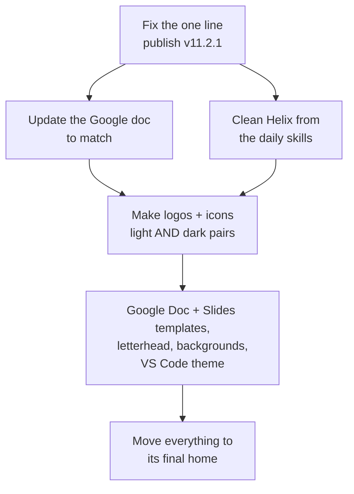

# Consolidating the Brand, in Plain Words

> **Status**: Active
> **Date**: 2026-07-10
> **Author**: @shahin
> **Audience**: designers, stakeholders
> **Tags**: `design`, `design-system`
> **Variants**: Technical (this doc) - Readable (Obsidian twin optional, same filename) - Agent (n/a)

**Reading time: 2 minutes.**

> **101 box: what is this?**
> Your brand rules live in three places: the new design system, your "skills" that Claude uses daily, and an older Google doc. I read all three, found where they disagree, decided the correct answer for each, and wrote the steps to finish and tidy everything.

## The one thing to do

Run `prompt_v11_revision_4_publish_ready.md` in Claude Design. Gradient decision is locked (kept the current blue-violet-indigo). This prompt now does two jobs: it makes the system publish-ready AND it applies every piece of your ADHD/neurodiverse research.

## The neurodiverse check (what you asked for)

I ran your full 45-point neurodiverse research checklist against the design. It scored 23 of 45. Revision 3 fixed the motion and profile problems you already knew about. But measuring the actual colors revealed a real issue: **the text a patient reads on the health screens, and the main line on the homepage, are too low-contrast** (about 4.7 and 3.0, when you promised 7). And some decorations still animate forever. The prompt fixes all 26 items, with the strictest calm and contrast reserved for patient screens.

## What I found

- The new design system (v11.2.0) is 83% done and almost ready. Helix is gone from it, the calm rules are in, the safety pieces for the phone app exist.
- One line still sounds like it "diagnoses disease," which you avoid. That is the fix above.
- Your older Google doc is out of date on four things (gradient, treating pink as a main color, an old font, old icons). The new system is right; the doc needs updating.
- **Helix still shows up as a fake product in five of your Claude skill files.** Those run every day, so I wrote a separate cleanup order for them.

## What comes next

## Where things will live

- The written guideline: your docs area, section "07-Design".
- The colors, code, logos, themes: the branding repo, but only after you and Ali sort out that repo (it currently holds his unrelated code library).
- Every key design gets both a dark and a light version, made as a pair.

## Choices locked in

1. Gradient: kept current (blue to violet to indigo). **Done.**
2. Update the existing Google doc rather than start a new one. **Recommended.**
3. Fix the Helix leak in your daily skills now. **Recommended.**
4. Neurodiverse standard is now system-wide and baked into every next prompt (design, logos, templates, backgrounds). **Done.**
