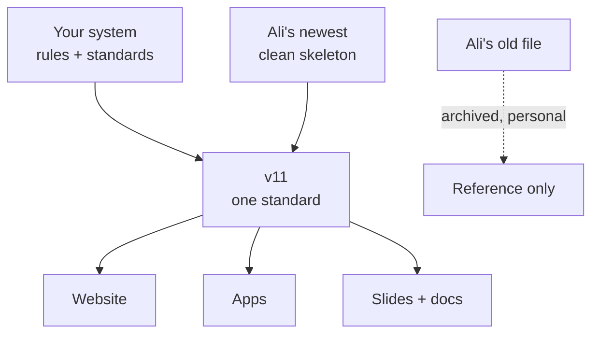

# The Design System Story, in Plain Words

> **Status**: Active
> **Date**: 2026-07-10
> **Author**: @shahin
> **Audience**: designers, stakeholders
> **Tags**: `design`, `design-system`
> **Variants**: Technical (this doc) - Readable (Obsidian twin optional, same filename) - Agent (n/a)

**Reading time: 2 minutes.**

> **101 box: what is this about?**
> You and Ali each built a design system (the official colors, fonts, buttons, and rules for the website and apps). We compared yours, his old one, and his new one, decided what to keep from each, and planned how to combine them into one standard called v11.

## The headlines

1. **Good news: the brand never actually split.** Your colors and fonts and Ali's newest ones are identical. Only a thin layer of nicknames (like what "background 1" points to) disagreed, and those are now settled.
2. **Ali's old file was never a company file.** It is his personal portfolio design. We archived it as reference and merged nothing from it.
3. **Ali's newest file is the best skeleton; yours is the best rulebook.** His has clean, machine-checkable parts. Yours has the accessibility, writing, photo, and logo standards, the four audience "modes", and the ready-made deck and one-pager templates. v11 = his skeleton + your rulebook.
4. **One surprise to handle later:** the company's shared brand folder on GitHub was replaced with Ali's own unrelated component library. The old contents are fully recoverable. This waits for a conversation with Ali; a ready-made recovery brief exists for when you have talked.

## The picture

## Where everything lives

One folder: **Claude → Projects → Science and Platform → design-system-merge-2026-07**. The full review, the raw evidence, the prompts to run, and the plan are all inside, each named for what it is.
