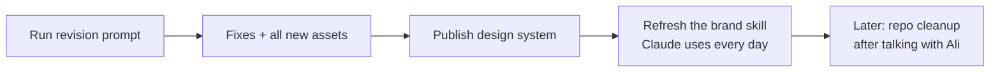

# The v11 Check-Up, in Plain Words

> **Status**: Active
> **Date**: 2026-07-10
> **Author**: @shahin
> **Audience**: designers, stakeholders
> **Tags**: `design`, `design-system`
> **Variants**: Technical (this doc) - Readable (Obsidian twin optional, same filename) - Agent (n/a)

**Reading time: 90 seconds.**

> **101 box: what happened?**
> Claude Design combined your old design system and Ali's new one into a single "v11". We then checked its work line by line. The combining worked. It found its own checklist not fully satisfied, so it (correctly) did not start making the new logos and icons yet.

## The one thing to do

Attach the file `prompt_v11_revision_1.md` in the same Claude Design chat and tell it to execute. That one run fixes the 5 small problems AND makes all the new assets (logos, favicons, app icons, social images, slide art, 48 icons).

## What passed

- One version number everywhere (11.0.0), honest changelog
- All colors, spacing, and motion values are exactly right
- Every component now has its rulebook, and buttons meet the 44px touch rule
- Your accessibility, writing, imagery, and logo standards are all in
- The unrelated side project (Yar) was cleanly removed

## The 5 small problems it will fix

1. The word "breakthrough" slipped into 2 sentences (banned word)
2. A few em dashes in 3 technical files
3. The font whitelist forgot the 4 profile fonts
4. 62 colors written by hand instead of using the official color names
5. A wrong claim about icon line thickness, plus one lowercase filename

## What comes after

