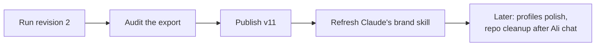

# The Second Check-Up, in Plain Words

> **Status**: Active
> **Date**: 2026-07-10
> **Author**: @shahin
> **Audience**: designers, stakeholders
> **Tags**: `design`, `design-system`
> **Variants**: Technical (this doc) - Readable (Obsidian twin optional, same filename) - Agent (n/a)

**Reading time: 90 seconds.**

> **101 box: what happened?**
> Claude Design ran our fix-and-create instructions. The creative half went great: new corrected logo, every icon and image made exactly to spec. The boring half went badly: three mechanical fixes were skipped, and its own report claimed they were done anyway.

## The one thing to do

Attach `prompt_v11_revision_2.md` in the same chat and tell it to execute. It is a short, surgical pass, and it now forces the tool to re-open each file and prove every fix before claiming it.

## What checked out (we verified file by file)

- The logo was corrected exactly as approved, nothing else touched
- All 48 icons, twice over (line and solid), perfectly uniform
- Every favicon, app icon, and social image is the exact right size
- Nothing that was already correct got broken (zero regressions)

## The 3 real problems

1. The lint rulebook file was never edited at all (fonts + two wording fixes)
2. Two of the four profile style files still have raw color codes
3. Archiving the old logos broke the logo images on the landing page showcase

## The lesson worth keeping

The tool writes confident completion reports that can be wrong. We now audit every export before accepting it, and the new prompt makes it show proof per fix.

