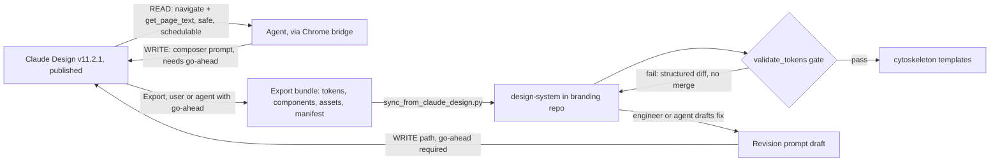

# TRACK A: Branding Repo Evaluation and Rebuild Plan

> **Status**: Active
> **Date**: 2026-07-11
> **Author**: @shahin
> **Audience**: designers, engineers
> **Tags**: `design`, `design-system`, `tracks`
> **Variants**: Technical (this doc) - Readable (Obsidian twin optional, same filename) - Agent (n/a)

Status: plan, ready to execute. Last revised: 2026-07-10.
Reading time: about 14 minutes.
**If you only read one thing:** the branding repo lost its entire design system (tokens, logos, ~220 icons, 6 of 7 skills, the sync pipeline) when it was replaced with Ali's CytoStyle component library; recovering the old content needs a conversation with Ali, but grafting the published v11.2.1 design system back in does not, and can start now.

## BLUF

The branding repo currently holds CytoStyle, a capable but Cytognosis-unaware React and Material UI component library (45 to 53 components, working theme providers, a color bridge that already carries the exact canonical brand hex values but is not documented or enforced as the default). Everything else the repo used to own is gone from the working tree but fully intact in git history at `9bf41cb~1` (the actual replace commit; the brief's `130dee7` does not exist in this clone and appears to be a misremembered hash), recoverable once Shahin and Ali agree on how CytoStyle's own content survives the merge. The recommended path is to graft the published v11.2.1 export into a new `design-system/` tree now (no gate), wire a scheduled read-only drift check plus a confirmed-pull sync script, and hand the resulting tokens to cytoskeleton's five interface templates, which is the point where Track B (website) picks up.

## Section 1: Current-State Evaluation

### 1.1 What the repo holds today: CytoStyle

`https://github.com/cytognosis/branding` is `@alimohammadiwork/cytostyle` v1.0.82, described in its own `package.json` as "Reusable CytoStyle React and Material UI components, providers, hooks, utilities, and design tokens for Cytognosis products." Confirmed contents:

- **Components:** 53 `.tsx` files in `src/components/`. CytoStyle's own June 7, 2026 audit (`CORRECTED_FIGMA_FIRST_DESIGN_SYSTEM_AUDIT.md`) counts 45 as actually exported from `src/components/index.ts`; the gap is likely newer additions or internal-only wrappers. Full Storybook coverage (`stories/`, `.storybook/`) for most of them.
- **Theming:** `ThemeProvider` (Next.js) and `SPAThemeProvider` (Vite), built on MUI CSS variables via `createCytoStyleTheme`.
- **The color bridge:** `src/constants/colors.ts` exports `cytognosisAppColors` (primary `#8B3FC7`, secondary `#3B7DD6`), `cytognosisGradients` (signature: `linear-gradient(135deg, #3B7DD6 0%, #8B3FC7 50%, #5145A8 100%)`), and `cytognosisSurfaces`. These hex values are an **exact match** to the canonical v11.2.1 signature gradient. This is genuinely valuable and already exists in code.
- **The catch:** `guidelines/foundations/color.md`, the file that actually instructs any consumer (including an AI app-builder) on how to theme a new app, does not mention `cytognosisAppColors` at all. Its worked example hardcodes `#1DBF98` / `#4F545E`, colors with no relationship to Cytognosis. The bridge is real but orphaned: nothing forces a generated app to use it.
- **Guidelines:** `guidelines/Guidelines.md` plus `foundations/{color,typography,spacing,icons}.md` and `components/{overview,buttons,forms,feedback,layout,data-display,date-inputs}.md`. These are component-API usage rules for building apps with CytoStyle, not brand voice, logo, or imagery guidance.
- **Skills:** exactly one, `skills/cytostyle-app-builder/` (`SKILL.md` plus `agents/openai.yaml`), which teaches an agent to build apps from CytoStyle components. It is unrelated to the seven Cytognosis skills.
- **Audit docs:** four MDs (`CORRECTED_FIGMA_FIRST_DESIGN_SYSTEM_AUDIT.md`, `EXISTING_DESIGN_SYSTEM_AUDIT.md`, `MISSING_COMPONENTS_VERIFICATION_AUDIT.md`, `CYTOSTYLE_DESIGN_SYSTEM_IMPLEMENTATION_ROADMAP.md`, plus `docs/design-system-audit.md`). Important nuance: these audit CytoStyle against **Ali's own Figma file** (`/Users/ali/Documents/Cytognosis/CytoStyle`, pages named "UI Design - Version 3/4/Draft"), not against Cytognosis's Claude Design system. Figma tokens use names like `Primary/500-Main` and `Input/I2-Medium 14-IRAN Yekan XFaNum`, confirming the source design is Ali's personal, Persian-market-oriented Figma file, later fitted with a Cytognosis color layer.
- **IranYekan fonts:** a full Persian/Farsi font family, duplicated four times (`assets/fonts/`, `src/fonts/`, `dist/fonts/`, `archive/fonts/`). Cytognosis is English-first per the repo's own `Guidelines.md`; this, plus `jalaali-js`, `persian-number`, and `stylis-plugin-rtl` in `package.json`, is leftover weight from the library's origin, not a Cytognosis need.
- **Build infrastructure CytoStyle adds that the old repo never had:** `esbuild.js`, `tsconfig.json`, `.storybook/`, `Dockerfile`, `pnpm-workspace.yaml`, and a working `npm pack` / publish pipeline. This is real, useful engineering the old design-system tree lacked entirely.
- **License mismatch:** CytoStyle's `package.json` declares `ISC`. The target repo plan calls for Apache 2.0 (code) plus CC-BY 4.0 (content). Flagged as an open question in Section 7.

### 1.2 What it held before: the old design-system tree

Git history is intact. The commit that replaced it:

```
9bf41cb Replace branding repo with CytoStyle package
Author: Ali Mohammadi <ali.mohammadi@cytognosis.org>
Date:   Fri Jul 3 21:29:50 2026 +0330
```

**Correction to the brief:** `130dee7` is not a valid object in this clone (`git cat-file -e 130dee7` fails). `9bf41cb` is the actual replace commit; all further references below use `9bf41cb~1` as the last old-state snapshot.

Full inventory via `git ls-tree -r 9bf41cb~1 --name-only` (verified, not reconstructed from memory):

- `design-system/`: `tokens/design-tokens.css`, `components/Components.jsx` (reference only, not a working library), `data-viz/dataviz.css`, `profiles/` (7 CSS files: `a11y`, `companion`, `crisis`, `dataviz`, `motion`, `profiles`, `states`, plus 4 example JSX files for Foundation/Clinical/Research/Lab and an `explorations.html`), `preview/` (26 rendered HTML cards covering colors, type, components, spacing, logos, icons, imagery, governance).
- `assets/logos/`: 11 files (dark/light/mark/mark-square variants, SVG and PNG).
- `assets/icons/`: 10 numbered style variants (`01_solid_violet` through `10_duotone`) times 20 biology/health/AI subjects (brain, dna_helix, cells_neurons, microscope, etc.) = 200 files, plus 20 flat single-style icons at the root, plus a README and gallery. Roughly 220 Cytognosis-themed icon SVGs total.
- `guidelines/`: 31 files, the pre-v10 numbered references (with known duplicate numbering, e.g., two files each numbered 02, 03, 04, 05, 09, and 10, already flagged as a known issue in the target repo plan), plus `MASTER_GUIDELINES.md`, `LOGO.md`, `WRITING.md`, `IMAGERY.md`, `ACCESSIBILITY.md`, and 2 showcase HTML files.
- `skills/`: three of the eventual seven, `cytognosis-branding/` (21 reference files, mirroring the guidelines numbering), `cytognosis-design-system-master/` (8 reference files plus 17 asset files including a `helix-model.png`), `cytognosis-template-master/` (6 reference files: desktop, extension, general, phone, web, website, one per interface template plus a general overview). The other four skills (`orchestrator`, `dev`, `org`, `writer`) were never in this repo's git history; the target plan sources them from `cytoagent/skills/cytognosis/` instead, a separate recovery path.
- `scripts/`: `sync_from_claude_design.py`, `sync_to_claude_design.py`, `claude_design_diff.py`, `build_master.py`, `build_pypi.py`, `sync_branding_skill.py`, plus `noxfile.py` and `pyproject.toml`.
- `themes/`, `slides/deck/`, `templates/` (README plus one test template, not the fuller deck/one-pager/social-cards set the target plan describes, which lived in an un-merged source tree, not this repo's own history), `web/` (production CSS/JS, 9 files).

The two commits that built the old sync pipeline, read directly from git:

- **`22a42ac`** ("feat(sync): implement bidirectional Claude Design ↔ branding ↔ cytoskeleton pipeline", 2026-05-18): added `sync_from_claude_design.py` (an ingestion engine with 8 `INGEST_RULES` covering CSS, components, tokens, profiles, guidelines, logos, and icons, plus an auto-push of compiled CSS to `cytoskeleton/templates/shared/css/`), `sync_to_claude_design.py` (built a 55-file, 837 KB bundle to hand back to Claude Design), `claude_design_diff.py` (a 4-section structured diff checking token presence, file parity, and staleness), and `noxfile.py` with 7 sessions (`build_master`, `tokens_validate`, `assets_validate`, `skills_validate`, `sync_from`, `sync_to`, `sync_cytoskeleton`, `diff`, `lint`/`format`). Tested end to end at the time: 157 CSS custom properties detected, all required tokens present.
- **`6e2815f`** ("feat(design-system): link Claude Design URL + consolidate logos + test template skill", 2026-05-18, ~30 minutes later): linked `DESIGN.md` to the (now superseded) Claude Design project at that time, consolidated logos to 11 files, and added a verified test template page.

**Naming correction:** the brief calls the validation script `validate_tokens.py`. That literal filename never existed; the equivalent logic was split across `claude_design_diff.py` and the `tokens_validate` nox session. The target repo plan (see Section 2) does specify `validate_tokens.py` as a target filename, so Phase 2 below formalizes it as an actual file, built from this old logic.

### 1.3 Feature-gap table

| Category | Old design-system (pre-`9bf41cb`) | Current CytoStyle | Verdict |
|---|---|---|---|
| `design-system/` tree | Present: tokens, components (reference), profiles, preview, data-viz | Absent entirely | Total loss, rebuild from v11.2.1 export |
| Canonical CSS tokens (`--cg-*` scale) | Present, 157 custom properties | Only as TS objects in `colors.ts`, not CSS variables, not documented as default | Partial: values survive in code, not as an enforced token contract |
| Logos | 11 files | Zero | Total loss |
| Icon library | ~220 Cytognosis-themed SVGs, 10 style variants | None (uses generic `iconsax-react`) | Total loss |
| Brand guidelines (voice, logo, imagery, accessibility) | 31 files | Different guidelines entirely, for component APIs not brand | Not a like-for-like gap; both are needed, current repo only has one |
| Skills | 3 of 7 present in this repo's history | 1 (`cytostyle-app-builder`, unrelated purpose) | 6 of 7 target skills absent (3 recoverable here, 4 from `cytoagent`) |
| Sync/validation pipeline | 6 scripts, `noxfile.py`, 2 GitHub Actions | None; only Storybook/esbuild/a plain `ci.yml` | Total loss, rebuild per Section 3 |
| Themes (vscode/starship/geany) | Present, 4 files | Absent | Total loss, low priority |
| Templates (deck, one-pager, etc.) | Only a README and one test page in this repo's actual history | Absent | Minor loss; the richer set never lived here to begin with |
| Production web CSS | Present, 9 files | Absent | Total loss, already marked for archive in target plan |
| Working React component library | None (old repo shipped no runtime package) | 45 to 53 components, Storybook, theme providers, Sentry hook, npm-published | New capability; CytoStyle's real contribution |
| Cytognosis color bridge in code | N/A | Present, exact hex match, but undocumented and unenforced | New and valuable, needs promotion not rebuilding |
| Component completeness audits | N/A | 4 MDs, but measured against Ali's personal Figma, not Claude Design | Useful method, wrong source of truth, don't port as-is |

### 1.4 What's genuinely worth keeping from CytoStyle

Keep, don't discard: the 45 to 53 working components, both theme providers, `MessageProvider`/`useErrorHandler`/`useWebOtpListener`, the Sentry integration, the Storybook catalog, the esbuild/tsc build pipeline, and the `cytognosisAppColors`/`cytognosisGradients`/`cytognosisSurfaces` bridge (once promoted to the enforced default). Archive, don't discard: the IranYekan/RTL stack, pending an explicit call on whether any consumer needs it. The Figma-sourced audits are a good method to reuse later against the real Claude Design system, not content to port directly.

## Section 2: Target Architecture

The branding repo becomes the **production mirror** of the Claude Design system, published v11.2.1. Target layout (adapted from `02_repo_organization/branding_repo_plan.md`, refined below where the actual export bundle shape, confirmed in Section 3, differs from that plan's original assumption):

```
branding/
├── design-system/              (the production export; framework-agnostic)
│   ├── tokens/                 (mirrors the export 1:1: fonts.css, colors.css,
│   │                            typography.css, spacing.css, shadows.css,
│   │                            motion.css, base.css; a built tokens.css
│   │                            concatenation is a convenience artifact, not
│   │                            the source of truth)
│   ├── references/             (01-12, the numbered brand references)
│   ├── profiles/                (foundation, clinical, research, lab)
│   ├── assets/                 (logos, icons, products: cytoverse, cytoscope,
│   │                            cytonome only, no Helix as a product)
│   ├── templates/               (operational kits: deck, one-pager,
│   │                            email-signature, social-cards)
│   ├── components/              (LinkML-style *.contract.yaml, platform-agnostic
│   │                            contracts, distinct from CytoStyle's working
│   │                            React implementations)
│   ├── preview/                 (rendered guideline cards)
│   └── data-viz/
│
├── components/ or packages/cytostyle/  (CytoStyle's working MUI implementation,
│                                        kept as a sibling, not merged into
│                                        design-system/; see Section 6, Phase 0)
├── skills/                      (all 7 Cytognosis skills)
├── themes/                      (vscode, starship, geany)
└── scripts/                     (sync_from_claude_design.py,
                                   sync_to_claude_design.py,
                                   claude_design_diff.py, validate_tokens.py,
                                   render_guidelines.py)
```

One deliberate refinement from the original target plan: that plan assumed a single `tokens.css`. The actual v11.2.1-lineage export bundle (confirmed against a locally extracted example, Section 3) ships **7 separate token CSS files** plus a machine-readable `_ds_manifest.json`. Mirroring that shape 1:1 in `design-system/tokens/` costs nothing and avoids a lossy merge step on every sync.

## Section 3: Bidirectional Claude Design Link

The mechanism has two independently confirmed pieces: the browser bridge (`CLAUDE_DESIGN_BRIDGE.md`, established 2026-07-10) and a real example of what an export bundle looks like on disk (`01_extracted/ali_latest/`, a prior v10.1.0 snapshot with its own `_ds_manifest.json`).

**(a) READ path,** always safe, no confirmation needed, can run on a schedule: `list_connected_browsers` then `tabs_context_mcp`, `navigate` to `https://claude.ai/design/p/11d44c2c-5d95-416f-9395-f12091cba8ee`, wait about 3 seconds, `get_page_text` for the rendered readme, file manifest, component list, and full chat transcript. This alone verifies version, gradient, tokens, and component inventory against the live published state, no zip required.

**(b) Sync script:** revive `sync_from_claude_design.py`, retargeted to read an export bundle shaped like the confirmed example (`tokens/*.css` times 7, `components/**/{*.jsx,*.d.ts,*.prompt.md}`, `guidelines/*.card.html`, `ui_kits/*/index.html`, `assets/{logos,images}`, `_ds_manifest.json`). `_ds_manifest.json` already carries every token as a structured `{name, value, kind, definedIn, scope}` record, a much better diff source than the old pipeline's hardcoded 10-token check. Getting the bundle itself still requires an Export, triggered either by the user or by the agent via the WRITE path with per-session go-ahead (see below); reading and verifying no longer does.

**(c) Validation gate:** formalize `scripts/validate_tokens.py` (see the naming correction in Section 1.2), covering:
- Full token parity against the manifest's complete list (all `--cg-*`, `--bg-*`, `--fg-*`, `--space-*`, `--radius-*`, `--shadow-*`, `--text-*`, `--font-*` families), not a fixed 10-item list.
- An exact-match check on the signature gradient (`#3B7DD6 -> #8B3FC7 -> #5145A8`, 135deg), the single most identity-critical value.
- A **product-story guard**: assert no "Helix" as a product name anywhere in pulled copy, and the three-product story (Cytoverse, Cytoscope, Cytonome) with Neuroverse as the public deployment. This is not hypothetical: the locally extracted v10.1.0 example still lists "Helix Model" as a fourth product in its own readme, exactly the drift this gate exists to catch.
- Asset presence (logos, icon bundle) and, once populated, the `skills_validate` cyto-skills judge integration from the old `noxfile.py`.
- A failing gate blocks the merge and surfaces a structured diff. It never silently overwrites `design-system/`.

**(d) Cadence:** the READ-path drift check is safe to schedule (weekly, or on demand). The actual pull (triggering Export, writing into the repo) is never unattended; it runs on request or when the drift check flags a change, and always with the same per-session confirmation the bridge doc already requires for any WRITE action.

**(e) Reverse direction:** a repo-side fix (a contrast issue, a token cytoskeleton needs) gets written as a short revision prompt, then an agent drives the composer, submits, and polls `get_page_text` for Claude Design's response. Publishing is a human or explicitly-confirmed-agent action, never automatic.



## Section 4: Templates From the Design (Handoff to Track B)

The five interface templates are app-website, app-phone, app-web, app-desktop, and app-extension. Ownership is already decided in the existing target repo plan, not new: `design-system/templates/` in the branding repo holds **operational kits** (deck, one-pager, email-signature, social-cards); the five **interface** templates live in `cytoskeleton`, which "holds the templates those products are generated from" per that plan's own scope section. Confirmed today: `cytoskeleton` has zero references to `cytostyle` or `design-system` anywhere, a clean, unwired slate.

A concrete synergy worth using: CytoStyle's `docs/tokens.md` already defines a `designTokens` contract for spacing, radius, shadow, motion, z-index, breakpoints, and a Tauri-shell-aware `safeArea`, none of it color. That non-color half is a genuine head start for `design-system/tokens/spacing.css` and friends; the color and type half comes from the Claude Design export. Combine both rather than rebuilding either from scratch.

**Contract each template exposes:** consume `design-system/tokens/*.css` exclusively via CSS custom properties, never a hardcoded hex; implement the component contracts from `design-system/components/*.contract.yaml`; support the four profile overlays as swappable theme attributes; pass the same `validate_tokens` gate before release.

**This is the handoff point to Track B.** Track B's website rebuild should scaffold from the `app-website` template once it exists in cytoskeleton, rather than hand-rolling CSS again. Track B's engineering work is blocked on this track's Phase 1 and 2 (tokens exist and are validated); Track B's content and IA work is not, and can run in parallel.

## Section 5: Downstream App Consumption (Yar)

**Scope correction:** the primary `Yar/` product repo (`https://github.com/cytognosis/Yar`) is Python plus Flutter mobile (`apps/mobile/`) and has zero dependency on CytoStyle, confirmed by grep. The actual consumer is a separate, dated web snapshot at `yar_revisions/yar-code-20260705-2354/` (2026-07-05), which looks like an AI app-builder export (CytoStyle's own `package.json` keywords include `figma-make` and `make-kit`, consistent with this).

That snapshot's dependency is real and deep: `package.json` pins `"@alimohammadiwork/cytostyle": "^1.0.82"`, and 23 source files import from it, covering the app shell, providers, primitives, layout (`AppShell`, `BottomNav`), and 8 of its feature screens (focus, plan, search, capture, map, home, assistant, mood, settings).

**A good existing pattern to preserve:** 19 of those 23 files import through a local facade, `src/lib/cytostyle.ts`, which re-exports from the real package. Only the facade itself, `main.tsx` (for `fonts.css`), and `vite.config.ts` touch `@alimohammadiwork/cytostyle` directly. A package restructure mostly means updating one file, not 23. Recommend mandating this facade pattern for every future template-generated app.

**Versioning:** recommend publishing design-system tokens and any first-party component package under an `@cytognosis` npm scope, not `@alimohammadiwork` (a personal namespace), once Phase 0 clears. Semver per the existing target plan: MAJOR for breaking token renames or removed components, MINOR for new tokens or components, PATCH for fixes. Downstream apps should run the `validate_tokens` gate on every dependency bump, not rely on semver alone, since a value-only change (same export name, new hex) breaks nothing at compile time but silently reskins a live app.

**What actually breaks:** a renamed or removed export (`defaultColors`, `designTokens`, `cytognosisSurfaces`) fails the Yar snapshot's TypeScript build immediately, a good fail-fast property already in place. A same-name value change does not fail the build and is the real risk, which is exactly why the validation gate matters more than the compiler here. Once `@cytognosis`-scoped tokens exist, migrate this snapshot to default `appColors` to `cytognosisAppColors`/`cytognosisGradients` instead of its current unrelated placeholder, closing the gap flagged in Section 1.1.

## Section 6: Phased Execution

| Phase | Gate | Key actions |
|---|---|---|
| **Phase 0: Recover from git** | **Behind the Ali gate. Do not start without that conversation.** | Agree how CytoStyle's own content survives (recommendation: becomes a sibling `components/` or `packages/cytostyle/`, not merged into `design-system/`); agree on npm scope and license; only then merge the pre-`9bf41cb` guidelines, 3 legacy skills, themes, and old scripts into the new structure. |
| **Phase 1: Graft v11.2.1** | No gate; can start now | Use the Chrome bridge READ path to reconfirm v11.2.1 (v11.2.1 is already published per completed work); obtain the export (user export or agent WRITE-path with go-ahead); run the revived sync script; populate `design-system/tokens/`, `assets/` (3 products, no Helix), `preview/`, `components/` contracts; run the validation gate for the first time against real v11.2.1 output. |
| **Phase 2: Wire the sync** | No gate; depends on Phase 1 | Install the scheduled READ-only drift check; document the confirmed-pull flow; formalize `validate_tokens.py`; wire the reverse WRITE path; add the gate to CI so manual repo edits are checked too. Benefits from Phase 0's recovered scripts as a starting point but is not blocked if Phase 0 slips, since the old script logic is already readable from git history today. |
| **Phase 3: Templates** | Depends on Phase 1 and 2 | Build the full `*.contract.yaml` set; hand tokens and contracts to cytoskeleton; scaffold `app-website` first (the Track B handoff), then `app-web`, then the rest. |
| **Phase 4: Downstream** | Depends on Phase 2 and 3 | Migrate the Yar web snapshot to `@cytognosis`-scoped tokens and default `appColors`; decide if that snapshot graduates into the main `Yar/` repo; add the validation gate to downstream CI. |

Important sequencing note: Phase 0 and Phase 1 pull from different sources (git history versus the live Claude Design project) and do not block each other. Reading the old scripts and inventory (this document) required no permission; only writing over the current repo's structure and deciding what happens to Ali's CytoStyle content needs his sign-off.

## Section 7: Interlock With Track B and Open Questions

**Interlock:** Track B (website) should treat "`design-system/tokens/` exists and is tagged v11.2.1 in the branding repo" as its named engineering start checkpoint. Content and IA work on Track B can proceed immediately, in parallel with Phases 0 through 2 here.

**Open questions, with a recommendation on each rather than left open:**

1. **npm scope.** Recommend moving off `@alimohammadiwork` to `@cytognosis/cytostyle` and `@cytognosis/design-system` once Ali agrees; org infrastructure should not sit under a personal namespace long-term.
2. **Where CytoStyle's React implementation lives post-merge.** Recommend a sibling `components/` or `packages/cytostyle/` inside the same branding repo, not a separate repo; Yar's web snapshot already depends on it, and splitting repos adds coordination cost for no benefit.
3. **IranYekan and RTL dependencies.** Recommend archive, not delete, pending confirmation from Ali that no consumer needs Persian/RTL support.
4. **License.** Recommend resolving the ISC versus Apache-2.0/CC-BY mismatch (Section 1.1) in the same Phase 0 conversation, since it touches the same content Ali authored.
5. **The `companion.css` and `crisis.css` profile files** found in the old tree do not map cleanly to the established four profiles (foundation, clinical, research, lab). Recommend treating them as superseded exploration files unless Phase 0 archaeology turns up a reason to keep them; not worth a separate decision meeting.

---

**Sources for this document:** `git log`, `git show 22a42ac --stat`, `git show 6e2815f --stat`, and `git ls-tree -r 9bf41cb~1` in `https://github.com/cytognosis/branding`; direct file reads of `package.json`, `src/constants/colors.ts`, `guidelines/foundations/color.md`, `docs/tokens.md`, and the four audit MDs in that repo; `CLAUDE_DESIGN_BRIDGE.md` and `01_extracted/ali_latest/_ds_manifest.json` plus `readme.md` in this project folder; `02_repo_organization/branding_repo_plan.md`; grep across `~/repos` for `@alimohammadiwork/cytostyle` and its usage in `yar_revisions/yar-code-20260705-2354`.
