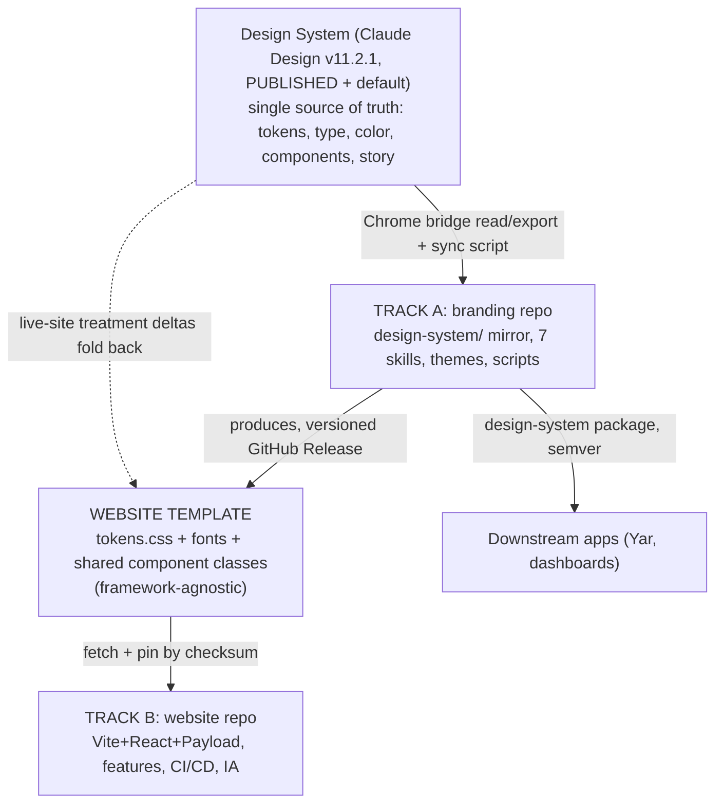

# Two-Track Orchestration and Relocation Plan

> **Status**: Active
> **Date**: 2026-07-11
> **Author**: @shahin
> **Audience**: designers, engineers
> **Tags**: `design`, `design-system`, `tracks`
> **Variants**: Technical (this doc) - Readable (Obsidian twin optional, same filename) - Agent (n/a)

**Date:** 2026-07-10. **Reading time:** about 6 minutes. **You execute the moves; I planned them here.**
**If you only read one thing:** the Design System (published v11.2.1) is the single upstream source for both tracks. Track A (branding repo) turns it into a versioned **Website Template**; Track B (website) consumes that Template. The Template is the one shared contract between the two tracks, so they can run as separate agent sessions that sync only on Template releases.

---

## 0. BLUF

- Two tracks, one contract. **Track A = branding repo** (production mirror of the Design System + the Website Template + downstream package). **Track B = website** (consumes the Template, rebuilds features, fixes CI/CD). Plans: `TRACK-A_BRANDING-REPO_PLAN.md`, `TRACK-B_WEBSITE_PLAN.md`.
- They interconnect through exactly one artifact: the **Website Template** (a versioned, framework-agnostic token + component-class release produced by Track A from the published design). Track B pins a Template version; nothing is hand-copied.
- Run them as **two dedicated Claude sessions** (each can spawn an agent team), coordinating through a shared status board and Template version pins. Neither needs to live in the other's context.
- Relocation: Track B work goes to the **Website** project; Track A work goes to a **Branding and Design System** home under Science and Platform; the finalized guideline goes to the docs repo `07-Design/`; Yar consumption notes cross-link into the **Yar** project. The merge working folder is archived once content lands.

---

## 1. The upstream source and the one shared contract

**The contract (Website Template):** a framework-agnostic bundle Track A publishes as a versioned GitHub Release: `tokens.css` (all v11.2.1 tokens), the font stack, and shared component classes/markup patterns. It carries the live-site treatment deltas (Section 2) so the Template, the Design System, and the site all agree. Track B fetches and pins it by checksum, and never hand-edits tokens again. When Track A publishes `website-template@x.y.z`, that version string is the sync point between the tracks.

## 2. Website design deltas to fold into the Template (from the live cytognosis.org inspection)

The site is already aligned on the core palette (body `#F4F2EF` = warm-paper default, landing violet `#6E5BD1`, warm ladder `#FAF8F2`/`#ECE9E4`). The deltas are treatment, and they belong in the Template so the Design System and the site stop drifting:

| Delta | Live site | Fold into Template as |
|---|---|---|
| Display weight | Space Grotesk **500** at 64px (airy, elegant) | A display-heading treatment at weight 500, not Bold 700, for marketing surfaces |
| Body ink | `#23232B` near-ink (~12.6:1) | Confirm as the marketing body token (crisper than the softer `--ink-2`) |
| Spacing | 64/96px section padding, very generous whitespace | The 96px desktop / 48px mobile rhythm plus a stated "one idea per viewport" airiness principle |
| Eyebrows | tiny uppercase-mono labels ("NONPROFIT AI FOUNDATION") | A documented eyebrow-label pattern (ALL CAPS MONO) |

One correction Track B flagged: a July 6 website patch swapped Space Grotesk for Inter in headings, which contradicts v11.2.1. Revert it as part of adopting the Template.

## 3. Artifact status (the logos/icons/backgrounds/theme you asked for)

| Artifact | Status | Where |
|---|---|---|
| Logo + icon family (light/dark pairs, per-surface) | **Running now** in Claude Design via the bridge; verify output when complete | design system project |
| Google Docs template + letterhead + Slides deck | Queued | `prompt_google_and_artifact_templates.md` (Track A) |
| Meeting backgrounds, LinkedIn/X/social images | Queued | same prompt, light/dark pairs |
| VS Code theme family (Night/Day + calm) + Starship + Geany | Queued (recover "Cytognosis Dusk" from git) | Track A, `branding/themes/` |

These are Track A deliverables (they come from the Design System and live in the branding repo). They run through the bridge; nothing is blocked by the Ali gate except committing them into the recovered repo.

## 4. Multi-agent orchestration

Run two dedicated sessions. Each opens with its track plan and the Design System URL, and uses the Chrome bridge to read the latest published design.

- **Session A (Branding):** owns the branding repo, the sync pipeline, the Website Template, the artifact pack, and the downstream package. Can spawn subagents for: git recovery (behind the Ali gate), token/asset grafting, template authoring, theme generation.
- **Session B (Website):** owns the website repo, feature reconstruction, DB/resource pressure-tests, CI/CD repair, IA revision, Yar-section revision. Can spawn subagents per area.

**Coordination protocol (lightweight, file-based):**
1. A shared **TRACKS-STATUS-BOARD.md** (in the Branding project, mirrored/linked from Website) that both sessions read at start and update at end: current Template version, open cross-track blockers, last sync.
2. **Template releases are the only hard handoff.** Session A announces `website-template@x.y.z` on the board with a changelog; Session B pins it and reports integration status back on the board.
3. **Blockers cross-post.** If Session B needs a token or component the Template lacks, it files a one-line request on the board; Session A folds it into the next Template release.
4. **Both read the same upstream** (the published Design System) via the bridge, so neither invents values.
5. Cadence: asynchronous. They do not need to run simultaneously; the board + version pin keep them consistent.

## 5. Relocation map (you execute; grounded in the consolidation standards, `raw_canon_and_relocation.md` Part 3)

| What | From (now) | To | Notes |
|---|---|---|---|
| Track B website plan (+ simple) | `Science and Platform/design-system-merge-2026-07/05_tracks/` | **Website** project | Its natural home; Website project already exists |
| Track A branding plan (+ simple) | same | **Science and Platform / branding-and-design-system/** (or a new "Branding" project) | Recommend a clear folder under Science and Platform to avoid proliferating top-level projects; a dedicated project is fine if you prefer |
| Finalized guideline (prose) + published-export pointer | merge project `02_review/` | docs repo **`07-Design/`** (when mounted) + the Branding home | Two-variant rule (technical + Obsidian companion) per the `cytognosis-doc` skill |
| Production tokens, CSS, assets, themes | merge project | **`branding/design-system/`** + **`branding/themes/`** | HARD-GATED on branding-repo recovery (Ali). Stage under `03_artifacts/` meanwhile |
| Yar consumption notes | Track A plan Section 5 | cross-link into the **Yar** project | Yar main repo does not use CytoStyle; a web snapshot does |
| Merge working folder | `design-system-merge-2026-07/` | Archive in place with a forward link | Only after the design-system content lands in its target repo; keeps the full audit trail |
| The bridge workflow doc | `design-system-merge-2026-07/CLAUDE_DESIGN_BRIDGE.md` | copy into BOTH track homes | Both sessions need it |

Naming: exported docs `[Type]-[Topic]-[Version]-[Date]`; branding semver per `governance.md`; docs get a `simple/` companion.

## 6. Gates and sequencing

- **Ali conversation** gates only: branding-repo recovery (Track A Phase 0) and the `branding/design-system/` write. Everything else starts now.
- **Docs repo mount** gates the `07-Design/` guideline move.
- Track A Phases 1 to 3 (graft v11.2.1, wire sync, build the Template + artifacts) and Track B content/IA/CI-CD diagnosis can begin immediately, in parallel.
- Animated visualizations (Track B Section 7) are explicitly deferred to their own later sessions.

## 7. Open questions

1. Dedicated "Branding" Claude project, or a folder under Science and Platform? (Recommend folder; low overhead.)
2. Website Template distribution: GitHub Release (Track B's recommendation) vs npm package vs git submodule. (Recommend GitHub Release + checksummed fetch; submodule already failed once.)
3. Does the Ali conversation also cover the npm scope move (`@alimohammadiwork` to `@cytognosis`) and the ISC-vs-Apache/CC-BY license mismatch Track A flagged?
