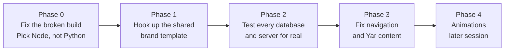

# Fixing the Website, in Plain Words

> **Status**: Active
> **Date**: 2026-07-11
> **Author**: @shahin
> **Audience**: designers, engineers
> **Tags**: `design`, `design-system`, `tracks`
> **Variants**: Technical (this doc) - Readable (Obsidian twin optional, same filename) - Agent (n/a)

**Reading time: 2 minutes.**

> **101 box: what is this?**
> Your website repo is three half-finished rebuilds stacked on top of each other. Two of them broke the build. I read everything (the code, the docs, the old site, the new site) and wrote the fix-it order: what to fix first, what to fix second, and what to leave alone until later.

## The one thing to do

Before anything else: the site's build is currently broken. The deploy scripts try to build a piece of the app ("site" and "cms") that the instruction file (the `Dockerfile`) does not actually know how to build. That needs a direct fix, not a workaround, before touching colors, Yar, or navigation.

## What I found

- **The old Python backend is dead but not removed.** Half its files are gone; the parts still sitting in the repo would crash if anyone tried to start them. The current, working site is built in Node.js instead. Pick Node, delete the Python leftovers, done.
- **Three different files all claim to hold your brand colors**, and they disagree with each other. One of them was patched five weeks ago against an older, now-outdated version of your design system, and it patched the wrong thing: it removed Space Grotesk (your display font) and put Inter in its place. Your finalized design system says Space Grotesk. Put it back.
- **The site secretly has a git problem it just barely recovered from**: someone accidentally committed 124 MB of `node_modules` files, which blocked pushing to GitHub for a while. You fixed that two days ago. Worth double-checking the fix actually let a real deploy through.
- **Your CI/CD never uses `cytohost`** (your own server), even though it is already registered and already hosts your calendar and code tools. Right now, GitHub's own shared computers do the work instead.
- **The navigation menu has been decided three different times** by three different documents, and none of them match what is actually live on the site today. I picked one final version and explained why.

## What's genuinely good and should not be touched

Yar, Neuroverse, and Research are already live and already prominent in the nav, which is correct. The calm, low-motion, reading-mode-friendly design work from earlier this summer is solid and should stay exactly as it is.

## What comes next

Phase 1 is stuck until Shahin has a conversation with Ali about the branding repo. Everything else can move now.

**Full detail:** `05_tracks/TRACK-B_WEBSITE_PLAN.md`
