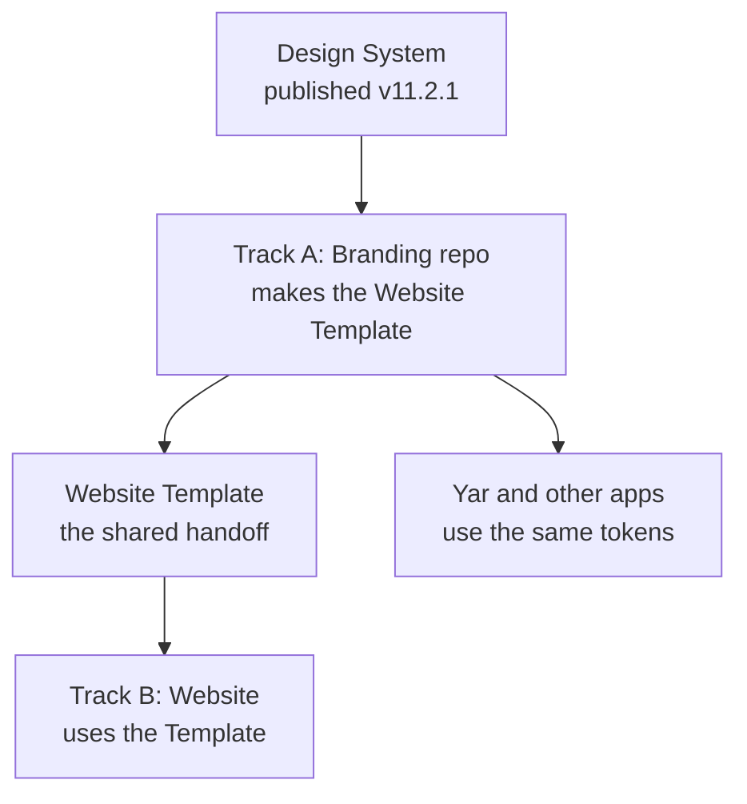

# Two Tracks, in Plain Words

> **Status**: Active
> **Date**: 2026-07-11
> **Author**: @shahin
> **Audience**: designers, engineers
> **Tags**: `design`, `design-system`, `tracks`
> **Variants**: Technical (this doc) - Readable (Obsidian twin optional, same filename) - Agent (n/a)

**Reading time: 90 seconds.**

> **101 box:** Your brand and your website are now two separate jobs that share one thing. The shared thing is a "Website Template" made from the Design System. The branding job makes it; the website job uses it. That is the whole connection.

## The picture

## What each track does

- **Track A (Branding):** make the branding repo the mirror of the Design System, wire it so it always pulls the latest published design, produce the Website Template, the logos/icons/backgrounds/VS Code theme, and the package Yar uses.
- **Track B (Website):** rebuild the site on the Template (so colors always match), bring back old features the new site lost, fix the broken publishing pipeline, revise the Yar sections, tidy the site structure. Animations come later in their own sessions.

## How they talk to each other

They do not need to run at the same time. They share one file, a status board. When Track A publishes a new Template version, it writes it on the board; Track B picks it up. That is the only handshake.

## What is already done

- Design System published and set as the team default.
- Logos and icons generated as matched light and dark pairs, verified clean.
- Brand skills cleaned, Google guide updated to match.

## What is blocked

Only one thing: moving the production files into the branding repo needs your conversation with Ali (his unrelated code is in that repo now). Everything else can start.

## Your part

You run the two tracks as separate chats, each opening with its plan. I planned where every file moves; you do the moves. Say the word and I can also start Track A's next artifact run (templates, backgrounds, VS Code theme) now.
