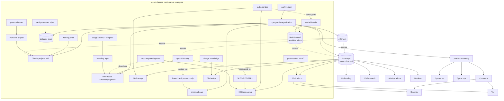

# Cytognosis Asset Ontology (placement DAG, finalized)

> **Status**: Active (contract #3; siblings: PROJECT-MAP.md, ORGANIZATION-ATLAS_2026-07-11.md)
> **Date**: 2026-07-12
> **Author**: @shahin
> **Audience**: everyone, every agent
> **Tags**: `organization`, `ontology`, `taxonomy`, `placement`
> **Variants**: Technical (this doc) - Readable (same filename in Obsidian vault)
> **Machine-readable**: `ontology.yaml` (same folder) - validated acyclic by `scripts/validate_ontology.py`

> [!NOTE]
> **TL;DR**: Every asset class has one or more parents in a directed acyclic graph; following parents answers both questions that matter: WHERE IS IT STORED (follow storage parents) and WHERE IS IT LINKED (follow category parents plus the overlay edges). Multi-parent is normal (a spec belongs to its repo AND the registry AND a board card); cycles are forbidden and script-checked.

## 1. Node types and edge types

| Node type | Meaning | Examples |
|---|---|---|
| surface | a physical home | docs repo, Obsidian vault, Claude projects, mission board, cytomem, datasets store, code repos |
| pillar | placement category (the spine) | `00-Inbox` ... `07-Design` |
| taxon | product vocabulary (describes, never stores) | Cytoverse, Cytoscope, Cytonome, Cytoplex, Yar |
| project | Claude workspace | Grants, Design, Yar, ... (12) |
| repo | git repository | website, branding, cytomem, ... |
| asset-class | a kind of thing needing placement | technical doc, twin, spec, token, card, dataset |

| Edge type | Direction | In DAG? |
|---|---|---|
| `is_a` / `part_of` | child -> parent | yes |
| `stored_under` | asset-class -> surface or pillar path | yes |
| `slice_of` | project `_context` -> pillar subtree | yes |
| `mirrors` | vault pillar -> docs pillar | yes |
| overlay: `paired_with`, `registered_in`, `carded_on`, `ingested_by`, `upstream_of`, `dispatches` | one-way flow annotations | no (excluded from cycle check, still acyclic by convention) |

## 2. The DAG (core view; complete graph in ontology.yaml)

## 3. Placement procedure (answers "where does X go")

1. **Personal?** -> Personal project (never the docs repo).
2. **Data or large binary?** -> `https://github.com/cytognosis/datasets/tree/main/cytognosis<area>/`.
3. **Code?** -> its repo `src/`; governed by a spec (spec-guard enforces).
4. **Spec?** -> owning repo `specs/NNN-slug/` + row in SPEC-REGISTRY + one board card (pointers only). Deltas in `specs/NNN/changes/`.
5. **Design?** tokens/components/template -> branding repo (single upstream: published Claude Design v11.2.1, never hand-edit); knowledge/track plans -> `07-Design`; source exports/zips -> datasets store.
6. **Document?** finished -> docs pillar per PROJECT-MAP; product WHAT -> `03-Products/<Taxon>/<Product>/`; per-repo HOW -> `04-Engineering/<repo>/` (R-WHAT/HOW, cross-linked both ways); draft -> owning Claude project; readable twin -> vault, same path, same filename (R-TWIN); agent handoff -> `*_prompt.md` beside the original.
7. **Tracking?** -> board card carrying only IDs, paths, status (pointer discipline).
8. **Steering?** -> `AGENTS.md` + `.specify/memory/constitution.md` per repo; `CLAUDE.md`/`PLAN.md` per project; skills in cytoskills.
9. **Retired?** -> nearest `_archive/` (archive, never delete); pre-operation backups -> `Refactor/_safety-archives/`.
10. **Everything** above is ingested by cytomem (specs via cytomem spec 004); memory artifacts and tasks live only in cytomem.

## 4. Linking rules (where each asset is REACHED from)

- Projects reach docs ONLY via `_context` symlinks to their PROJECT-MAP slice (R-SLICE: narrowest slice; whole pillar only for the single owning project).
- Twins and originals link each other in the header Variants line (bidirectional, mandatory).
- WHAT pages and HOW folders cross-link both directions.
- Specs link: registry row, board card, governing code paths (in Checks), and verification record.
- Board cards link back by spec ID and repo path; never carry content.
- The three contracts cross-link: PROJECT-MAP (projects to pillars), ORGANIZATION-ATLAS (audit + rules), ONTOLOGY (this DAG).

## 5. Invariants (validated by `scripts/validate_ontology.py`)

1. Graph is acyclic (topological sort succeeds), including overlay edges.
2. Every node except the root has at least one parent; multi-parent allowed.
3. Every CONCRETE asset-class reaches at least one surface through `stored_under`/`is_a` ancestry (nothing is homeless); abstract groupings use type `class` and are exempt (their children carry the storage parents).
4. Product taxa never appear as storage parents of documents outside `03-Products` and `05-Research` subtrees (taxonomy describes, placement stores).
5. Exactly one home-of-record parent per document asset (docs repo); vault holds twins only.

## 6. Change control

This ontology changes only via a dated delta note in `ORGANIZATION-ATLAS` change log plus a commit updating `ontology.yaml`; the validator must pass in the same commit. Wave cards W1, W2, and W3 implement the current gaps (atlas M1-M12).
