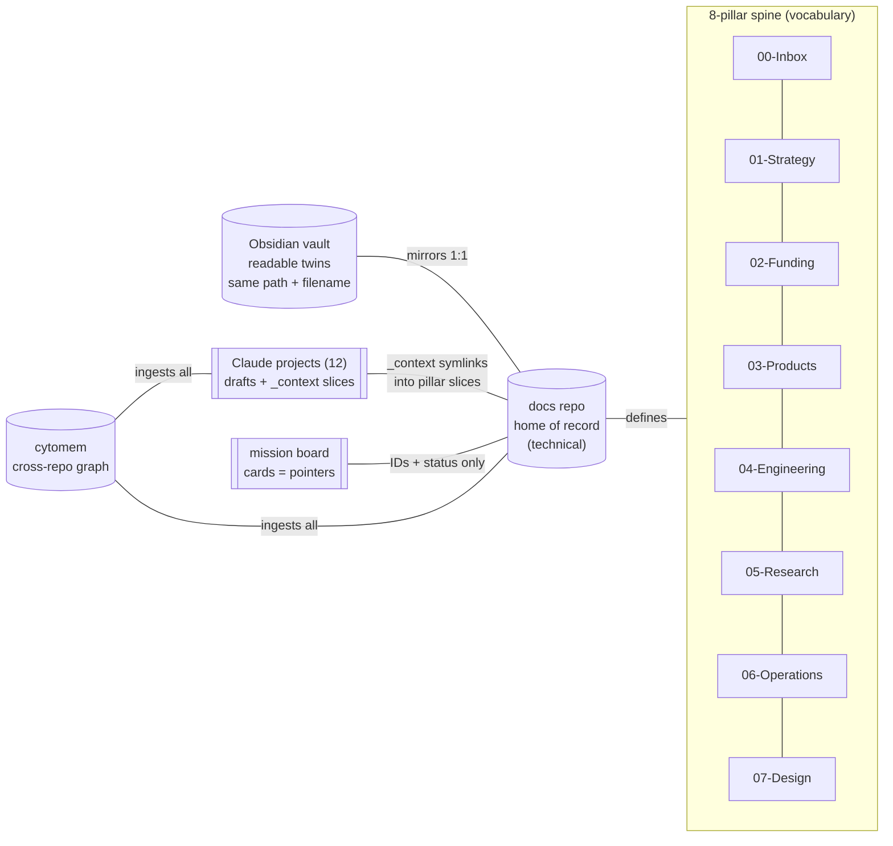

# Organization Atlas: structures, vocabulary, misalignments, revision waves

> **Status**: Active (the audit + contract companion to PROJECT-MAP.md)
> **Date**: 2026-07-11
> **Author**: @shahin
> **Audience**: operators, agents
> **Tags**: `organization`, `taxonomy`, `audit`, `vocabulary`
> **Variants**: Technical (this doc) - Readable (same filename in Obsidian vault)

> [!NOTE]
> **TL;DR**: One spine (the 8 pillars) is supposed to organize three surfaces (docs repo, Obsidian vault, Claude projects) plus the board and memory. The spine is healthy in docs, PARTIAL in the vault (legacy folders + divergent level-2), and leaky in projects (mixed `_context` granularity). This doc inventories every convention in force, lists every found misalignment with a severity, and defines revision waves executed iteratively via board cards.

## 1. The systems in force (vocabulary inventory)

| Layer | Convention | Values / form |
|---|---|---|
| Placement spine | 8 pillars, `NN-Name` | `00-Inbox, 01-Strategy, 02-Funding, 03-Products, 04-Engineering, 05-Research, 06-Operations, 07-Design` |
| Product taxonomy (describes, never places) | platform components | Cytoverse, Cytoscope, Cytonome; products Cytoplex, Yar; research areas `cytoverse/neuroverse/foundational` |
| Doc header | blockquote metadata | Status (Active, Draft, Accepted, Done, Superseded), Date, Author, Audience, Tags (backtick kebab), Variants |
| Variants | 2 + 1 | Technical (docs repo) - Readable (SAME filename, SAME relative path, Obsidian vault) - Agent (`*_prompt.md`, true handoffs only); links bidirectional, no filename suffixes |
| Specs | first-class artifacts | in-repo `specs/NNN-slug/spec.md`, EARS `REQ-NNN-NN`, executable Checks, statuses Draft, Approved, Implementing, Live, Superseded; evolution via `changes/` deltas; index `04-Engineering/specs/SPEC-REGISTRY.md` |
| Structural markers | reserved names | `_context/` (symlinks to docs slices), `_archive/` (never delete), `_safety-archives/` (pre-op backups), `MOVED/RELOCATED` stub files, dated folders `*_YYYY-MM(-DD)`, `NN-` ordering prefixes |
| Projects | 12 workspaces | drafts only; `PLAN.md` + `_context/` (+ optional `CLAUDE.md`, `README.md`); finished docs promote to docs repo; versions as git commits, never copies |
| Board (mission hub) | dispatch/tracking | organization > project > issue (pointer discipline: IDs + status only), workspace (worktree branch `vk/NNNN-slug`) > session (executor pinned) > execution |
| Memory (cytomem) | graph vocabulary | artifact, episode, task (status todo/in-progress/done/blocked/backlog; priority p0-p3; track; board), backlog idea, links |
| Repos | `cyto*` family + products | engineering docs per repo under `04-Engineering/<repo>/` |
| Commits | one identity | `Shahin Mohammadi <mohammadi@cytognosis.org>`; branches per effort; conventional-commit prefixes |

## 2. The intended shape (one spine, three surfaces)

## 3. Misalignments found (2026-07-11 audit, severity-ordered)

| # | Where | Problem | Severity | Fix wave |
|---|---|---|---|---|
| M1 | Vault root | Legacy pre-pillar folders coexist with pillars: `Cytos`, `Funding`, `Infrastructure`, `Neuroverse`, and a misnumbered `02-Products`; `REORG_NOTES.md` half-done | HIGH (breaks mirror contract) | W1 |
| M2 | Vault level-2 | Pillar interiors diverge from docs (e.g., vault `01-Strategy/{fundraising,master-plan,monday}` vs docs `{data-strategy,helix,partnerships,planning,tracks}`; vault `02-Funding` nearly empty vs 13 docs subdirs) | HIGH | W1 |
| M3 | Projects `_context` | Mixed granularity: whole-pillar links (Infra -> all of `04-Engineering`, Grants -> all of `05-Research`) leak other projects' slices; Shahin's example `Infrastructure and Tooling/_context/04-Engineering/cytoplex` is Yar's product code surfacing in Infra | HIGH | W2 |
| M4 | docs `04-Engineering` | Catch-all: product-tied docs (`cytoplex`, `yar`, `cytos`) sit beside true infra (`infrastructure`, `toolchain`, `specs`, `agent-integration`) while `03-Products/Cytonome/{Cytoplex,Yar}` also exist; split-brain WHAT vs HOW never written down | HIGH (rule needed, moves maybe not) | W2 |
| M5 | docs-side `simple/` folders | Legacy convention: `02-Funding/simple/`, plus tonight's own `simple/PROJECT-MAP.md` and `04-Engineering/specs/simple/` violate the vault-twin rule (self-inflicted, 2026-07-11) | MED | W0 (tonight) |
| M6 | Yar project | Duplicate links `_context/Yar` and `_context/Yar-product` -> same target; case-colliding `yar` alongside | LOW | W0 (tonight) |
| M7 | Website project | Nonstandard layout: `MASTER_DRIVE_PLAN.md` instead of `PLAN.md`; stale `README_HANDOFF.md` (Ali-addressed, dead layout); `WEBSITE_DESIGN_HANDBOOK.md` belongs under `07-Design` review | MED | W0 stub + W2 |
| M8 | Science and Platform | Design-era leftovers post split: `design/` (pointer, fine), `design-system-consolidation-2026-05/`, `design-system-merge-2026-07/` (large, off-limits marker), `NeuroMONDO-ontologies-MOVED.md` stub | MED | W3 |
| M9 | docs level-2 sprawl | `02-Funding` 13 subdirs incl. dated one-offs at structural level (`runway-comp-decision-2026-06`, `schema-survey-2026-05` in 04) | MED | W3 |
| M10 | Duplicate names across pillars | `data-strategy` under both `01-Strategy` and `06-Operations` | LOW | W3 |
| M11 | Projects overlap | `Cytognosis` links whole `06-Operations` (Operations' pillar) + `01-Strategy`; boundary Cytognosis-vs-Operations undefined in practice | LOW | W2 |
| M12 | Stub project | `Strategic Planning` permanent stub | LOW | W3 (archive decision) |

## 4. Target rules (added to the contract)

1. **R-WHAT/HOW**: `03-Products/<Component>/<Product>/` holds WHAT (product definition, strategy, product specs); `04-Engineering/<repo>/` holds HOW (per-repo engineering docs, named exactly after the repo). Cross-links mandatory in both directions. No third home.
2. **R-SLICE**: `_context` links point at the NARROWEST slice a project owns (per PROJECT-MAP), never a whole pillar, except the single owning project of that pillar (Operations owns 06, Design owns 07, Grants owns 02).
3. **R-MIRROR**: the vault contains ONLY the 8 pillars at root (plus README); every twin at the docs-identical path; legacy folders migrate into pillars or `_archive`.
4. **R-TWIN**: readable twins ONLY in the vault (no `simple/` folders in the docs repo, projects keep `simple/` for working drafts only).
5. **R-DATED**: dated working folders live under `_archive/` or the owning project, never as structural level-2 in a pillar.

## 5. Revision waves (iterative, each verified before the next)

| Wave | Scope | Mechanism |
|---|---|---|
| W0 (tonight) | M5 twin relocation, M6 duplicate link, M7 PLAN.md stub + handoff archived | direct, backed up, committed |
| W1 | Vault realignment to R-MIRROR (migrate 5 legacy roots + reconcile level-2; content-preserving moves with redirects) | board card, Claude Code run, safety bundle first |
| W2 | `_context` granularity to R-SLICE across all 12 projects; write R-WHAT/HOW into PROJECT-MAP; relabel or move `04-Engineering/{cytoplex,yar,cytos}` per rule (likely keep location, add contract headers + cross-links) | board card, spec-style checklist |
| W3 | Sprawl + leftovers (M8, M9, M10, M12) | board cards, one per item |
| Each wave | update this atlas section 3 (strike fixed rows), cytomem re-ingest, STATUS-SIMPLE entry | standing rule |
