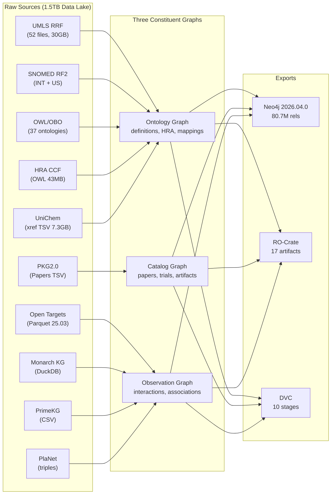

# Cytos Architecture

> Last updated: 2026-05-12 | KG: **10.7M nodes × 118.5M edges** | Neo4j: **80.7M rels**

## 1. Three Constituent Graphs

The Cytos KG is composed of three constituent graphs:

| Graph | Content | Primary Sources |
|-------|---------|----------------|
| **Ontology Graph** | Definitions, hierarchies, identifiers, mappings, HRA spatial scaffold | UMLS, SNOMED, OBO ontologies, UniChem, Ensembl, HRA CCF |
| **Catalog Graph** | Papers, clinical trials, datasets, models, software, organizations | PKG2.0, OpenAlex, ClinicalTrials.gov |
| **Observation Graph** | Measured associations, interactions, annotations, clinical findings | Monarch, PrimeKG, Open Targets, PlaNet |

Plus an orthogonal **Classification Layer** (UMLS Semantic Network, BioLink categories, MeSH, AIO, CSO).

## 2. Module Map

```
src/cytos/
├── cli/                  # Typer CLI (14 command groups)
├── sources/              # Source descriptors + HTTP fetcher + registry
├── ontology/             # Ontology manager [Phase F]
│   ├── registry.py       # registry.yaml loader/validator
│   ├── fetcher.py        # OWL/OBO download + format conversion
│   ├── validator.py      # ROBOT-based OWL validation
│   ├── reasoner.py       # EL++ reasoning via ROBOT
│   └── converter.py      # OBO↔OWL, OWL→KGX conversions
├── ingest/               # Ingestion runner (phase orchestrator)
│   ├── parsers/          # 7 format parsers (RRF, RF2, OWL, Parquet, etc.)
│   ├── linkmlize/        # 10 source-to-LinkML normalizers
│   ├── ensembl.py        # Ensembl release 115 gene/protein loader
│   └── ontology_owl.py   # Pronto-based OWL → KGX pipeline
├── schema/               # LinkML validation runtime
├── harmonize/            # Entity resolution + SSSOM + prefix policy
├── kg/                   # Knowledge graph construction
│   ├── builder.py        # KGBuilder: DuckDB-based KGX construction (860 lines)
│   ├── exporter.py       # Neo4j/Parquet/TSV exports
│   ├── hra_ingest.py     # Human Reference Atlas CCF parser
│   ├── semantic_overlay.py # TUI→BioLink category propagation
│   └── source_resolver.py  # Manifest-based URI resolution
├── services/             # KG-backed query services
│   ├── hra.py            # HRA organ catalog, spatial queries
│   ├── single_cell.py    # AnnData/TileDB-SOMA backend
│   ├── ontology_mapper.py # Free-text → ontology resolution
│   ├── cellxgene.py      # CellxGene Census integration
│   └── rest_apis.py      # OLS4, Biothings, Open Targets clients
├── pipelines/
│   ├── dagster_definitions.py  # Dagster assets + jobs
│   └── data_engineering/
│       ├── convert_to_neo4j.py # KGX → Neo4j CSV bulk import
│       ├── bibtex_io.py        # BibTeX import/export with round-trip
│       ├── parse_uniprot.py    # UniProt XML SAX streaming → KGX
│       └── rocrate.py          # RO-Crate metadata generator
├── validate/             # KG validation checks
├── features/             # Modality featurizers [stub]
├── models/               # Neural network modules [stub]
├── train/                # Training orchestration [stub]
├── evaluate/             # Evaluation metrics [stub]
├── publish/              # RO-Crate packaging + export
├── rag/                  # RAG/LLM integration [stub]
└── utils/                # IO, paths, checksums
```

## 3. Data Flow



## 4. Data Lake Structure

```
/home/mohammadi/datasets/         ← 1.5 TB total
├── 01-ontologies/          75GB  ← OWL/OBO files + registry.yaml
│   ├── owl/                      ← Flat deduplicated OWL files
│   ├── mappings/                 ← SSSOM mapping files
│   ├── archive/                  ← Legacy directory structure
│   └── registry.yaml             ← Single source of truth
├── 02-vocabularies/        76GB  ← UMLS, SNOMED CT, MeSH
├── 03-knowledge-graphs/   440GB  ← Monarch, PrimeKG, PlaNet, OT, PKG2.0
├── 04-identifiers/        178GB  ← Ensembl, UniChem, OLS4 SSSOM
├── 05-annotations/         12GB  ← CellxGene, HRA, topic areas
├── 06-genotype/           103GB  ← WGS/WES data
├── 07-single-cell/           -   ← TileDB-SOMA pending
├── 08-neuroimaging/       319GB  ← BIDS/NWB datasets
├── 09-literature/            -   ← BibTeX pending
├── 10-embeddings/          34GB  ← Pre-computed
├── 11-benchmarks/          23GB  ← Benchmark datasets
├── 12-network/            200GB  ← Biological networks
└── 13-cell-lines/            -   ← Cell line reference
```

## 5. Neo4j Deployment

| Parameter | Value |
|-----------|-------|
| Version | Neo4j Community 2026.04.0 |
| Database | `cytos` |
| Nodes | 10,705,948 |
| Relationships | 80,698,937 |
| Labels | 53 → 42 canonical (after reclassification) |
| Heap | 8 GB |
| Pagecache | 16 GB |
| DB size on disk | ~8 GB |
| Bolt | `bolt://localhost:7687` |
| HTTP | `http://localhost:7474` |

## 6. HRA Integration (Ontology Graph)

The Human Reference Atlas is a first-class component of the Ontology Graph:

| HRA Component | Nodes | Edges | Role |
|--------------|------:|------:|------|
| Anatomical structures (ASCT+B) | 4,496 | 5,089 (ccf_part_of) | Body coordinate system |
| Cell types | 1,195 | 13,904 (ccf_located_in) | Cell→anatomy mapping |
| Biomarkers | 2,084 | — | Gene/protein→cell type |
| 3D reference organs | 1,713 | — | Spatial meshes |
| Spatial placements | 3,481 | — | x/y/z + rotation + scaling |
| **Total** | **9,493** | **26,444** | **GPS for the body** |

Every Sensor measurement maps to an HRA location via the Sensor Triple: `Sensor → measures_at → HRA/UBERON`.

## 7. Pipeline Orchestration

| Tool | Role | Status |
|------|------|--------|
| **DVC** | 10-stage pipeline (ingest, quality, export, test) | ✅ Active |
| **Dagster** | 5 assets, 3 jobs (quality, export, full_build) | ✅ Installed |
| **RO-Crate** | Provenance (9 sources, 17 artifacts, licenses) | ✅ Generated |
| **pytest** | 33 tests (integrity, headers, BioLink, CURIEs, totals) | ✅ 33/33 |
