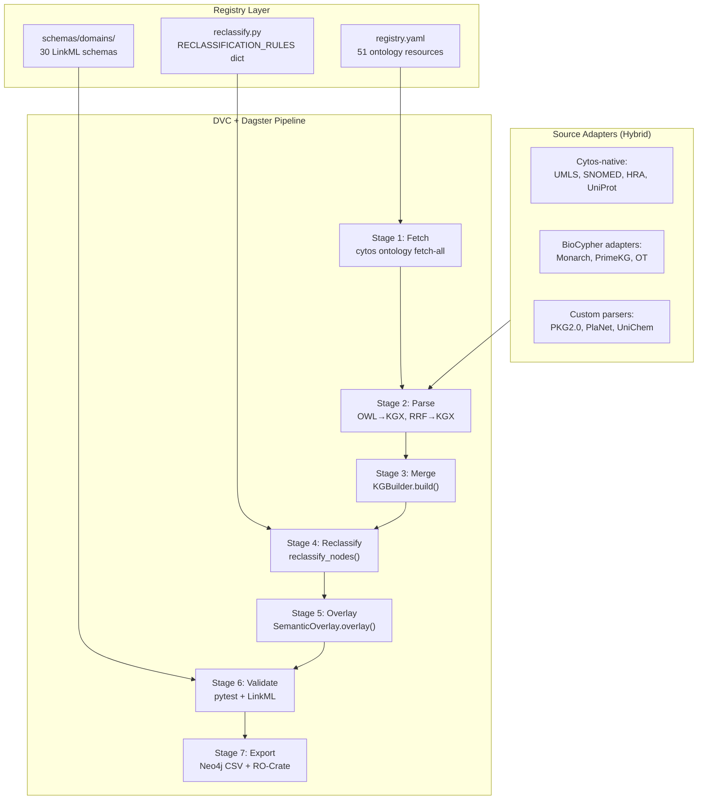

# Cytos KG Build Automation Strategy

> Last updated: 2026-05-12 | Status: DESIGN

## Problem Statement

The Cytos KG currently requires ~15 manual steps to rebuild. Source data evolves (ontology releases, new KG versions, paper additions), so we need a fully automated, reproducible pipeline that can rebuild the entire 10.7M node, 118.5M edge KG from source data in under 4 hours.

## Architecture Decision: Cytos-Native vs BioCypher

### Option 1: BioCypher Adapters (Evaluated, Not Recommended as Primary)

BioCypher provides a standardized adapter pattern for building biomedical KGs. We evaluated it for Cytos.

| Pro | Con |
|-----|-----|
| Standard adapter interface | Opinionated about schema mapping (BioLink-only) |
| Community adapters exist for some sources | Our Three-Graph taxonomy (Ontology/Catalog/Observation) is not a first-class BioCypher concept |
| Neo4j/Postgres export built-in | Our DuckDB-based KGBuilder is 10x faster than BioCypher's RDF pipeline |
| Active community | Custom reclassification rules (TUI→cytos: types) would need to bypass BioCypher's mapper |
| Schema YAML configuration | SSSOM/UniChem/Ensembl cross-reference layers don't fit the adapter pattern well |

**Verdict**: Use BioCypher adapters ONLY for external sources (Monarch, PrimeKG, Open Targets) where community adapters exist. Keep the Cytos-native pipeline for core UMLS/SNOMED/ontology ingestion, reclassification, and the semantic overlay.

### Option 2: Cytos-Native Pipeline (Recommended)

Extend the existing DVC + Dagster + DuckDB architecture with:

1. **Registry-driven ontology management** (Phase B+F: done)
2. **Declarative reclassification rules** (Phase C: done)
3. **Schema-validated output** (Phase D: done)
4. **Dagster assets for each pipeline stage** (to build)

## Automation Architecture



## Dagster Asset Definitions (Target State)

```python
# Each pipeline stage = one Dagster asset
@asset(group_name="ontology_graph")
def ontology_owl_nodes(registry: OntologyRegistry) -> pl.DataFrame:
    """Parse all registered OWL files → KGX nodes."""

@asset(group_name="ontology_graph")
def umls_nodes(mrsty: Path, mrcon: Path) -> pl.DataFrame:
    """Parse UMLS RRF → KGX nodes with TUI assignments."""

@asset(group_name="catalog_graph")
def scholarly_nodes(pkg_path: Path) -> pl.DataFrame:
    """Parse PKG2.0 → Publication + ClinicalTrial nodes."""

@asset(group_name="observation_graph")
def monarch_nodes() -> pl.DataFrame:
    """BioCypher adapter: Monarch KGX → KGX nodes."""

@asset(deps=[ontology_owl_nodes, umls_nodes, scholarly_nodes, monarch_nodes])
def merged_nodes() -> pl.DataFrame:
    """Merge all node sources, deduplicate by ID."""

@asset(deps=[merged_nodes])
def reclassified_nodes(merged: pl.DataFrame, mrsty: Path) -> pl.DataFrame:
    """Apply reclassification rules."""

@asset(deps=[reclassified_nodes])
def overlaid_nodes(nodes: pl.DataFrame) -> pl.DataFrame:
    """Apply UMLS Semantic Network overlay."""

@asset(deps=[overlaid_nodes])
def validated_kg(nodes: pl.DataFrame, edges: pl.DataFrame) -> bool:
    """Run pytest + LinkML validation."""

@asset(deps=[validated_kg])
def neo4j_export(nodes: Path, edges: Path) -> None:
    """Bulk import to Neo4j."""
```

## Versioning and Reproducibility

| Component | Version Control | Update Frequency |
|-----------|----------------|-----------------|
| `registry.yaml` | Git | When ontology sources change |
| `RECLASSIFICATION_RULES` | Git (in reclassify.py) | When taxonomy decisions change |
| LinkML schemas | Git | When entity types evolve |
| DVC stages | Git (dvc.yaml + dvc.lock) | Every pipeline run |
| Source data | Data lake + checksums | Quarterly (UMLS) / monthly (ontologies) |
| KG output | DVC tracked | Every pipeline run |

## BioCypher Integration Points

For external KGs where community adapters exist:

| Source | BioCypher Adapter | Status |
|--------|------------------|--------|
| Monarch Initiative | `biocypher-monarch` | Available |
| PrimeKG | `biocypher-primekg` | Available |
| Open Targets | Custom adapter needed | Write using BioCypher template |
| STRING PPI | `biocypher-string` | Available |
| DisGeNET | `biocypher-disgenet` | Available |

These adapters would feed into Stage 2 (Parse) of the Cytos pipeline, outputting standard KGX TSVs that merge seamlessly with our native sources.

## Rebuild Commands (Target State)

```bash
# Full rebuild (all stages)
cytos pipeline run --full

# Selective rebuild (specific stage)
cytos pipeline run --stage reclassify

# Ontology update only
cytos ontology fetch-all --check-updates
cytos pipeline run --stage parse --sources ontology

# Single source re-ingestion
cytos pipeline run --source monarch --version latest

# Dry-run validation
cytos pipeline validate --dry-run
```

## Implementation Priority

1. ✅ Registry system (`cytos.ontology.registry`)
2. ✅ Reclassification rules (`cytos.kg.reclassify`)
3. ✅ LinkML schemas (30 domain schemas)
4. ⬜ Dagster asset definitions (convert DVC stages → Dagster assets)
5. ⬜ BioCypher adapter wrappers (Monarch, PrimeKG)
6. ⬜ `cytos pipeline` CLI (orchestration commands)
7. ⬜ Automated version checking (registry → OBO Foundry/BioPortal APIs)
