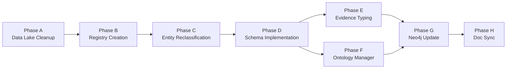

# Cytos Semantic Infrastructure — Execution Plan

> Last updated: 2026-05-12 | Status: PLANNING → READY FOR EXECUTION

## Terminology

| Term | Definition |
|------|-----------|
| **Ontology Graph** | Constituent graph containing definitions, hierarchies, identifiers, mappings |
| **Catalog Graph** | Constituent graph containing human-created artifacts (papers, datasets, models) |
| **Observation Graph** | Constituent graph containing measured/observed associations and interactions |
| **Classification Layer** | Orthogonal tagging system (UMLS STN, BioLink categories, MeSH) |
| **Sensor Triple** | Assay (WHAT) × Location (WHERE) × Schema (HOW) — the Cytoscope backbone |

---

## Phase A: Data Lake Cleanup & Ontology Archive

**Goal**: Archive legacy ontology directories, create flat registry-based structure.

### Steps

| # | Task | Command/Action | Verification |
|---|------|---------------|-------------|
| A1 | Create archive directory | `mkdir -p /home/mohammadi/datasets/01-ontologies/archive` | `ls -la` confirms directory |
| A2 | Move legacy subdirs to archive | `mv 01-ontologies/{biomedical,clinical,neuro,single-cell} 01-ontologies/archive/` | `ls 01-ontologies/archive/` shows 4+ dirs |
| A3 | Create flat `/owl/` directory | `mkdir -p /home/mohammadi/datasets/01-ontologies/owl` | Directory exists |
| A4 | Create `/mappings/` directory | `mkdir -p /home/mohammadi/datasets/01-ontologies/mappings` | Directory exists |
| A5 | Deduplicate OWL files into `/owl/` | Script: find all .owl/.obo, copy unique files to `/owl/` with canonical names | `ls owl/ | wc -l` ≥ 37 files |
| A6 | Validate no broken symlinks in cytos/data | `find /home/mohammadi/repos/cytognosis/cytos/data -type l ! -exec test -e {} \; -print` | Zero output |

**Verification**: `ls -la 01-ontologies/` shows `archive/`, `owl/`, `mappings/`, `registry.yaml`

---

## Phase B: Registry Creation

**Goal**: Build `registry.yaml` as single source of truth for all semantic resources.

### Steps

| # | Task | Details | Verification |
|---|------|---------|-------------|
| B1 | Create registry schema | Define YAML structure: id, name, type, version, url, owl_path, entity_types, xrefs | Schema validates with yamllint |
| B2 | Register 50+ ontologies | One entry per ontology/vocabulary/identifier registry | `yq '.resources | length' registry.yaml` ≥ 50 |
| B3 | Annotate entity types per ontology | Tag each resource with BioLink categories it covers | All 42 canonical types have ≥1 resource |
| B4 | Add version tracking | Current version + latest available version fields | `yq '.resources[].version_installed' registry.yaml | sort -u` shows versions |
| B5 | Cross-reference sources | Link each ontology to the Cytos Graph it contributes to (OG/CG/ObG) | Every resource has `graph: ontology|catalog|observation` |
| B6 | Commit registry to repo | `cp registry.yaml cytos/design/registry.yaml && git add` | File tracked in git |

**Verification**: `python3 -c "import yaml; r=yaml.safe_load(open('registry.yaml')); print(len(r['resources']))"` ≥ 50

---

## Phase C: Entity Reclassification

**Goal**: Resolve all NamedThing, InformationContentEntity, and mistyped nodes.

### Steps

| # | Task | Nodes | Method | Verification |
|---|------|------:|--------|-------------|
| C1 | Reclassify PlaNet NamedThing | 184,861 | Map KG IDs to MeSH/CUI → resolve entity type via UMLS semantic type | `grep NamedThing planet_nodes.tsv | wc -l` = 0 |
| C2 | Reclassify Core NamedThing | 77,649 | Resolve via prefix analysis (UMLS CUI → STY → BioLink) | NamedThing reduced by ≥80% |
| C3 | Reclassify InformationContentEntity | 597,848 | Split by UMLS STY: T047→Disease, T061→Procedure, T033→ClinicalFinding | ICE reduced by ≥70% |
| C4 | Split Agent into Organization | 3,480 | Category rename in nodes.tsv | `grep Organization nodes.tsv | wc -l` ≥ 3000 |
| C5 | Split IndividualOrganism into OccupationalRole | 7,829 | Category rename | `grep OccupationalRole nodes.tsv | wc -l` ≥ 7000 |
| C6 | Rename PopulationOfIndividualOrganisms → PopulationGroup | 12,109 | Category rename | Grep confirms |
| C7 | Rename QuantityValue → MeasurementUnit | 5,981 | Category rename | Grep confirms |
| C8 | Split Behavior into NeurobehavioralPhenotype | 5,003 | Map via UMLS STY: T053→Behavior, T048→Mental process | New categories in nodes.tsv |
| C9 | Validate all reclassifications | — | Run pytest integrity suite | 33/33 tests pass |

**Verification**: `python3 -c "..." ` counts NamedThing < 50K (from 297K), ICE < 180K (from 598K)

---

## Phase D: Schema Implementation

**Goal**: Create/update LinkML schemas for all 42 canonical entity types.

### Steps

| # | Task | Schema File | Entities Covered | Verification |
|---|------|------------|-----------------|-------------|
| D1 | Create `cellline.yaml` | `schemas/domains/cellline.yaml` | CellLine with CLO/Cellosaurus/DepMap fields, cell_type_of_origin, tissue, disease, protocol | `linkml validate` passes |
| D2 | Create `device.yaml` | `schemas/domains/device.yaml` | Device → MedicalDevice + DiagnosticDevice + Sensor hierarchy | `linkml validate` passes |
| D3 | Create `behavior.yaml` | `schemas/domains/behavior.yaml` | NeurobehavioralPhenotype + BehavioralAssessment (PHQ-9, GAD-7) | `linkml validate` passes |
| D4 | Create `exposure.yaml` | `schemas/domains/exposure.yaml` | ExposureEntity with 9 subtypes (chemical, dietary, social, etc.) | `linkml validate` passes |
| D5 | Create `geography.yaml` | `schemas/domains/geography.yaml` | GeographicLocation with GAZ + ISO 3166 | `linkml validate` passes |
| D6 | Create `measurement.yaml` | `schemas/domains/measurement.yaml` | MeasurementUnit (UO + QUDT) | `linkml validate` passes |
| D7 | Create `population.yaml` | `schemas/domains/population.yaml` | PopulationGroup, EthnicGroup | `linkml validate` passes |
| D8 | Create `agent.yaml` | `schemas/domains/agent.yaml` | Organization (ROR + Schema.org) + OccupationalRole | `linkml validate` passes |
| D9 | Update `clinical.yaml` | `schemas/domains/clinical.yaml` | ClinicalFinding, ClinicalAttribute, Procedure aligned to OMOP CDM | `linkml validate` passes |
| D10 | Update `hra.yaml` | `schemas/domains/hra.yaml` | Add SpatialPlacement coordinate fields, ccf_located_in edges | `linkml validate` passes |
| D11 | Update `variant.yaml` | `schemas/domains/variant.yaml` | Dual-graph: variant definition (OG) + variant-disease association (ObG) | `linkml validate` passes |
| D12 | Create `dataset.yaml` | `schemas/domains/dataset.yaml` | FAIR fields: DCAT, EDAM format, RO-Crate, Croissant | `linkml validate` passes |
| D13 | Update `cytos.yaml` master | `schemas/cytos.yaml` | Import all new domain schemas | Full schema validates |

**Verification**: `linkml-validate schemas/cytos.yaml` passes with 0 errors

---

## Phase E: Interaction Evidence Typing

**Goal**: Add MI ontology evidence metadata to molecular interaction edges.

### Steps

| # | Task | Edges | Method | Verification |
|---|------|------:|--------|-------------|
| E1 | Create interaction evidence schema | — | Define edge metadata YAML: evidence_class, detection_method (MI term), confidence, source_db | Schema defined |
| E2 | Subtype Monarch `interacts_with` | 2,758,065 | Map to MI:0190 subtypes using Monarch source_database field | ≥80% edges typed |
| E3 | Subtype PrimeKG `interacts_with` | 3,366,084 | Map via PrimeKG source column (STRING, BioGRID, IntAct) | ≥80% edges typed |
| E4 | Decompose `related_to` | 17,589,344 | Split UMLS MRREL REL types: PAR→subclass_of, SY→synonym_of, RB/RN→broader/narrower | related_to reduced by ≥60% |
| E5 | Add evidence typing to OT edges | 465,572 | Map OT evidence_type field to edge metadata | 100% edges have evidence_type |
| E6 | Validate typed edges | — | Count edges by evidence_class | Distribution report generated |

**Verification**: `related_to` < 7M (from 17.6M); `interacts_with` has `evidence_class` in ≥80% of edges

---

## Phase F: Ontology Manager Module

**Goal**: Build `src/cytos/ontology/` package for registry-based ontology management.

### Steps

| # | Task | File | Function | Verification |
|---|------|------|----------|-------------|
| F1 | Registry loader | `registry.py` | Load/validate `registry.yaml`, expose API | `from cytos.ontology import Registry; r = Registry()` |
| F2 | Fetcher | `fetcher.py` | Download OWL/OBO by ID or query, auto-convert OBO→OWL | `cytos ontology fetch --id cl` downloads CL |
| F3 | Validator | `validator.py` | OWL validation via ROBOT, check EL++ profile | `cytos ontology validate --id cl` passes |
| F4 | Reasoner | `reasoner.py` | EL++ reasoning via ROBOT, materialize inferences | `cytos ontology reason --id cl` outputs inferred OWL |
| F5 | Converter | `converter.py` | OBO↔OWL, OWL→KGX, OWL→Parquet conversions | `cytos ontology convert --id cl --format kgx` |
| F6 | CLI | `cli.py` | Typer CLI for all above operations | `cytos ontology --help` shows 5 subcommands |
| F7 | Tests | `tests/test_ontology.py` | Unit tests for all module functions | `pytest tests/test_ontology.py -v` passes |

**Verification**: `cytos ontology status` shows registry with 50+ resources, versions, and validation status

---

## Phase G: Update Neo4j and Validate

**Goal**: Re-export KG to Neo4j with reclassified entities and evidence typing.

### Steps

| # | Task | Details | Verification |
|---|------|---------|-------------|
| G1 | Re-run KGBuilder with updated categories | `python3 -m cytos.kg.builder` | nodes.tsv has new categories |
| G2 | Export to Neo4j CSV format | `python3 -m cytos.pipelines.data_engineering.convert_to_neo4j` | CSV files generated |
| G3 | Bulk import to Neo4j | `neo4j-admin database import full cytos ...` | Import succeeds |
| G4 | Verify node counts | `MATCH (n) RETURN labels(n), count(n) ORDER BY count(n) DESC` | NamedThing < 50K |
| G5 | Verify HRA spatial data | `MATCH (n:SpatialPlacement) RETURN count(n)` | ≥ 3,481 |
| G6 | Verify evidence-typed edges | `MATCH ()-[r]->() WHERE r.evidence_class IS NOT NULL RETURN count(r)` | > 0 |
| G7 | Run full test suite | `pytest tests/ -v` | All tests pass |

**Verification**: Neo4j Cypher: `MATCH (n) RETURN count(n)` ≈ 10.7M; `MATCH ()-[r]->() RETURN count(r)` ≈ 80.7M

---

## Phase H: Documentation Sync

**Goal**: All design docs reflect final architecture.

### Steps

| # | Task | File | Changes |
|---|------|------|---------|
| H1 | Update README.md | `design/README.md` | Three Constituent Graphs, updated stats |
| H2 | Update ARCHITECTURE.md | `design/ARCHITECTURE.md` | Three Graphs in data flow, HRA integration |
| H3 | Update SCHEMAS.md | `design/SCHEMAS.md` | 42 canonical types, maturity ratings |
| H4 | Update REQUIREMENTS.md | `design/REQUIREMENTS.md` | New FRs for ontology manager, FAIR, Sensor |
| H5 | Update ROADMAP.md | `design/ROADMAP.md` | New priorities reflecting Phase C-G |
| H6 | Update TASKS.md | `design/TASKS.md` | Phase A-H task list with status |
| H7 | Update HRA_INTEGRATION.md | `design/HRA_INTEGRATION.md` | Full Ontology Graph integration, Sensor mapping |
| H8 | Create EXECUTION_PLAN.md | `design/EXECUTION_PLAN.md` | This document |

**Verification**: All 8 docs consistent with each other; grep for "Semantic World" returns 0 hits

---

## Execution Order

## Risk Register

| Risk | Likelihood | Impact | Mitigation |
|------|-----------|--------|-----------|
| UMLS MRREL decomposition produces false positives | MEDIUM | HIGH | Sample 1000 edges manually before bulk reclassification |
| MI ontology alignment gaps (some interactions have no MI term) | LOW | MEDIUM | Use "unclassified" bin, flag for manual curation |
| Schema validation breaks existing pipeline | MEDIUM | HIGH | Run full test suite after each phase; keep backward-compatible fields |
| Registry YAML becomes too large (>50 resources) | LOW | LOW | Split into `registry/ontologies.yaml`, `registry/vocabs.yaml` if needed |
| HRA spatial coordinates incompatible with new schemas | LOW | MEDIUM | Test with 10 known HRA-anchored datasets before bulk update |
