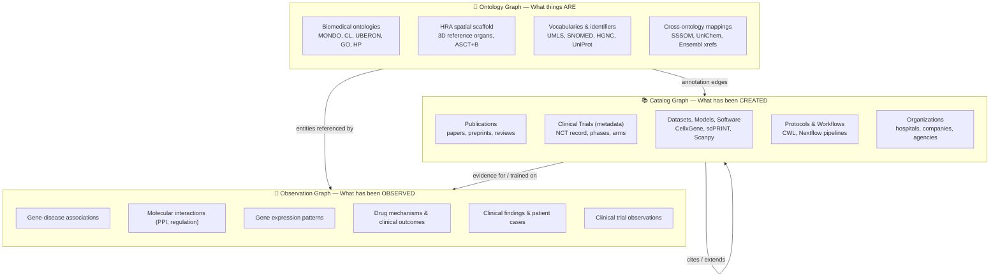

# Cytos Knowledge Graph Platform — Design Overview

> **Version**: 3.0.0 | **Date**: 2026-05-12 | **Author**: AI Agent (Antigravity)
> **Repository**: `/home/mohammadi/repos/cytognosis/cytos`

## 1. Vision

Cytos is the data backbone of the Cytognosis platform ("GPS for Health"). It constructs a unified biomedical knowledge graph from 50+ source vocabularies, ontologies, external KGs, and cross-reference databases, organized into three constituent graphs, then layers AI-ready featurizations for the Cytoverse health coordinate system.

## 2. The Three Constituent Graphs

The Cytos KG is composed of three constituent graphs, plus an orthogonal classification layer:

| Constituent Graph | Mnemonic | Analogy | Stability |
|------------------|----------|---------|-----------|
| **Ontology Graph** | What things ARE | Dictionary + Atlas | Slow-changing (ontology releases) |
| **Catalog Graph** | What has been CREATED | Library catalog | Growing (new papers, models) |
| **Observation Graph** | What has been OBSERVED | Lab notebook | Growing (new experiments) |

## 3. Current State Summary

| Metric | Value |
|--------|------:|
| Total unique nodes | 10,705,948 |
| Total edges (TSV) | 118,539,862 |
| Active Graph DBs | Neo4j, SurrealDB |
| Canonical entity types | 42 |
| Edge predicates | 702 |
| KG layers | 10 |
| Data sources | 9 |
| Data lake size | 1.5 TB |
| LinkML schema files | 22 |
| HRA spatial placements | 3,481 |
| DVC pipeline stages | 10 |
| Test pass rate | 33/33 (100%) |

## 4. KG Layers

| # | Layer | Nodes | Edges | Primary Graph |
|---|-------|------:|------:|--------------|
| 1 | Core (ontologies + UMLS + UniProt) | 8,736,860 | 43,323,578 | Ontology + Observation |
| 2 | PKG2.0 (scholarly) | 1,480,795 | 34,565,345 | Catalog |
| 3 | Monarch Initiative | 1,379,605 | 15,356,321 | Observation |
| 4 | UniChem (chemical xrefs) | 0 | 10,000,000 | Ontology (mappings) |
| 5 | PrimeKG | 129,312 | 8,100,498 | Observation |
| 6 | PlaNet (clinical trials) | 184,861 | 3,765,506 | Observation |
| 7 | Ensembl xrefs | 0 | 1,645,953 | Ontology (mappings) |
| 8 | Monarch SSSOM | 0 | 1,262,397 | Ontology (mappings) |
| 9 | Open Targets | 125,360 | 465,572 | Observation |
| 10 | Topics (AIO+CSO+ROADMAP) | 15,715 | 54,692 | Classification Layer |

## 5. Key Architectural Concepts

### Sensor → Assay → Schema → Location (Cytoscope Backbone)

Every measurement in Cytognosis is described by three dimensions anchored in the Ontology Graph:
- **Assay** (WHAT): OBI/NCIT/EFO ontology term (e.g., scRNA-seq = `EFO:0010183`)
- **Location** (WHERE): HRA/UBERON anatomical coordinate (e.g., brain = `UBERON:0000955`)
- **Schema** (HOW): Data schema that inherits along assay hierarchy (e.g., CellxGene for RNA-seq)

### HRA as Spatial Scaffold

The Human Reference Atlas provides 3D anatomical coordinates (9,493 nodes, 26,444 edges, 3,481 spatial placements) mapping every measurement to a precise body location across 41 organs.

### FAIR Data Access

Dataset nodes in the Catalog Graph are metadata pointers to actual data in the data lake, with FAIR-compliant fields (DCAT, EDAM, RO-Crate, Croissant) for findability, access, interoperability, and reuse.

### Classification Layer (Orthogonal)

UMLS Semantic Network (127 types), BioLink categories (53), MeSH tree numbers (~29K) overlay all three graphs for navigational clustering.

## 6. Design Documents Index

| Document | Description |
|----------|-------------|
| [ARCHITECTURE.md](ARCHITECTURE.md) | System architecture, module map, data flow, data lake |
| [SCHEMAS.md](SCHEMAS.md) | Three-graph entity types, schema maturity, interaction taxonomy |
| [REQUIREMENTS.md](REQUIREMENTS.md) | Functional and non-functional requirements |
| [PROVENANCE.md](PROVENANCE.md) | Data manifest, DVC, RO-Crate, reproducibility |
| [TASKS.md](TASKS.md) | Implementation status, detailed task list |
| [ROADMAP.md](ROADMAP.md) | Prioritized next steps and remaining work |
| [HRA_INTEGRATION.md](HRA_INTEGRATION.md) | Human Reference Atlas spatial scaffold |
| [PIPELINE.md](PIPELINE.md) | Detailed execution pipeline with verification steps |
| [decision_log.md](decision_log.md) | Log of architectural changes and historical decisions |

## 7. Key Design Decisions

| Decision | Rationale |
|----------|-----------|
| Three constituent graphs (Ontology/Catalog/Observation) | Clear separation of concerns: definitions, artifacts, evidence |
| DuckDB over MySQL/Oracle | 100x faster for analytical queries; no server setup |
| SurrealDB adoption | Unified document-graph model, real-time sync, simplified strict schema management |
| Neo4j 2026.04.0 Community | Maintained alongside SurrealDB for specialized Cypher graph analytics |
| KGX format (TSV) | BioCypher/Monarch compatible; universal exchange |
| BioLink Model categories | Industry standard; direct mapping to BioCypher |
| CURIE identifiers | Compact, prefix-expandable; LinkML-native |
| HRA as spatial scaffold | GPS coordinates for the body; 41 organs, 3,481 placements |
| Sensor as parent of all measurement devices | Unifies molecular, cellular, clinical, physiological scales |
| Schema inheritance follows assay ontology | Adding a new data type = find assay term + extend parent schema |
| FAIR fields on Dataset nodes | Metadata/data separation; RO-Crate exportable |
| UMLS Semantic Network as canonical classifier | 127 types, ~80% coverage, propagatable via CUI mapping |
| MI ontology for interaction typing | 4-class taxonomy (functional, experimental, predicted, genetic) |
| CiTO for citation subtyping | Captures citation intent (uses method, uses data, extends, critiques) |
