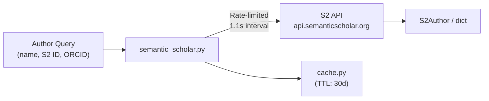

# MODULE: Semantic Scholar Client

> **Package**: `cytos.scholarly.semantic_scholar`
> **Status**: Active
> **Date**: 2026-05-14
> **Owner**: @shmohammadi
> **Lines of Code**: 409
> **Test Coverage**: Manual integration tests (live API)

## Purpose

Provides programmatic access to the Semantic Scholar Academic Graph API, enabling author search, paper discovery, citation graph traversal, and batch operations. This is the primary free alternative to Google Scholar for bibliometric data, operated by the Allen Institute for AI.

## Architecture

### Dependencies

| Dependency | Type | Purpose |
|-----------|------|---------|
| `requests` | PyPI | HTTP client for API calls |
| `S2_API_KEY` | Env var | Optional: dedicated rate limit (1 req/s) |

## Public API

### `search_author(name, *, limit=5, enrich_top=True) -> list[S2Author]`

Search for an author by name. The `/author/search` endpoint returns basic fields; if `enrich_top=True`, the top result is enriched via `get_author()` to include affiliations and external IDs.

| Parameter | Type | Required | Default | Description |
|-----------|------|----------|---------|-------------|
| `name` | `str` | Yes | — | Author full name to search |
| `limit` | `int` | No | `5` | Max results to return |
| `enrich_top` | `bool` | No | `True` | Fetch full details for top result |

**Returns**: `list[S2Author]`

### `get_author(author_id, *, fields=None) -> S2Author | None`

Get full author details by S2 ID or external ID format.

| Parameter | Type | Required | Default | Description |
|-----------|------|----------|---------|-------------|
| `author_id` | `str` | Yes | — | S2 ID, or `"ORCID:0000-..."`, `"DBLP:..."` |
| `fields` | `str \| None` | No | Auto | Comma-separated API fields |

### `get_author_papers(author_id, *, limit=100, fields=None) -> list[dict]`

Paginated retrieval of an author's papers (100 per page, auto-paginated).

### `search_papers(query, *, limit=10, year=None, fields=None) -> list[dict]`

Full-text paper search. Returns papers with TLDRs, citation counts, influence scores.

### `get_paper(paper_id, *, fields=None) -> dict | None`

Single paper lookup by S2 ID, DOI (`"DOI:10.1234/..."`), ArXiv (`"ArXiv:2301.12345"`), or PMID.

### `get_citations(paper_id, *, limit=100, fields=None) -> list[dict]`

Papers that cite a given paper, with citation contexts, intents, and influence flags.

### `get_references(paper_id, *, limit=100, fields=None) -> list[dict]`

Papers referenced by a given paper, with citation contexts.

### `batch_get_papers(paper_ids, *, fields=None) -> list[dict]`

Batch retrieval of up to 500 papers per POST request. Free, no authentication needed.

### `S2Author` (dataclass)

| Field | Type | Default | Description |
|-------|------|---------|-------------|
| `author_id` | `str` | `""` | Semantic Scholar author ID |
| `name` | `str` | `""` | Display name |
| `affiliations` | `list[str]` | `[]` | Current affiliations |
| `homepage` | `str` | `""` | Author homepage URL |
| `paper_count` | `int` | `0` | Total papers indexed |
| `citation_count` | `int` | `0` | Total citations |
| `h_index` | `int` | `0` | h-index |
| `external_ids` | `dict[str, str]` | `{}` | Cross-references (DBLP, ORCID) |

## Configuration

| Variable | Source | Required | Description |
|----------|--------|----------|-------------|
| `S2_API_KEY` | Env var | No | Free API key for dedicated rate limit (1 req/s vs. shared pool) |

## Error Handling

| Error | Cause | Resolution |
|-------|-------|------------|
| `400 Bad Request` | Invalid field names in query | Check S2 API docs for supported fields per endpoint |
| `429 Rate Limited` | Too many requests | Built-in 5s backoff + retry |
| `404 Not Found` | Author/paper not in S2 index | Try alternative ID format or name search |

## Performance

| Operation | Latency | Throughput | Notes |
|-----------|---------|------------|-------|
| `search_author()` | ~2.5s | — | 1.1s interval + enrichment call |
| `get_paper()` | ~1.2s | 1 req/s | Rate-limited |
| `batch_get_papers()` | ~3s | 500 papers/req | POST, most efficient for bulk |

## Known Limitations

1. **Author disambiguation**: Common names (e.g., "S. Mohammadi") return many candidates. The top result may not be the correct person. Use ORCID-based lookup when possible.
2. **No `aliases` field**: The API no longer supports the `aliases` field on search or author endpoints (returns 400). Removed from default fields.
3. **ORCID lookup**: `ORCID:` prefix lookup returns 404 for many valid ORCIDs that aren't cross-referenced in S2's database.

## Changelog

| Date | Change | Author |
|------|--------|--------|
| 2026-05-14 | Initial implementation | @shmohammadi |
| 2026-05-14 | Fixed search fields (removed unsupported `aliases`, `affiliations` from search endpoint) | @shmohammadi |

## Related Documents

- [ADR-001: Tiered Author Identity API Strategy](../adrs/ADR-001-tiered-author-identity-api-strategy.md)
- [MODULE: SerpAPI Scholar](MODULE-serp-scholar.md)
- [MODULE: Cache](MODULE-cache.md)
