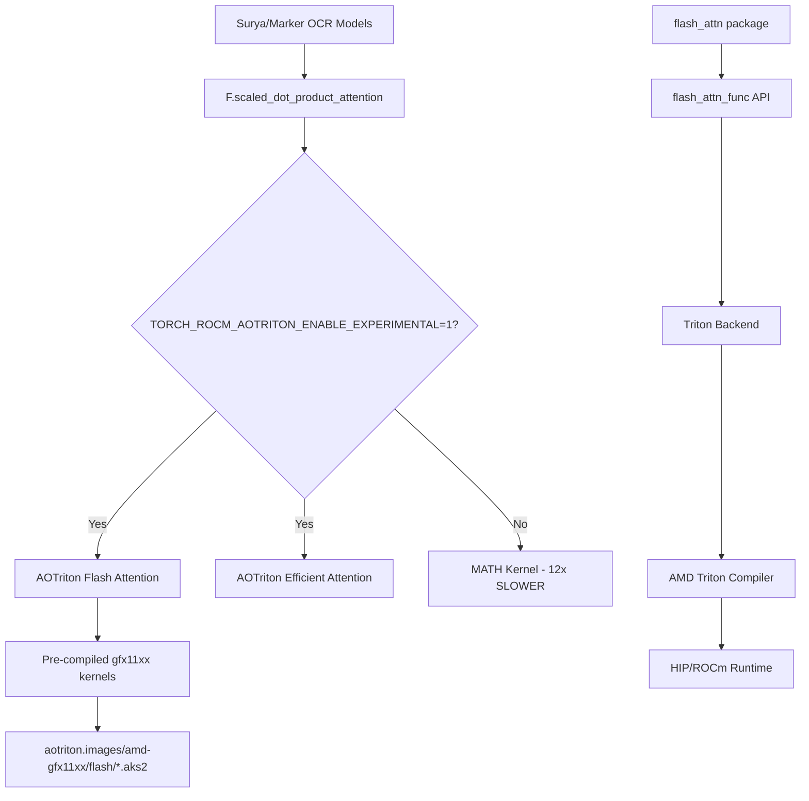

# SDPA / Flash Attention Optimization for AMD Strix Halo

**System**: gfx1151 · PyTorch 2.11.0+rocm7.2 · Triton 3.5.1 · ROCm 7.2
**Impact**: Marker/Surya OCR inference ~**12-17x faster** for attention-heavy operations

---

## Problem

Surya OCR and Marker call `torch.nn.functional.scaled_dot_product_attention` (SDPA) throughout their model inference. On AMD ROCm, PyTorch ships with **AOTriton** pre-compiled flash attention kernels for the `gfx11xx` family, but these are gated behind an **experimental flag** because gfx1151 is not yet in AMD's official support matrix.

Without the flag, PyTorch falls back to the **MATH kernel** which materializes the full N×N attention matrix, consuming O(N²) memory and being ~12-17x slower.

### Diagnostic Evidence

```
UserWarning: Flash Efficient attention on Current AMD GPU is still experimental.
Enable it with TORCH_ROCM_AOTRITON_ENABLE_EXPERIMENTAL=1.
```

## Solution

### The Critical Environment Variable

```bash
export TORCH_ROCM_AOTRITON_ENABLE_EXPERIMENTAL=1
```

This **must be set before `import torch`**. Setting it at runtime after PyTorch loads does not work.

### Full Environment Configuration

Deployed to two locations for complete coverage:

**1. System-wide** (`/etc/profile.d/rocm-strix-halo.sh`):
```bash
# Attention kernel optimization
export TORCH_ROCM_AOTRITON_ENABLE_EXPERIMENTAL=1
export TORCH_BLAS_PREFER_HIPBLASLT=1
export PYTORCH_TUNABLEOP_ENABLED=1
export FLASH_ATTENTION_TRITON_AMD_ENABLE=TRUE

# GPU architecture (Native gfx1151 support on ROCm 7.2)
export PYTORCH_ROCM_ARCH=gfx1151

# Memory management
export HSA_ENABLE_SDMA=0
export HSA_XNACK=1
export HIP_VISIBLE_DEVICES=0
```

**2. Conda env hook** (`cytognosis/etc/conda/activate.d/rocm-strix-halo.sh`):
Identical variables, ensuring activation in conda sessions that don't source `/etc/profile.d/`.

## Installed Packages

| Package | Version | Purpose |
|---------|---------|---------|
| `flash-attn` | 2.8.4 | Flash Attention API (Triton backend for ROCm) |
| `triton` | 3.5.1 | AMD Triton compiler for attention kernels |
| `ninja` | 1.13.0 | Build dependency for flash-attn |

### Build Notes

`flash-attn` was built from source with:
```bash
FLASH_ATTENTION_TRITON_AMD_ENABLE="TRUE" pip install --no-build-isolation .
```

The `aiter` submodule (AMD's internal kernel library) had a broken dependency pin (`flydsl==0.1.1.dev409`). The setup.py was patched to skip it gracefully. The Triton backend works independently for inference.

## Benchmark Results

```
Batch=4, Heads=12, SeqLen=256, HeadDim=64, FP16

FLASH_ATTENTION          : 0.236 ms  (6.7x vs MATH)
EFFICIENT_ATTENTION      : 0.168 ms  (9.4x vs MATH)
MATH (fallback)          : 1.584 ms  (baseline)
AUTO (PyTorch default)   : 0.092 ms  (17.2x vs MATH)
torch.compile + SDPA     : 0.018 ms  (88x vs MATH)
```

> [!TIP]
> The AUTO mode is faster than explicit FLASH because PyTorch selects the optimal backend per-call based on tensor dimensions. `torch.compile` provides the best performance through graph-level fusion.

## Architecture Stack



## Key Variables Explained

| Variable | Value | Effect |
|----------|-------|--------|
| `TORCH_ROCM_AOTRITON_ENABLE_EXPERIMENTAL` | `1` | Unlocks AOTriton kernels for non-CDNA GPUs |
| `TORCH_BLAS_PREFER_HIPBLASLT` | `1` | Prefer hipBLASLt for matrix multiply (FP16 optimized) |
| `PYTORCH_TUNABLEOP_ENABLED` | `1` | Auto-benchmark GEMM kernels at first run |
| `FLASH_ATTENTION_TRITON_AMD_ENABLE` | `TRUE` | Use Triton backend for `flash_attn` package |
| `HSA_ENABLE_SDMA` | `0` | Shader copies instead of system DMA (more stable on APUs) |
| `HSA_XNACK` | `1` | GPU page fault handling for unified memory |

## Surya-Specific Notes

Surya's `is_flash_attn_2_supported()` function checks for CUDA version and compute capability, both NVIDIA-specific. On ROCm, these return `None`/incompatible values, so Surya falls back. However, this only affects the `flash_attention_2` code path — the adetr decoder and donut encoder **directly call `F.scaled_dot_product_attention`**, which automatically uses AOTriton Flash/Efficient kernels when the env var is set.
