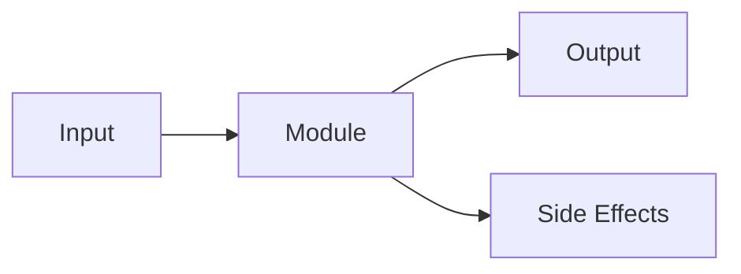

# MODULE: [Module Name]

> **Package**: `cytos.[parent].[module_name]`
> **Status**: Draft | Active | Deprecated
> **Date**: YYYY-MM-DD
> **Owner**: @handle
> **Lines of Code**: NNN
> **Test Coverage**: NN%

## Purpose

_One paragraph explaining what this module does and why it exists. What problem does it solve?_

## Architecture



_Describe how this module fits into the broader system. What does it depend on? What depends on it?_

### Dependencies

| Dependency | Type | Purpose |
|-----------|------|---------|
| `requests` | PyPI | HTTP client for API calls |
| `cytos.scholarly.cache` | Internal | Disk-backed response caching |

## Public API

### `function_name(param1, *, param2, param3) -> ReturnType`

_Description of what this function does._

| Parameter | Type | Required | Default | Description |
|-----------|------|----------|---------|-------------|
| `param1` | `str` | Yes | — | Description |
| `param2` | `int` | No | `10` | Description |

**Returns**: `ReturnType` — description of return value.

**Raises**: `ValueError` — when input is invalid.

**Example**:
```python
from cytos.module import function_name
result = function_name("input", param2=5)
```

### `ClassOrDataclass`

_Description of the class._

| Field | Type | Default | Description |
|-------|------|---------|-------------|
| `field1` | `str` | `""` | Description |
| `field2` | `int` | `0` | Description |

## Configuration

| Variable | Source | Required | Description |
|----------|--------|----------|-------------|
| `API_KEY` | Env var | No | API key for authentication |

## Error Handling

| Error | Cause | Resolution |
|-------|-------|------------|
| `TimeoutError` | API unreachable | Retry with backoff; check network |
| `429 Rate Limited` | Too many requests | Built-in backoff; wait and retry |

## Performance

| Operation | Latency | Throughput | Notes |
|-----------|---------|------------|-------|
| `function_name()` | ~200ms | 5 req/s | Rate-limited by upstream API |

## Known Limitations

1. **[Limitation]**: Description and workaround if any.

## Changelog

| Date | Change | Author |
|------|--------|--------|
| YYYY-MM-DD | Initial implementation | @handle |

## Related Documents

- [ADR-NNN](../adrs/ADR-NNN.md): Decision that led to this module
- [RFC-NNN](../rfcs/RFC-NNN.md): Original proposal
