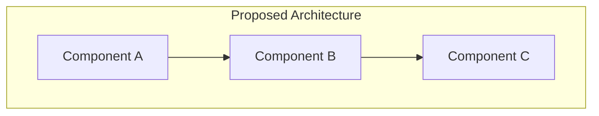

# RFC-NNN: [Proposal Title]

> **Status**: Draft | Under Review | Accepted | Rejected | Withdrawn
> **Date**: YYYY-MM-DD
> **Author**: @handle
> **Reviewers**: @reviewer1, @reviewer2
> **Target Release**: vX.Y.Z
> **Tags**: `feature`, `refactor`, `integration`, `schema`, `infrastructure`

## Summary

_2-3 sentences explaining the proposal at a high level. A busy reader should understand the gist from this section alone._

## Background and Motivation

_Why is this change needed now? What problem does it solve? Include data, user feedback, or technical debt metrics that justify the effort._

### Current State

_Describe how things work today. Include architecture diagrams if helpful._

### Problem Statement

_What specifically is broken, missing, or suboptimal?_

## Proposal

### Overview

_Describe the proposed solution at a high level._

### Detailed Design

_Technical details: data models, API changes, new modules, schema modifications. Use code blocks and diagrams._



### API Changes

_List any new or modified public interfaces._

```python
# New function signature
def new_function(param: str, *, option: bool = False) -> Result:
    """Description."""
```

### Data Model Changes

_Schema additions, migrations, or breaking changes._

### Migration Plan

_How do we get from the current state to the proposed state? Include rollback strategy._

## Alternatives Considered

### Alternative A: [Name]

_Description, pros, cons, and why it was not chosen._

### Alternative B: [Name]

_Description, pros, cons, and why it was not chosen._

## Trade-offs

| Aspect | This Proposal | Alternative |
|--------|--------------|-------------|
| Complexity | ... | ... |
| Performance | ... | ... |
| Maintenance | ... | ... |

## Implementation Plan

| Phase | Description | Effort | Dependencies |
|-------|-------------|--------|-------------|
| 1 | ... | X days | None |
| 2 | ... | X days | Phase 1 |

## Risks and Mitigations

| Risk | Likelihood | Impact | Mitigation |
|------|-----------|--------|------------|
| ... | Low/Med/High | Low/Med/High | ... |

## Open Questions

1. **[Question]**: Context for why this is unresolved.
2. **[Question]**: ...

## References

- [Link to related ADRs, issues, external docs]
